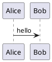

# Stack v2 Chunk 5_n_p Comment Research

This report follows the online-first workflow from `docs/comment_research/online_research_playbook.md` and the per-language template in `docs/comment_research/report_template.md`.

## nanorc
- Registry key: `nanorc`
- Version scope: GNU nano current/latest `nanorc` parser and man page.
- Version-specific syntax: no version-specific split found; hash-prefixed config comment lines are the only confirmed form.
- Line comments: `#` at the first non-blank character of a config line
- Block comments: unsupported
- Termination behavior: `newline`
- Nested comments: unsupported
- Confidence: verified
- Evidence mode: implementation_cross_checked
- Docs source: https://www.nano-editor.org/dist/latest/nanorc.5.html
- Implementation source: https://github.com/madnight/nano/blob/master/src/rcfile.c
- Community source: unresolved
- Corpus fallback source: unresolved
- Recommended action: add a line-comment fixture only; keep block comments unsupported.
- Notes: the `comment` nanorc command configures editor comment toggling for edited files, not comments in nanorc files.

### Examples

#### Line comment
```nanorc
set tabsize 4
# keep this aligned
set softwrap
```

## Nasal
- Registry key: `nasal`
- Version scope: Andy Ross Nasal master and FlightGear Nasal scripting usage.
- Version-specific syntax: no version-specific split found.
- Line comments: `#`
- Block comments: unsupported
- Termination behavior: `newline`
- Nested comments: unsupported
- Confidence: verified
- Evidence mode: implementation_cross_checked
- Docs source: unresolved
- Implementation source: https://github.com/andyross/nasal/blob/master/src/lex.c
- Community source: https://wiki.flightgear.org/Nasal_scripting_language
- Corpus fallback source: unresolved
- Recommended action: add a hash line-comment fixture; keep block comments unsupported.
- Notes: the lexer skips from `#` to the line end.

### Examples

#### Line comment
```nasal
var throttle = 0.5; # clamp before use
var next = throttle + 0.1;
```

## NASL
- Registry key: `nasl`
- Version scope: Greenbone/OpenVAS NASL scanner grammar on current main.
- Version-specific syntax: no version-specific split found in the checked grammar.
- Line comments: `#`
- Block comments: unsupported
- Termination behavior: `newline`
- Nested comments: unsupported
- Confidence: verified
- Evidence mode: implementation_cross_checked
- Docs source: unresolved
- Implementation source: https://github.com/greenbone/openvas-scanner/blob/main/nasl/nasl_grammar.y
- Community source: unresolved
- Corpus fallback source: unresolved
- Recommended action: add a hash line-comment fixture; keep block comments unsupported.
- Notes: the grammar enters `ST_COMMENT` after `#` and leaves it on newline.

### Examples

#### Line comment
```nasl
display("probe"); # audit note
exit(0);
```

## NCL
- Registry key: `ncl`
- Version scope: NCL reference manual, including NCL 6.4.0 block-comment syntax.
- Version-specific syntax: before NCL 6.4.0, only semicolon line comments are documented; NCL 6.4.0 and later add `/; ... ;/` block comments.
- Line comments: `;`
- Block comments: `/; ... ;/`
- Termination behavior: `newline` for line comments; `first ;/ closes block comments`
- Nested comments: unsupported
- Confidence: verified
- Evidence mode: official_docs
- Docs source: https://www.ncl.ucar.edu/Document/Manuals/Ref_Manual/NclStatements.shtml#Comments
- Implementation source: unresolved
- Community source: unresolved
- Corpus fallback source: unresolved
- Recommended action: add semicolon line comments and gated block-comment examples noting the NCL 6.4.0 floor.
- Notes: multi-line comments are represented by a single `/;` opener and `;/` closer, not repeated semicolon leaders.

### Examples

#### Line comment
```ncl
x = 1
; calibration note
y = x + 1
```

#### Block comment
```ncl
x = 1
/;
  calibration note
;/
y = x + 1
```

## Nearley
- Registry key: `nearley`
- Version scope: nearley current grammar documentation and compiler grammar.
- Version-specific syntax: no version-specific split found.
- Line comments: `#`
- Block comments: unsupported
- Termination behavior: `newline`
- Nested comments: unsupported
- Confidence: verified
- Evidence mode: implementation_cross_checked
- Docs source: https://nearley.js.org/docs/grammar
- Implementation source: https://github.com/kach/nearley/blob/master/lib/nearley-language-bootstrapped.ne
- Community source: unresolved
- Corpus fallback source: unresolved
- Recommended action: add a hash line-comment fixture; keep block comments unsupported.
- Notes: the bootstrapped grammar tokenizes `#` through the rest of the line as `%comment`.

### Examples

#### Line comment
```nearley
main -> word
# parser note
word -> [a-z]:+
```

## Nemerle
- Registry key: `nemerle`
- Version scope: Nemerle compiler source on current master and historical Nemerle language usage.
- Version-specific syntax: no version-specific split found; documentation comments are lexical comment variants.
- Line comments: `//`; documentation line comments `///`
- Block comments: `/* ... */`; documentation block comments `/** ... */`
- Termination behavior: `newline` for line comments; `first */ closes block comments`
- Nested comments: unsupported
- Confidence: verified
- Evidence mode: implementation_cross_checked
- Docs source: unresolved
- Implementation source: https://github.com/rsdn/nemerle/blob/master/ncc/parsing/Lexer.n
- Community source: https://github.com/rsdn/nemerle/wiki
- Corpus fallback source: unresolved
- Recommended action: add C-family line and block fixtures, plus doc-comment examples if the registry tracks documentation comments.
- Notes: the lexer distinguishes one-line and block comments and scans a block until the first `*/`.

### Examples

#### Line comment
```nemerle
def value = 1; // increment later
def next = value + 1;
```

#### Block comment
```nemerle
def value = 1;
/* increment later */
def next = value + 1;
```

## NEON
- Registry key: `neon`
- Line comments: `#`
- Block comments: unsupported
- Termination behavior: `newline`
- Nested comments: unsupported
- Confidence: verified
- Evidence mode: official_docs
- Docs source: https://doc.nette.org/en/neon/format
- Implementation source: https://github.com/nette/neon
- Corpus fallback source: unresolved
- Recommended action: add hash-comment fixtures and keep block comments unsupported.
- Notes: the NEON format docs say `#` starts a comment and the rest of the line is ignored.

### Examples

#### Line comment
```neon
# this line will be ignored by the interpreter
street: 742 Evergreen Terrace
city: Springfield  # this is ignored too
country: USA
```

## nesC
- Registry key: `nesc`
- Version scope: nesC 1.1/1.3 reference material and current TinyOS nesC compiler sources.
- Version-specific syntax: no syntax split found; C++-style `//` comments are enabled in the lexer, and `/**` / `///` documentation comments are recognized.
- Line comments: `//`
- Block comments: `/* ... */`
- Termination behavior: `newline` for line comments; `first */ closes block comments`
- Nested comments: unsupported
- Confidence: verified
- Evidence mode: implementation_cross_checked
- Docs source: https://nescc.sourceforge.net/papers/nesc-ref.pdf
- Implementation source: https://github.com/tinyos/nesc/blob/master/src/c-lex.c
- Community source: unresolved
- Corpus fallback source: unresolved
- Recommended action: add C-family line and block fixtures; include doc-comment variants only if the registry models documentation comments separately.
- Notes: nesC inherits C-family lexical comments and the compiler enables C++-style line comments.

### Examples

#### Line comment
```c
int value = 1;
// calibration
int next = value + 1;
```

#### Block comment
```c
int value = 1;
/* calibration */
int next = value + 1;
```

## NetLinx
- Registry key: `netlinx`
- Version scope: AMX NetLinx language reference/style guide era through NetLinx Studio v4.
- Version-specific syntax: no version-specific split found in the checked references.
- Line comments: `//`
- Block comments: `(* ... *)`
- Termination behavior: `newline` for line comments; `first *) closes block comments`
- Nested comments: unsupported
- Confidence: verified
- Evidence mode: official_docs
- Docs source: https://dextra.com.mx/img/files/PRODUCTOS/AMX/NX-2200/NetLinx.LanguageReferenceGuide.pdf
- Implementation source: unresolved
- Community source: unresolved
- Corpus fallback source: unresolved
- Recommended action: add `//` and `(* ... *)` fixtures; do not add C-style `/* ... */` without a stronger NetLinx source.
- Notes: the AMX language reference describes `(*COMMENT*)` block comments and `//` line comments; the cited copy is a vendor/distributor-hosted PDF.

### Examples

#### Line comment
```netlinx
DEFINE_DEVICE
dvTP = 10001:1:0 // main touch panel
```

#### Block comment
```netlinx
(*
  controlled device notes
*)
DEFINE_START
```

## NewLisp
- Registry key: `newlisp`
- Version scope: newLISP manual v10.7.1.
- Version-specific syntax: no version-specific split found.
- Line comments: `;`, `#`
- Block comments: unsupported
- Termination behavior: `newline`
- Nested comments: unsupported
- Confidence: verified
- Evidence mode: official_docs
- Docs source: https://web.mit.edu/newlisp_v10.7.1/share/doc/newlisp/newlisp_manual.html
- Implementation source: unresolved
- Community source: unresolved
- Corpus fallback source: unresolved
- Recommended action: add line-comment fixtures for both semicolon and hash forms.
- Notes: the manual documents both `;` and `#` as line-comment leaders.

### Examples

#### Line comment
```newlisp
(set 'value 1) ; increment later
# same file can use hash comments
(+ value 1)
```

## Nextflow
- Registry key: `nextflow`
- Line comments: `//`
- Block comments: `/* ... */`
- Termination behavior: `first closing delimiter wins`
- Nested comments: unsupported
- Confidence: verified
- Evidence mode: implementation_cross_checked
- Docs source: https://nextflow.io/docs/latest/reference/syntax.html
- Implementation source: https://github.com/nextflow-io/nextflow
- Corpus fallback source: unresolved
- Recommended action: add line-comment and block-comment fixtures.
- Notes: official syntax docs explicitly describe both comment forms.

### Examples

#### Line comment
```groovy
println 'Hello world!' // line comment
```

#### Block comment
```groovy
/*
 * block comment
 */
println 'Hello again!'
```

## Nginx
- Registry key: `nginx`
- Line comments: `#`
- Block comments: unsupported
- Termination behavior: `newline`
- Nested comments: unsupported
- Confidence: verified
- Evidence mode: implementation_cross_checked
- Docs source: https://nginx.org/en/docs/beginners_guide.html
- Implementation source: https://hg.nginx.org/nginx/
- Corpus fallback source: unresolved
- Recommended action: add line-comment fixtures only.
- Notes: the official beginner guide says the rest of a line after `#` is a comment.

### Examples

#### Line comment
```nginx
server {
  listen 80;
  # proxy to the app server
  location / {
    proxy_pass http://app;
  }
}
```

## Nim
- Registry key: `nim`
- Line comments: `#`
- Block comments: `#[ ... ]#`
- Termination behavior: `true nesting supported`
- Nested comments: supported
- Confidence: verified
- Evidence mode: implementation_cross_checked
- Docs source: https://nim-lang.org/docs/manual.html
- Implementation source: https://github.com/nim-lang/Nim
- Corpus fallback source: unresolved
- Recommended action: add line, block, and nested-block fixtures.
- Notes: the Nim manual explicitly documents multiline comments and nesting.

### Examples

#### Line comment
```nim
let x = 1
# increment the value
let y = x + 1
```

#### Block comment
```nim
let x = 1
#[ increment the value ]#
let y = x + 1
```

#### Nested comment
```nim
let x = 1
#[ outer
  #[ inner ]#
]#
let y = x + 1
```

## Ninja
- Registry key: `ninja`
- Line comments: `#`
- Block comments: unsupported
- Termination behavior: `newline`
- Nested comments: unsupported
- Confidence: verified
- Evidence mode: implementation_cross_checked
- Docs source: https://ninja-build.org/manual
- Implementation source: https://github.com/ninja-build/ninja
- Corpus fallback source: unresolved
- Recommended action: add a line-comment regression fixture.
- Notes: the official manual and build file examples use hash comments.

### Examples

#### Line comment
```ninja
rule cc
  command = cc -c $in -o $out
# build the object file
build app.o: cc app.c
```

## Nit
- Registry key: `nit`
- Version scope: Nit compiler grammar on current master.
- Version-specific syntax: no version-specific split found.
- Line comments: `#`
- Block comments: unsupported
- Termination behavior: `newline`
- Nested comments: unsupported
- Confidence: verified
- Evidence mode: implementation_cross_checked
- Docs source: https://nitlanguage.org/doc/nitc/grammar.html
- Implementation source: https://github.com/nitlang/nit/blob/master/src/parser/nit.sablecc3xx
- Community source: unresolved
- Corpus fallback source: unresolved
- Recommended action: add a hash line-comment fixture; keep block comments unsupported.
- Notes: the grammar defines `comment = '#' any* eol_helper?`; adjacent comments also feed doc extraction.

### Examples

#### Line comment
```nit
var value = 1 # increment later
var next = value + 1
```

## NL
- Registry key: `nl`
- Version scope: GitHub Linguist `NL` data label as used by corpus metadata.
- Version-specific syntax: no language version identified; the label is classified as data with no TextMate scope.
- Line comments: unsupported
- Block comments: unsupported
- Termination behavior: unsupported
- Nested comments: unsupported
- Confidence: low
- Evidence mode: unresolved
- Docs source: unresolved
- Implementation source: https://github.com/github-linguist/linguist/blob/master/lib/linguist/languages.yml
- Community source: unresolved
- Corpus fallback source: unresolved
- Recommended action: keep unsupported/unresolved until Stack v2 identifies a concrete NL format and syntax.
- Notes: Linguist classifies `NL` as `type: data`, extension `.nl`, and `tm_scope: none`; no stable comment grammar was found.

### Examples

#### No comment form
```text
value 1
next 2
```

## NPM Config
- Registry key: `npm_config`
- Line comments: `;`, `#`
- Block comments: unsupported
- Termination behavior: `newline`
- Nested comments: unsupported
- Confidence: verified
- Evidence mode: implementation_cross_checked
- Docs source: https://docs.npmjs.com/cli/v11/configuring-npm/npmrc
- Implementation source: https://github.com/npm/ini
- Corpus fallback source: unresolved
- Recommended action: add line-comment fixtures for both `;` and `#`.
- Notes: npm docs say `.npmrc` files are ini-formatted and comment lines start with `;` or `#`.

### Examples

#### Line comment
```ini
# last modified: 01 Jan 2016
; set a custom registry for this project
registry=https://registry.npmjs.org/
```

## NSIS
- Registry key: `nsis`
- Line comments: `;`, `#`
- Block comments: `/* ... */`
- Termination behavior: `first closing delimiter wins`
- Nested comments: unsupported
- Confidence: verified
- Evidence mode: implementation_cross_checked
- Docs source: https://nsis.sourceforge.io/Docs/Chapter4.html
- Implementation source: https://github.com/kichik/nsis
- Corpus fallback source: unresolved
- Recommended action: add line and block comment fixtures, including end-of-line comments.
- Notes: the NSIS scripting reference explicitly documents both hash/semicolon lines and C-style block comments.

### Examples

#### Line comment
```nsis
Name "Example"
; installer metadata
OutFile "example.exe"
```

#### Block comment
```nsis
Name "Example"
/*
  installer metadata
  can span multiple lines
*/
OutFile "example.exe"
```

## Nunjucks
- Registry key: `nunjucks`
- Line comments: unsupported
- Block comments: `{# ... #}`
- Termination behavior: `first closing delimiter wins`
- Nested comments: unsupported
- Confidence: verified
- Evidence mode: implementation_cross_checked
- Docs source: https://mozilla.github.io/nunjucks/templating.html#comments
- Implementation source: https://github.com/mozilla/nunjucks
- Corpus fallback source: unresolved
- Recommended action: add template-comment fixtures and keep line comments unsupported.
- Notes: Nunjucks comments are template delimiters, not line comments.

### Examples

#### Block comment
```nunjucks
{# loop through the users #}

  <li>{{ user.name }}</li>

```

## NWScript
- Registry key: `nwscript`
- Version scope: NWScript compiler-compatible syntax as implemented by `nwnsc`.
- Version-specific syntax: no version-specific split found.
- Line comments: `//`
- Block comments: `/* ... */`
- Termination behavior: `newline` for line comments; `first */ closes block comments`
- Nested comments: unsupported
- Confidence: verified
- Evidence mode: implementation_cross_checked
- Docs source: https://nwnlexicon.com/index.php?title=NWScript
- Implementation source: https://github.com/nwneetools/nwnsc/blob/master/_NscLib/NscContext.cpp
- Community source: https://nwnlexicon.com/index.php?title=NWScript
- Corpus fallback source: unresolved
- Recommended action: add C-family line and block fixtures; keep nesting unsupported.
- Notes: the compiler context consumes `//` through line end and `/*` through the first `*/`.

### Examples

#### Line comment
```c
void main() {
  // initialise game state
  int x = 1;
}
```

#### Block comment
```c
void main() {
  /* initialise game state */
  int x = 1;
}
```

## ObjDump
- Registry key: `objdump`
- Version scope: GitHub Linguist `ObjDump` data/disassembly-output label.
- Version-specific syntax: no stable source-language version identified; objdump output varies by architecture and options.
- Line comments: unsupported
- Block comments: unsupported
- Termination behavior: unsupported
- Nested comments: unsupported
- Confidence: medium
- Evidence mode: unresolved
- Docs source: unresolved
- Implementation source: https://github.com/github-linguist/linguist/blob/master/lib/linguist/languages.yml
- Community source: unresolved
- Corpus fallback source: unresolved
- Recommended action: keep unsupported until the registry has a specific objdump flavor with a defensible comment convention.
- Notes: Linguist marks ObjDump as `type: data`; any `#`, `;`, or source annotation text in disassembly is not a language-wide lexical comment grammar.

### Examples

#### No comment form
```objdump
0000000000000000 <main>:
   0: 55                    push   %rbp
```

## Object Data Instance Notation
- Registry key: `object_data_instance_notation`
- Version scope: openEHR ODIN latest language specification.
- Version-specific syntax: no version-specific split found in the latest specification.
- Line comments: `--`
- Block comments: unsupported; multi-line comments repeat `--` on each line
- Termination behavior: `newline`
- Nested comments: unsupported
- Confidence: verified
- Evidence mode: official_docs
- Docs source: https://specifications.openehr.org/releases/LANG/latest/odin.html#_comments
- Implementation source: unresolved
- Community source: unresolved
- Corpus fallback source: unresolved
- Recommended action: add a double-hyphen line-comment fixture; keep block comments unsupported.
- Notes: the ODIN spec states that comments are indicated by `--` and multi-line comments use the same leader on each continued line.

### Examples

#### Line comment
```odin
name = <"Django Reinhardt"> -- person's name
birthdate = <1919-01-23>
```

## Objective-C++
- Registry key: `objective_cpp`
- Line comments: `//`
- Block comments: `/* ... */`
- Termination behavior: `first closing delimiter wins`
- Nested comments: unsupported
- Confidence: high
- Evidence mode: unresolved
- Docs source: unresolved
- Implementation source: unresolved
- Community source: unresolved
- Corpus fallback source: unresolved
- Recommended action: add C/C++-style fixtures.
- Notes: Objective-C++ uses standard C++ comment syntax.

### Examples

#### Line comment
```cpp
int value = 1;
// increment
int next = value + 1;
```

#### Block comment
```cpp
int value = 1;
/* increment */
int next = value + 1;
```

## Objective-J
- Registry key: `objective_j`
- Line comments: `//`
- Block comments: `/* ... */`
- Termination behavior: `first closing delimiter wins`
- Nested comments: unsupported
- Confidence: high
- Evidence mode: unresolved
- Docs source: unresolved
- Implementation source: unresolved
- Community source: unresolved
- Corpus fallback source: unresolved
- Recommended action: add C-family fixtures.
- Notes: Objective-J follows the same comment model as JavaScript/C.

### Examples

#### Line comment
```objective-j
var value = 1;
// increment
value = value + 1;
```

#### Block comment
```objective-j
var value = 1;
/* increment */
value = value + 1;
```

## ObjectScript
- Registry key: `objectscript`
- Line comments: `//`, `;`, `##;` (`#;` in column 1)
- Block comments: `/* ... */`
- Termination behavior: `newline` for line comments; `first closing delimiter wins` for block comments
- Nested comments: unsupported
- Confidence: verified
- Evidence mode: official_docs
- Docs source: https://docs.intersystems.com/irislatest/csp/docbook/DocBook.UI.Page.cls?KEY=GCOS_syntax
- Implementation source: https://docs.rs/crate/tree-sitter-objectscript/1.6.3
- Corpus fallback source: unresolved
- Recommended action: add fixtures for `//`, `;`, `##;`, and `/* */`, but keep nested comments unsupported.
- Notes: InterSystems docs distinguish INT, MAC, and class-definition comment contexts; `##;` comments out the rest of the current line, and `#;` is the column-1 equivalent in preprocessor contexts.

### Examples

#### `//` line comment
```objectscript
Class Demo.Sample
{
ClassMethod Main()
{
  // increment value
  Set x = 1
}
}
```

#### `;` line comment
```objectscript
Class Demo.Sample
{
ClassMethod Main()
{
  Set x = 1 ; increment value
  Set y = x + 1
}
}
```

#### `##;` line comment
```objectscript
#define alphalen ##function($LENGTH("abcdefghijklmnopqrstuvwxyz")) ##; + 100
WRITE $$$alphalen," is the length of the alphabet"
```

#### Block comment
```objectscript
Class Demo.Sample
{
ClassMethod Main()
{
  /* increment value */
  Set x = 1
}
}
```

## Odin
- Registry key: `odin`
- Line comments: `//`
- Block comments: `/* ... */`
- Termination behavior: `first closing delimiter wins`
- Nested comments: unsupported
- Confidence: high
- Evidence mode: unresolved
- Docs source: unresolved
- Implementation source: unresolved
- Community source: unresolved
- Corpus fallback source: unresolved
- Recommended action: add C-style fixtures.
- Notes: Odin uses standard C-family comment forms.

### Examples

#### Line comment
```odin
main :: proc() {
    // setup
    x := 1
}
```

#### Block comment
```odin
main :: proc() {
    /* setup */
    x := 1
}
```

## ooc
- Registry key: `ooc`
- Version scope: ooc-lang `rock` compiler on current master.
- Version-specific syntax: no version-specific split found; oocdoc forms are documentation-comment variants.
- Line comments: `//`
- Block comments: `/* ... */`; documentation block comments `/** ... */`
- Termination behavior: `newline` for line comments; recursive/depth-balanced block scanning in the checked parser
- Nested comments: supported
- Confidence: verified
- Evidence mode: implementation_cross_checked
- Docs source: unresolved
- Implementation source: https://github.com/ooc-lang/rock/blob/master/source/rock/frontend/NagaQueen.c
- Community source: https://ooc-lang.org/docs/lang/
- Corpus fallback source: unresolved
- Recommended action: add C-family line and block fixtures and include a nested block case if the registry supports nested comment metadata.
- Notes: the generated parser has separate rules for line, block, and oocdoc comments and recursively recognizes multiline comments.

### Examples

#### Line comment
```ooc
println("hello") // say hello
```

#### Block comment
```ooc
/*
  say hello
  /* nested implementation note */
*/
println("hello")
```

## Opa
- Registry key: `opa`
- Version scope: MLstate/opalang classic syntax lexer on current master.
- Version-specific syntax: no version-specific split found.
- Line comments: `//`
- Block comments: `/* ... */`
- Termination behavior: `newline` for line comments; recursive/depth-balanced block scanning
- Nested comments: supported
- Confidence: verified
- Evidence mode: implementation_cross_checked
- Docs source: unresolved
- Implementation source: https://github.com/MLstate/opalang/blob/master/compiler/opalang/classic_syntax/opa_lexer.trx
- Community source: unresolved
- Corpus fallback source: unresolved
- Recommended action: add `//` and nested-capable `/* ... */` fixtures.
- Notes: the lexer grammar handles slash-line comments and recursively nested star comments.

### Examples

#### Line comment
```opa
x = 1 // increment later
y = x + 1
```

#### Block comment
```opa
/*
  outer note
  /* nested note */
*/
x = 1
```

## Open Policy Agent
- Registry key: `open_policy_agent`
- Line comments: `#`
- Block comments: unsupported
- Termination behavior: `newline`
- Nested comments: unsupported
- Confidence: verified
- Evidence mode: implementation_cross_checked
- Docs source: https://www.openpolicyagent.org/docs
- Implementation source: https://github.com/open-policy-agent/opa
- Corpus fallback source: unresolved
- Recommended action: add hash-comment fixtures and keep block comments unsupported.
- Notes: the official docs examples use `#` comments in Rego.

### Examples

#### Line comment
```rego
package example

# deny invalid numbers
deny if input.number > 5
```

## OpenCL
- Registry key: `opencl`
- Line comments: `//`
- Block comments: `/* ... */`
- Termination behavior: `first closing delimiter wins`
- Nested comments: unsupported
- Confidence: high
- Evidence mode: unresolved
- Docs source: unresolved
- Implementation source: unresolved
- Community source: unresolved
- Corpus fallback source: unresolved
- Recommended action: add C-style fixtures.
- Notes: OpenCL C uses standard C-family comment forms.

### Examples

#### Line comment
```c
__kernel void add(__global const float* a, __global const float* b) {
  // compute a single element
  int id = get_global_id(0);
}
```

#### Block comment
```c
__kernel void add(__global const float* a, __global const float* b) {
  /* compute a single element */
  int id = get_global_id(0);
}
```

## OpenEdge ABL
- Registry key: `openedge_abl`
- Version scope: Progress OpenEdge ABL 13.0 reference, with historical note for OpenEdge 11.6 single-line comments.
- Version-specific syntax: `/* ... */` comments exist in older ABL releases; `//` single-line comments are supported as of OpenEdge 11.6.
- Line comments: `//`
- Block comments: `/* ... */`
- Termination behavior: `newline`, `carriage return`, or EOF for `//`; nested/depth-balanced scanning for `/* ... */`
- Nested comments: supported
- Confidence: verified
- Evidence mode: official_docs
- Docs source: https://docs.progress.com/bundle/abl-reference/page/Single-line-comments.html; https://docs.progress.com/bundle/abl-reference/page/Multi-line-comments.html
- Implementation source: unresolved
- Community source: https://community.progress.com/s/article/How-does-Single-line-comment-feature-work-and-can-it-be-disabled
- Corpus fallback source: unresolved
- Recommended action: add block-comment fixtures for all supported ABL versions and gate `//` examples behind an OpenEdge 11.6+ note.
- Notes: official docs describe both current comment forms; Progress support material records the 11.6 introduction of single-line comments.

### Examples

#### Line comment
```abl
MESSAGE "hello". // OpenEdge 11.6+
```

#### Block comment
```abl
/* outer note
   /* nested note */
*/
MESSAGE "hello".
```

## OpenQASM
- Registry key: `openqasm`
- Line comments: `//`
- Block comments: `/* ... */`
- Termination behavior: `newline` for line comments; `first closing delimiter wins` for block comments
- Nested comments: unsupported
- Confidence: verified
- Evidence mode: implementation_cross_checked
- Docs source: https://openqasm.com/versions/3.0/language/comments.html
- Implementation source: https://github.com/openqasm/openqasm
- Corpus fallback source: unresolved
- Recommended action: add line and block fixtures and keep nested comments unsupported.
- Notes: the OpenQASM 3 spec explicitly defines `//` line comments and `/* ... */` block comments.

### Examples

#### Line comment
```qasm
// First non-comment is a version string
OPENQASM 3.0;
include "stdgates.qasm";
```

#### Block comment
```qasm
/*
  Repeat-until-success circuit for Rz(theta)
*/
OPENQASM 3.0;
```

## OpenRC runscript
- Registry key: `openrc_runscript`
- Version scope: OpenRC current service-script/runscript format.
- Version-specific syntax: no version-specific split found; runscripts are shell scripts executed through `openrc-run`.
- Line comments: `#`
- Block comments: unsupported
- Termination behavior: `newline`
- Nested comments: unsupported
- Confidence: verified
- Evidence mode: official_docs
- Docs source: https://github.com/OpenRC/openrc/blob/master/service-script-guide.md
- Implementation source: https://github.com/OpenRC/openrc
- Community source: unresolved
- Corpus fallback source: unresolved
- Recommended action: add a shell-style hash line-comment fixture; keep block comments unsupported.
- Notes: runscript files use shell syntax around OpenRC helper functions.

### Examples

#### Line comment
```sh
description="Example service"
# restart policy
command="/usr/bin/example"
```

## OpenSCAD
- Registry key: `openscad`
- Line comments: `//`
- Block comments: `/* ... */`
- Termination behavior: `first closing delimiter wins`
- Nested comments: unsupported
- Confidence: verified
- Evidence mode: implementation_cross_checked
- Docs source: https://openscad.org/documentation.html
- Implementation source: https://github.com/openscad/openscad
- Community source: unresolved
- Corpus fallback source: unresolved
- Recommended action: add line and block fixtures.
- Notes: OpenSCAD uses the standard C-family comment forms.

### Examples

#### Line comment
```scad
cube(10);
// parametric note
sphere(5);
```

#### Block comment
```scad
cube(10);
/* parametric note */
sphere(5);
```

## OpenStep Property List
- Registry key: `openstep_property_list`
- Version scope: old-style/OpenStep ASCII property lists; XML property lists have separate XML comment syntax.
- Version-specific syntax: no old-style version split found; XML plist comments are not part of this registry key's OpenStep syntax.
- Line comments: `//`
- Block comments: `/* ... */`
- Termination behavior: `newline` for line comments; `first */ closes block comments`
- Nested comments: unsupported
- Confidence: verified
- Evidence mode: implementation_cross_checked
- Docs source: https://developer.apple.com/library/archive/documentation/Cocoa/Conceptual/PropertyLists/OldStylePlists/OldStylePLists.html
- Implementation source: https://github.com/textmate/property-list.tmbundle/blob/textmate-1.x/Syntaxes/Property%20List.tmLanguage
- Community source: unresolved
- Corpus fallback source: unresolved
- Recommended action: add old-style plist `//` and `/* ... */` fixtures; do not mix XML `<!-- ... -->` into this entry.
- Notes: the TextMate plist grammar includes OpenStep double-slash and slash-star comments.

### Examples

#### Line comment
```plist
{
  Name = Example; // display name
}
```

#### Block comment
```plist
{
  /* display name */
  Name = Example;
}
```

## OpenType Feature File
- Registry key: `opentype_feature_file`
- Version scope: Adobe AFDKO OpenType Feature File Specification current.
- Version-specific syntax: no version-specific split found.
- Line comments: `#`
- Block comments: unsupported
- Termination behavior: `newline`
- Nested comments: unsupported
- Confidence: verified
- Evidence mode: official_docs
- Docs source: https://adobe-type-tools.github.io/afdko/OpenTypeFeatureFileSpecification.html
- Implementation source: https://github.com/adobe-type-tools/afdko/blob/develop/docs/OpenTypeFeatureFileSpecification.md
- Community source: unresolved
- Corpus fallback source: unresolved
- Recommended action: add a hash line-comment fixture; keep block comments unsupported.
- Notes: the spec states that `#` starts a comment that continues to the end of the line.

### Examples

#### Line comment
```fea
# liga substitutions
feature liga {
  sub f i by fi;
} liga;
```

## Org
- Registry key: `org`
- Version scope: current Org manual and org-mode implementation.
- Version-specific syntax: no version-specific split found in the checked manual.
- Line comments: lines whose first non-space character is `#` followed by whitespace or line end; `#+` keyword lines are not ordinary comments
- Block comments: `#+BEGIN_COMMENT` ... `#+END_COMMENT`
- Termination behavior: `newline` for line comments; first matching `#+END_COMMENT` line closes a comment block
- Nested comments: unsupported
- Confidence: verified
- Evidence mode: implementation_cross_checked
- Docs source: https://orgmode.org/manual/Comment-Lines.html
- Implementation source: https://git.savannah.gnu.org/cgit/emacs/org-mode.git/plain/lisp/org.el
- Community source: unresolved
- Corpus fallback source: unresolved
- Recommended action: add Org line and block fixtures; treat `COMMENT` subtrees and `@@comment:...@@` as structural/inline Org features rather than source comments unless the parser explicitly models them.
- Notes: Org comment handling is line-oriented and document-structure aware.

### Examples

#### Line comment
```org
* Task
# local note
Body text
```

#### Block comment
```org
#+BEGIN_COMMENT
hidden planning notes
#+END_COMMENT
Visible text
```

## Ox
- Registry key: `ox`
- Version scope: Ox language syntax manual.
- Version-specific syntax: no version-specific split found.
- Line comments: `//`
- Block comments: `/* ... */`
- Termination behavior: `newline` for line comments; nested/depth-balanced `*/` for block comments
- Nested comments: supported
- Confidence: verified
- Evidence mode: official_docs
- Docs source: http://fmwww.bc.edu/ec-p/obsolete/oxsyntax.htm
- Implementation source: unresolved
- Community source: unresolved
- Corpus fallback source: unresolved
- Recommended action: add `//` and nested-capable `/* ... */` fixtures.
- Notes: the syntax manual states that block comments may be nested and that `//` inside a block is ignored as comment syntax.

### Examples

#### Line comment
```ox
decl value = 1; // increment later
decl next = value + 1;
```

#### Block comment
```ox
/*
  outer note
  /* nested note */
*/
decl value = 1;
```

## Oz
- Registry key: `oz`
- Version scope: Mozart Oz 1.4 lexical syntax.
- Version-specific syntax: no version-specific split found in the checked Mozart documentation.
- Line comments: `%`
- Block comments: `/* ... */`
- Termination behavior: `newline` or EOF for `%`; nested/depth-balanced `*/` for block comments
- Nested comments: supported
- Confidence: verified
- Evidence mode: official_docs
- Docs source: https://mozart2.org/mozart-v1/doc-1.4.0/notation/node2.html
- Implementation source: unresolved
- Community source: https://stackoverflow.com/questions/33210687/what-is-the-syntax-for-a-block-comment-in-the-oz-programming-language
- Corpus fallback source: unresolved
- Recommended action: add percent line comments and nested-capable slash-star block fixtures.
- Notes: the Mozart notation reference documents lexical comments; community/compiler usage confirms slash-star block comments.

### Examples

#### Line comment
```oz
declare X = 1 % increment later
```

#### Block comment
```oz
/*
  outer note
  /* nested note */
*/
declare X = 1
```

## P4
- Registry key: `p4`
- Version scope: P4_16 specification v1.2.3 and current p4c lexer.
- Version-specific syntax: no version-specific split found; Javadoc-style `/** ... */` comments are documented as a block-comment variant.
- Line comments: `//`
- Block comments: `/* ... */`; documentation block comments `/** ... */`
- Termination behavior: `newline` for line comments; `first */ closes block comments`
- Nested comments: unsupported
- Confidence: verified
- Evidence mode: implementation_cross_checked
- Docs source: https://p4.org/p4-spec/docs/P4-16-v1.2.3.html
- Implementation source: https://github.com/p4lang/p4c/blob/main/frontends/parsers/p4/p4lexer.ll
- Community source: unresolved
- Corpus fallback source: unresolved
- Recommended action: add C-family line and block fixtures; add a doc-comment fixture only if the registry tracks documentation comments.
- Notes: the P4_16 spec states that nested comments are not supported.

### Examples

#### Line comment
```p4
// ingress processing
control MyIngress() {
  apply { }
}
```

#### Block comment
```p4
/* ingress processing */
control MyIngress() {
  apply { }
}
```

## Pan
- Registry key: `pan`
- Version scope: Quattor pan compiler grammar on current master.
- Version-specific syntax: no version-specific split found.
- Line comments: `#`
- Block comments: unsupported
- Termination behavior: `newline`
- Nested comments: unsupported
- Confidence: verified
- Evidence mode: implementation_cross_checked
- Docs source: unresolved
- Implementation source: https://github.com/quattor/pan/blob/master/panc/src/main/jjtree/PanParser.jjt
- Community source: unresolved
- Corpus fallback source: unresolved
- Recommended action: add a hash line-comment fixture; keep block comments unsupported.
- Notes: the JavaCC grammar defines `#` comments as special tokens through the line end.

### Examples

#### Line comment
```pan
variable VALUE = 1; # increment later
variable NEXT = VALUE + 1;
```

## Papyrus
- Registry key: `papyrus`
- Version scope: Bethesda Papyrus as used by Skyrim/Fallout Creation Kit tooling.
- Version-specific syntax: no version-specific split found in the checked Papyrus references.
- Line comments: `;`
- Block comments: `;/ ... /;`
- Termination behavior: `newline` for line comments; `first /; closes block comments`
- Nested comments: unsupported
- Confidence: high
- Evidence mode: implementation_cross_checked
- Docs source: https://ck.uesp.net/wiki/Comment_Reference
- Implementation source: https://github.com/Gawdl3y/atom-language-papyrus/blob/master/grammars/papyrus-skyrim.cson
- Community source: https://forums.ultraedit.com/papyrus-creation-kit-comments-t18261.html
- Corpus fallback source: unresolved
- Recommended action: add semicolon line comments and `;/ ... /;` block fixtures; keep nesting unsupported.
- Notes: official Creation Kit documentation is mirrored/community-hosted; source evidence consistently describes `;` and `;/ ... /;`.

### Examples

#### Line comment
```papyrus
int value = 1 ; increment later
int next = value + 1
```

#### Block comment
```papyrus
;/
  increment later
/;
int value = 1
```

## Parrot Assembly
- Registry key: `parrot_assembly`
- Version scope: Parrot PASM 1.1 documentation and IMCC lexer on master.
- Version-specific syntax: no version-specific split found.
- Line comments: `#`
- Block comments: POD blocks beginning with a POD directive such as `=pod` at column 1 and ending at `=cut`
- Termination behavior: `newline` for `#`; first `=cut` line ends POD comment blocks
- Nested comments: unsupported
- Confidence: verified
- Evidence mode: implementation_cross_checked
- Docs source: https://parrot.github.io/parrot-docs1/1.1.0/html/docs/book/ch09_pasm.pod.html
- Implementation source: https://github.com/parrot/parrot/blob/master/compilers/imcc/imcc.l
- Community source: unresolved
- Corpus fallback source: unresolved
- Recommended action: add hash line-comment fixtures; consider POD block fixtures if the parser models multiline comment blocks for Parrot languages.
- Notes: Parrot assembly documentation says comments run from `#` to line end and that POD blocks are ignored by the assembler.

### Examples

#### Line comment
```pasm
set I0, 1 # increment later
inc I0
```

#### Block comment
```pasm
=pod
assembler note
=cut
set I0, 1
```

## Parrot Internal Representation
- Registry key: `parrot_internal_representation`
- Version scope: Parrot PIR/IMCC lexer on master and Parrot documentation generation conventions.
- Version-specific syntax: no version-specific split found.
- Line comments: `#`
- Block comments: POD blocks beginning with a POD directive such as `=pod` at column 1 and ending at `=cut`
- Termination behavior: `newline` for `#`; first `=cut` line ends POD comment blocks
- Nested comments: unsupported
- Confidence: verified
- Evidence mode: implementation_cross_checked
- Docs source: https://parrot.github.io/parrot-docs1/1.1.0/html/docs/book/ch09_pasm.pod.html
- Implementation source: https://github.com/parrot/parrot/blob/master/compilers/imcc/imcc.l
- Community source: unresolved
- Corpus fallback source: unresolved
- Recommended action: add hash line-comment fixtures; consider shared POD block handling with PASM.
- Notes: PASM and PIR are both handled by the IMCC lexer, which skips hash comments and POD regions.

### Examples

#### Line comment
```pir
.sub 'main'
  $I0 = 1 # increment later
.end
```

#### Block comment
```pir
=pod
PIR note
=cut
.sub 'main'
.end
```

## Pascal
- Registry key: `pascal`
- Line comments: `//`
- Block comments: `{ ... }`, `(* ... *)`
- Termination behavior: `true nesting supported in Free Pascal normal mode; disabled in TP/Delphi mode`
- Nested comments: supported in Free Pascal normal mode; unsupported in TP/Delphi mode; unsupported in Pascal65
- Version scope: Free Pascal 3.0.0, 3.2.2, and 3.2.4; Pascal65 current docs; Free Pascal TP/Delphi compatibility mode
- Version-specific syntax: Free Pascal accepts `{...}`, `(*...*)`, and `//`, and nests comments in normal mode; TP/Delphi mode disables nesting; Pascal65 accepts `//` and `(*...*)` but rejects `{...}`
- Confidence: verified
- Evidence mode: documentation_cross_checked
- Docs source: https://www.freepascal.org/docs-html/3.0.0/ref/refse2.html; https://docs.freepascal.org/docs-html/current/ref/ref.html; https://docs.pascal65.org/en/latest/notablediffs/
- Community source: https://lists.freepascal.org/pipermail/fpc-pascal.old/2013-September/039422.html
- Implementation source: unresolved
- Corpus fallback source: unresolved
- Recommended action: implement the union of `{...}`, `(*...*)`, and `//` for the generic Pascal registry key, but split or gate by dialect if the parser needs to distinguish Free Pascal from TP/Delphi/Pascal65 behavior.
- Notes: Free Pascal explicitly documents nested comments in normal mode and disables them in TP/Delphi mode.

## Pawn
- Registry key: `pawn`
- Version scope: CompuPhase Pawn language guide/current feature documentation.
- Version-specific syntax: no version-specific split found.
- Line comments: `//`
- Block comments: `/* ... */`
- Termination behavior: `newline` for line comments; `first */ closes block comments`
- Nested comments: unsupported
- Confidence: verified
- Evidence mode: official_docs
- Docs source: https://www.compuphase.com/pawn/pawnfeatures.htm
- Implementation source: unresolved
- Community source: unresolved
- Corpus fallback source: unresolved
- Recommended action: add C-family line and block fixtures; add an explicit non-nesting regression case.
- Notes: Pawn documentation states that nested comments are not allowed.

### Examples

#### Line comment
```pawn
new value = 1;
// increment
new next = value + 1;
```

#### Block comment
```pawn
new value = 1;
/* increment */
new next = value + 1;
```

## PEG.js
- Registry key: `peg_js`
- Version scope: PEG.js grammar documentation and Peggy successor documentation.
- Version-specific syntax: no version-specific split found.
- Line comments: `//`
- Block comments: `/* ... */`
- Termination behavior: `newline` for line comments; `first */ closes block comments`
- Nested comments: unsupported
- Confidence: verified
- Evidence mode: official_docs
- Docs source: https://pegjs.org/documentation; https://peggyjs.org/documentation.html
- Implementation source: https://github.com/pegjs/pegjs
- Community source: unresolved
- Corpus fallback source: unresolved
- Recommended action: add JavaScript-style line and block fixtures.
- Notes: PEG.js grammars accept JavaScript-style comments.

### Examples

#### Line comment
```pegjs
// entry point
start = "a"
```

#### Block comment
```pegjs
/*
  entry point
*/
start = "a"
```

## Pep8
- Registry key: `pep8`
- Version scope: Stan Warford Pep/8 assembler source.
- Version-specific syntax: no version-specific split found.
- Line comments: `;`
- Block comments: unsupported
- Termination behavior: `newline`
- Nested comments: unsupported
- Confidence: verified
- Evidence mode: implementation_cross_checked
- Docs source: unresolved
- Implementation source: https://github.com/StanWarford/pep8/blob/master/asm.cpp
- Community source: unresolved
- Corpus fallback source: unresolved
- Recommended action: add a semicolon line-comment fixture; keep block comments unsupported.
- Notes: this registry key refers to Pep/8 assembly, not Python PEP 8; assembler code recognizes semicolon comments.

### Examples

#### Line comment
```pep8
LDWA 0,i ; load zero
STOP
```

## Pic
- Registry key: `pic`
- Version scope: GNU groff `pic` preprocessor lexer.
- Version-specific syntax: no version-specific split found.
- Line comments: `#`
- Block comments: unsupported
- Termination behavior: `newline`
- Nested comments: unsupported
- Confidence: verified
- Evidence mode: implementation_cross_checked
- Docs source: https://man7.org/linux/man-pages/man1/pic.1.html
- Implementation source: https://github.com/dbarowy/groff/blob/master/src/preproc/pic/lex.cpp
- Community source: unresolved
- Corpus fallback source: unresolved
- Recommended action: add a hash line-comment fixture; keep semicolon as syntax, not a comment leader.
- Notes: the lexer skips from `#` to newline; semicolon is a statement separator in pic.

### Examples

#### Line comment
```pic
.PS
# draw a box
box
.PE
```

## Pickle
- Registry key: `pickle`
- Version scope: Python pickle protocols, including text protocol 0 and binary protocols.
- Version-specific syntax: no pickle protocol defines lexical comments.
- Line comments: unsupported
- Block comments: unsupported
- Termination behavior: unsupported
- Nested comments: unsupported
- Confidence: verified
- Evidence mode: implementation_cross_checked
- Docs source: https://docs.python.org/3/library/pickle.html
- Implementation source: https://github.com/python/cpython/blob/main/Lib/pickle.py
- Community source: unresolved
- Corpus fallback source: unresolved
- Recommended action: keep unsupported; do not add text comment fixtures to pickle data.
- Notes: pickle is a serialized data format/opcode stream, not a source language with comments.

### Examples

#### No comment form
```text
(dp0
Vname
p1
Vexample
p2
s.
```

## PicoLisp
- Registry key: `picolisp`
- Version scope: PicoLisp current reference.
- Version-specific syntax: no version-specific split found.
- Line comments: `#`
- Block comments: `#{ ... }#`
- Termination behavior: `newline` for line comments; nested/depth-balanced `}#` for block comments
- Nested comments: supported
- Confidence: verified
- Evidence mode: official_docs
- Docs source: https://software-lab.de/doc/ref.html
- Implementation source: unresolved
- Community source: unresolved
- Corpus fallback source: unresolved
- Recommended action: add hash line comments and nested-capable `#{ ... }#` block fixtures.
- Notes: PicoLisp documents nested block comments using `#{` and `}#`.

### Examples

#### Line comment
```picolisp
(setq Value 1) # increment later
```

#### Block comment
```picolisp
#{
  outer note
  #{ nested note }#
}#
(setq Value 1)
```

## PigLatin
- Registry key: `piglatin`
- Version scope: Apache Pig trunk QueryLexer/PigLatin parser.
- Version-specific syntax: no version-specific split found.
- Line comments: `--`
- Block comments: `/* ... */`
- Termination behavior: `newline` for line comments; `first */ closes block comments`
- Nested comments: unsupported
- Confidence: verified
- Evidence mode: implementation_cross_checked
- Docs source: https://pig.apache.org/docs/latest/basic.html
- Implementation source: https://github.com/apache/pig/blob/trunk/src/org/apache/pig/parser/QueryLexer.g
- Community source: unresolved
- Corpus fallback source: unresolved
- Recommended action: add SQL-style line and block fixtures; keep nesting unsupported.
- Notes: the lexer defines `--` line comments and slash-star block comments.

### Examples

#### Line comment
```pig
LOAD 'data.csv' USING PigStorage(',');
-- clean the input first
filtered = FILTER data BY age > 18;
```

#### Block comment
```pig
LOAD 'data.csv' USING PigStorage(',');
/* clean the input first */
filtered = FILTER data BY age > 18;
```

## Pike
- Registry key: `pike`
- Line comments: `//`
- Block comments: `/* ... */`
- Termination behavior: `first closing delimiter wins`
- Nested comments: unsupported
- Version scope: current Pike tutorial/manual pages; Pike autodoc chapter 32 for C-mode and Pike-mode doc comments
- Version-specific syntax: no version-specific syntax change found in the checked docs; ordinary Pike code uses `//` and `/*...*/`, while Pike autodoc adds `//!` line doc comments in Pike files and `/*! ... */` blocks with `*!`-prefixed lines in C files
- Confidence: verified
- Evidence mode: documentation_cross_checked
- Docs source: https://pike.lysator.liu.se/docs/tut/browser/index.md; https://pike.lysator.liu.se/docs/man/chapter_32.html
- Implementation source: unresolved
- Corpus fallback source: unresolved
- Recommended action: keep ordinary `//` and `/*...*/` in the base registry and decide separately whether autodoc forms should be added as a doc-comment subfamily.
- Notes: Pike autodoc mode is dialect-specific rather than version-specific, but it introduces additional comment-like forms worth tracking.

### Examples

#### Line comment
```pike
int x = 1;
// increment
int y = x + 1;
```

#### Block comment
```pike
int x = 1;
/* increment */
int y = x + 1;
```

## PlantUML
- Registry key: `plantuml`
- Line comments: `'`
- Block comments: `/' ... '/`
- Termination behavior: `newline` for line comments; `first closing delimiter wins` for block comments
- Nested comments: unsupported
- Confidence: verified
- Evidence mode: implementation_cross_checked
- Docs source: https://plantuml.com/en/commons
- Implementation source: https://github.com/plantuml/plantuml
- Corpus fallback source: unresolved
- Recommended action: add apostrophe-comment fixtures and keep nested comments unsupported.
- Notes: PlantUML line comments use a single apostrophe, and block comments use `/'` ... `'/`.

### Examples

#### Line comment


#### Block comment


## PLpgSQL
- Registry key: `plpgsql`
- Line comments: `--`
- Block comments: `/* ... */`
- Termination behavior: `first closing delimiter wins`
- Nested comments: unsupported
- Confidence: verified
- Evidence mode: implementation_cross_checked
- Docs source: https://www.postgresql.org/docs/8.3/plpgsql-structure.html
- Implementation source: https://github.com/postgres/postgres
- Corpus fallback source: unresolved
- Recommended action: add SQL-family fixtures for both line and block comments.
- Notes: PostgreSQL docs explicitly state that block comments cannot nest.

### Examples

#### Line comment
```sql
DO $$
BEGIN
  -- increment a counter
  RAISE NOTICE 'hello';
END
$$;
```

#### Block comment
```sql
DO $$
BEGIN
  /* increment a counter */
  RAISE NOTICE 'hello';
END
$$;
```

## PLSQL
- Registry key: `plsql`
- Line comments: `--`
- Block comments: `/* ... */`
- Termination behavior: `first closing delimiter wins`
- Nested comments: unsupported
- Confidence: verified
- Evidence mode: official_docs
- Docs source: https://docs.oracle.com/en/database/oracle/oracle-database/26/lnpls/comment.html
- Implementation source: unresolved
- Corpus fallback source: unresolved
- Recommended action: add SQL-family fixtures and keep nested comments unsupported.
- Notes: Oracle docs state that multiline comments cannot contain other multiline comments.

### Examples

#### Line comment
```sql
DECLARE
  value NUMBER := 1;
BEGIN
  -- increment a counter
  value := value + 1;
END;
/
```

#### Block comment
```sql
DECLARE
  value NUMBER := 1;
BEGIN
  /* increment a counter */
  value := value + 1;
END;
/
```

## Pod
- Registry key: `pod`
- Version scope: Perl POD as documented by current `perlpod`.
- Version-specific syntax: no version-specific split found for POD comment paragraphs/blocks.
- Line comments: unsupported as ordinary line comments
- Block comments: `=for comment` paragraph form; `=begin comment` ... `=end comment` multi-paragraph form
- Termination behavior: `=for comment` ends at the next paragraph boundary; `=begin comment` ends at the matching `=end comment`
- Nested comments: unsupported
- Confidence: verified
- Evidence mode: official_docs
- Docs source: https://perldoc.perl.org/perlpod
- Implementation source: https://github.com/Perl/perl5
- Community source: unresolved
- Corpus fallback source: unresolved
- Recommended action: add POD comment paragraph/block fixtures rather than Perl `#` fixtures.
- Notes: generic POD files do not use Perl source `#` comments; Perl files can embed POD sections, but that is a host-language concern.

### Examples

#### Block comment
```pod
=begin comment

internal note for maintainers

=end comment

=head1 NAME

Example
```

## Pod 6
- Registry key: `pod_6`
- Version scope: Raku Pod 6 documentation format as documented by current Raku docs.
- Version-specific syntax: no version-specific split found.
- Line comments: unsupported as ordinary line comments
- Block comments: `=comment` paragraph form; `=begin comment` ... `=end comment` block form
- Termination behavior: `=comment` ends at the paragraph boundary; `=begin comment` ends at the matching `=end comment`
- Nested comments: unsupported
- Confidence: verified
- Evidence mode: official_docs
- Docs source: https://docs.raku.org/language/pod
- Implementation source: https://github.com/raku/roast
- Community source: unresolved
- Corpus fallback source: unresolved
- Recommended action: add Pod 6 comment paragraph/block fixtures and keep Raku `#` source comments out of this registry key.
- Notes: Pod 6 comment markup is document syntax, not Raku code syntax.

### Examples

#### Block comment
```pod6
=begin comment
internal note for maintainers
=end comment

=head1 Example
```

## PogoScript
- Registry key: `pogoscript`
- Version scope: featurist PogoScript parser grammar and TextMate grammar.
- Version-specific syntax: no version-specific split found.
- Line comments: `//`
- Block comments: `/* ... */`
- Termination behavior: `newline` for line comments; `first */ closes block comments`
- Nested comments: unsupported
- Confidence: verified
- Evidence mode: implementation_cross_checked
- Docs source: unresolved
- Implementation source: https://github.com/featurist/pogoscript/blob/master/lib/parser/grammar.js
- Community source: https://github.com/featurist/PogoScript.tmbundle/blob/master/Syntaxes/PogoScript.tmLanguage
- Corpus fallback source: unresolved
- Recommended action: add JavaScript-style line and block fixtures; do not treat `#` as a comment leader except for file-initial hashbang handling.
- Notes: the grammar ignores `//` and `/* ... */` comments and has separate hashbang handling.

### Examples

#### Line comment
```pogoscript
value = 1 // increment later
next = value + 1
```

#### Block comment
```pogoscript
/*
  increment later
*/
value = 1
```

## Pony
- Registry key: `pony`
- Version scope: Pony compiler lexer on current main and current tutorial syntax page.
- Version-specific syntax: no version-specific split found.
- Line comments: `//`
- Block comments: `/* ... */`
- Termination behavior: `newline` for line comments; nested/depth-balanced `*/` for block comments
- Nested comments: supported
- Confidence: verified
- Evidence mode: implementation_cross_checked
- Docs source: https://tutorial.ponylang.io/appendices/syntax.html
- Implementation source: https://github.com/ponylang/ponyc/blob/main/src/libponyc/ast/lexer.c
- Community source: unresolved
- Corpus fallback source: unresolved
- Recommended action: add `//` and nested-capable `/* ... */` fixtures.
- Notes: the compiler lexer has separate line-comment handling and a depth-counted nested block-comment scanner.

### Examples

#### Line comment
```pony
actor Main
  new create(env: Env) =>
    // increment later
    let value: U32 = 1
```

#### Block comment
```pony
/*
  outer note
  /* nested note */
*/
actor Main
```

## Portugol
- Registry key: `portugol`
- Version scope: Portugol Studio / UNIVALI-LITE ANTLR grammar.
- Version-specific syntax: Stack v2's generic `Portugol` label is dialect-ambiguous; this evidence covers Portugol Studio.
- Line comments: `//`
- Block comments: `/* ... */`
- Termination behavior: `newline` or EOF for line comments; `first */ closes block comments`
- Nested comments: unsupported
- Confidence: verified
- Evidence mode: implementation_cross_checked
- Docs source: unresolved
- Implementation source: https://github.com/UNIVALI-LITE/Portugol-Studio/blob/master/core/src/main/antlr/PortugolLexico.g4
- Community source: https://github.com/UNIVALI-LITE/Portugol-Studio
- Corpus fallback source: unresolved
- Recommended action: add Portugol Studio C-family fixtures only if the registry accepts that dialect scope; otherwise split/gate by dialect.
- Notes: educational Portugol dialects may vary, so this should not be generalized without dialect metadata.

### Examples

#### Line comment
```portugol
inteiro valor = 1 // incrementar depois
```

#### Block comment
```portugol
/*
  incrementar depois
*/
inteiro valor = 1
```

## PostCSS
- Registry key: `postcss`
- Line comments: unsupported
- Block comments: `/* ... */`
- Termination behavior: `first closing delimiter wins`
- Nested comments: unsupported
- Confidence: high
- Evidence mode: unresolved
- Docs source: unresolved
- Implementation source: unresolved
- Community source: unresolved
- Corpus fallback source: unresolved
- Recommended action: add CSS-comment fixtures.
- Notes: PostCSS inherits standard CSS comment syntax.

### Examples

#### Block comment
```css
a {
  color: red;
  /* custom postcss note */
  display: block;
}
```

## PostScript
- Registry key: `postscript`
- Line comments: `%`
- Block comments: unsupported
- Termination behavior: `newline`
- Nested comments: unsupported
- Confidence: high
- Evidence mode: unresolved
- Docs source: unresolved
- Implementation source: unresolved
- Community source: unresolved
- Corpus fallback source: unresolved
- Recommended action: add percent-comment fixtures.
- Notes: PostScript comments run to end of line.

### Examples

#### Line comment
```postscript
% this is a comment
/Times-Roman findfont 12 scalefont setfont
```

## POV-Ray SDL
- Registry key: `pov_ray_sdl`
- Version scope: POV-Ray SDL 3.7/3.8 scanner behavior and current documentation examples.
- Version-specific syntax: current scanner defaults to nested block comments to match the 3.7 parser; a compatibility switch can disable nested block comments to mimic older behavior.
- Line comments: `//`
- Block comments: `/* ... */`
- Termination behavior: `newline` for line comments; nested/depth-balanced `*/` by default, or first `*/` when nested-block compatibility is disabled
- Nested comments: supported by current default scanner; compatibility-disabled mode is unsupported
- Confidence: verified
- Evidence mode: implementation_cross_checked
- Docs source: https://www.povray.org/documentation/view/3.7.1/228/
- Implementation source: https://github.com/POV-Ray/povray/blob/master/source/parser/scanner.cpp
- Community source: unresolved
- Corpus fallback source: unresolved
- Recommended action: add `//` and `/* ... */` fixtures and include a nested block fixture with a version/compatibility note.
- Notes: scanner options explicitly control nested block-comment support.

### Examples

#### Line comment
```pov
sphere { <0, 0, 0>, 1 } // unit sphere
```

#### Block comment
```pov
/*
  outer note
  /* nested note */
*/
sphere { <0, 0, 0>, 1 }
```

## PowerBuilder
- Registry key: `powerbuilder`
- Line comments: `//`
- Block comments: `/* ... */`
- Termination behavior: `true nesting supported`
- Nested comments: supported
- Version scope: PowerBuilder 2021, 2022, 2022 R3, 2025, and 2025 R2 documentation; PowerServer Mobile feature docs also checked
- Version-specific syntax: no version split found across the checked releases; `//` comments run to end of line, while `/*...*/` comments can span multiple lines and can nest
- Confidence: verified
- Evidence mode: documentation_cross_checked
- Docs source: https://docs.appeon.com/pb2021/powerscript_reference/xREF_94732_Comments.html; https://docs.appeon.com/pb2022/powerscript_reference/xREF_94732_Comments.html; https://docs.appeon.com/pb2025/powerscript_reference/Language_Basics.html; https://docs.appeon.com/pb2025r2/powerscript_reference/index.html; https://docs.appeon.com/2017/features_help_for_appeon_mobile/ch04s01s02.html
- Implementation source: unresolved
- Corpus fallback source: unresolved
- Recommended action: implement the union of `//` and `/*...*/`, and preserve nesting in the registry entry.
- Notes: all checked Appeon docs agree on the same comment forms.

## PowerShell
- Registry key: `powershell`
- Line comments: `#`
- Block comments: `<# ... #>`
- Termination behavior: `first closing delimiter wins`
- Nested comments: unsupported
- Confidence: verified
- Evidence mode: implementation_cross_checked
- Docs source: https://learn.microsoft.com/powershell/module/microsoft.powershell.core/about/about_comments?view=powershell-7.6
- Implementation source: https://github.com/PowerShell/PowerShell
- Corpus fallback source: unresolved
- Recommended action: add line and block fixtures, and test non-nesting explicitly.
- Notes: Microsoft docs state that block comments cannot nest.

### Examples

#### Line comment
```powershell
$value = 1
# increment for the next step
$value = $value + 1
```

#### Block comment
```powershell
$value = 1
<#
  increment for the next step
#>
$value = $value + 1
```

## Prisma
- Registry key: `prisma`
- Version scope: Prisma Schema Language current documentation and prisma-engines parser grammar.
- Version-specific syntax: no version-specific split found; `///` and `/** ... */` comments are AST-attached documentation comments.
- Line comments: `//`; documentation line comments `///`
- Block comments: `/* ... */`; documentation block comments `/** ... */`
- Termination behavior: `newline` for line comments; `first */ closes block comments`
- Nested comments: unsupported
- Confidence: verified
- Evidence mode: implementation_cross_checked
- Docs source: https://www.prisma.io/docs/orm/prisma-schema/overview#comments
- Implementation source: https://github.com/prisma/prisma-engines/blob/main/psl/schema-ast/src/parser/datamodel.pest
- Community source: unresolved
- Corpus fallback source: unresolved
- Recommended action: add line, block, and doc-comment fixtures; keep nested comments unsupported.
- Notes: Prisma distinguishes reader comments from documentation comments that are retained in the schema AST.

### Examples

#### Line comment
```prisma
// reader-only note
model User {
  /// field documentation
  id Int @id
}
```

#### Block comment
```prisma
/**
 * model documentation
 */
model User {
  id Int @id
}
```

## Procfile
- Registry key: `procfile`
- Line comments: `#`
- Block comments: unsupported
- Termination behavior: `newline`
- Nested comments: unsupported
- Confidence: high
- Evidence mode: unresolved
- Docs source: unresolved
- Implementation source: unresolved
- Community source: unresolved
- Corpus fallback source: unresolved
- Recommended action: add line-comment fixtures only.
- Notes: Procfile lines use hash comments.

### Examples

#### Line comment
```procfile
web: bundle exec puma -C config/puma.rb
# worker process
worker: bundle exec sidekiq
```

## Proguard
- Registry key: `proguard`
- Line comments: `#`
- Block comments: unsupported
- Termination behavior: `newline`
- Nested comments: unsupported
- Confidence: high
- Evidence mode: unresolved
- Docs source: unresolved
- Implementation source: unresolved
- Community source: unresolved
- Corpus fallback source: unresolved
- Recommended action: add hash-comment fixtures.
- Notes: ProGuard configuration files use `#` comments.

### Examples

#### Line comment
```pro
-keep class com.example.** { *; }
# keep generated accessors too
```

## Promela
- Registry key: `promela`
- Line comments: preprocessor-dependent (`//` accepted by some C preprocessors used with Spin; not native Promela syntax)
- Block comments: `/* ... */`
- Termination behavior: `first closing delimiter wins`
- Nested comments: unsupported
- Version scope: Spin 2.9.7 quick reference and current Spin manual pages
- Version-specific syntax: no Promela-language version split found; Promela proper only guarantees `/*...*/`, and `//` appears only when the selected external C preprocessor accepts C++-style comments
- Confidence: verified
- Evidence mode: documentation_cross_checked
- Docs source: https://spinroot.com/spin/Man/comments.html; https://spinroot.com/spin/Man/macros.html; https://spinroot.com/spin/Man/Quick.html
- Implementation source: unresolved
- Corpus fallback source: unresolved
- Recommended action: implement block comments only as the native registry form; keep `//` out unless the extractor is explicitly modeling preprocessed source.
- Notes: Spin's comment handling is mediated by the preprocessor, so line comments are not guaranteed by Promela itself.

### Examples

#### Line comment
```promela
active proctype Example() {
  // state initialization
  skip;
}
```

#### Block comment
```promela
active proctype Example() {
  /* state initialization */
  skip;
}
```

## Propeller Spin
- Registry key: `propeller_spin`
- Version scope: Parallax Propeller Spin 1 tutorial/manual material and Spin2 language documentation.
- Version-specific syntax: Spin and Spin2 both use apostrophe line comments and brace block comments; Spin2 documentation also records `...` continuation comments, where the rest of the line is ignored and parsing continues on the next line.
- Line comments: `'`; documentation line comments `''`; Spin2 continuation comments `...`
- Block comments: `{ ... }`; documentation block comments `{{ ... }}`
- Termination behavior: `newline` for apostrophe and double-apostrophe comments; first matching `}` or `}}` closes block comments; `...` ignores the rest of the line and continues parsing on the next line
- Nested comments: unsupported
- Confidence: verified
- Evidence mode: official_docs
- Docs source: https://forums.parallax.com/uploads/editor/3l/lzpix2by2k4r.pdf; https://raw.githubusercontent.com/parallaxinc/spin-docs/master/pdf/P8X32A-Web-PropellerManual-v1.2_0.pdf
- Implementation source: unresolved
- Community source: https://forums.parallax.com/discussion/download/85706/Propeller_Tutorial_1.01.pdf
- Corpus fallback source: unresolved
- Recommended action: add apostrophe and brace comment fixtures, include documentation-comment variants, and gate `...` as Spin2-specific.
- Notes: Parallax material distinguishes code comments from documentation comments by doubled delimiters.

### Examples

#### Line comment
```spin
PUB Main
  value := 1 ' code comment
  next := value + 1
```

#### Block comment
```spin
{ code comment
  over multiple lines }
PUB Main
  value := 1
```

## Protocol Buffer
- Registry key: `protocol_buffer`
- Line comments: `//`
- Block comments: `/* ... */`
- Termination behavior: `first closing delimiter wins`
- Nested comments: unsupported
- Confidence: verified
- Evidence mode: implementation_cross_checked
- Docs source: https://protobuf.dev/programming-guides/proto3/
- Implementation source: https://github.com/protocolbuffers/protobuf
- Corpus fallback source: unresolved
- Recommended action: add line and block fixtures for .proto files.
- Notes: the language guide explicitly recommends `//` comments and accepts C-style block comments.

### Examples

#### Line comment
```proto
syntax = "proto3";

// user record
message Person {
  string name = 1;
}
```

#### Block comment
```proto
syntax = "proto3";

/* user record */
message Person {
  string name = 1;
}
```

## Protocol Buffer Text Format
- Registry key: `protocol_buffer_text_format`
- Line comments: `#`
- Block comments: unsupported
- Termination behavior: `newline`
- Nested comments: unsupported
- Confidence: verified
- Evidence mode: implementation_cross_checked
- Docs source: https://protobuf.dev/reference/protobuf/textformat-spec/
- Implementation source: https://github.com/protocolbuffers/protobuf
- Corpus fallback source: unresolved
- Recommended action: add line-comment fixtures and keep block comments unsupported.
- Notes: the text-format spec defines a single shell-style line comment token.

### Examples

#### Line comment
```text
# proto-file: some/proto/my_file.proto
# proto-message: MyMessage

name: "John Smith"
```

## Public Key
- Registry key: `public_key`
- Version scope: OpenPGP ASCII-armored public key blocks and SSH public key `.pub` lines as represented by the Linguist `Public Key` data label.
- Version-specific syntax: authorized_keys files may allow `#` comment lines, but that is a different file context from standalone public key blobs.
- Line comments: unsupported
- Block comments: unsupported
- Termination behavior: unsupported
- Nested comments: unsupported
- Confidence: verified
- Evidence mode: official_docs
- Docs source: https://www.rfc-editor.org/rfc/rfc9580.html; https://man.openbsd.org/sshd.8#AUTHORIZED_KEYS_FILE_FORMAT
- Implementation source: https://github.com/github-linguist/linguist/blob/master/lib/linguist/languages.yml
- Community source: unresolved
- Corpus fallback source: unresolved
- Recommended action: keep this entry unsupported unless a formal spec changes.
- Notes: OpenPGP armor headers/footers are data delimiters; an SSH trailing key comment is a field label, not lexical comment syntax.

### Examples

#### No comment form
```text
-----BEGIN PGP PUBLIC KEY BLOCK-----
...
-----END PGP PUBLIC KEY BLOCK-----
```

## Pug
- Registry key: `pug`
- Line comments: `//`, `//-`
- Block comments: supported via indented comment blocks
- Termination behavior: `first dedent ends block`
- Nested comments: unsupported
- Confidence: verified
- Evidence mode: implementation_cross_checked
- Docs source: https://pugjs.org/language/comments.html
- Implementation source: https://github.com/pugjs/pug
- Corpus fallback source: unresolved
- Recommended action: add buffered and unbuffered comment fixtures, plus one indented block case.
- Notes: Pug comments are template-aware and may render as HTML comments.

### Examples

#### Line comment
```pug
div.card
  // visible in rendered HTML
  p hello
  //- hidden from rendered HTML
  span world
```

#### Block comment
```pug
body
  //- template writers note
    this line stays inside the comment block
  p hello
```

## Puppet
- Registry key: `puppet`
- Line comments: `#`
- Block comments: unsupported
- Termination behavior: `newline`
- Nested comments: unsupported
- Confidence: verified
- Evidence mode: implementation_cross_checked
- Docs source: https://help.puppet.com/core/current/Content/PuppetCore/lang_comments.htm
- Implementation source: https://github.com/puppetlabs/puppet
- Corpus fallback source: unresolved
- Recommended action: add hash-comment fixtures.
- Notes: Puppet docs describe shell-style hash comments.

### Examples

#### Line comment
```puppet
class example {
  # ensure ordering is stable
  notify { 'hello': }
}
```

## Pure Data
- Registry key: `pure_data`
- Version scope: Pure Data `.pd` patch text format/current source.
- Version-specific syntax: no lexical comment syntax found; `#X text` records are GUI text/comment objects in the patch graph, not ignored source comments.
- Line comments: unsupported
- Block comments: unsupported
- Termination behavior: unsupported
- Nested comments: unsupported
- Confidence: verified
- Evidence mode: implementation_cross_checked
- Docs source: https://puredata.info/docs/developer/PdFileFormat
- Implementation source: https://github.com/pure-data/pure-data/blob/master/src/g_readwrite.c
- Community source: https://github.com/pure-data/pure-data/blob/master/doc/5.reference/help-intro.pd
- Corpus fallback source: unresolved
- Recommended action: keep unsupported for lexical comments; do not treat `#X text` as ignored comment syntax.
- Notes: `.pd` files are serialized patch data where each `#N`/`#X` line is a patch record.

### Examples

#### No comment form
```puredata
#N canvas 0 0 450 300 10;
#X text 20 20 this is a visible text object, not ignored syntax;
```

## PureBasic
- Registry key: `purebasic`
- Line comments: `;`
- Block comments: unsupported
- Termination behavior: `newline`
- Nested comments: unsupported
- Confidence: verified
- Evidence mode: official_docs
- Docs source: https://www.purebasic.com/documentation/reference/general_rules.html
- Implementation source: unresolved
- Corpus fallback source: unresolved
- Recommended action: add semicolon-comment fixtures and keep block comments unsupported.
- Notes: the PureBasic reference manual documents semicolon comments in the general syntax rules.

### Examples

#### Line comment
```purebasic
If a = 10 ; This is a comment to indicate something.
  Debug "value is 10"
EndIf
```

## PureScript
- Registry key: `purescript`
- Line comments: `--`
- Block comments: `{- ... -}`
- Termination behavior: `true nesting supported`
- Nested comments: supported
- Confidence: high
- Evidence mode: unresolved
- Docs source: unresolved
- Implementation source: unresolved
- Community source: unresolved
- Corpus fallback source: unresolved
- Recommended action: add line, block, and nested-block fixtures.
- Notes: PureScript follows the Haskell-style nested comment model.

### Examples

#### Line comment
```purescript
value = 1
-- increment
next = value + 1
```

#### Block comment
```purescript
value = 1
{- increment -}
next = value + 1
```

#### Nested comment
```purescript
value = 1
{- outer
  {- inner -}
-}
next = value + 1
```
