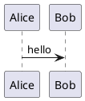

# Stack v2 Chunk 5_n_p Comment Research

This report follows the online-first workflow from `docs/comment_research/online_research_playbook.md` and the per-language template in `docs/comment_research/report_template.md`.

## nanorc
- Registry key: `nanorc`
- Line comments: `#`
- Block comments: unsupported
- Termination behavior: `newline`
- Nested comments: unsupported
- Confidence: medium
- Evidence mode: unresolved
- Docs source: unresolved
- Implementation source: unresolved
- Community source: unresolved
- Corpus fallback source: unresolved
- Recommended action: add a line-comment fixture and verify the nano manual before registry changes.
- Notes: common nanorc usage is hash-prefixed comments.

### Examples

#### Line comment
```nanorc
set tabsize 4
# keep this aligned
set softwrap
```

## Nasal
- Registry key: `nasal`
- Line comments: unresolved
- Block comments: unresolved
- Termination behavior: unresolved
- Nested comments: unresolved
- Confidence: unresolved
- Evidence mode: unresolved
- Docs source: unresolved
- Implementation source: unresolved
- Corpus fallback source: unresolved
- Recommended action: research official Nasal docs before registry updates.
- Notes: unresolved in this pass.

## NASL
- Registry key: `nasl`
- Line comments: unresolved
- Block comments: unresolved
- Termination behavior: unresolved
- Nested comments: unresolved
- Confidence: unresolved
- Evidence mode: unresolved
- Docs source: unresolved
- Implementation source: unresolved
- Corpus fallback source: unresolved
- Recommended action: research official NASL docs before registry updates.
- Notes: unresolved in this pass.

## NCL
- Registry key: `ncl`
- Line comments: unresolved
- Block comments: unresolved
- Termination behavior: unresolved
- Nested comments: unresolved
- Confidence: unresolved
- Evidence mode: unresolved
- Docs source: unresolved
- Implementation source: unresolved
- Corpus fallback source: unresolved
- Recommended action: research official NCL docs before registry updates.
- Notes: unresolved in this pass.

## Nearley
- Registry key: `nearley`
- Line comments: unresolved
- Block comments: unresolved
- Termination behavior: unresolved
- Nested comments: unresolved
- Confidence: unresolved
- Evidence mode: unresolved
- Docs source: unresolved
- Implementation source: unresolved
- Corpus fallback source: unresolved
- Recommended action: verify Nearley grammar comment syntax from official docs or grammar sources.
- Notes: unresolved in this pass.

## Nemerle
- Registry key: `nemerle`
- Line comments: unresolved
- Block comments: unresolved
- Termination behavior: unresolved
- Nested comments: unresolved
- Confidence: unresolved
- Evidence mode: unresolved
- Docs source: unresolved
- Implementation source: unresolved
- Corpus fallback source: unresolved
- Recommended action: verify Nemerle comment syntax before adding fixtures.
- Notes: unresolved in this pass.

## NEON
- Registry key: `neon`
- Line comments: `#`
- Block comments: unsupported
- Termination behavior: `newline`
- Nested comments: unsupported
- Confidence: verified
- Evidence mode: official_docs
- Docs source: https://doc.nette.org/en/neon/format
- Implementation source: https://github.com/nette/neon
- Corpus fallback source: unresolved
- Recommended action: add hash-comment fixtures and keep block comments unsupported.
- Notes: the NEON format docs say `#` starts a comment and the rest of the line is ignored.

### Examples

#### Line comment
```neon
# this line will be ignored by the interpreter
street: 742 Evergreen Terrace
city: Springfield  # this is ignored too
country: USA
```

## nesC
- Registry key: `nesc`
- Line comments: `//`
- Block comments: `/* ... */`
- Termination behavior: `first closing delimiter wins`
- Nested comments: unsupported
- Confidence: medium
- Evidence mode: unresolved
- Docs source: unresolved
- Implementation source: unresolved
- Community source: unresolved
- Corpus fallback source: unresolved
- Recommended action: add C-style fixtures and verify against the nesC reference.
- Notes: nesC is C-derived for comments.

### Examples

#### Line comment
```c
int value = 1;
// calibration
int next = value + 1;
```

#### Block comment
```c
int value = 1;
/* calibration */
int next = value + 1;
```

## NetLinx
- Registry key: `netlinx`
- Line comments: unresolved
- Block comments: unresolved
- Termination behavior: unresolved
- Nested comments: unresolved
- Confidence: unresolved
- Evidence mode: unresolved
- Docs source: unresolved
- Implementation source: unresolved
- Corpus fallback source: unresolved
- Recommended action: verify NetLinx comment syntax from official docs.
- Notes: unresolved in this pass.

## NewLisp
- Registry key: `newlisp`
- Line comments: unresolved
- Block comments: unresolved
- Termination behavior: unresolved
- Nested comments: unresolved
- Confidence: unresolved
- Evidence mode: unresolved
- Docs source: unresolved
- Implementation source: unresolved
- Corpus fallback source: unresolved
- Recommended action: verify newLISP comment syntax from the reference manual.
- Notes: unresolved in this pass.

## Nextflow
- Registry key: `nextflow`
- Line comments: `//`
- Block comments: `/* ... */`
- Termination behavior: `first closing delimiter wins`
- Nested comments: unsupported
- Confidence: verified
- Evidence mode: implementation_cross_checked
- Docs source: https://nextflow.io/docs/latest/reference/syntax.html
- Implementation source: https://github.com/nextflow-io/nextflow
- Corpus fallback source: unresolved
- Recommended action: add line-comment and block-comment fixtures.
- Notes: official syntax docs explicitly describe both comment forms.

### Examples

#### Line comment
```groovy
println 'Hello world!' // line comment
```

#### Block comment
```groovy
/*
 * block comment
 */
println 'Hello again!'
```

## Nginx
- Registry key: `nginx`
- Line comments: `#`
- Block comments: unsupported
- Termination behavior: `newline`
- Nested comments: unsupported
- Confidence: verified
- Evidence mode: implementation_cross_checked
- Docs source: https://nginx.org/en/docs/beginners_guide.html
- Implementation source: https://hg.nginx.org/nginx/
- Corpus fallback source: unresolved
- Recommended action: add line-comment fixtures only.
- Notes: the official beginner guide says the rest of a line after `#` is a comment.

### Examples

#### Line comment
```nginx
server {
  listen 80;
  # proxy to the app server
  location / {
    proxy_pass http://app;
  }
}
```

## Nim
- Registry key: `nim`
- Line comments: `#`
- Block comments: `#[ ... ]#`
- Termination behavior: `true nesting supported`
- Nested comments: supported
- Confidence: verified
- Evidence mode: implementation_cross_checked
- Docs source: https://nim-lang.org/docs/manual.html
- Implementation source: https://github.com/nim-lang/Nim
- Corpus fallback source: unresolved
- Recommended action: add line, block, and nested-block fixtures.
- Notes: the Nim manual explicitly documents multiline comments and nesting.

### Examples

#### Line comment
```nim
let x = 1
# increment the value
let y = x + 1
```

#### Block comment
```nim
let x = 1
#[ increment the value ]#
let y = x + 1
```

#### Nested comment
```nim
let x = 1
#[ outer
  #[ inner ]#
]#
let y = x + 1
```

## Ninja
- Registry key: `ninja`
- Line comments: `#`
- Block comments: unsupported
- Termination behavior: `newline`
- Nested comments: unsupported
- Confidence: verified
- Evidence mode: implementation_cross_checked
- Docs source: https://ninja-build.org/manual
- Implementation source: https://github.com/ninja-build/ninja
- Corpus fallback source: unresolved
- Recommended action: add a line-comment regression fixture.
- Notes: the official manual and build file examples use hash comments.

### Examples

#### Line comment
```ninja
rule cc
  command = cc -c $in -o $out
# build the object file
build app.o: cc app.c
```

## Nit
- Registry key: `nit`
- Line comments: unresolved
- Block comments: unresolved
- Termination behavior: unresolved
- Nested comments: unresolved
- Confidence: unresolved
- Evidence mode: unresolved
- Docs source: unresolved
- Implementation source: unresolved
- Corpus fallback source: unresolved
- Recommended action: verify Nit comment syntax before registry updates.
- Notes: unresolved in this pass.

## NL
- Registry key: `nl`
- Line comments: unresolved
- Block comments: unresolved
- Termination behavior: unresolved
- Nested comments: unresolved
- Confidence: unresolved
- Evidence mode: unresolved
- Docs source: unresolved
- Implementation source: unresolved
- Corpus fallback source: unresolved
- Recommended action: clarify what Stack v2 means by NL before further research.
- Notes: unresolved in this pass.

## NPM Config
- Registry key: `npm_config`
- Line comments: `;`, `#`
- Block comments: unsupported
- Termination behavior: `newline`
- Nested comments: unsupported
- Confidence: verified
- Evidence mode: implementation_cross_checked
- Docs source: https://docs.npmjs.com/cli/v11/configuring-npm/npmrc
- Implementation source: https://github.com/npm/ini
- Corpus fallback source: unresolved
- Recommended action: add line-comment fixtures for both `;` and `#`.
- Notes: npm docs say `.npmrc` files are ini-formatted and comment lines start with `;` or `#`.

### Examples

#### Line comment
```ini
# last modified: 01 Jan 2016
; set a custom registry for this project
registry=https://registry.npmjs.org/
```

## NSIS
- Registry key: `nsis`
- Line comments: `;`, `#`
- Block comments: `/* ... */`
- Termination behavior: `first closing delimiter wins`
- Nested comments: unsupported
- Confidence: verified
- Evidence mode: implementation_cross_checked
- Docs source: https://nsis.sourceforge.io/Docs/Chapter4.html
- Implementation source: https://github.com/kichik/nsis
- Corpus fallback source: unresolved
- Recommended action: add line and block comment fixtures, including end-of-line comments.
- Notes: the NSIS scripting reference explicitly documents both hash/semicolon lines and C-style block comments.

### Examples

#### Line comment
```nsis
Name "Example"
; installer metadata
OutFile "example.exe"
```

#### Block comment
```nsis
Name "Example"
/*
  installer metadata
  can span multiple lines
*/
OutFile "example.exe"
```

## Nunjucks
- Registry key: `nunjucks`
- Line comments: unsupported
- Block comments: `{# ... #}`
- Termination behavior: `first closing delimiter wins`
- Nested comments: unsupported
- Confidence: verified
- Evidence mode: implementation_cross_checked
- Docs source: https://mozilla.github.io/nunjucks/templating.html#comments
- Implementation source: https://github.com/mozilla/nunjucks
- Corpus fallback source: unresolved
- Recommended action: add template-comment fixtures and keep line comments unsupported.
- Notes: Nunjucks comments are template delimiters, not line comments.

### Examples

#### Block comment
```nunjucks
{# loop through the users #}

  <li>{{ user.name }}</li>

```

## NWScript
- Registry key: `nwscript`
- Line comments: `//`
- Block comments: `/* ... */`
- Termination behavior: `first closing delimiter wins`
- Nested comments: unsupported
- Confidence: medium
- Evidence mode: unresolved
- Docs source: unresolved
- Implementation source: unresolved
- Community source: unresolved
- Corpus fallback source: unresolved
- Recommended action: add C-style fixtures and verify against the NWScript reference.
- Notes: NWScript follows the common C-style comment convention.

### Examples

#### Line comment
```c
void main() {
  // initialise game state
  int x = 1;
}
```

#### Block comment
```c
void main() {
  /* initialise game state */
  int x = 1;
}
```

## ObjDump
- Registry key: `objdump`
- Line comments: unresolved
- Block comments: unresolved
- Termination behavior: unresolved
- Nested comments: unresolved
- Confidence: unresolved
- Evidence mode: unresolved
- Docs source: unresolved
- Implementation source: unresolved
- Corpus fallback source: unresolved
- Recommended action: identify the exact Stack v2 syntax flavor for this entry.
- Notes: unresolved in this pass.

## Object Data Instance Notation
- Registry key: `object_data_instance_notation`
- Line comments: unresolved
- Block comments: unresolved
- Termination behavior: unresolved
- Nested comments: unresolved
- Confidence: unresolved
- Evidence mode: unresolved
- Docs source: unresolved
- Implementation source: unresolved
- Corpus fallback source: unresolved
- Recommended action: verify whether the format supports comments at all.
- Notes: unresolved in this pass.

## Objective-C++
- Registry key: `objective_cpp`
- Line comments: `//`
- Block comments: `/* ... */`
- Termination behavior: `first closing delimiter wins`
- Nested comments: unsupported
- Confidence: high
- Evidence mode: unresolved
- Docs source: unresolved
- Implementation source: unresolved
- Community source: unresolved
- Corpus fallback source: unresolved
- Recommended action: add C/C++-style fixtures.
- Notes: Objective-C++ uses standard C++ comment syntax.

### Examples

#### Line comment
```cpp
int value = 1;
// increment
int next = value + 1;
```

#### Block comment
```cpp
int value = 1;
/* increment */
int next = value + 1;
```

## Objective-J
- Registry key: `objective_j`
- Line comments: `//`
- Block comments: `/* ... */`
- Termination behavior: `first closing delimiter wins`
- Nested comments: unsupported
- Confidence: high
- Evidence mode: unresolved
- Docs source: unresolved
- Implementation source: unresolved
- Community source: unresolved
- Corpus fallback source: unresolved
- Recommended action: add C-family fixtures.
- Notes: Objective-J follows the same comment model as JavaScript/C.

### Examples

#### Line comment
```objective-j
var value = 1;
// increment
value = value + 1;
```

#### Block comment
```objective-j
var value = 1;
/* increment */
value = value + 1;
```

## ObjectScript
- Registry key: `objectscript`
- Line comments: `//`, `;`, `##;` (`#;` in column 1)
- Block comments: `/* ... */`
- Termination behavior: `newline` for line comments; `first closing delimiter wins` for block comments
- Nested comments: unsupported
- Confidence: verified
- Evidence mode: official_docs
- Docs source: https://docs.intersystems.com/irislatest/csp/docbook/DocBook.UI.Page.cls?KEY=GCOS_syntax
- Implementation source: https://docs.rs/crate/tree-sitter-objectscript/1.6.3
- Corpus fallback source: unresolved
- Recommended action: add fixtures for `//`, `;`, `##;`, and `/* */`, but keep nested comments unsupported.
- Notes: InterSystems docs distinguish INT, MAC, and class-definition comment contexts; `##;` comments out the rest of the current line, and `#;` is the column-1 equivalent in preprocessor contexts.

### Examples

#### `//` line comment
```objectscript
Class Demo.Sample
{
ClassMethod Main()
{
  // increment value
  Set x = 1
}
}
```

#### `;` line comment
```objectscript
Class Demo.Sample
{
ClassMethod Main()
{
  Set x = 1 ; increment value
  Set y = x + 1
}
}
```

#### `##;` line comment
```objectscript
#define alphalen ##function($LENGTH("abcdefghijklmnopqrstuvwxyz")) ##; + 100
WRITE $$$alphalen," is the length of the alphabet"
```

#### Block comment
```objectscript
Class Demo.Sample
{
ClassMethod Main()
{
  /* increment value */
  Set x = 1
}
}
```

## Odin
- Registry key: `odin`
- Line comments: `//`
- Block comments: `/* ... */`
- Termination behavior: `first closing delimiter wins`
- Nested comments: unsupported
- Confidence: high
- Evidence mode: unresolved
- Docs source: unresolved
- Implementation source: unresolved
- Community source: unresolved
- Corpus fallback source: unresolved
- Recommended action: add C-style fixtures.
- Notes: Odin uses standard C-family comment forms.

### Examples

#### Line comment
```odin
main :: proc() {
    // setup
    x := 1
}
```

#### Block comment
```odin
main :: proc() {
    /* setup */
    x := 1
}
```

## ooc
- Registry key: `ooc`
- Line comments: `//`
- Block comments: `/* ... */`
- Termination behavior: `first closing delimiter wins`
- Nested comments: unsupported
- Confidence: medium
- Evidence mode: unresolved
- Docs source: unresolved
- Implementation source: unresolved
- Community source: unresolved
- Corpus fallback source: unresolved
- Recommended action: add C-family fixtures and verify against ooc docs.
- Notes: ooc appears to follow a C-like comment model.

### Examples

#### Line comment
```ooc
println("hello") // say hello
```

#### Block comment
```ooc
/*
  say hello
*/
println("hello")
```

## Opa
- Registry key: `opa`
- Line comments: unresolved
- Block comments: unresolved
- Termination behavior: unresolved
- Nested comments: unresolved
- Confidence: unresolved
- Evidence mode: unresolved
- Docs source: unresolved
- Implementation source: unresolved
- Corpus fallback source: unresolved
- Recommended action: verify the Stack v2 Opa entry before assuming any syntax family.
- Notes: unresolved in this pass.

## Open Policy Agent
- Registry key: `open_policy_agent`
- Line comments: `#`
- Block comments: unsupported
- Termination behavior: `newline`
- Nested comments: unsupported
- Confidence: verified
- Evidence mode: implementation_cross_checked
- Docs source: https://www.openpolicyagent.org/docs
- Implementation source: https://github.com/open-policy-agent/opa
- Corpus fallback source: unresolved
- Recommended action: add hash-comment fixtures and keep block comments unsupported.
- Notes: the official docs examples use `#` comments in Rego.

### Examples

#### Line comment
```rego
package example

# deny invalid numbers
deny if input.number > 5
```

## OpenCL
- Registry key: `opencl`
- Line comments: `//`
- Block comments: `/* ... */`
- Termination behavior: `first closing delimiter wins`
- Nested comments: unsupported
- Confidence: high
- Evidence mode: unresolved
- Docs source: unresolved
- Implementation source: unresolved
- Community source: unresolved
- Corpus fallback source: unresolved
- Recommended action: add C-style fixtures.
- Notes: OpenCL C uses standard C-family comment forms.

### Examples

#### Line comment
```c
__kernel void add(__global const float* a, __global const float* b) {
  // compute a single element
  int id = get_global_id(0);
}
```

#### Block comment
```c
__kernel void add(__global const float* a, __global const float* b) {
  /* compute a single element */
  int id = get_global_id(0);
}
```

## OpenEdge ABL
- Registry key: `openedge_abl`
- Line comments: unresolved
- Block comments: unresolved
- Termination behavior: unresolved
- Nested comments: unresolved
- Confidence: unresolved
- Evidence mode: unresolved
- Docs source: unresolved
- Implementation source: unresolved
- Corpus fallback source: unresolved
- Recommended action: verify ABL comment syntax from the official reference.
- Notes: unresolved in this pass.

## OpenQASM
- Registry key: `openqasm`
- Line comments: `//`
- Block comments: `/* ... */`
- Termination behavior: `newline` for line comments; `first closing delimiter wins` for block comments
- Nested comments: unsupported
- Confidence: verified
- Evidence mode: implementation_cross_checked
- Docs source: https://openqasm.com/versions/3.0/language/comments.html
- Implementation source: https://github.com/openqasm/openqasm
- Corpus fallback source: unresolved
- Recommended action: add line and block fixtures and keep nested comments unsupported.
- Notes: the OpenQASM 3 spec explicitly defines `//` line comments and `/* ... */` block comments.

### Examples

#### Line comment
```qasm
// First non-comment is a version string
OPENQASM 3.0;
include "stdgates.qasm";
```

#### Block comment
```qasm
/*
  Repeat-until-success circuit for Rz(theta)
*/
OPENQASM 3.0;
```

## OpenRC runscript
- Registry key: `openrc_runscript`
- Line comments: `#`
- Block comments: unsupported
- Termination behavior: `newline`
- Nested comments: unsupported
- Confidence: medium
- Evidence mode: unresolved
- Docs source: unresolved
- Implementation source: unresolved
- Community source: unresolved
- Corpus fallback source: unresolved
- Recommended action: add line-comment fixtures and confirm against the runscript reference.
- Notes: runscript files are shell-like and typically use hash comments.

### Examples

#### Line comment
```sh
description="Example service"
# restart policy
command="/usr/bin/example"
```

## OpenSCAD
- Registry key: `openscad`
- Line comments: `//`
- Block comments: `/* ... */`
- Termination behavior: `first closing delimiter wins`
- Nested comments: unsupported
- Confidence: verified
- Evidence mode: implementation_cross_checked
- Docs source: https://openscad.org/documentation.html
- Implementation source: https://github.com/openscad/openscad
- Community source: unresolved
- Corpus fallback source: unresolved
- Recommended action: add line and block fixtures.
- Notes: OpenSCAD uses the standard C-family comment forms.

### Examples

#### Line comment
```scad
cube(10);
// parametric note
sphere(5);
```

#### Block comment
```scad
cube(10);
/* parametric note */
sphere(5);
```

## OpenStep Property List
- Registry key: `openstep_property_list`
- Line comments: unresolved
- Block comments: unresolved
- Termination behavior: unresolved
- Nested comments: unresolved
- Confidence: unresolved
- Evidence mode: unresolved
- Docs source: unresolved
- Implementation source: unresolved
- Corpus fallback source: unresolved
- Recommended action: verify whether the plist variant supports comments at all.
- Notes: unresolved in this pass.

## OpenType Feature File
- Registry key: `opentype_feature_file`
- Line comments: unresolved
- Block comments: unresolved
- Termination behavior: unresolved
- Nested comments: unresolved
- Confidence: unresolved
- Evidence mode: unresolved
- Docs source: unresolved
- Implementation source: unresolved
- Corpus fallback source: unresolved
- Recommended action: verify feature-file comment syntax from the OpenType feature syntax docs.
- Notes: unresolved in this pass.

## Org
- Registry key: `org`
- Line comments: unresolved
- Block comments: unresolved
- Termination behavior: unresolved
- Nested comments: unresolved
- Confidence: unresolved
- Evidence mode: unresolved
- Docs source: unresolved
- Implementation source: unresolved
- Corpus fallback source: unresolved
- Recommended action: verify Org comment syntax separately from source comments.
- Notes: unresolved in this pass.

## Ox
- Registry key: `ox`
- Line comments: unresolved
- Block comments: unresolved
- Termination behavior: unresolved
- Nested comments: unresolved
- Confidence: unresolved
- Evidence mode: unresolved
- Docs source: unresolved
- Implementation source: unresolved
- Corpus fallback source: unresolved
- Recommended action: verify Ox comment syntax from the official reference.
- Notes: unresolved in this pass.

## Oz
- Registry key: `oz`
- Line comments: unresolved
- Block comments: unresolved
- Termination behavior: unresolved
- Nested comments: unresolved
- Confidence: unresolved
- Evidence mode: unresolved
- Docs source: unresolved
- Implementation source: unresolved
- Corpus fallback source: unresolved
- Recommended action: verify Oz comment syntax from the language reference.
- Notes: unresolved in this pass.

## P4
- Registry key: `p4`
- Line comments: `//`
- Block comments: `/* ... */`
- Termination behavior: `first closing delimiter wins`
- Nested comments: unsupported
- Confidence: medium
- Evidence mode: unresolved
- Docs source: unresolved
- Implementation source: unresolved
- Community source: unresolved
- Corpus fallback source: unresolved
- Recommended action: add C-style fixtures if the P4 reference confirms this syntax.
- Notes: P4 is usually treated as C-like for comments.

### Examples

#### Line comment
```p4
// ingress processing
control MyIngress() {
  apply { }
}
```

#### Block comment
```p4
/* ingress processing */
control MyIngress() {
  apply { }
}
```

## Pan
- Registry key: `pan`
- Line comments: unresolved
- Block comments: unresolved
- Termination behavior: unresolved
- Nested comments: unresolved
- Confidence: unresolved
- Evidence mode: unresolved
- Docs source: unresolved
- Implementation source: unresolved
- Corpus fallback source: unresolved
- Recommended action: verify Pan comment syntax from the language reference.
- Notes: unresolved in this pass.

## Papyrus
- Registry key: `papyrus`
- Line comments: unresolved
- Block comments: unresolved
- Termination behavior: unresolved
- Nested comments: unresolved
- Confidence: unresolved
- Evidence mode: unresolved
- Docs source: unresolved
- Implementation source: unresolved
- Corpus fallback source: unresolved
- Recommended action: verify Papyrus comment syntax from the language reference.
- Notes: unresolved in this pass.

## Parrot Assembly
- Registry key: `parrot_assembly`
- Line comments: unresolved
- Block comments: unresolved
- Termination behavior: unresolved
- Nested comments: unresolved
- Confidence: unresolved
- Evidence mode: unresolved
- Docs source: unresolved
- Implementation source: unresolved
- Corpus fallback source: unresolved
- Recommended action: verify Parrot Assembly comment syntax from the official reference.
- Notes: unresolved in this pass.

## Parrot Internal Representation
- Registry key: `parrot_internal_representation`
- Line comments: unresolved
- Block comments: unresolved
- Termination behavior: unresolved
- Nested comments: unresolved
- Confidence: unresolved
- Evidence mode: unresolved
- Docs source: unresolved
- Implementation source: unresolved
- Corpus fallback source: unresolved
- Recommended action: verify PIR comment syntax from the official reference.
- Notes: unresolved in this pass.

## Pascal
- Registry key: `pascal`
- Line comments: `//`
- Block comments: `{ ... }`, `(* ... *)`
- Termination behavior: `true nesting supported in Free Pascal normal mode; disabled in TP/Delphi mode`
- Nested comments: supported in Free Pascal normal mode; unsupported in TP/Delphi mode; unsupported in Pascal65
- Version scope: Free Pascal 3.0.0, 3.2.2, and 3.2.4; Pascal65 current docs; Free Pascal TP/Delphi compatibility mode
- Version-specific syntax: Free Pascal accepts `{...}`, `(*...*)`, and `//`, and nests comments in normal mode; TP/Delphi mode disables nesting; Pascal65 accepts `//` and `(*...*)` but rejects `{...}`
- Confidence: verified
- Evidence mode: documentation_cross_checked
- Docs source: https://www.freepascal.org/docs-html/3.0.0/ref/refse2.html; https://docs.freepascal.org/docs-html/current/ref/ref.html; https://docs.pascal65.org/en/latest/notablediffs/
- Community source: https://lists.freepascal.org/pipermail/fpc-pascal.old/2013-September/039422.html
- Implementation source: unresolved
- Corpus fallback source: unresolved
- Recommended action: implement the union of `{...}`, `(*...*)`, and `//` for the generic Pascal registry key, but split or gate by dialect if the parser needs to distinguish Free Pascal from TP/Delphi/Pascal65 behavior.
- Notes: Free Pascal explicitly documents nested comments in normal mode and disables them in TP/Delphi mode.

## Pawn
- Registry key: `pawn`
- Line comments: `//`
- Block comments: `/* ... */`
- Termination behavior: `first closing delimiter wins`
- Nested comments: unsupported
- Confidence: medium
- Evidence mode: unresolved
- Docs source: unresolved
- Implementation source: unresolved
- Community source: unresolved
- Corpus fallback source: unresolved
- Recommended action: add C-style fixtures and confirm against the Pawn reference.
- Notes: Pawn follows the common C-family comment model.

### Examples

#### Line comment
```pawn
new value = 1;
// increment
new next = value + 1;
```

#### Block comment
```pawn
new value = 1;
/* increment */
new next = value + 1;
```

## PEG.js
- Registry key: `peg_js`
- Line comments: unresolved
- Block comments: unresolved
- Termination behavior: unresolved
- Nested comments: unresolved
- Confidence: unresolved
- Evidence mode: unresolved
- Docs source: unresolved
- Implementation source: unresolved
- Corpus fallback source: unresolved
- Recommended action: verify PEG.js grammar comment syntax from the grammar docs.
- Notes: unresolved in this pass.

## Pep8
- Registry key: `pep8`
- Line comments: unresolved
- Block comments: unresolved
- Termination behavior: unresolved
- Nested comments: unresolved
- Confidence: unresolved
- Evidence mode: unresolved
- Docs source: unresolved
- Implementation source: unresolved
- Corpus fallback source: unresolved
- Recommended action: verify the Pep8 dialect comment syntax before registry work.
- Notes: unresolved in this pass.

## Pic
- Registry key: `pic`
- Line comments: unresolved
- Block comments: unresolved
- Termination behavior: unresolved
- Nested comments: unresolved
- Confidence: unresolved
- Evidence mode: unresolved
- Docs source: unresolved
- Implementation source: unresolved
- Corpus fallback source: unresolved
- Recommended action: verify Pic comment syntax from the language reference.
- Notes: unresolved in this pass.

## Pickle
- Registry key: `pickle`
- Line comments: unresolved
- Block comments: unresolved
- Termination behavior: unresolved
- Nested comments: unresolved
- Confidence: unresolved
- Evidence mode: unresolved
- Docs source: unresolved
- Implementation source: unresolved
- Corpus fallback source: unresolved
- Recommended action: verify Pickle syntax before adding fixtures.
- Notes: unresolved in this pass.

## PicoLisp
- Registry key: `picolisp`
- Line comments: unresolved
- Block comments: unresolved
- Termination behavior: unresolved
- Nested comments: unresolved
- Confidence: unresolved
- Evidence mode: unresolved
- Docs source: unresolved
- Implementation source: unresolved
- Corpus fallback source: unresolved
- Recommended action: verify PicoLisp comment syntax from the official docs.
- Notes: unresolved in this pass.

## PigLatin
- Registry key: `piglatin`
- Line comments: `--`
- Block comments: `/* ... */`
- Termination behavior: `first closing delimiter wins`
- Nested comments: unsupported
- Confidence: medium
- Evidence mode: unresolved
- Docs source: unresolved
- Implementation source: unresolved
- Community source: unresolved
- Corpus fallback source: unresolved
- Recommended action: add SQL-like fixtures and confirm the PigLatin comment rules.
- Notes: PigLatin appears to use SQL-style comment delimiters.

### Examples

#### Line comment
```pig
LOAD 'data.csv' USING PigStorage(',');
-- clean the input first
filtered = FILTER data BY age > 18;
```

#### Block comment
```pig
LOAD 'data.csv' USING PigStorage(',');
/* clean the input first */
filtered = FILTER data BY age > 18;
```

## Pike
- Registry key: `pike`
- Line comments: `//`
- Block comments: `/* ... */`
- Termination behavior: `first closing delimiter wins`
- Nested comments: unsupported
- Version scope: current Pike tutorial/manual pages; Pike autodoc chapter 32 for C-mode and Pike-mode doc comments
- Version-specific syntax: no version-specific syntax change found in the checked docs; ordinary Pike code uses `//` and `/*...*/`, while Pike autodoc adds `//!` line doc comments in Pike files and `/*! ... */` blocks with `*!`-prefixed lines in C files
- Confidence: verified
- Evidence mode: documentation_cross_checked
- Docs source: https://pike.lysator.liu.se/docs/tut/browser/index.md; https://pike.lysator.liu.se/docs/man/chapter_32.html
- Implementation source: unresolved
- Corpus fallback source: unresolved
- Recommended action: keep ordinary `//` and `/*...*/` in the base registry and decide separately whether autodoc forms should be added as a doc-comment subfamily.
- Notes: Pike autodoc mode is dialect-specific rather than version-specific, but it introduces additional comment-like forms worth tracking.

### Examples

#### Line comment
```pike
int x = 1;
// increment
int y = x + 1;
```

#### Block comment
```pike
int x = 1;
/* increment */
int y = x + 1;
```

## PlantUML
- Registry key: `plantuml`
- Line comments: `'`
- Block comments: `/' ... '/`
- Termination behavior: `newline` for line comments; `first closing delimiter wins` for block comments
- Nested comments: unsupported
- Confidence: verified
- Evidence mode: implementation_cross_checked
- Docs source: https://plantuml.com/en/commons
- Implementation source: https://github.com/plantuml/plantuml
- Corpus fallback source: unresolved
- Recommended action: add apostrophe-comment fixtures and keep nested comments unsupported.
- Notes: PlantUML line comments use a single apostrophe, and block comments use `/'` ... `'/`.

### Examples

#### Line comment


#### Block comment


## PLpgSQL
- Registry key: `plpgsql`
- Line comments: `--`
- Block comments: `/* ... */`
- Termination behavior: `first closing delimiter wins`
- Nested comments: unsupported
- Confidence: verified
- Evidence mode: implementation_cross_checked
- Docs source: https://www.postgresql.org/docs/8.3/plpgsql-structure.html
- Implementation source: https://github.com/postgres/postgres
- Corpus fallback source: unresolved
- Recommended action: add SQL-family fixtures for both line and block comments.
- Notes: PostgreSQL docs explicitly state that block comments cannot nest.

### Examples

#### Line comment
```sql
DO $$
BEGIN
  -- increment a counter
  RAISE NOTICE 'hello';
END
$$;
```

#### Block comment
```sql
DO $$
BEGIN
  /* increment a counter */
  RAISE NOTICE 'hello';
END
$$;
```

## PLSQL
- Registry key: `plsql`
- Line comments: `--`
- Block comments: `/* ... */`
- Termination behavior: `first closing delimiter wins`
- Nested comments: unsupported
- Confidence: verified
- Evidence mode: official_docs
- Docs source: https://docs.oracle.com/en/database/oracle/oracle-database/26/lnpls/comment.html
- Implementation source: unresolved
- Corpus fallback source: unresolved
- Recommended action: add SQL-family fixtures and keep nested comments unsupported.
- Notes: Oracle docs state that multiline comments cannot contain other multiline comments.

### Examples

#### Line comment
```sql
DECLARE
  value NUMBER := 1;
BEGIN
  -- increment a counter
  value := value + 1;
END;
/
```

#### Block comment
```sql
DECLARE
  value NUMBER := 1;
BEGIN
  /* increment a counter */
  value := value + 1;
END;
/
```

## Pod
- Registry key: `pod`
- Line comments: unresolved
- Block comments: unresolved
- Termination behavior: unresolved
- Nested comments: unresolved
- Confidence: unresolved
- Evidence mode: unresolved
- Docs source: unresolved
- Implementation source: unresolved
- Corpus fallback source: unresolved
- Recommended action: verify whether this is Perl POD or a different source format.
- Notes: unresolved in this pass.

## Pod 6
- Registry key: `pod_6`
- Line comments: unresolved
- Block comments: unresolved
- Termination behavior: unresolved
- Nested comments: unresolved
- Confidence: unresolved
- Evidence mode: unresolved
- Docs source: unresolved
- Implementation source: unresolved
- Corpus fallback source: unresolved
- Recommended action: verify Pod 6 / Raku docs before registry changes.
- Notes: unresolved in this pass.

## PogoScript
- Registry key: `pogoscript`
- Line comments: unresolved
- Block comments: unresolved
- Termination behavior: unresolved
- Nested comments: unresolved
- Confidence: unresolved
- Evidence mode: unresolved
- Docs source: unresolved
- Implementation source: unresolved
- Corpus fallback source: unresolved
- Recommended action: verify PogoScript syntax from official docs.
- Notes: unresolved in this pass.

## Pony
- Registry key: `pony`
- Line comments: unresolved
- Block comments: unresolved
- Termination behavior: unresolved
- Nested comments: unresolved
- Confidence: unresolved
- Evidence mode: unresolved
- Docs source: unresolved
- Implementation source: unresolved
- Corpus fallback source: unresolved
- Recommended action: verify Pony comment syntax from the language reference.
- Notes: unresolved in this pass.

## Portugol
- Registry key: `portugol`
- Line comments: unresolved
- Block comments: unresolved
- Termination behavior: unresolved
- Nested comments: unresolved
- Confidence: unresolved
- Evidence mode: unresolved
- Docs source: unresolved
- Implementation source: unresolved
- Corpus fallback source: unresolved
- Recommended action: verify the Stack v2 Portugol dialect before adding fixtures.
- Notes: unresolved in this pass.

## PostCSS
- Registry key: `postcss`
- Line comments: unsupported
- Block comments: `/* ... */`
- Termination behavior: `first closing delimiter wins`
- Nested comments: unsupported
- Confidence: high
- Evidence mode: unresolved
- Docs source: unresolved
- Implementation source: unresolved
- Community source: unresolved
- Corpus fallback source: unresolved
- Recommended action: add CSS-comment fixtures.
- Notes: PostCSS inherits standard CSS comment syntax.

### Examples

#### Block comment
```css
a {
  color: red;
  /* custom postcss note */
  display: block;
}
```

## PostScript
- Registry key: `postscript`
- Line comments: `%`
- Block comments: unsupported
- Termination behavior: `newline`
- Nested comments: unsupported
- Confidence: high
- Evidence mode: unresolved
- Docs source: unresolved
- Implementation source: unresolved
- Community source: unresolved
- Corpus fallback source: unresolved
- Recommended action: add percent-comment fixtures.
- Notes: PostScript comments run to end of line.

### Examples

#### Line comment
```postscript
% this is a comment
/Times-Roman findfont 12 scalefont setfont
```

## POV-Ray SDL
- Registry key: `pov_ray_sdl`
- Line comments: unresolved
- Block comments: unresolved
- Termination behavior: unresolved
- Nested comments: unresolved
- Confidence: unresolved
- Evidence mode: unresolved
- Docs source: unresolved
- Implementation source: unresolved
- Corpus fallback source: unresolved
- Recommended action: verify POV-Ray SDL comment syntax from the language reference.
- Notes: unresolved in this pass.

## PowerBuilder
- Registry key: `powerbuilder`
- Line comments: `//`
- Block comments: `/* ... */`
- Termination behavior: `true nesting supported`
- Nested comments: supported
- Version scope: PowerBuilder 2021, 2022, 2022 R3, 2025, and 2025 R2 documentation; PowerServer Mobile feature docs also checked
- Version-specific syntax: no version split found across the checked releases; `//` comments run to end of line, while `/*...*/` comments can span multiple lines and can nest
- Confidence: verified
- Evidence mode: documentation_cross_checked
- Docs source: https://docs.appeon.com/pb2021/powerscript_reference/xREF_94732_Comments.html; https://docs.appeon.com/pb2022/powerscript_reference/xREF_94732_Comments.html; https://docs.appeon.com/pb2025/powerscript_reference/Language_Basics.html; https://docs.appeon.com/pb2025r2/powerscript_reference/index.html; https://docs.appeon.com/2017/features_help_for_appeon_mobile/ch04s01s02.html
- Implementation source: unresolved
- Corpus fallback source: unresolved
- Recommended action: implement the union of `//` and `/*...*/`, and preserve nesting in the registry entry.
- Notes: all checked Appeon docs agree on the same comment forms.

## PowerShell
- Registry key: `powershell`
- Line comments: `#`
- Block comments: `<# ... #>`
- Termination behavior: `first closing delimiter wins`
- Nested comments: unsupported
- Confidence: verified
- Evidence mode: implementation_cross_checked
- Docs source: https://learn.microsoft.com/powershell/module/microsoft.powershell.core/about/about_comments?view=powershell-7.6
- Implementation source: https://github.com/PowerShell/PowerShell
- Corpus fallback source: unresolved
- Recommended action: add line and block fixtures, and test non-nesting explicitly.
- Notes: Microsoft docs state that block comments cannot nest.

### Examples

#### Line comment
```powershell
$value = 1
# increment for the next step
$value = $value + 1
```

#### Block comment
```powershell
$value = 1
<#
  increment for the next step
#>
$value = $value + 1
```

## Prisma
- Registry key: `prisma`
- Line comments: unresolved
- Block comments: unresolved
- Termination behavior: unresolved
- Nested comments: unresolved
- Confidence: unresolved
- Evidence mode: unresolved
- Docs source: unresolved
- Implementation source: unresolved
- Corpus fallback source: unresolved
- Recommended action: verify Prisma schema comment syntax before adding fixtures.
- Notes: unresolved in this pass.

## Procfile
- Registry key: `procfile`
- Line comments: `#`
- Block comments: unsupported
- Termination behavior: `newline`
- Nested comments: unsupported
- Confidence: high
- Evidence mode: unresolved
- Docs source: unresolved
- Implementation source: unresolved
- Community source: unresolved
- Corpus fallback source: unresolved
- Recommended action: add line-comment fixtures only.
- Notes: Procfile lines use hash comments.

### Examples

#### Line comment
```procfile
web: bundle exec puma -C config/puma.rb
# worker process
worker: bundle exec sidekiq
```

## Proguard
- Registry key: `proguard`
- Line comments: `#`
- Block comments: unsupported
- Termination behavior: `newline`
- Nested comments: unsupported
- Confidence: high
- Evidence mode: unresolved
- Docs source: unresolved
- Implementation source: unresolved
- Community source: unresolved
- Corpus fallback source: unresolved
- Recommended action: add hash-comment fixtures.
- Notes: ProGuard configuration files use `#` comments.

### Examples

#### Line comment
```pro
-keep class com.example.** { *; }
# keep generated accessors too
```

## Promela
- Registry key: `promela`
- Line comments: preprocessor-dependent (`//` accepted by some C preprocessors used with Spin; not native Promela syntax)
- Block comments: `/* ... */`
- Termination behavior: `first closing delimiter wins`
- Nested comments: unsupported
- Version scope: Spin 2.9.7 quick reference and current Spin manual pages
- Version-specific syntax: no Promela-language version split found; Promela proper only guarantees `/*...*/`, and `//` appears only when the selected external C preprocessor accepts C++-style comments
- Confidence: verified
- Evidence mode: documentation_cross_checked
- Docs source: https://spinroot.com/spin/Man/comments.html; https://spinroot.com/spin/Man/macros.html; https://spinroot.com/spin/Man/Quick.html
- Implementation source: unresolved
- Corpus fallback source: unresolved
- Recommended action: implement block comments only as the native registry form; keep `//` out unless the extractor is explicitly modeling preprocessed source.
- Notes: Spin's comment handling is mediated by the preprocessor, so line comments are not guaranteed by Promela itself.

### Examples

#### Line comment
```promela
active proctype Example() {
  // state initialization
  skip;
}
```

#### Block comment
```promela
active proctype Example() {
  /* state initialization */
  skip;
}
```

## Propeller Spin
- Registry key: `propeller_spin`
- Line comments: unresolved
- Block comments: unresolved
- Termination behavior: unresolved
- Nested comments: unresolved
- Confidence: unresolved
- Evidence mode: unresolved
- Docs source: unresolved
- Implementation source: unresolved
- Corpus fallback source: unresolved
- Recommended action: verify Spin comment syntax from the official reference.
- Notes: unresolved in this pass.

## Protocol Buffer
- Registry key: `protocol_buffer`
- Line comments: `//`
- Block comments: `/* ... */`
- Termination behavior: `first closing delimiter wins`
- Nested comments: unsupported
- Confidence: verified
- Evidence mode: implementation_cross_checked
- Docs source: https://protobuf.dev/programming-guides/proto3/
- Implementation source: https://github.com/protocolbuffers/protobuf
- Corpus fallback source: unresolved
- Recommended action: add line and block fixtures for .proto files.
- Notes: the language guide explicitly recommends `//` comments and accepts C-style block comments.

### Examples

#### Line comment
```proto
syntax = "proto3";

// user record
message Person {
  string name = 1;
}
```

#### Block comment
```proto
syntax = "proto3";

/* user record */
message Person {
  string name = 1;
}
```

## Protocol Buffer Text Format
- Registry key: `protocol_buffer_text_format`
- Line comments: `#`
- Block comments: unsupported
- Termination behavior: `newline`
- Nested comments: unsupported
- Confidence: verified
- Evidence mode: implementation_cross_checked
- Docs source: https://protobuf.dev/reference/protobuf/textformat-spec/
- Implementation source: https://github.com/protocolbuffers/protobuf
- Corpus fallback source: unresolved
- Recommended action: add line-comment fixtures and keep block comments unsupported.
- Notes: the text-format spec defines a single shell-style line comment token.

### Examples

#### Line comment
```text
# proto-file: some/proto/my_file.proto
# proto-message: MyMessage

name: "John Smith"
```

## Public Key
- Registry key: `public_key`
- Line comments: unsupported
- Block comments: unsupported
- Termination behavior: unsupported
- Nested comments: unsupported
- Confidence: high
- Evidence mode: unresolved
- Docs source: unresolved
- Implementation source: unresolved
- Corpus fallback source: unresolved
- Recommended action: keep this entry unsupported unless a formal spec changes.
- Notes: armored public key files use headers and footers, not comments.

## Pug
- Registry key: `pug`
- Line comments: `//`, `//-`
- Block comments: supported via indented comment blocks
- Termination behavior: `first dedent ends block`
- Nested comments: unsupported
- Confidence: verified
- Evidence mode: implementation_cross_checked
- Docs source: https://pugjs.org/language/comments.html
- Implementation source: https://github.com/pugjs/pug
- Corpus fallback source: unresolved
- Recommended action: add buffered and unbuffered comment fixtures, plus one indented block case.
- Notes: Pug comments are template-aware and may render as HTML comments.

### Examples

#### Line comment
```pug
div.card
  // visible in rendered HTML
  p hello
  //- hidden from rendered HTML
  span world
```

#### Block comment
```pug
body
  //- template writers note
    this line stays inside the comment block
  p hello
```

## Puppet
- Registry key: `puppet`
- Line comments: `#`
- Block comments: unsupported
- Termination behavior: `newline`
- Nested comments: unsupported
- Confidence: verified
- Evidence mode: implementation_cross_checked
- Docs source: https://help.puppet.com/core/current/Content/PuppetCore/lang_comments.htm
- Implementation source: https://github.com/puppetlabs/puppet
- Corpus fallback source: unresolved
- Recommended action: add hash-comment fixtures.
- Notes: Puppet docs describe shell-style hash comments.

### Examples

#### Line comment
```puppet
class example {
  # ensure ordering is stable
  notify { 'hello': }
}
```

## Pure Data
- Registry key: `pure_data`
- Line comments: unresolved
- Block comments: unresolved
- Termination behavior: unresolved
- Nested comments: unresolved
- Confidence: unresolved
- Evidence mode: unresolved
- Docs source: unresolved
- Implementation source: unresolved
- Corpus fallback source: unresolved
- Recommended action: verify whether the format has true comments or only directives.
- Notes: unresolved in this pass.

## PureBasic
- Registry key: `purebasic`
- Line comments: `;`
- Block comments: unsupported
- Termination behavior: `newline`
- Nested comments: unsupported
- Confidence: verified
- Evidence mode: official_docs
- Docs source: https://www.purebasic.com/documentation/reference/general_rules.html
- Implementation source: unresolved
- Corpus fallback source: unresolved
- Recommended action: add semicolon-comment fixtures and keep block comments unsupported.
- Notes: the PureBasic reference manual documents semicolon comments in the general syntax rules.

### Examples

#### Line comment
```purebasic
If a = 10 ; This is a comment to indicate something.
  Debug "value is 10"
EndIf
```

## PureScript
- Registry key: `purescript`
- Line comments: `--`
- Block comments: `{- ... -}`
- Termination behavior: `true nesting supported`
- Nested comments: supported
- Confidence: high
- Evidence mode: unresolved
- Docs source: unresolved
- Implementation source: unresolved
- Community source: unresolved
- Corpus fallback source: unresolved
- Recommended action: add line, block, and nested-block fixtures.
- Notes: PureScript follows the Haskell-style nested comment model.

### Examples

#### Line comment
```purescript
value = 1
-- increment
next = value + 1
```

#### Block comment
```purescript
value = 1
{- increment -}
next = value + 1
```

#### Nested comment
```purescript
value = 1
{- outer
  {- inner -}
-}
next = value + 1
```
