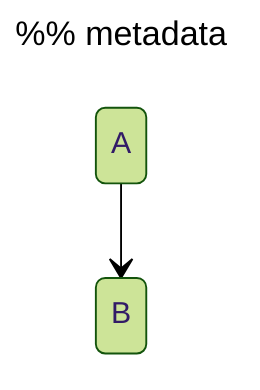
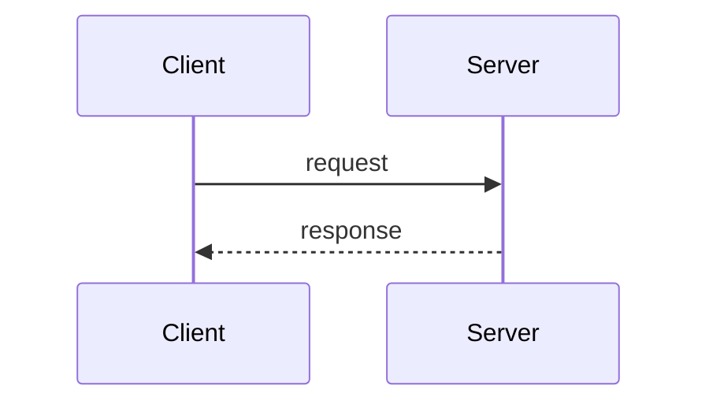

# Stack v3 Full Comment Research: batch_05

## Dataset provenance

- Dataset/project: `HuggingFaceCode/stack-v3-full`
- Statistics repository: `HuggingFaceCode/stack-v3-train`
- Immutable revision: `716a043a6c2adc34a2032b159364908a09ffe4ec`
- Full statistics SHA-256:
  `804cbdea6fc5329282096628a9865f5e91079f845dbcb82cd0da7af4be0a6d45`
- Retrieved: 2026-08-01
- Inventory source and label column: pinned full statistics aggregated from
  `files[].language`
- Researcher or agent: `/root/research_batch_05`
- Review status: `reviewed`

The raw labels were reconciled against the feature-branch registry before this
research. None of the ten labels resolved at that point. Dataset identities and
extensions below are pinned to
[Linguist commit `af6f772`](https://github.com/github-linguist/linguist/blob/af6f772786199696e4d07d618c9c5b625a1a03f0/lib/linguist/languages.yml).

## Leo

### Identity and scope

- Raw dataset label: `Leo` (241,537 files; 588,000,908 tokens)
- Proposed registry key: `leo`
- Existing family or aliases checked: `java` / `c_style`; the delimiters and
  non-nesting rule match, but that shared family cannot encode Leo's
  security-significant bidi boundaries without changing its other aliases.
- Classification: `language`
- Versions or releases checked: Leo Rowan lexer `leo-lsp-v4.4.0`, commit
  `320a595caae5804cf02762902db768d51611237a`
- Dialects checked: current Provable Leo `.leo` source
- Intended support scope: syntactically valid Leo source accepted by the pinned
  lexer.
- Explicitly excluded scope: Aleo instructions, generated bytecode, manifest
  data, and malformed source containing Unicode bidi controls.

### Syntax contract

- Line comments: `//` through CR, LF, or EOF; the line terminator is not part
  of the comment.
- Block comments: `/*` through the first `*/`.
- Nested comments: no. A nested-looking `/*` is ordinary comment content and
  the first later `*/` closes the outer token.
- Termination at newline, delimiter, or EOF: line comments accept EOF; complete
  block comments require `*/`.
- Inline use: yes for line and block forms.
- Adjacent-line grouping: yes for consecutive `//` comment lines.
- Unclosed delimiter behavior: the lexer consumes an unclosed block to EOF but
  emits `CouldNotLex`; extraction must not present it as a complete valid block.
- Lexical or structural context: delimiter recognition occurs in the Leo
  lexer. Double-quoted static strings and identifier literals are separate
  tokens and protect marker-looking content.
- Conflicts with strings, operators, directives, or embedded languages: `/`
  remains an operator unless paired as `//` or `/*`. Bidi controls U+202A
  through U+202E and U+2066 through U+2069 split comment tokens and are lexer
  errors, not comment content.
- Sanitizer line wrappers: `("//", "")`.
- Sanitizer block wrappers: `("/*", "*/")`.
- Content-preservation expectations: remove only verified wrappers, retain body
  text and line structure, and leave invalid unclosed source unchanged.

### Evidence

- Official implementation permalink:
  [comment callback and token rules](https://github.com/ProvableHQ/leo/blob/320a595caae5804cf02762902db768d51611237a/crates/parser-rowan/src/lexer.rs#L56-L105)
- Implementation version, file, and relevant symbol: `leo-lsp-v4.4.0`,
  `crates/parser-rowan/src/lexer.rs`, `comment_block`, `CommentLine`, and
  `CommentBlock`.
- Conformance tests:
  [line and block cases](https://github.com/ProvableHQ/leo/blob/320a595caae5804cf02762902db768d51611237a/crates/parser-rowan/src/lexer.rs#L613-L630)
  and
  [unclosed/non-nested cases](https://github.com/ProvableHQ/leo/blob/320a595caae5804cf02762902db768d51611237a/crates/parser-rowan/src/lexer.rs#L1105-L1129)
- Dataset identity evidence:
  [Linguist Leo entry](https://github.com/github-linguist/linguist/blob/af6f772786199696e4d07d618c9c5b625a1a03f0/lib/linguist/languages.yml#L4235-L4243)
- Evidence conflicts or gaps: no delimiter conflict. The implementation emits a
  comment token for an unclosed block only to support diagnostics; that token is
  not evidence that malformed input is a valid comment.
- Confidence: `verified`

### Implementation confirmation

- Implementation tested: pinned lexer and its official tests inspected; no
  local Rust probe was run because `cargo` is unavailable.
- Exact version or commit: `320a595caae5804cf02762902db768d51611237a`
- Probe method: trace `comment_block` and `lex` error construction.
- Probe input:

```leo
let x = 1u8; // line
/* outer /* inner */ let y = 2u8;
```

- Observed result: the first line yields `COMMENT_LINE`; the block ends at the
  first `*/`. The official unclosed case yields `COMMENT_BLOCK` plus an error.
- Conclusion and limits of the probe: source inspection establishes delimiter,
  nesting, and malformed-EOF behavior; it does not execute the full parser.

### Representative examples

```leo
transition mint(public amount: u64) {
    // Keep the public amount in range.
    assert(amount < 1000u64);
    /* This block is intentionally non-nested. */
}
```

Expected regions are `// Keep the public amount in range.` and the complete
`/* ... */` block, without surrounding whitespace.

### Adversarial boundaries

- Negative cases: `"https://host/a//b"`, `"/* literal */"`, division, a lone
  slash, and identifier literals containing marker characters where legal.
- Malformed-input cases: unclosed block, stray `*/`, nested-looking block, and
  a bidi control inside each comment form.
- Line-ending and Unicode cases: LF, CRLF, CR-only boundary, EOF line comment,
  non-ASCII body text, and every prohibited bidi range.
- Version or dialect counterexamples: Aleo instruction files are not Leo source.
- Cleaner preservation cases: preserve the exact comment body and never clean
  an error-producing unclosed block through EOF.

### Decision

- Recommended action: `separate-family`
- Registry fields to change: add canonical `leo` with C-style line and
  first-close block patterns that reject U+202A-U+202E and U+2066-U+2069,
  pinned evidence, and Leo-specific seeds; do not enable EOF blocks.
- Deterministic tests to add: raw `Leo` mapping, strings, operators, inline and
  adjacent lines, first-close nesting, unclosed block, CRLF/EOF, bidi rejection,
  and sanitizer wrapper preservation.
- Remaining blocker: none.
- Reviewer: `/root/review_batches_04_05`
- Review date: 2026-08-01

## Linear Programming

### Identity and scope

- Raw dataset label: `Linear Programming` (491,427 files; 25,468,610,474
  tokens)
- Proposed registry key: `linear_programming`
- Existing family or aliases checked: `forth` and every backslash-prefixed
  registry family; none has the same unconditional line rule without an extra
  block form.
- Classification: `document-format`
- Versions or releases checked: Gurobi Optimizer 13.0 LP format and GNU GLPK
  5.0 CPLEX LP reader
- Dialects checked: Gurobi LP and GLPK's CPLEX LP implementation
- Intended support scope: the common textual LP model contract implemented by
  both checked solvers.
- Explicitly excluded scope: MPS, GNU MathProg, AMPL, OPB, `lp_solve`-specific
  syntax, and unrelated source languages that also use `.lp`.

### Syntax contract

- Line comments: one backslash `\` starts a comment wherever the LP scanner is
  between tokens; the remainder of the physical line is ignored.
- Block comments: unsupported.
- Nested comments: unsupported.
- Termination at newline, delimiter, or EOF: LF or CRLF terminates the comment;
  both implementations accept a final comment at EOF.
- Inline use: yes, including after an objective or constraint token.
- Adjacent-line grouping: yes for consecutive backslash-comment lines.
- Unclosed delimiter behavior: not applicable.
- Lexical or structural context: the marker is unconditional in the common LP
  scanner contract. GLPK tests it before scanning a symbolic name; backslash is
  not in its symbolic-name character set.
- Conflicts with strings, operators, directives, or embedded languages: this LP
  scope has no quoted-string mode that protects a backslash. MPS `*` comments,
  OPB `*` comments, and MathProg `#` comments belong to other formats.
- Sanitizer line wrappers: `("\\", "")`.
- Sanitizer block wrappers: none.
- Content-preservation expectations: strip only the one leading backslash from
  each verified region and preserve the remainder, including leading spaces.

### Evidence

- Official documentation permalink:
  [Gurobi 13.0 LP format](https://docs.gurobi.com/projects/optimizer/en/13.0/reference/fileformats/modelformats.html#lp-format)
- Documentation version and relevant section: Optimizer 13.0, `LP Format`;
  the section states that backslash starts a comment and the rest of the line
  is ignored.
- Official implementation artifact:
  [GNU GLPK 5.0 source tarball](https://ftp.gnu.org/gnu/glpk/glpk-5.0.tar.gz),
  SHA-256 `4a1013eebb50f728fc601bdd833b0b2870333c3b3e5a816eeba921d95bec6f15`
- Implementation version, file, and relevant symbol: GLPK 5.0,
  `src/api/cplex.c:214-240`, `scan_token`; `read_char` at lines 167-193
  synthesizes a final newline when needed.
- Format-variance evidence:
  [Gurobi's interoperability note](https://support.gurobi.com/hc/en-us/articles/360013195612-Why-is-Gurobi-unable-to-read-my-LP-model-file)
  explicitly says LP is not standardized.
- Dataset identity evidence:
  [Linguist `.lp` entry](https://github.com/github-linguist/linguist/blob/af6f772786199696e4d07d618c9c5b625a1a03f0/lib/linguist/languages.yml#L4298-L4304)
- Evidence conflicts or gaps: broader LP grammar differs by solver, but the
  comment marker agrees in both authoritative implementations checked. No claim
  is made for formats excluded above.
- Confidence: `cross-checked`

### Implementation confirmation

- Implementation tested: Gurobi documentation and GLPK scanner source were
  inspected; no solver binary is installed locally.
- Exact version or commit: Gurobi 13.0 documentation; GLPK 5.0 tarball checksum
  above.
- Probe method: source trace from `scan_token` into `read_char`.
- Probe input:

```text
\ model provenance
Maximize
 obj: x + y \ prefer the sparse solution
Subject To
 c0: x + y <= 4
End
```

- Observed result: GLPK's scanner discards both backslash regions through its
  normalized newline and resumes at the next token.
- Conclusion and limits of the probe: confirms the common comment rule, inline
  placement, and EOF handling, but not every solver's wider LP grammar.

### Representative examples

```text
\ generated from model revision 7
Minimize
 cost: 4 x + 2 y \ objective units are USD
Subject To
 demand: x + y >= 8
End
```

The two backslash regions are comments. `>=`, arithmetic operators, and the
section headers are not.

### Adversarial boundaries

- Negative cases: MPS `* comment`, MathProg `# comment`, `/`, `//`, and a
  Windows path copied into a different format.
- Malformed-input cases: a backslash immediately after a token, an otherwise
  empty `\`, and a final comment without a newline.
- Line-ending and Unicode cases: LF, CRLF, final EOF, UTF-8 prose after the
  marker, and no inclusion of CR in the extracted slice.
- Version or dialect counterexamples: `lp_solve` and vendor extensions must be
  sampled separately before expanding this scope.
- Cleaner preservation cases: retain whitespace and every body byte after the
  marker; do not reinterpret non-LP files merely because they use `.lp`.

### Decision

- Recommended action: `separate-family`
- Registry fields to change: add canonical `linear_programming`, family
  `linear_programming_style`, line pattern `\\[^\r\n]*`, and sanitizer wrapper
  `("\\", "")`.
- Deterministic tests to add: raw-label normalization, standalone/inline/empty
  comments, adjacent grouping, LF/CRLF/EOF, alternate-format negatives, and
  cleaner body preservation.
- Remaining blocker: none for the stated common Gurobi/GLPK scope.
- Reviewer: `/root/review_batches_04_05`
- Review date: 2026-08-01

## LiveCode Script

### Identity and scope

- Raw dataset label: `LiveCode Script` (7,835 files; 42,777,196 tokens)
- Proposed registry key: `livecode_script`
- Existing family or aliases checked: `java` / `c_style`, hash-line families,
  and dash-line families; no existing family has all four forms.
- Classification: `language`
- Versions or releases checked: current LiveCode keyword documentation and
  official engine commit `4606a10ea10b16d5071d0f9f263ccdd7ede8b31d`
- Dialects checked: ordinary and server-side LiveCode Script tokenization
- Intended support scope: `.livecodescript` source handled by the official
  engine tokenizer.
- Explicitly excluded scope: LiveCode Builder, stack-file serialization,
  embedded server page markup, and host HTML.

### Syntax contract

- Line comments: `#`, `--`, and `//`, each through CR, LF, or EOF.
- Block comments: `/*` through the first `*/`.
- Nested comments: no.
- Termination at newline, delimiter, or EOF: all line forms accept EOF; block
  form requires the first `*/`.
- Inline use: yes. The official `--` example follows an expression, and the
  scanner checks every marker when it next skips inter-token space.
- Adjacent-line grouping: yes for consecutive line comments, including mixed
  line markers.
- Unclosed delimiter behavior: the engine restores the block start position
  and returns `PS_ERROR`; extraction must not consume the malformed tail.
- Lexical or structural context: markers are recognized by `skip_space` between
  tokens. Quoted string literals are scanned as literals and protect marker
  text.
- Conflicts with strings, operators, directives, or embedded languages: one
  `-` and one `/` remain operators; quoted URLs are strings; server script tags
  are structural syntax rather than comments.
- Sanitizer line wrappers: `("#", "")`, `("--", "")`, and `("//", "")`.
- Sanitizer block wrappers: `("/*", "*/")`.
- Content-preservation expectations: remove only the recognized wrapper,
  retain the text and line layout, and preserve invalid unclosed blocks.

### Evidence

- Official documentation permalink:
  [LiveCode `singleline comment`](https://docs.livecode.com/docs/LiveCode%20Script/Keywords/singleline%20comment/)
- Documentation version and relevant section: current keyword reference;
  `--` is documented from LiveCode 1.0 and shown both standalone and inline.
- Official implementation permalink:
  [`MCScriptPoint::skip_space`](https://github.com/livecode/livecode/blob/4606a10ea10b16d5071d0f9f263ccdd7ede8b31d/engine/src/scriptpt.cpp#L856-L926)
- Implementation details:
  [`type_table` maps `#` to `ST_COM`](https://github.com/livecode/livecode/blob/4606a10ea10b16d5071d0f9f263ccdd7ede8b31d/engine/src/lextable.cpp#L51-L68);
  `skip_space` implements `--`, `//`, and `/*...*/` and handles CRLF.
- Dataset identity evidence:
  [Linguist LiveCode Script entry](https://github.com/github-linguist/linguist/blob/af6f772786199696e4d07d618c9c5b625a1a03f0/lib/linguist/languages.yml#L4375-L4382)
- Evidence conflicts or gaps: the keyword page describes `--`; the additional
  forms are verified directly in the official engine. The source mirror has no
  release tag at the pinned develop commit.
- Confidence: `verified`

### Implementation confirmation

- Implementation tested: source-level engine trace; no LiveCode runtime is
  installed locally.
- Exact version or commit: `4606a10ea10b16d5071d0f9f263ccdd7ede8b31d`
- Probe method: inspect every `skip_space` switch branch and character-table
  classification.
- Probe input:

```livecodescript
put "https://example.test" into tURL -- retained string, trailing note
# legacy note
// slash note
/* block note */
```

- Observed result: each marker enters the documented source branch; markers in
  the quoted literal are not presented to `skip_space` as token starts.
- Conclusion and limits of the probe: confirms all delimiter and EOF/error
  paths without executing a complete handler.

### Representative examples

```livecodescript
command greet pName
   # This handler is public.
   put "Hello " & pName into tMessage -- build the greeting
   /* Delivery is handled by the caller. */
   return tMessage // return the value
end greet
```

All four forms are extracted; code and quoted text remain outside the matches.

### Adversarial boundaries

- Negative cases: single `-`, single `/`, arithmetic operators, quoted `#`,
  `--`, `//`, `/*`, and a URL inside a string.
- Malformed-input cases: nested-looking block, stray `*/`, and unclosed block.
- Line-ending and Unicode cases: LF, CRLF, CR, EOF for each line marker, and
  UTF-8 body text.
- Version or dialect counterexamples: LiveCode Builder and server page markup
  require their own labels and structural rules.
- Cleaner preservation cases: handle all three line wrappers deterministically,
  preserve block body newlines, and never erase an unclosed script tail.

### Decision

- Recommended action: `separate-family`
- Registry fields to change: add canonical `livecode_script`, patterns for the
  three line markers and non-nested block, plus all four sanitizer wrappers.
- Deterministic tests to add: raw mapping, every standalone and inline form,
  mixed grouping, strings/operators, CRLF/EOF, first-close nesting, unclosed
  block, and sanitizer content preservation.
- Remaining blocker: none.
- Reviewer: `/root/review_batches_04_05`
- Review date: 2026-08-01

## Luau

### Identity and scope

- Raw dataset label: `Luau` (92,917 files; 287,139,133 tokens)
- Proposed registry key: `luau`
- Existing family or aliases checked: `lua` / `lua_style`; delimiter mechanics
  match, but Luau's `--!` hot comments are semantic directives and require a
  language-specific exclusion.
- Classification: `dialect`
- Versions or releases checked: Luau 0.732, commit
  `decb2d0526797a175d7c5ba8d4d78858ced98553`
- Dialects checked: current standalone Luau lexer, parser, analyzer, and compiler
- Intended support scope: valid `.luau` source, excluding semantic hot-comment
  directives from extraction and cleaning.
- Explicitly excluded scope: ordinary Lua aliases, Roblox metadata files, and
  malformed broken long comments.

### Syntax contract

- Line comments: `--` through CR, LF, or EOF, except `--!` hot comments.
- Block comments: `--[[...]]` and `--[=[...]=]` with any non-negative number
  of `=` characters; the closing count must exactly match the opener.
- Nested comments: no. Inner long openers have no nesting effect.
- Termination at newline, delimiter, or EOF: ordinary lines accept EOF; long
  comments require their matching close.
- Inline use: yes for both ordinary line and long forms.
- Adjacent-line grouping: yes for adjacent ordinary `--` lines; excluded `--!`
  directives interrupt a group.
- Unclosed delimiter behavior: the lexer returns `BrokenComment`, which the
  parser turns into a syntax error; do not return it as a complete block.
- Lexical or structural context: single/double strings, long strings, and Luau
  backtick interpolation are lexed separately and protect comment-like text.
- Conflicts with strings, operators, directives, or embedded languages: `//`
  is Luau floor division, never a comment. Any line comment whose payload starts
  immediately with `!` is a parser hot comment; header forms such as
  `--!strict`, `--!nonstrict`, `--!nocheck`, `--!native`, and `--!optimize`
  affect analysis or compilation and must be preserved.
- Sanitizer line wrappers: `("--", "")`, after rejecting `--!`.
- Sanitizer block wrappers: dynamic pairs `("--[" + "=" * n + "[",
  "]" + "=" * n + "]")`.
- Content-preservation expectations: preserve exact body bytes and the opener's
  equals count; never remove hot comments or broken EOF blocks.

### Evidence

- Official documentation permalink:
  [Luau syntax](https://luau.org/syntax/) and
  [Luau grammar](https://luau.org/grammar/)
- Official implementation permalink:
  [`Lexer::readCommentBody`, `skipLongSeparator`, and `readLongString`](https://github.com/luau-lang/luau/blob/decb2d0526797a175d7c5ba8d4d78858ced98553/Ast/src/Lexer.cpp#L475-L555)
- Directive implementation permalink:
  [`Parser::nextLexeme`](https://github.com/luau-lang/luau/blob/decb2d0526797a175d7c5ba8d4d78858ced98553/Ast/src/Parser.cpp#L5305-L5334)
  identifies all immediate `--!` payloads as hot comments.
- Header semantics permalink:
  [parser header handling](https://github.com/luau-lang/luau/blob/decb2d0526797a175d7c5ba8d4d78858ced98553/Ast/src/Parser.cpp#L334-L342)
- Dataset identity evidence:
  [Linguist Luau entry](https://github.com/github-linguist/linguist/blob/af6f772786199696e4d07d618c9c5b625a1a03f0/lib/linguist/languages.yml#L4457-L4468)
- Evidence conflicts or gaps: Luau inherits Lua comment delimiters, but aliasing
  without the hot-comment exclusion would allow cleaning to change program
  modes. That semantic difference is decisive.
- Confidence: `verified`

### Implementation confirmation

- Implementation tested: pinned lexer/parser source and official tests were
  inspected; no local C++ build was run.
- Exact version or commit: Luau 0.732,
  `decb2d0526797a175d7c5ba8d4d78858ced98553`
- Probe method: trace the lexer result type into `Parser::nextLexeme`.
- Probe input:

```luau
--!strict
local quotient = 8 // 2
local url = "https://example.test/a--b"
--[=[ ordinary long comment ]=]
-- ordinary line comment
```

- Observed result: `--!strict` becomes a header hot comment, `//` remains an
  operator, the string is one token, and the two ordinary comments are comment
  lexemes.
- Conclusion and limits of the probe: source inspection proves lexical ranges
  and directive classification; it does not run Roblox-specific tooling.

### Representative examples

```luau
--!strict
local total = 10 // 2 -- integer quotient
--[==[
This is an ordinary long comment; --[[ does not nest it.
]==]
return total
```

Only `-- integer quotient` and the matched equals-delimited block are extracted.
The header directive and `//` are preserved as code.

### Adversarial boundaries

- Negative cases: every `--!` payload, `//` floor division, markers in quoted,
  long, and interpolated strings, and a minus pair formed across tokens.
- Malformed-input cases: unclosed long comment, mismatched equals counts,
  nested-looking long comments, and malformed `--[=x` (which falls back to an
  ordinary line comment rather than opening a block).
- Line-ending and Unicode cases: LF, CRLF, CR, EOF line comment, Unicode body
  text, and Unicode in strings adjacent to markers.
- Version or dialect counterexamples: do not add Luau to the Lua family unless
  the exclusion remains language-specific.
- Cleaner preservation cases: preserve hot comments byte-for-byte, pair long
  delimiters by exact equals count, and retain malformed EOF source.

### Decision

- Recommended action: `alias`
- Registry fields to change: add `luau` to `lua_style` and add
  `language_excluded_comment_prefixes=(("luau", ("--!",)),)`; retain the
  family's exact long-delimiter pairing and sanitizer wrappers.
- Deterministic tests to add: raw mapping, hot directives in header/body,
  ordinary `-- !` with a space, floor division, all string forms, equals-count
  blocks, mismatches, broken EOF, CRLF, grouping, and sanitizer preservation.
- Remaining blocker: none.
- Reviewer: `/root/review_batches_04_05`
- Review date: 2026-08-01

## M3U

### Identity and scope

- Raw dataset label: `M3U` (1,208,508 files; 28,008,123,025 tokens)
- Proposed registry key: `m3u` only after the aggregate is split or its dialect
  can be established safely.
- Existing family or aliases checked: hash-line families; none can distinguish
  HLS tags from comments, much less vendor properties.
- Classification: `aggregate`
- Versions or releases checked: RFC 8216 HLS and Kodi IPTV Simple commit
  `78a023cb31c5b87df2cebe1d9c4ac2f000ba1c1a`
- Dialects checked: standardized HLS plus Kodi/VLC-style extended M3U
- Intended support scope: unresolved for the aggregate label; the verified HLS
  sub-contract is recorded below for a future split.
- Explicitly excluded scope: no production extraction should run for the raw
  aggregate until its dialect and semantic directive set are known.

### Syntax contract

- Line comments: in RFC 8216 HLS only, a line whose first character is `#` is a
  comment when it does not begin with case-sensitive `#EXT`.
- Block comments: unsupported in HLS; unresolved for the full aggregate.
- Nested comments: unsupported in HLS; unresolved for the full aggregate.
- Termination at newline, delimiter, or EOF: RFC HLS lines terminate with LF or
  CRLF. A final unterminated line is outside the verified RFC contract.
- Inline use: no. Every valid HLS line is blank, a URI, or begins with `#` at
  column zero; leading whitespace is forbidden unless specifically allowed.
- Adjacent-line grouping: yes for adjacent verified HLS comment lines.
- Unclosed delimiter behavior: not applicable.
- Lexical or structural context: an HLS parser must first distinguish `#EXT`
  tags. The raw Linguist label also covers `.m3u` and `.m3u8` and aliases itself
  to both `hls playlist` and `m3u playlist`.
- Conflicts with strings, operators, directives, or embedded languages:
  `#EXTM3U`, `#EXTINF`, and all case-sensitive `#EXT...` lines are semantic HLS
  tags. In deployed extended M3U, non-EXT lines such as `#KODIPROP` and
  `#WEBPROP` are also semantic properties, contradicting an HLS-only negative
  lookahead.
- Sanitizer line wrappers: `("#", "")` for verified HLS comments only.
- Sanitizer block wrappers: none.
- Content-preservation expectations: never remove a tag or vendor property;
  strip `#` only after dialect-aware classification proves an ordinary comment.

### Evidence

- Official specification permalink:
  [RFC 8216 section 4.1](https://www.rfc-editor.org/rfc/rfc8216.html#section-4.1)
- Documentation version and relevant section: August 2017 HLS definition;
  lines 493-510 define UTF-8, LF/CRLF, column-zero `#`, `#EXT` tags, and all
  other HLS hash lines as comments.
- Aggregate identity permalink:
  [Linguist M3U entry](https://github.com/github-linguist/linguist/blob/af6f772786199696e4d07d618c9c5b625a1a03f0/lib/linguist/languages.yml#L4481-L4492)
- Conflicting implementation documentation:
  [Kodi's supported M3U elements](https://github.com/kodi-pvr/pvr.iptvsimple/blob/78a023cb31c5b87df2cebe1d9c4ac2f000ba1c1a/README.md#supported-m3u-and-xmltv-elements)
  defines semantic `#KODIPROP` and `#WEBPROP` lines that do not start `#EXT`.
- Evidence conflicts or gaps: classic and vendor-extended M3U have no single
  standards body or complete shared directive vocabulary. The Stack label has
  no dialect field.
- Confidence: `unresolved` for the aggregate; `verified` for RFC HLS.

### Implementation confirmation

- Implementation tested: RFC state transitions and pinned Kodi documentation
  were compared; no aggregate parser exists to probe.
- Exact version or commit: RFC 8216; Kodi IPTV Simple
  `78a023cb31c5b87df2cebe1d9c4ac2f000ba1c1a`
- Probe method: classify the same line under RFC HLS and Kodi extended M3U.
- Probe input:

```text
#EXTM3U
# operator note
#KODIPROP:inputstream=inputstream.ffmpegdirect
#EXTINF:9.009,
segment.ts
```

- Observed result: RFC HLS calls only `# operator note` a comment and would
  ignore `#KODIPROP` as an unknown non-EXT comment; Kodi assigns `#KODIPROP`
  executable configuration semantics.
- Conclusion and limits of the probe: a single `#(?!EXT)` rule would delete
  real data from files represented by the aggregate label.

### Representative examples

```text
#EXTM3U
# deployment note
#EXT-X-TARGETDURATION:10
#EXTINF:9.009,
segment0.ts
```

Under the verified HLS sub-contract, only `# deployment note` is a comment.

### Adversarial boundaries

- Negative cases: every `#EXT...` tag, a URI containing a fragment `#part`,
  leading whitespace before `#`, `#KODIPROP`, `#WEBPROP`, and other vendor
  properties.
- Malformed-input cases: BOM, forbidden control characters, leading whitespace,
  and a final line without LF/CRLF under strict RFC interpretation.
- Line-ending and Unicode cases: LF and CRLF only; HLS requires UTF-8 without
  BOM and NFC normalization.
- Version or dialect counterexamples: classic M3U, HLS, Kodi IPTV, and VLC
  extensions cannot be collapsed by extension alone.
- Cleaner preservation cases: preserve all unknown hash lines until a complete
  dialect directive allowlist is pinned; never clean a URI fragment.

### Decision

- Recommended action: `defer`
- Registry fields to change: none in this research stage.
- Deterministic tests to add: once dialect sampling is available, lock HLS tags,
  ordinary HLS comments, URI fragments, and each observed non-EXT vendor
  directive before enabling extraction.
- Remaining blocker: sample the pinned Stack V3 `M3U` records by `.m3u`/`.m3u8`
  and producer, then either split HLS from extended M3U or pin a complete
  dialect-aware parser contract. Extension-only inference is insufficient.
- Reviewer: `/root/review_batches_04_05`
- Review date: 2026-08-01

## mdsvex

### Identity and scope

- Raw dataset label: `mdsvex` (10,355 files; 14,441,416 tokens)
- Proposed registry key: `mdsvex`
- Existing family or aliases checked: `html` / `markup_style`, `markdown`, and
  `svelte`; the delimiters overlap, but generic matching cannot distinguish
  host comments from Markdown code or Svelte directives.
- Classification: `template`
- Versions or releases checked: MDsveX 0.12.8 at commit
  `6cd89be39d2e506d408d832175884b74689e2126`; Svelte 5.56.8 at commit
  `44a7813730579b94004e182e5a67aab27aa9d2a6`
- Dialects checked: MDsveX Markdown/Svelte host layer, fenced and inline code,
  front matter, raw HTML, `<script>`, and `<style>` regions
- Intended support scope: HTML-style comments that the MDsveX parse pipeline
  classifies as host markup and that do not carry Svelte directive semantics.
- Explicitly excluded scope: comments inside code spans/blocks, YAML front
  matter, scripts, styles, raw `<pre>` content, user-selected preprocessors,
  and embedded-language comments.

### Syntax contract

- Line comments: unsupported at the MDsveX host layer. `//` in `<script>` is an
  embedded JavaScript comment, not an MDsveX comment.
- Block comments: `<!--` through the first `-->` in a host HTML node.
- Nested comments: no; HTML comments do not nest.
- Termination at newline, delimiter, or EOF: newlines are content; a valid host
  comment requires `-->`.
- Inline use: yes, including an HTML comment between markup content on one line.
- Adjacent-line grouping: not applicable; these are block comments and must
  remain separate exact ranges.
- Unclosed delimiter behavior: MDsveX's block tokenizer can collect an HTML
  region to EOF, but the downstream Svelte parser requires `-->`; do not return
  malformed EOF input as a complete comment.
- Lexical or structural context: match only source ranges represented as host
  HTML comment nodes after Markdown parsing. A marker in fenced/indented code,
  inline code, front matter, raw script/style/pre content, or an attribute
  string is not a host comment.
- Conflicts with strings, operators, directives, or embedded languages:
  preserve `<!-- svelte-ignore ... -->`, which affects Svelte diagnostics.
  JavaScript/TypeScript and CSS comment forms belong to their embedded regions.
- Sanitizer line wrappers: none.
- Sanitizer block wrappers: `("<!--", "-->")`.
- Content-preservation expectations: strip only the two HTML wrappers from an
  ordinary host comment, retain its body and newlines, and preserve Svelte
  directives and embedded content byte-for-byte.

### Evidence

- Official implementation permalink:
  [MDsveX HTML block tokenizer](https://github.com/pngwn/MDsveX/blob/6cd89be39d2e506d408d832175884b74689e2126/packages/mdsvex/src/parsers/html_block.ts#L11-L114)
- Implementation version, file, and relevant symbol: MDsveX 0.12.8,
  `html_block.ts`, `commentOpenExpression`, `commentCloseExpression`, and
  `blockHtml`; the same parser separately identifies raw script/style/pre
  regions.
- Official conformance fixture:
  [HTML comments input](https://github.com/pngwn/MDsveX/blob/6cd89be39d2e506d408d832175884b74689e2126/packages/mdsvex/test/_fixtures/markdown/input/html-comments.md#L1-L8)
  and
  [preserved output](https://github.com/pngwn/MDsveX/blob/6cd89be39d2e506d408d832175884b74689e2126/packages/mdsvex/test/_fixtures/markdown/output/html-comments.html#L1-L8)
- Embedded-language boundary:
  [official `<script>` test](https://github.com/pngwn/MDsveX/blob/6cd89be39d2e506d408d832175884b74689e2126/packages/mdsvex/test/it/mdsvex.spec.ts#L30-L49)
  preserves `//` inside the script rather than treating it as host syntax.
- Directive evidence:
  [Svelte `extract_svelte_ignore`](https://github.com/sveltejs/svelte/blob/44a7813730579b94004e182e5a67aab27aa9d2a6/packages/svelte/src/compiler/utils/extract_svelte_ignore.js#L1-L20)
- Dataset identity evidence:
  [Linguist mdsvex entry](https://github.com/github-linguist/linguist/blob/af6f772786199696e4d07d618c9c5b625a1a03f0/lib/linguist/languages.yml#L9320-L9330)
- Evidence conflicts or gaps: MDsveX compiles host comments through to Svelte;
  whether a marker is a comment therefore depends on parsed host structure, not
  delimiter text alone. Custom remark/rehype preprocessors remain excluded.
- Confidence: `cross-checked`

### Implementation confirmation

- Implementation tested: pinned tokenizer, fixtures, transformer structure,
  and Svelte directive extractor inspected; npm dependencies were not installed
  for a local runtime probe.
- Exact version or commit: MDsveX 0.12.8
  `6cd89be39d2e506d408d832175884b74689e2126`; Svelte 5.56.8
  `44a7813730579b94004e182e5a67aab27aa9d2a6`
- Probe method: compare official fixture node contexts and output.
- Probe input:

```md
<!-- host note -->
`<!-- code literal -->`
<script>// embedded JavaScript</script>
<!-- svelte-ignore a11y_missing_attribute -->
```

- Observed result: the first marker is a host HTML comment; the code literal and
  script content remain their own node types; Svelte consumes the last comment
  as a warning directive.
- Conclusion and limits of the probe: proves that raw regex matching is unsafe;
  source offsets must come from the parsed host structure.

### Representative examples

````md
---
title: "<!-- metadata text -->"
---

<!-- ordinary host note -->
<p>value <!-- inline host note --> value</p>

```html
<!-- fenced example, not a host comment -->
```

<!-- svelte-ignore a11y_missing_attribute -->

````

Only the two ordinary host notes are extracted.

### Adversarial boundaries

- Negative cases: inline/fenced/indented code, front matter, HTML attribute
  strings, `<script>`, `<style>`, `<pre>`, Svelte expressions, and every
  `svelte-ignore` host directive.
- Malformed-input cases: unclosed `<!--`, nested-looking openers, stray `-->`,
  and a raw tag with no close.
- Line-ending and Unicode cases: LF/CRLF host comments, multiline UTF-8 bodies,
  and exact source offsets after non-ASCII text.
- Version or dialect counterexamples: user configured remark, rehype, and
  Svelte preprocessors can introduce additional embedded languages and remain
  outside this key's promise.
- Cleaner preservation cases: keep directive comments, preserve comment body
  layout, and never clean marker text from code or metadata.

### Decision

- Recommended action: `contextual-helper`
- Registry fields to change: add canonical `mdsvex` with contextual extractor
  `mdsvex`, block wrapper `("<!--", "-->")`, and an exact
  semantic exclusion when the comment payload matches
  `^\s*svelte-ignore\s`.
- Deterministic tests to add: raw mapping, standalone/inline host nodes, all
  excluded node types, directive preservation, first-close behavior, unclosed
  input, CRLF/Unicode offsets, and sanitizer body preservation.
- Remaining blocker: none for the default MDsveX host pipeline.
- Reviewer: `/root/review_batches_04_05`
- Review date: 2026-08-01

## MDX

### Identity and scope

- Raw dataset label: `MDX` (8,088,704 files; 8,948,528,464 tokens)
- Proposed registry key: `mdx`
- Existing family or aliases checked: Markdown/markup, JavaScript, JSX, and
  TypeScript; none alone can constrain comments to valid MDX JavaScript regions.
- Classification: `template`
- Versions or releases checked: `@mdx-js/mdx` 3.1.1 at commit
  `685627a819567c0788eadb85f5f57065bcc81c2c`; micromark MDX expression 3.0.1
  at commit `2891b75ff9e985c6df208a47348e76ced05dbfed`; micromark MDX ESM 3.0.0 at
  commit `3fdf3d3e597c707ac08ca94ba52d99d88f87ddfe`
- Dialects checked: MDX flow/text expressions, JSX expression values, JSX
  attribute-list positions, and `mdxjsEsm` regions
- Intended support scope: ECMAScript comment tokens reported by Acorn inside a
  successfully parsed MDX JavaScript region.
- Explicitly excluded scope: ordinary prose, Markdown code, HTML comments,
  invalid JSX attribute-list braces, and comments belonging to code-fence
  languages.

### Syntax contract

- Line comments: `//` through an ECMAScript LineTerminator or EOF, but only
  inside a valid MDX expression or ESM program region.
- Block comments: `/*` through the first `*/` inside those same parsed regions.
- Nested comments: no.
- Termination at newline, delimiter, or EOF: line terminators are CR, LF,
  CRLF, U+2028, and U+2029. A line comment can reach EOF in an ESM region; in a
  braced expression it must leave a later line and `}` or the MDX is invalid.
- Inline use: yes within a valid JavaScript region. The exact comment match does
  not include the surrounding MDX braces.
- Adjacent-line grouping: yes for consecutive line comments within one parsed
  JavaScript region; never group across Markdown or JSX structure.
- Unclosed delimiter behavior: an unclosed block or expression is an MDX/Acorn
  parse error and must not become a complete match.
- Lexical or structural context: use MDX parse nodes and Acorn comment ranges.
  JavaScript strings, template literals, regex literals, and JSX strings protect
  marker-looking content.
- Conflicts with strings, operators, directives, or embedded languages: HTML
  `<!-- -->` syntax is not valid MDX comment syntax. `{/* note */}` is valid in
  content expression position, but `<div {/* note */} />` is invalid because an
  attribute-list braced slot allows only a spread element.
- Sanitizer line wrappers: `("//", "")`.
- Sanitizer block wrappers: `("/*", "*/")`.
- Content-preservation expectations: remove only Acorn-reported token wrappers,
  retain body/line layout, and leave braces plus all surrounding MDX structure.

### Evidence

- Official documentation permalink:
  [MDX differences from Markdown](https://github.com/mdx-js/mdx/blob/685627a819567c0788eadb85f5f57065bcc81c2c/docs/docs/what-is-mdx.mdx#L161-L171)
  explicitly replaces HTML comments with JavaScript comments in braces.
- Official package test:
  [`{/*...*/}` empty expression](https://github.com/mdx-js/mdx/blob/685627a819567c0788eadb85f5f57065bcc81c2c/packages/mdx/test/syntax.js#L575-L582)
- Official grammar conformance tests:
  [block and line comment cases](https://github.com/micromark/micromark-extension-mdx-expression/blob/2891b75ff9e985c6df208a47348e76ced05dbfed/test/index.js#L528-L633)
  and
  [Acorn comment ranges](https://github.com/micromark/micromark-extension-mdx-expression/blob/2891b75ff9e985c6df208a47348e76ced05dbfed/test/index.js#L635-L684)
- Official ESM conformance test:
  [line and block comments in an export region](https://github.com/micromark/micromark-extension-mdxjs-esm/blob/3fdf3d3e597c707ac08ca94ba52d99d88f87ddfe/test/index.js#L240-L248)
- Structural negative evidence:
  [MDX attribute-list error example](https://github.com/mdx-js/mdx/blob/685627a819567c0788eadb85f5f57065bcc81c2c/docs/docs/troubleshooting-mdx.mdx#L379-L396)
- Dataset identity evidence:
  [Linguist MDX entry](https://github.com/github-linguist/linguist/blob/af6f772786199696e4d07d618c9c5b625a1a03f0/lib/linguist/languages.yml#L4535-L4545)
- Evidence conflicts or gaps: JavaScript delimiters are familiar, but only the
  MDX grammar can determine whether the surrounding braces are an expression,
  invalid attribute syntax, prose, or code.
- Confidence: `verified`

### Implementation confirmation

- Implementation tested: pinned official MDX and micromark tests inspected; no
  local npm test run was performed.
- Exact version or commit: MDX 3.1.1
  `685627a819567c0788eadb85f5f57065bcc81c2c`; expression grammar 3.0.1
  `2891b75ff9e985c6df208a47348e76ced05dbfed`; ESM grammar 3.0.0
  `3fdf3d3e597c707ac08ca94ba52d99d88f87ddfe`
- Probe method: follow the official `onComment` Acorn ranges for flow/text
  expression tokens.
- Probe input:

```mdx
Before {/* block */} after
{// line
}
<div {/* invalid here */} />
```

- Observed result: the first two comments are valid and Acorn reports only the
  token ranges; the attribute-list form raises the documented MDX parser error.
- Conclusion and limits of the probe: verifies range and context requirements;
  comments introduced by optional plugins are not covered.

### Representative examples

```mdx
export const value = 1 // ESM comment

# Result

{/* rendered-content note */}
The answer is {value /* expression note */}.

`{/* code literal */}`
```

The ESM, content-expression, and expression-suffix comments are extracted. The
inline-code text is not.

### Adversarial boundaries

- Negative cases: prose URLs, fenced/inline code, HTML comments, JSX quoted
  attributes, strings/templates/regexes in expressions, division, and invalid
  attribute-list comment slots.
- Malformed-input cases: `{//}` and `{ // swallowed close }`, unclosed `/*`,
  missing `}`, and extra JavaScript after an expression.
- Line-ending and Unicode cases: LF, CRLF, CR, U+2028, U+2029, EOF in ESM, and
  source offsets after Unicode prose.
- Version or dialect counterexamples: MDX 1/2 and optional remark/rehype plugins
  should be checked before broadening the 3.x common contract.
- Cleaner preservation cases: retain `{}` and expression code, preserve
  newlines needed to terminate `//`, and never touch code examples.

### Decision

- Recommended action: `contextual-helper`
- Registry fields to change: add canonical `mdx` with contextual extractor
  `mdx`, Acorn-reported comment ranges, and ordinary JavaScript sanitizer
  wrappers.
- Deterministic tests to add: raw mapping, flow/text/ESM/JSX-value contexts,
  Acorn range exactness, invalid attribute slots, strings/regex/templates, code
  fences, all ECMAScript line terminators, malformed expressions, and cleaner
  brace preservation.
- Remaining blocker: none for MDX 3.x default grammar.
- Reviewer: `/root/review_batches_04_05`
- Review date: 2026-08-01

## Mermaid

### Identity and scope

- Raw dataset label: `Mermaid` (103,338 files; 207,796,603 tokens)
- Proposed registry key: `mermaid`
- Existing family or aliases checked: percent-line and template-directive
  families; none enforces Mermaid's physical-line position and `%%{` exclusion.
- Classification: `language`
- Versions or releases checked: Mermaid 11.16.0 at commit
  `19563d81ebbfd6cb7b97e285bafd986ed40df130`
- Dialects checked: global preprocessing, class/sequence/gantt/state diagrams,
  front matter, directives, ZenUML, and railroad diagrams
- Intended support scope: the portable comment form removed by Mermaid's global
  preprocessor before diagram dispatch: own-line `%%` comments.
- Explicitly excluded scope: diagram-specific inline comments and comment-like
  constructs inside ZenUML or railroad subgrammars; those require diagram-type
  parsing and are not part of the portable common contract.

### Syntax contract

- Line comments: after optional horizontal indentation at physical line start,
  `%%` followed by at least one non-newline character, except when the next
  character is `{`; content continues through LF or EOF.
- Block comments: unsupported in the portable global contract.
- Nested comments: unsupported.
- Termination at newline, delimiter, or EOF: LF or EOF after Mermaid normalizes
  CRLF/CR to LF.
- Inline use: no in the portable contract. Some state-diagram grammar accepts
  trailing `%%`, but the global cleanup pass does not and that dialect-specific
  form is intentionally excluded.
- Adjacent-line grouping: yes for consecutive own-line comments.
- Unclosed delimiter behavior: not applicable. A bare `%%` has no body and is
  not removed by the pinned implementation.
- Lexical or structural context: front matter and directives are processed
  before comment cleanup. Match only when all preceding characters on the
  physical line are spaces or tabs, and return a range beginning at `%%`, not
  at its indentation.
- Conflicts with strings, operators, directives, or embedded languages:
  `%%{...}%%` is a semantic directive and must be preserved. `%%` in a quoted
  label or after a statement is outside the common contract. YAML front matter
  is metadata, not Mermaid comment source.
- Sanitizer line wrappers: `("%%", "")`.
- Sanitizer block wrappers: none.
- Content-preservation expectations: preserve indentation outside the match,
  body text after the wrapper, line layout, directives, front matter, and all
  diagram-specific constructs.

### Evidence

- Official documentation permalink:
  [class diagram comments](https://github.com/mermaid-js/mermaid/blob/19563d81ebbfd6cb7b97e285bafd986ed40df130/packages/mermaid/src/docs/syntax/classDiagram.md#L502-L511)
  defines own-line `%%` through newline.
- Official implementation permalink:
  [`cleanupComments`](https://github.com/mermaid-js/mermaid/blob/19563d81ebbfd6cb7b97e285bafd986ed40df130/packages/mermaid/src/diagram-api/comments.ts#L1-L8)
- Official conformance tests:
  [comments, directives, indentation, and EOF](https://github.com/mermaid-js/mermaid/blob/19563d81ebbfd6cb7b97e285bafd986ed40df130/packages/mermaid/src/diagram-api/comments.spec.ts#L4-L91)
- Preprocessing order:
  [`preprocessDiagram`](https://github.com/mermaid-js/mermaid/blob/19563d81ebbfd6cb7b97e285bafd986ed40df130/packages/mermaid/src/preprocess.ts#L47-L63)
  normalizes CR, extracts front matter and directives, then removes comments.
- Directive grammar:
  [`directiveRegex`](https://github.com/mermaid-js/mermaid/blob/19563d81ebbfd6cb7b97e285bafd986ed40df130/packages/mermaid/src/diagram-api/regexes.ts#L9-L10)
- Dataset identity evidence:
  [Linguist Mermaid entry](https://github.com/github-linguist/linguist/blob/af6f772786199696e4d07d618c9c5b625a1a03f0/lib/linguist/languages.yml#L4750-L4760)
- Evidence conflicts or gaps: individual diagram grammars add forms, including
  inline `%%` in state diagrams and embedded grammar comments in railroad
  diagrams. The global own-line rule is the only verified cross-diagram form.
- Confidence: `verified` for the stated portable scope.

### Implementation confirmation

- Implementation tested: cleanup implementation and all official unit cases
  inspected; the JS test suite was not installed locally.
- Exact version or commit: Mermaid 11.16.0,
  `19563d81ebbfd6cb7b97e285bafd986ed40df130`
- Probe method: apply the pinned `cleanupComments` regular expression after the
  documented preprocessing order.
- Probe input:



- Observed result: the own-line note is removed; front matter and directive are
  handled before cleanup; the inline state comment is not removed globally.
- Conclusion and limits of the probe: establishes a safe cross-diagram range;
  full diagram-local comment support would require dispatch-aware research.

### Representative examples



Both `%%` regions are extracted without their indentation or terminating LF.

### Adversarial boundaries

- Negative cases: `%%{...}%%`, front matter, a quoted label containing `%%`,
  trailing `%%`, bare `%%`, and embedded ZenUML/railroad syntax.
- Malformed-input cases: incomplete directive and `%%{` at EOF; a body
  containing at least one space is accepted by the pinned cleanup expression,
  while a truly bare `%%` is not.
- Line-ending and Unicode cases: LF, CRLF, CR, EOF comment, tab indentation,
  Unicode comment text, and exact range starts after indentation.
- Version or dialect counterexamples: stateDiagram inline `%%`, ZenUML rendered
  `//` annotations, and railroad grammar comments remain explicitly excluded.
- Cleaner preservation cases: never remove `%%{` directives or indentation;
  preserve body spacing and the following diagram statement.

### Decision

- Recommended action: `contextual-helper`
- Registry fields to change: add canonical `mermaid`, contextual extractor
  `mermaid_line`, wrapper `("%%", "")`, line-start whitespace validation, a
  non-empty body requirement, and immediate `%%{` exclusion.
- Deterministic tests to add: raw mapping, column-zero/indented comments,
  adjacent grouping, directive/front-matter protection, inline and quoted
  negatives, bare marker, LF/CRLF/CR/EOF, Unicode offsets, and cleaner body
  preservation.
- Remaining blocker: none for the portable cross-diagram scope; diagram-local
  expansion requires a separate reviewed intake.
- Reviewer: `/root/review_batches_04_05`
- Review date: 2026-08-01

## MiniZinc

### Identity and scope

- Raw dataset label: `MiniZinc` (61,329 files; 382,582,226 tokens)
- Proposed registry key: `minizinc`
- Existing family or aliases checked: percent-line families and C-block
  families; no existing family combines both forms with MiniZinc doc tokens and
  accepted EOF blocks.
- Classification: `language`
- Versions or releases checked: MiniZinc 2.10.0 at commit
  `c9f9b649b2a251a40aa427a84d7cce73a8807fea`
- Dialects checked: `.mzn` model source, ordinary block comments, doc comments,
  file-doc comments, strings, quoted identifiers, and interpolation expressions
- Intended support scope: source accepted by the official 2.10.0 lexer,
  including its deliberate observed EOF behavior.
- Explicitly excluded scope: FlatZinc, solver output, MZN JSON, generated C++,
  and comments in foreign data embedded as strings.

### Syntax contract

- Line comments: `%` through LF or EOF. The pinned Flex rule is `%[^\x0a]*`,
  so a CR before LF is consumed inside the comment token rather than acting as
  a terminator.
- Block comments: ordinary `/*...*/`, documentation `/**...*/`, and file
  documentation `/***...*/`, each through the first `*/`.
- Nested comments: no. All three lexer states close at the first `*/`.
- Termination at newline, delimiter, or EOF: line comments terminate only at LF
  or EOF; a CR-only record does not terminate them. Complete blocks close at
  `*/`; the current generated lexer also terminates silently at EOF in all
  three comment states, so an unclosed opener is accepted through EOF.
- Inline use: yes for line and block forms.
- Adjacent-line grouping: yes for consecutive `%` comment lines.
- Unclosed delimiter behavior: unlike unterminated strings, which return
  `MZN_UNTERMINATED_STRING`, comment states share Flex's default `yyterminate`
  EOF action. Extraction should therefore consume an unclosed comment through
  EOF for the pinned 2.10.0 contract.
- Lexical or structural context: comments are recognized in the scanner's
  source/expression states. Double-quoted strings and backtick quoted
  identifiers have separate rules and protect marker text.
- Conflicts with strings, operators, directives, or embedded languages: `%` is
  not a remainder operator in MiniZinc; `mod` is used for arithmetic. The
  leading stars on `/**` and `/***` select documentation token types and are
  part of the wrapper, not user content.
- Sanitizer line wrappers: `("%", "")`.
- Sanitizer block wrappers: longest first, `("/***", "*/")`,
  `("/**", "*/")`, and `("/*", "*/")`.
- Content-preservation expectations: strip the exact longest opener and close,
  retain body/newlines, and for accepted EOF blocks strip only the opener while
  preserving the full remaining body.

### Evidence

- Official specification permalink:
  [MiniZinc syntax overview](https://github.com/MiniZinc/libminizinc/blob/c9f9b649b2a251a40aa427a84d7cce73a8807fea/docs/en/spec.rst#L300-L320)
- Documentation version and relevant section: MiniZinc 2.10.0, `Comments`;
  `%` is rest-of-line and `/*`/`*/` delimit blocks.
- Official implementation permalink:
  [lexer comment states](https://github.com/MiniZinc/libminizinc/blob/c9f9b649b2a251a40aa427a84d7cce73a8807fea/lib/lexer.lxx#L155-L202)
- EOF implementation permalink:
  [generated Flex EOF states](https://github.com/MiniZinc/libminizinc/blob/c9f9b649b2a251a40aa427a84d7cce73a8807fea/lib/cached/lexer.yy.cpp#L2816-L2822)
- String error contrast:
  [explicit string EOF rule](https://github.com/MiniZinc/libminizinc/blob/c9f9b649b2a251a40aa427a84d7cce73a8807fea/lib/lexer.lxx#L445-L456)
- Dataset identity evidence:
  [Linguist MiniZinc entry](https://github.com/github-linguist/linguist/blob/af6f772786199696e4d07d618c9c5b625a1a03f0/lib/linguist/languages.yml#L4812-L4819)
- Evidence conflicts or gaps: the specification defines paired block symbols
  but not malformed EOF behavior. The generated official lexer is authoritative
  for the accepted 2.10.0 behavior and requires a regression test.
- Confidence: `verified`

### Implementation confirmation

- Implementation tested: specification, source lexer, and committed generated
  scanner inspected; no MiniZinc executable is installed locally.
- Exact version or commit: MiniZinc 2.10.0,
  `c9f9b649b2a251a40aa427a84d7cce73a8807fea`
- Probe method: trace start conditions `multilinecomment`, `doccomment`, and
  `doccomment_file` to their close and generated EOF actions.
- Probe input:

```minizinc
int: x = 1; % line note
/** documented parameter */
constraint x > 0; /* ordinary block */
/* accepted to EOF
```

- Observed result: `%` is discarded through LF, both complete blocks close at
  the first `*/`, and the final comment state reaches `yyterminate` without an
  unterminated-comment token.
- Conclusion and limits of the probe: proves lexer acceptance; a future compiler
  change adding an EOF error should trigger a scoped contract revision.

### Representative examples

```minizinc
/** Number of available workers. */
int: workers;
constraint workers > 0; % reject an empty workforce
/* The solver chooses all assignments below. */
```

All three regions are comments. The documentation opener must be removed as
`/**`, not as `/*` followed by a content star.

### Adversarial boundaries

- Negative cases: `%` and `/*...*/` in strings, backtick identifiers where
  legal, `/` arithmetic syntax, and literal asterisks.
- Malformed-input cases: accepted unclosed ordinary/doc/file-doc comments,
  nested-looking blocks, stray `*/`, and unclosed strings as a contrasting
  error.
- Line-ending and Unicode cases: LF, CRLF with the CR retained in the exact
  line-comment slice, CR-only input, EOF line and block comments, and UTF-8
  bodies.
- Version or dialect counterexamples: FlatZinc and solver diagnostic `%` output
  are different formats and must not inherit this key.
- Cleaner preservation cases: longest-opener selection for doc forms, EOF-body
  retention, body newlines, and no changes to string contents.

### Decision

- Recommended action: `separate-family`
- Registry fields to change: add canonical `minizinc`, patterns for `%` and
  first-close `/*...*/`, doc-aware wrappers, and unclosed block openers for
  `/*`, `/**`, and `/***` under the pinned version scope.
- Deterministic tests to add: raw mapping, ordinary/doc/file-doc blocks,
  longest-wrapper cleaning, strings/quoted identifiers, inline/grouped lines,
  first-close nesting, all accepted EOF forms, LF/CRLF/CR-only behavior,
  Unicode, and FlatZinc negatives.
- Remaining blocker: none for MiniZinc 2.10.0; the EOF acceptance must be made
  explicit in tests rather than inferred from the specification.
- Reviewer: `/root/review_batches_04_05`
- Review date: 2026-08-01

## MiniZinc Data

### Identity and scope

- Raw dataset label: `MiniZinc Data` (263,646 files; 2,990,755,783 tokens)
- Proposed registry key: `minizinc_data`
- Existing family or aliases checked: researched `minizinc` family; the
  official documentation and Linguist scope both identify `.dzn` as MiniZinc
  source/data parsed with the same lexer.
- Classification: `document-format`
- Versions or releases checked: MiniZinc 2.10.0 at commit
  `c9f9b649b2a251a40aa427a84d7cce73a8807fea`
- Dialects checked: `.dzn` parameter-assignment files and `.mzn` lexical rules
- Intended support scope: MiniZinc data files consumed by the 2.10.0 parser.
- Explicitly excluded scope: JSON data, FlatZinc, solver output, and vendor data
  formats that are merely passed to a MiniZinc model.

### Syntax contract

- Line comments: `%` through LF or EOF. The shared Flex rule consumes a CR in a
  CRLF sequence inside the comment token and stops only at LF.
- Block comments: `/*...*/`, `/**...*/`, and `/***...*/`, closing at the first
  `*/`.
- Nested comments: no.
- Termination at newline, delimiter, or EOF: line comments stop only at LF or
  EOF, so CR-only input remains in the same comment. The pinned scanner accepts
  all three unclosed block forms through EOF via its default comment-state
  termination.
- Inline use: yes, including after a data assignment.
- Adjacent-line grouping: yes for consecutive `%` lines.
- Unclosed delimiter behavior: same accepted EOF behavior as `.mzn`; there is no
  separate `.dzn` lexer or comment error path.
- Lexical or structural context: double-quoted values and backtick identifiers
  are protected by the same MiniZinc scanner states; comments in interpolation
  expressions follow the source-language rules.
- Conflicts with strings, operators, directives, or embedded languages: no
  data-specific marker overrides exist. Documentation comment tokens are legal
  lexical comments even if unusual in data files.
- Sanitizer line wrappers: `("%", "")`.
- Sanitizer block wrappers: longest first, `("/***", "*/")`,
  `("/**", "*/")`, and `("/*", "*/")`.
- Content-preservation expectations: identical to `minizinc`; retain bodies and
  layout, and strip only the opener on an accepted EOF block.

### Evidence

- Official data-file documentation permalink:
  [MiniZinc data files](https://github.com/MiniZinc/libminizinc/blob/c9f9b649b2a251a40aa427a84d7cce73a8807fea/docs/en/modelling.rst#L396-L414)
- Documentation version and relevant section: MiniZinc 2.10.0,
  `Datafiles and Assertions`; `.dzn` is the MiniZinc data-file extension.
- Shared lexical specification:
  [MiniZinc comments](https://github.com/MiniZinc/libminizinc/blob/c9f9b649b2a251a40aa427a84d7cce73a8807fea/docs/en/spec.rst#L315-L320)
- Shared implementation permalink:
  [official lexer rules](https://github.com/MiniZinc/libminizinc/blob/c9f9b649b2a251a40aa427a84d7cce73a8807fea/lib/lexer.lxx#L155-L202)
- Dataset identity evidence:
  [Linguist MiniZinc Data entry](https://github.com/github-linguist/linguist/blob/af6f772786199696e4d07d618c9c5b625a1a03f0/lib/linguist/languages.yml#L4820-L4826)
  assigns `.dzn` the same `source.mzn` scope as `.mzn`.
- Evidence conflicts or gaps: none. The data label changes permitted top-level
  constructs, not lexical comments.
- Confidence: `verified`

### Implementation confirmation

- Implementation tested: official documentation and the shared lexer were
  inspected; no MiniZinc executable is installed locally.
- Exact version or commit: MiniZinc 2.10.0,
  `c9f9b649b2a251a40aa427a84d7cce73a8807fea`
- Probe method: route a `.dzn` assignment through the documented common scanner
  rules.
- Probe input:

```minizinc
% deployment data
workers = 8; /* production capacity */
name = "literal % and /* text */";
```

- Observed result: the first two regions match the shared lexer comment rules;
  the quoted markers remain string content.
- Conclusion and limits of the probe: lexical parity is established by the one
  implementation; semantic validity of every data value is outside comment
  extraction.

### Representative examples

```minizinc
% Instance 17
workers = 8;
demand = [2, 4, 6]; /* units per period */
/** Data provenance: reviewed. */
```

The percent line and both complete blocks are extracted with the same wrappers
as `.mzn` source.

### Adversarial boundaries

- Negative cases: markers in data strings, URL values, backtick identifiers,
  array syntax, and arithmetic `/`.
- Malformed-input cases: each accepted EOF block opener, nested-looking block,
  stray close, and an unclosed string.
- Line-ending and Unicode cases: LF, CRLF with CR retained in the exact comment
  slice, CR-only input, EOF lines/blocks, UTF-8 values, and exact slices after
  Unicode string content.
- Version or dialect counterexamples: `.json`, `.fzn`, and solver output must
  not normalize to `minizinc_data`.
- Cleaner preservation cases: identical longest-wrapper and EOF-body behavior
  across both raw labels.

### Decision

- Recommended action: `alias`
- Registry fields to change: add `minizinc_data` as an alias of the new
  `minizinc` family; keep syntax, examples, unclosed-openers, and sanitizer
  wrappers shared.
- Deterministic tests to add: raw `MiniZinc Data` normalization, syntax-object
  identity with `minizinc`, representative `.dzn` line/block/doc cases, string
  negatives, accepted EOF forms, and cleaner parity.
- Remaining blocker: none.
- Reviewer: `/root/review_batches_04_05`
- Review date: 2026-08-01
