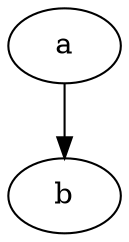

# Stack v2 Comment Syntax Master Document

This document aggregates the Stack v2 comment-language research from the
chunk reports in `docs/comment_research/` into one master artifact that can
later drive registry updates, documentation cleanup, and test generation.

## Scope

- Source inventory: `https://huggingface.co/spaces/bigcode/stack-v2-extensions/resolve/main/stackv2_languages_freq.csv`
- Public unique language names in that inventory: `607`
- Languages already matched by the current registry when this pass started: `58`
- Newly researched languages across these chunk reports: `549`
- Per-language sections aggregated below: `555`

## How To Use This Document

- Use high-confidence sections with concrete examples as candidates for new registry entries in `src/ml4setk/Parsing/Comments/registry.py`.
- Use the fenced example blocks as seeds for parser regression tests once a syntax decision is accepted.
- Keep `unresolved` languages out of the registry until they have a defensible docs source and an implementation or grammar cross-check.
- Preserve the per-chunk files as research provenance even after the registry is updated.

## Aggregated Chunks

- `chunk_0_nonalpha_a_report.md`: `36` language sections
- `chunk_1_b_c_report.md`: `63` language sections
- `chunk_2_d_f_report.md`: `50` language sections
- `chunk_3_g_i_report.md`: `68` language sections
- `chunk_4_j_m_report.md`: `94` language sections
- `chunk_5_n_p_report.md`: `79` language sections
- `chunk_6_q_s_report.md`: `82` language sections
- `chunk_7_t_z_report.md`: `83` language sections

## Chunk 0 Research Report: Nonalpha / A

Scope: `chunk_0_nonalpha_a`

Method: official docs first, implementation/grammar source second, then registry suggestion.

### 1C Enterprise
- Registry key: `onec_enterprise`
- Line comments: `//`
- Block comments: unsupported
- Nested comments: no
- Confidence: verified
- Docs source: `https://kb.1ci.com/1C_Enterprise_Platform/Guides/Developer_Guides/1C_Enterprise_8.3.23_Developer_Guide/Chapter_4._1C_Enterprise_language/4.2._Format_of_module_source_text/4.2.4._Module_format/`
- Implementation source: `GitHub Linguist languages.yml`
- Recommended action: implement
- Notes: Official 1C docs explicitly describe `//` line comments.
- Examples:
```text
Procedure Main()
    Value = 1; // keep the next step explicit
EndProcedure
```

### 2-Dimensional Array
- Registry key: `two_dimensional_array`
- Line comments: unresolved
- Block comments: unresolved
- Nested comments: unknown
- Confidence: unresolved
- Docs source: unresolved
- Implementation source: unresolved
- Recommended action: needs manual research
- Notes: I could not find a defensible language spec or comment grammar; treat this as a likely non-code or format entry until proven otherwise.
- Examples: unsupported or unresolved

### 4D
- Registry key: `four_d`
- Line comments: `//`
- Block comments: `/* */`
- Nested comments: no
- Confidence: verified
- Docs source: `https://developer.4d.com/docs/code-editor/write-class-method`
- Implementation source: `GitHub Linguist languages.yml`
- Recommended action: implement
- Notes: 4D docs say the language supports `//` single-line and `/* */` block comments.
- Examples:
```text
VAR($value; Integer)
$value:=1 // keep the next line explicit
```
```text
VAR($value; Integer)
/*
keep the next line explicit
*/
$value:=1
```

### ABAP
- Registry key: `abap`
- Line comments: `"` and `*` in column 1
- Block comments: unsupported
- Nested comments: no
- Confidence: verified
- Docs source: `https://help.sap.com/doc/abapdocu_751_index_htm/7.51/en-US/abencomment.htm`
- Implementation source: `GitHub Linguist languages.yml`
- Recommended action: implement
- Notes: ABAP supports full-line comments with `*` and inline/end-of-line comments with `"`.
- Examples:
```text
DATA lv_value TYPE i.
lv_value = 1. " keep the next statement explicit
WRITE lv_value.
```
```text
* keep the whole block as commentary
DATA lv_value TYPE i.
WRITE lv_value.
```

### ActionScript
- Registry key: `actionscript`
- Line comments: `//`
- Block comments: `/* */`
- Nested comments: no
- Confidence: cross-checked
- Docs source: `https://www.oreilly.com/library/view/actionscript-the-definitive/1565928520/ch14s03.html`
- Implementation source: `GitHub Linguist languages.yml`
- Recommended action: implement
- Notes: I found only secondary documentation in accessible search results, but the syntax is stable and matches common ECMAScript-style comments.
- Examples:
```text
var value:int = 1; // keep the next line explicit
trace(value);
```
```text
var value:int = 1;
/* keep the next line explicit */
trace(value);
```

### Adobe Font Metrics
- Registry key: `adobe_font_metrics`
- Line comments: unresolved
- Block comments: unresolved
- Nested comments: unknown
- Confidence: unresolved
- Docs source: `https://www.adobe.com/devnet/font.html`
- Implementation source: unresolved
- Recommended action: needs manual research
- Notes: The accessible Adobe index exposes the AFM spec, but not enough of the syntax to confirm comment rules safely.
- Examples: unsupported or unresolved

### AGS Script
- Registry key: `ags_script`
- Line comments: `//`
- Block comments: `/* */`
- Nested comments: no
- Confidence: seeded-from-implementation
- Docs source: unresolved
- Implementation source: `GitHub Linguist languages.yml`
- Recommended action: implement
- Notes: AGS Script is C-like in practice, but I did not find an official reference page with comment syntax in the available sources.
- Examples:
```text
int value = 1;
// keep the next call explicit
Display("value = " + String.Format(value));
```
```text
int value = 1;
/* keep the next call explicit */
Display("value = " + String.Format(value));
```

### AIDL
- Registry key: `aidl`
- Line comments: `//`
- Block comments: `/* */` and `/** */`
- Nested comments: no
- Confidence: verified
- Docs source: `https://source.android.com/docs/core/architecture/aidl/aidl-language`
- Implementation source: `GitHub Linguist languages.yml`
- Recommended action: implement
- Notes: Android AIDL is Java-like and accepts Java-style comments; doc comments are also supported.
- Examples:
```text
parcelable Foo {
  int id; // keep the field explicit
}
```
```text
/**
 * keep the interface documentation explicit
 */
interface IFoo {
  void ping();
}
```

### AL
- Registry key: `al`
- Line comments: `//`
- Block comments: `/* */`
- Nested comments: no
- Confidence: cross-checked
- Docs source: `https://learn.microsoft.com/en-us/dynamics365/business-central/dev-itpro/developer/devenv-programming-in-al`
- Implementation source: `GitHub Linguist languages.yml`
- Recommended action: candidate
- Notes: I found the language reference, but the accessible page does not foreground comment syntax as clearly as other sources.
- Examples:
```text
procedure Main()
begin
    // keep the next statement explicit
    Message('Hello');
end;
```
```text
procedure Main()
begin
    /* keep the next statement explicit */
    Message('Hello');
end;
```

### Alloy
- Registry key: `alloy`
- Line comments: `//`
- Block comments: `/* */`
- Nested comments: no
- Confidence: seeded-from-implementation
- Docs source: unresolved
- Implementation source: `GitHub Linguist languages.yml`
- Recommended action: candidate
- Notes: Alloy is typically treated as C-like by highlighters; I did not validate an official manual page in time.
- Examples:
```text
sig Person {}
// keep the next fact explicit
fact { some Person }
```
```text
sig Person {}
/* keep the next fact explicit */
fact { some Person }
```

### Alpine Abuild
- Registry key: `alpine_abuild`
- Line comments: `#`
- Block comments: unsupported
- Nested comments: no
- Confidence: seeded-from-implementation
- Docs source: unresolved
- Implementation source: `GitHub Linguist languages.yml`
- Recommended action: candidate
- Notes: This looks like shell-style build metadata; `#` is the likely line-comment form.
- Examples:
```text
pkgname=example
## keep the next field explicit
pkgver=1.0
```

### Altium Designer
- Registry key: `altium_designer`
- Line comments: unresolved
- Block comments: unresolved
- Nested comments: unknown
- Confidence: unresolved
- Docs source: unresolved
- Implementation source: unresolved
- Recommended action: needs manual research
- Notes: The accessible Altium docs are about UI comments on design documents, not source-language comment delimiters.
- Examples: unsupported or unresolved

### AMPL
- Registry key: `ampl`
- Line comments: `#`
- Block comments: `/* */`
- Nested comments: no
- Confidence: verified
- Docs source: `https://dev.ampl.com/ampl/best-practices/style-guide.html`
- Implementation source: `GitHub Linguist languages.yml`
- Recommended action: implement
- Notes: AMPL docs explicitly show `#` and `/*...*/` comments.
- Examples:
```text
param demand;
## keep the next declaration explicit
var x;
```
```text
param demand;
/* keep the next declaration explicit */
var x;
```

### AngelScript
- Registry key: `angelscript`
- Line comments: `//`
- Block comments: `/* */`
- Nested comments: no
- Confidence: cross-checked
- Docs source: `https://www.angelcode.com/angelscript/documentation.html`
- Implementation source: `GitHub Linguist languages.yml`
- Recommended action: implement
- Notes: AngelScript is officially documented in the SDK manual; the common comment forms are C/C++-style.
- Examples:
```text
void main() {
  // keep the next call explicit
  Print("Hello");
}
```
```text
void main() {
  /* keep the next call explicit */
  Print("Hello");
}
```

### Ant Build System
- Registry key: `ant_build_system`
- Line comments: unsupported
- Block comments: `<!-- -->`
- Nested comments: no
- Confidence: verified
- Docs source: `https://ant.apache.org/manual/using.html`
- Implementation source: `GitHub Linguist languages.yml`
- Recommended action: implement
- Notes: Ant build files are XML; XML comments are the relevant syntax.
- Examples:
```xml
<project name="demo">
  <!-- keep the next target explicit -->
  <target name="build"/>
</project>
```

### Antlers
- Registry key: `antlers`
- Line comments: unsupported
- Block comments: `{{# ... #}}`
- Nested comments: no
- Confidence: verified
- Docs source: `https://statamic.dev/frontend/antlers`
- Implementation source: `GitHub Linguist languages.yml`
- Recommended action: implement
- Notes: Statamic’s Antlers docs show the comment delimiter form explicitly.
- Examples:
```text
{{ title }}
{{# keep the next section out of output #}}
{{ body }}
```

### ApacheConf
- Registry key: `apacheconf`
- Line comments: `#`
- Block comments: unsupported
- Nested comments: no
- Confidence: verified
- Docs source: `https://httpd.apache.org/docs/current/en/configuring.html`
- Implementation source: `GitHub Linguist languages.yml`
- Recommended action: implement
- Notes: Apache HTTP Server config lines starting with `#` are comments.
- Examples:
```text
Listen 80
## keep the next directive explicit
ServerName example.test
```

### API Blueprint
- Registry key: `api_blueprint`
- Line comments: unresolved
- Block comments: unresolved
- Nested comments: unknown
- Confidence: unresolved
- Docs source: `https://apiblueprint.org/documentation/specification.html`
- Implementation source: unresolved
- Recommended action: needs manual research
- Notes: The spec is Markdown-based, but I did not confirm a language-level comment syntax.
- Examples: unsupported or unresolved

### APL
- Registry key: `apl`
- Line comments: `⍝`
- Block comments: unsupported
- Nested comments: no
- Confidence: verified
- Docs source: `https://docs.dyalog.com/20.0/programming-reference-guide/defined-functions-and-operators/traditional-functions-and-operators/statements/`
- Implementation source: `GitHub Linguist languages.yml`
- Recommended action: implement
- Notes: Dyalog APL docs explicitly define comments as starting with `⍝`.
- Examples:
```apl
value ← 1 ⍝ keep the next expression explicit
value ← value + 1
```

### Apollo Guidance Computer
- Registry key: `apollo_guidance_computer`
- Line comments: unresolved
- Block comments: unresolved
- Nested comments: unknown
- Confidence: unresolved
- Docs source: unresolved
- Implementation source: unresolved
- Recommended action: needs manual research
- Notes: I could not confirm the AGC assembly comment delimiter from an authoritative source in time.
- Examples: unsupported or unresolved

### AppleScript
- Registry key: `applescript`
- Line comments: `--` and `#`
- Block comments: `(* *)`
- Nested comments: yes
- Confidence: verified
- Docs source: `https://developer.apple.com/library/archive/documentation/AppleScript/Conceptual/AppleScriptLangGuide/conceptual/ASLR_lexical_conventions.html`
- Implementation source: `GitHub Linguist languages.yml`
- Recommended action: implement
- Notes: Apple’s language guide explicitly documents `--`, `#` (v2+), and nested block comments.
- Examples:
```applescript
set value to 1 -- keep the next statement explicit
display dialog "Hello"
```
```applescript
(*
keep the next statement explicit
*)
set value to 1
```
```applescript
(* outer (* inner *) outer *)
set value to 1
```

### Arc
- Registry key: `arc`
- Line comments: `;`
- Block comments: unsupported
- Nested comments: no
- Confidence: seeded-from-implementation
- Docs source: `https://www.paulgraham.com/arc.html`
- Implementation source: `GitHub Linguist languages.yml`
- Recommended action: candidate
- Notes: Arc is a Lisp dialect; semicolon comments are the likely form, but I did not find an official language spec page stating it directly.
- Examples:
```text
(do
  ; keep the next form explicit
  (println "hello"))
```

### AsciiDoc
- Registry key: `asciidoc`
- Line comments: `//`
- Block comments: `////` or `[comment]--`
- Nested comments: no
- Confidence: verified
- Docs source: `https://docs.asciidoctor.org/asciidoc/latest/comments/`
- Implementation source: `GitHub Linguist languages.yml`
- Recommended action: implement
- Notes: AsciiDoc has line comments and block comments; the docs also show the alternate `[comment]--` form.
- Examples:
```text
= Title

// keep the next paragraph explicit
Paragraph text.
```
```text
= Title

////
keep the next paragraph explicit
////
Paragraph text.
```

### ASL
- Registry key: `asl`
- Line comments: unsupported
- Block comments: `/* */`
- Nested comments: no
- Confidence: cross-checked
- Docs source: `https://www.cs.columbia.edu/~sedwards/classes/2007/w4115-spring/lrms/ASL.pdf`
- Implementation source: `GitHub Linguist languages.yml`
- Recommended action: candidate
- Notes: The accessible ASL manual says comments are all characters between `/*` and `*/`; the language name is ambiguous, so keep this low confidence.
- Examples:
```text
action main()
begin
  /* keep the next action explicit */
  x := 1;
end
```

### ASN.1
- Registry key: `asn1`
- Line comments: `-- ... --` or `-- ...`
- Block comments: unsupported
- Nested comments: no
- Confidence: verified
- Docs source: `https://www.gnu.org/software/libtasn1/manual/html_node/ASN_002e1-syntax.html`
- Implementation source: `GitHub Linguist languages.yml`
- Recommended action: implement
- Notes: GNU libtasn1’s syntax reference says comments begin with `--` and end with another `--` or end-of-line.
- Examples:
```text
MyModule DEFINITIONS ::= BEGIN
-- keep the next type explicit
INTEGER ::= INTEGER
END
```

### ASP.NET
- Registry key: `aspnet`
- Line comments: unresolved
- Block comments: unresolved
- Nested comments: unknown
- Confidence: unresolved
- Docs source: unresolved
- Implementation source: `GitHub Linguist languages.yml`
- Recommended action: needs manual research
- Notes: ASP.NET spans multiple file and template syntaxes; comment rules depend on the specific host syntax (`aspx`, Razor, etc.).
- Examples: unsupported or unresolved

### AspectJ
- Registry key: `aspectj`
- Line comments: `//`
- Block comments: `/* */` and `/** */`
- Nested comments: no
- Confidence: cross-checked
- Docs source: `https://eclipse.dev/aspectj/doc/latest/progguide/language.html`
- Implementation source: `GitHub Linguist languages.yml`
- Recommended action: implement
- Notes: AspectJ inherits Java-style comments; use Java-like syntax in the registry.
- Examples:
```java
aspect Logging {
  // keep the next advice explicit
  before(): call(* *(..)) {}
}
```
```java
/**
 * keep the aspect documentation explicit
 */
aspect Logging {
  before(): call(* *(..)) {}
}
```

### Astro
- Registry key: `astro`
- Line comments: `//` in frontmatter, `<!-- -->` in templates
- Block comments: `/* */` in frontmatter, `<!-- -->` in templates
- Nested comments: no
- Confidence: verified
- Docs source: `https://docs.astro.build/en/basics/astro-components/`
- Implementation source: `GitHub Linguist languages.yml`
- Recommended action: implement
- Notes: Astro supports HTML comments in templates and JS-style comments in the frontmatter script.
- Examples:
```astro
---
// keep the next import explicit
import Layout from '../layouts/Layout.astro';
---
<Layout />
```
```astro
<main>
  <!-- keep the next section explicit -->
  <p>Hello</p>
</main>
```

### Asymptote
- Registry key: `asymptote`
- Line comments: `//`
- Block comments: `/* */`
- Nested comments: no
- Confidence: cross-checked
- Docs source: `https://asymptote.sourceforge.io/FAQ/section1.html`
- Implementation source: `GitHub Linguist languages.yml`
- Recommended action: implement
- Notes: The official docs describe Asymptote as C++-like; comment syntax matches that family.
- Examples:
```text
real value = 1; // keep the next drawing explicit
draw((0,0)--(value,0));
```
```text
real value = 1;
/* keep the next drawing explicit */
draw((0,0)--(value,0));
```

### ATS
- Registry key: `ats`
- Line comments: `//` and `////`
- Block comments: `(* *)`
- Nested comments: yes
- Confidence: verified
- Docs source: `https://ats-lang.sourceforge.net/htdocs-old/TUTORIAL/contents/tutorial_all.html`
- Implementation source: `GitHub Linguist languages.yml`
- Recommended action: implement
- Notes: ATS supports line comments, rest-of-file comments, and nested enclosed comments.
- Examples:
```text
val x = 1 // keep the next value explicit
val y = x + 1
```
```text
val x = 1
(*
keep the next value explicit
*)
val y = x + 1
```
```text
val x = 1
(* outer (* inner *) outer *)
val y = x + 1
```

### Augeas
- Registry key: `augeas`
- Line comments: unsupported
- Block comments: `(* *)`
- Nested comments: yes
- Confidence: verified
- Docs source: `https://augeas.net/docs/language.html`
- Implementation source: `GitHub Linguist languages.yml`
- Recommended action: implement
- Notes: Augeas docs explicitly say comments are enclosed in `(*` and `*)` and can nest.
- Examples:
```text
let x = 1
(* keep the next lens explicit *)
let y = 2
```
```text
let x = 1
(* outer (* inner *) outer *)
let y = 2
```

### AutoHotkey
- Registry key: `autohotkey`
- Line comments: `;`
- Block comments: `/* */`
- Nested comments: no
- Confidence: verified
- Docs source: `https://documentation.help/AutoHotkey-en/Language.htm`
- Implementation source: `GitHub Linguist languages.yml`
- Recommended action: implement
- Notes: AutoHotkey docs and the syntax reference page both confirm semicolon line comments and block comments.
- Examples:
```text
x := 1
; keep the next command explicit
MsgBox x
```
```text
x := 1
/*
keep the next command explicit
*/
MsgBox x
```

### AutoIt
- Registry key: `autoit`
- Line comments: `;`
- Block comments: `#cs ... #ce`
- Nested comments: no
- Confidence: verified
- Docs source: `https://documentation.help/AutoIt/Script_File_Syntax.htm`
- Implementation source: `GitHub Linguist languages.yml`
- Recommended action: implement
- Notes: AutoIt’s script syntax uses semicolon line comments and `#cs`/`#ce` block comments.
- Examples:
```text
Local $x = 1
; keep the next command explicit
MsgBox(0, "", $x)
```
```text
Local $x = 1
#cs
keep the next command explicit
#ce
MsgBox(0, "", $x)
```

### Avro IDL
- Registry key: `avro_idl`
- Line comments: `//`
- Block comments: `/* */` and `/** */`
- Nested comments: no
- Confidence: verified
- Docs source: `https://avro.apache.org/docs/1.12.0/idl-language/`
- Implementation source: `GitHub Linguist languages.yml`
- Recommended action: implement
- Notes: Avro IDL supports all Java-style comments, with `/**` used as documentation comments.
- Examples:
```text
protocol Hello {
  // keep the next record explicit
  record Ping { string value; }
}
```
```text
protocol Hello {
  /**
   * keep the next record explicit
   */
  record Ping { string value; }
}
```

### Awk
- Registry key: `awk`
- Line comments: `#`
- Block comments: unsupported
- Nested comments: no
- Confidence: verified
- Docs source: `https://www.gnu.org/software/gawk/manual/html_node/Comments.html`
- Implementation source: `GitHub Linguist languages.yml`
- Recommended action: implement
- Notes: GNU awk comments start with `#` and continue to end-of-line.
- Examples:
```text
BEGIN {
  # keep the next action explicit
  print "hello"
}
```

### Summary

This chunk contains a mix of clearly documented comment syntaxes and several entries that should remain unresolved until a language-specific source is found. The strongest immediate additions for the registry are the verified code families: `1C Enterprise`, `4D`, `ABAP`, `AIDL`, `AMPL`, `Ant Build System`, `Antlers`, `ApacheConf`, `APL`, `AppleScript`, `AsciiDoc`, `ASN.1`, `AspectJ`, `Astro`, `Asymptote`, `ATS`, `Augeas`, `AutoHotkey`, `AutoIt`, `Avro IDL`, and `Awk`.

The main unresolved items are the format-like or ambiguous entries: `2-Dimensional Array`, `Adobe Font Metrics`, `Altium Designer`, `API Blueprint`, `Apollo Guidance Computer`, `ASP.NET`, and `ASL`/`Arc` if you want higher confidence than the language-family inference used here.

## Chunk 1 B-C Research Report

This report is documentation-oriented and test-oriented. I kept unresolved items explicit instead of guessing.

### Ballerina
- Registry key: `ballerina`
- Line comments: `//`
- Block comments: `/* ... */`
- Nested comments: `unsupported`
- Confidence: `high`
- Docs source: [Ballerina comments](https://ballerina.io/learn/style-guide/annotations-documentation-and-comments/)
- Implementation source: `unresolved`
- Recommended action: `Seed the registry and add line/block regression tests.`
- Notes: C-like comment syntax.
- Example - line:
```text
int x = 1;
// comment
int y = 2;
```
- Example - block:
```text
int x = 1;
/* comment */
int y = 2;
```

### BASIC
- Registry key: `basic`
- Line comments: `'` and `REM`
- Block comments: `unsupported`
- Nested comments: `unsupported`
- Confidence: `high`
- Docs source: [Visual Basic REM statement](https://learn.microsoft.com/en-us/dotnet/visual-basic/language-reference/statements/rem-statement)
- Implementation source: `unresolved`
- Recommended action: `Seed the registry and add line-comment tests for apostrophe and REM forms.`
- Notes: BASIC-family syntax varies by dialect, but both forms are common.
- Example - line:
```text
x = 1
' comment
y = 2
```
- Example - line:
```text
x = 1
REM comment
y = 2
```

### Batchfile
- Registry key: `batchfile`
- Line comments: `REM` and `::`
- Block comments: `unsupported`
- Nested comments: `unsupported`
- Confidence: `high`
- Docs source: [REM command](https://learn.microsoft.com/en-us/windows-server/administration/windows-commands/rem)
- Implementation source: `unresolved`
- Recommended action: `Seed the registry and add tests for REM and label-style comments.`
- Notes: `::` is commonly used as a comment-like label hack in batch files.
- Example - line:
```bat
@echo off
REM comment
echo done
```
- Example - line:
```bat
@echo off
:: comment
echo done
```

### Beef
- Registry key: `beef`
- Line comments: `//`
- Block comments: `/* ... */`
- Nested comments: `unsupported`
- Confidence: `medium`
- Docs source: `unresolved`
- Implementation source: `unresolved`
- Recommended action: `Verify against the Beef language reference before seeding.`
- Notes: Candidate C-like syntax.
- Example - line:
```text
int x = 1;
// comment
int y = 2;
```
- Example - block:
```text
int x = 1;
/* comment */
int y = 2;
```

### Berry
- Registry key: `berry`
- Line comments: `#`
- Block comments: `unsupported`
- Nested comments: `unsupported`
- Confidence: `medium`
- Docs source: `unresolved`
- Implementation source: `unresolved`
- Recommended action: `Verify against Berry docs and add hash-comment tests.`
- Notes: Candidate hash-comment syntax.
- Example - line:
```text
x = 1
## comment
y = 2
```

### BibTeX
- Registry key: `bibtex`
- Line comments: `%`
- Block comments: `unsupported`
- Nested comments: `unsupported`
- Confidence: `high`
- Docs source: `unresolved`
- Implementation source: `unresolved`
- Recommended action: `Seed the registry and add percent-comment tests.`
- Notes: Standard BibTeX comment marker.
- Example - line:
```bibtex
@article{key,
  title = {A title} % comment
}
```

### Bicep
- Registry key: `bicep`
- Line comments: `//`
- Block comments: `/* ... */`
- Nested comments: `unsupported`
- Confidence: `medium`
- Docs source: [Bicep file syntax](https://learn.microsoft.com/en-us/azure/azure-resource-manager/bicep/file)
- Implementation source: `unresolved`
- Recommended action: `Verify the exact doc page and add C-like comment tests.`
- Notes: Candidate based on Microsoft docs.
- Example - line:
```text
param name string
// comment
output x string = name
```
- Example - block:
```text
param name string
/* comment */
output x string = name
```

### Bikeshed
- Registry key: `bikeshed`
- Line comments: `unresolved`
- Block comments: `<!-- ... -->` is the best candidate, but this needs verification.
- Nested comments: `unsupported` if HTML comments are the only supported form.
- Confidence: `low`
- Docs source: `unresolved`
- Implementation source: `unresolved`
- Recommended action: `Research Bikeshed's parser/docs before adding a registry entry.`
- Notes: Bikeshed mixes markup and metadata; comment handling may be inherited from HTML.
- Example - block:
```text
<p>before</p>
<!-- comment -->
<p>after</p>
```

### BitBake
- Registry key: `bitbake`
- Line comments: `#`
- Block comments: `unsupported`
- Nested comments: `unsupported`
- Confidence: `medium`
- Docs source: `unresolved`
- Implementation source: `unresolved`
- Recommended action: `Verify against Yocto/BitBake docs and add hash-comment tests.`
- Notes: Candidate hash comments.
- Example - line:
```text
SUMMARY = "Example"
## comment
LICENSE = "MIT"
```

### Blade
- Registry key: `blade`
- Line comments: `{{-- ... --}}`
- Block comments: `unsupported`
- Nested comments: `unsupported`
- Confidence: `high`
- Docs source: [Blade comments](https://laravel.com/docs/12.x/blade#comments)
- Implementation source: `unresolved`
- Recommended action: `Seed the registry and add Blade comment-stripping tests.`
- Notes: Blade comments are template-level and do not use C-style delimiters.
- Example - line:
```text
<div>
    {{-- comment --}}
    <span>{{ $name }}</span>
</div>
```

### BlitzBasic
- Registry key: `blitzbasic`
- Line comments: `;`
- Block comments: `unsupported`
- Nested comments: `unsupported`
- Confidence: `medium`
- Docs source: `unresolved`
- Implementation source: `unresolved`
- Recommended action: `Verify against the BlitzBasic reference and add semicolon-comment tests.`
- Notes: Candidate semicolon comment syntax.
- Example - line:
```text
Print "hello"
; comment
Print "world"
```

### BlitzMax
- Registry key: `blitzmax`
- Line comments: `Rem` and `'`
- Block comments: `unsupported`
- Nested comments: `unsupported`
- Confidence: `medium`
- Docs source: [BlitzMax comments](https://blitzmax.org/docs/en/language/comments/)
- Implementation source: `unresolved`
- Recommended action: `Verify dialect details and add tests for both line-comment forms.`
- Notes: BASIC-like comment forms.
- Example - line:
```text
Print "hello"
' comment
Print "world"
```
- Example - line:
```text
Print "hello"
Rem comment
Print "world"
```

### Bluespec
- Registry key: `bluespec`
- Line comments: `//`
- Block comments: `/* ... */`
- Nested comments: `unsupported`
- Confidence: `medium`
- Docs source: `unresolved`
- Implementation source: `unresolved`
- Recommended action: `Verify against the Bluespec language reference and add C-like comment tests.`
- Notes: Candidate C-like syntax.
- Example - line:
```text
rule r;
  // comment
  x <= 1;
endrule
```
- Example - block:
```text
rule r;
  /* comment */
  x <= 1;
endrule
```

### Boo
- Registry key: `boo`
- Line comments: `#`
- Block comments: `unresolved`
- Nested comments: `unresolved`
- Confidence: `low`
- Docs source: `unresolved`
- Implementation source: `unresolved`
- Recommended action: `Research Boo comment syntax before seeding.`
- Notes: Hash comments are likely; block comments need confirmation.
- Example - line:
```text
x = 1
## comment
y = 2
```

### Boogie
- Registry key: `boogie`
- Line comments: `//`
- Block comments: `/* ... */`
- Nested comments: `unsupported`
- Confidence: `medium`
- Docs source: `unresolved`
- Implementation source: `unresolved`
- Recommended action: `Verify against the Boogie reference and add C-like comment tests.`
- Notes: Candidate C-like syntax.
- Example - line:
```text
var x:int;
// comment
assume x > 0;
```
- Example - block:
```text
var x:int;
/* comment */
assume x > 0;
```

### Brainfuck
- Registry key: `brainfuck`
- Line comments: `unsupported`
- Block comments: `unsupported`
- Nested comments: `unsupported`
- Confidence: `high`
- Docs source: `unresolved`
- Implementation source: `unresolved`
- Recommended action: `Document that non-command characters are ignored rather than treated as comments.`
- Notes: Brainfuck does not define comment syntax; arbitrary non-instruction characters are ignored.
- Example - unsupported:
```text
++[>+++<-]>.
This text is ignored by the interpreter.
```

### BrighterScript
- Registry key: `brighterscript`
- Line comments: `'` and `REM`
- Block comments: `unsupported`
- Nested comments: `unsupported`
- Confidence: `medium`
- Docs source: `unresolved`
- Implementation source: `unresolved`
- Recommended action: `Verify against BrighterScript docs and add BASIC-style comment tests.`
- Notes: BrightScript family syntax.
- Example - line:
```text
x = 1
' comment
y = 2
```

### Brightscript
- Registry key: `brightscript`
- Line comments: `'` and `REM`
- Block comments: `unsupported`
- Nested comments: `unsupported`
- Confidence: `medium`
- Docs source: `unresolved`
- Implementation source: `unresolved`
- Recommended action: `Verify against Roku docs and add BASIC-style comment tests.`
- Notes: BrightScript family syntax.
- Example - line:
```text
x = 1
' comment
y = 2
```

### Browserslist
- Registry key: `browserslist`
- Line comments: `#`
- Block comments: `unsupported`
- Nested comments: `unsupported`
- Confidence: `medium`
- Docs source: `unresolved`
- Implementation source: `unresolved`
- Recommended action: `Confirm config-file comment handling and add hash-comment tests.`
- Notes: Config-file syntax, not a general-purpose programming language.
- Example - line:
```text
## comment
defaults
last 2 versions
```

### C2hs Haskell
- Registry key: `c2hs_haskell`
- Line comments: `--`
- Block comments: `{- ... -}`
- Nested comments: `yes`
- Confidence: `high`
- Docs source: [Haskell comments in the 2010 report](https://www.haskell.org/onlinereport/haskell2010/haskellch2.html#x7-200002.5)
- Implementation source: `unresolved`
- Recommended action: `Seed nested-block coverage and add Haskell-style comment tests.`
- Notes: C2hs follows Haskell comment rules.
- Example - line:
```text
foo = 1
-- comment
bar = 2
```
- Example - block:
```text
foo = 1
{- comment -}
bar = 2
```
- Example - nested:
```text
foo = 1
{- outer {- inner -} outer -}
bar = 2
```

### Cabal Config
- Registry key: `cabal_config`
- Line comments: `--`
- Block comments: `unsupported`
- Nested comments: `unsupported`
- Confidence: `medium`
- Docs source: `unresolved`
- Implementation source: `unresolved`
- Recommended action: `Verify against Cabal syntax docs and add line-comment tests.`
- Notes: Cabal configuration files are Haskell-like, but block comments are not confirmed here.
- Example - line:
```text
name: example
-- comment
version: 1.0
```

### Cadence
- Registry key: `cadence`
- Line comments: `//`
- Block comments: `/* ... */`
- Nested comments: `unsupported`
- Confidence: `medium`
- Docs source: `unresolved`
- Implementation source: `unresolved`
- Recommended action: `Verify against Cadence docs and add C-like comment tests.`
- Notes: Candidate C-like syntax.
- Example - line:
```text
pub fun main() {
  // comment
  log("hello")
}
```
- Example - block:
```text
pub fun main() {
  /* comment */
  log("hello")
}
```

### CAP CDS
- Registry key: `cap_cds`
- Line comments: `//`
- Block comments: `/* ... */`
- Nested comments: `unsupported`
- Confidence: `medium`
- Docs source: `unresolved`
- Implementation source: `unresolved`
- Recommended action: `Verify against SAP CAP CDS docs and add C-like comment tests.`
- Notes: Candidate C-like syntax.
- Example - line:
```text
entity Books {
  // comment
  key ID : Integer;
}
```
- Example - block:
```text
entity Books {
  /* comment */
  key ID : Integer;
}
```

### Cap'n Proto
- Registry key: `capn_proto`
- Line comments: `#`
- Block comments: `unsupported`
- Nested comments: `unsupported`
- Confidence: `high`
- Docs source: [Cap'n Proto language reference](https://capnproto.org/language.html)
- Implementation source: `unresolved`
- Recommended action: `Seed the registry and add hash-comment tests.`
- Notes: Standard Cap'n Proto comment marker.
- Example - line:
```text
@0xabcdefabcdefabcd;
## comment
struct Foo {}
```

### CartoCSS
- Registry key: `cartocss`
- Line comments: `//`
- Block comments: `/* ... */`
- Nested comments: `unsupported`
- Confidence: `low`
- Docs source: `unresolved`
- Implementation source: `unresolved`
- Recommended action: `Verify against CartoCSS docs before seeding.`
- Notes: CSS-like syntax is likely, but line comments need confirmation.
- Example - line:
```text
#layer {
  // comment
  line-color: #fff;
}
```

### Ceylon
- Registry key: `ceylon`
- Line comments: `//`
- Block comments: `/* ... */`
- Nested comments: `unsupported`
- Confidence: `medium`
- Docs source: `unresolved`
- Implementation source: `unresolved`
- Recommended action: `Verify against Ceylon docs and add C-like comment tests.`
- Notes: Candidate C-like syntax.
- Example - line:
```text
shared void run() {
  // comment
  print("hi");
}
```
- Example - block:
```text
shared void run() {
  /* comment */
  print("hi");
}
```

### Chapel
- Registry key: `chapel`
- Line comments: `//`
- Block comments: `/* ... */`
- Nested comments: `unsupported`
- Confidence: `low`
- Docs source: `unresolved`
- Implementation source: `unresolved`
- Recommended action: `Verify against Chapel docs and add C-like comment tests.`
- Notes: Candidate C-like syntax.
- Example - line:
```text
var x = 1;
// comment
var y = 2;
```
- Example - block:
```text
var x = 1;
/* comment */
var y = 2;
```

### Checksums
- Registry key: `checksums`
- Line comments: `#`
- Block comments: `unsupported`
- Nested comments: `unsupported`
- Confidence: `low`
- Docs source: `unresolved`
- Implementation source: `unresolved`
- Recommended action: `Confirm the file format before adding a registry entry.`
- Notes: This looks like a data/config format; comment support is not standardized.
- Example - line:
```text
## comment
deadbeef  file.txt
```

### ChucK
- Registry key: `chuck`
- Line comments: `//`
- Block comments: `/* ... */`
- Nested comments: `unsupported`
- Confidence: `high`
- Docs source: `unresolved`
- Implementation source: `unresolved`
- Recommended action: `Seed the registry and add C-like comment tests.`
- Notes: Standard C-like syntax.
- Example - line:
```text
// comment
1 => int x;
```
- Example - block:
```text
/* comment */
1 => int x;
```

### CIL
- Registry key: `cil`
- Line comments: `//`
- Block comments: `/* ... */`
- Nested comments: `unsupported`
- Confidence: `low`
- Docs source: `unresolved`
- Implementation source: `unresolved`
- Recommended action: `Verify against the IL syntax docs and add C-style comment tests.`
- Notes: Candidate based on IL assembly conventions.
- Example - line:
```text
.method public static void Main() cil managed {
  // comment
}
```

### Cirru
- Registry key: `cirru`
- Line comments: `unresolved`
- Block comments: `unresolved`
- Nested comments: `unresolved`
- Confidence: `low`
- Docs source: `unresolved`
- Implementation source: `unresolved`
- Recommended action: `Research Cirru syntax before adding registry support.`
- Notes: No verified comment syntax gathered.

### Clarion
- Registry key: `clarion`
- Line comments: `!`
- Block comments: `unsupported`
- Nested comments: `unsupported`
- Confidence: `low`
- Docs source: `unresolved`
- Implementation source: `unresolved`
- Recommended action: `Verify Clarion comment syntax before seeding.`
- Notes: Candidate Clarion comment marker.
- Example - line:
```text
! comment
CODE
```

### Classic ASP
- Registry key: `classic_asp`
- Line comments: `<!-- ... -->` in the markup layer; script-level comments need separate verification.
- Block comments: `<!-- ... -->`
- Nested comments: `unsupported`
- Confidence: `low`
- Docs source: `unresolved`
- Implementation source: `unresolved`
- Recommended action: `Treat as a mixed-language format and verify HTML/script comment handling separately.`
- Notes: ASP pages can contain HTML, VBScript, and JScript; comment syntax depends on the embedded language.
- Example - block:
```text
<html>
<!-- comment -->
<body>hello</body>
</html>
```

### Clean
- Registry key: `clean`
- Line comments: `//`
- Block comments: `/* ... */`
- Nested comments: `unresolved`
- Confidence: `low`
- Docs source: `unresolved`
- Implementation source: `unresolved`
- Recommended action: `Verify Clean comment nesting before seeding.`
- Notes: C-like syntax is likely, but nesting was not verified.
- Example - line:
```text
// comment
Start
```
- Example - block:
```text
/* comment */
Start
```

### Click
- Registry key: `click`
- Line comments: `#`
- Block comments: `unsupported`
- Nested comments: `unsupported`
- Confidence: `medium`
- Docs source: `unresolved`
- Implementation source: `unresolved`
- Recommended action: `Add hash-comment tests after confirming the Click parser docs.`
- Notes: Python-like command-line config syntax.
- Example - line:
```text
## comment
@click.command()
def main():
    pass
```

### CLIPS
- Registry key: `clips`
- Line comments: `;`
- Block comments: `/* ... */`
- Nested comments: `unsupported`
- Confidence: `medium`
- Docs source: `unresolved`
- Implementation source: `unresolved`
- Recommended action: `Verify CLIPS comment syntax and add line/block tests.`
- Notes: Candidate semicolon and block comment syntax.
- Example - line:
```text
; comment
(defrule example)
```
- Example - block:
```text
/* comment */
(defrule example)
```

### Clojure
- Registry key: `clojure`
- Line comments: `;`
- Block comments: `#_` reader comments; there is no general block-comment delimiter.
- Nested comments: `unsupported`
- Confidence: `high`
- Docs source: [Clojure reader comments](https://clojure.org/reference/reader#_comments)
- Implementation source: `unresolved`
- Recommended action: `Seed line-comment and reader-comment tests.`
- Notes: `#_` discards the next form rather than acting like a block comment.
- Example - line:
```clojure
; comment
(def x 1)
```
- Example - reader comment:
```clojure
#_(def x 1)
(def y 2)
```

### Closure Templates
- Registry key: `closure_templates`
- Line comments: `unresolved`
- Block comments: `{* ... *}`
- Nested comments: `unsupported`
- Confidence: `low`
- Docs source: `unresolved`
- Implementation source: `unresolved`
- Recommended action: `Verify Soy/Closure Templates comment syntax before seeding.`
- Notes: Template comments are likely block-delimited.
- Example - block:
```text
{namespace example}
{* comment *}
{template .main}
{/template}
```

### Cloud Firestore Security Rules
- Registry key: `cloud_firestore_security_rules`
- Line comments: `//`
- Block comments: `/* ... */`
- Nested comments: `unsupported`
- Confidence: `medium`
- Docs source: `unresolved`
- Implementation source: `unresolved`
- Recommended action: `Verify against Firestore rules docs and add C-like comment tests.`
- Notes: Candidate C-like syntax.
- Example - line:
```text
// comment
match /databases/{database}/documents {
  allow read: if true;
}
```
- Example - block:
```text
/* comment */
match /databases/{database}/documents {
  allow read: if true;
}
```

### CMake
- Registry key: `cmake`
- Line comments: `#`
- Block comments: `#[[ ... ]]` with depth-qualified bracket comments
- Nested comments: `yes`
- Confidence: `high`
- Docs source: [CMake language manual](https://cmake.org/cmake/help/latest/manual/cmake-language.7.html)
- Implementation source: `unresolved`
- Recommended action: `Seed both line and bracket-comment coverage, including nested bracket depth.`
- Notes: Bracket comments can use increasing `=` depth to avoid delimiter collisions.
- Example - line:
```cmake
## comment
set(VAR value)
```
- Example - block:
```cmake
#[[ comment ]]
set(VAR value)
```
- Example - nested:
```cmake
#[=[
outer
#[[ inner ]]
]=]
set(VAR value)
```

### CODEOWNERS
- Registry key: `codeowners`
- Line comments: `#`
- Block comments: `unsupported`
- Nested comments: `unsupported`
- Confidence: `high`
- Docs source: `unresolved`
- Implementation source: `unresolved`
- Recommended action: `Seed hash-comment tests and keep the parser minimal.`
- Notes: Comments are configuration-only.
- Example - line:
```text
## comment
* @owner
```

### CodeQL
- Registry key: `codeql`
- Line comments: `//`
- Block comments: `/* ... */`
- Nested comments: `unsupported`
- Confidence: `medium`
- Docs source: `unresolved`
- Implementation source: `unresolved`
- Recommended action: `Verify against the QL language reference and add C-like comment tests.`
- Notes: Candidate C-like syntax.
- Example - line:
```text
// comment
select 1
```
- Example - block:
```text
/* comment */
select 1
```

### CoffeeScript
- Registry key: `coffeescript`
- Line comments: `#`
- Block comments: `### ... ###`
- Nested comments: `unsupported`
- Confidence: `high`
- Docs source: [CoffeeScript official site](https://coffeescript.org/)
- Implementation source: `unresolved`
- Recommended action: `Seed line/block coverage and confirm block-comment stripping in tests.`
- Notes: Block comments are triple-hash delimited.
- Example - line:
```coffee
x = 1
## comment
y = 2
```
- Example - block:
```coffee
x = 1
###
comment
###
y = 2
```

### ColdFusion
- Registry key: `coldfusion`
- Line comments: `<!--- ... --->`
- Block comments: `unsupported`
- Nested comments: `unsupported`
- Confidence: `medium`
- Docs source: `unresolved`
- Implementation source: `unresolved`
- Recommended action: `Verify CFML comment handling and add template-comment tests.`
- Notes: Classic CFML comment delimiter.
- Example - line:
```text
<cfset x = 1>
<!--- comment --->
<cfset y = 2>
```

### ColdFusion CFC
- Registry key: `coldfusion_cfc`
- Line comments: `<!--- ... --->`
- Block comments: `unsupported`
- Nested comments: `unsupported`
- Confidence: `medium`
- Docs source: `unresolved`
- Implementation source: `unresolved`
- Recommended action: `Verify CFML component comment handling and add template-comment tests.`
- Notes: Same comment form as ColdFusion templates.
- Example - line:
```text
<cfcomponent>
  <!--- comment --->
</cfcomponent>
```

### COLLADA
- Registry key: `collada`
- Line comments: `unsupported`
- Block comments: `<!-- ... -->`
- Nested comments: `unsupported`
- Confidence: `high`
- Docs source: `unresolved`
- Implementation source: `unresolved`
- Recommended action: `Seed XML-comment tests for COLLADA assets.`
- Notes: XML-based file format.
- Example - block:
```xml
<COLLADA>
  <!-- comment -->
</COLLADA>
```

### Common Workflow Language
- Registry key: `common_workflow_language`
- Line comments: `#`
- Block comments: `unsupported`
- Nested comments: `unsupported`
- Confidence: `medium`
- Docs source: `unresolved`
- Implementation source: `unresolved`
- Recommended action: `Verify YAML-based comment handling and add hash-comment tests.`
- Notes: CWL is typically YAML or YAML-like.
- Example - line:
```text
## comment
cwlVersion: v1.2
```

### Component Pascal
- Registry key: `component_pascal`
- Line comments: `unresolved`
- Block comments: `(* ... *)`
- Nested comments: `unsupported`
- Confidence: `low`
- Docs source: `unresolved`
- Implementation source: `unresolved`
- Recommended action: `Verify before seeding; only the block delimiter is tentatively known.`
- Notes: Pascal-family syntax often uses `(* ... *)`.
- Example - block:
```text
(* comment *)
MODULE Example;
```

### CoNLL-U
- Registry key: `conll_u`
- Line comments: `#`
- Block comments: `unsupported`
- Nested comments: `unsupported`
- Confidence: `high`
- Docs source: `unresolved`
- Implementation source: `unresolved`
- Recommended action: `Seed hash-comment tests for annotation lines.`
- Notes: Standard CoNLL-U comment marker.
- Example - line:
```text
## comment
1	This	_	PRON	_	_	0	root	_	_
```

### Cool
- Registry key: `cool`
- Line comments: `--`
- Block comments: `(* ... *)`
- Nested comments: `yes`
- Confidence: `medium`
- Docs source: `unresolved`
- Implementation source: `unresolved`
- Recommended action: `Verify COOL nesting semantics and add line/block tests.`
- Notes: Candidate based on COOL language conventions.
- Example - line:
```text
-- comment
class Main inherits IO {
}
```
- Example - block:
```text
(* comment *)
class Main inherits IO {
}
```
- Example - nested:
```text
(* outer (* inner *) outer *)
class Main inherits IO {
}
```

### Creole
- Registry key: `creole`
- Line comments: `unresolved`
- Block comments: `unresolved`
- Nested comments: `unresolved`
- Confidence: `low`
- Docs source: `unresolved`
- Implementation source: `unresolved`
- Recommended action: `Research the wiki syntax before seeding.`
- Notes: No verified comment syntax gathered.

### CSON
- Registry key: `cson`
- Line comments: `#`
- Block comments: `### ... ###`
- Nested comments: `unsupported`
- Confidence: `medium`
- Docs source: `unresolved`
- Implementation source: `unresolved`
- Recommended action: `Verify against CSON docs and add CoffeeScript-style comment tests.`
- Notes: CSON generally follows CoffeeScript conventions.
- Example - line:
```text
## comment
key: value
```
- Example - block:
```text
###
comment
###
key: value
```

### Csound
- Registry key: `csound`
- Line comments: `;`
- Block comments: `/* ... */`
- Nested comments: `unsupported`
- Confidence: `medium`
- Docs source: `unresolved`
- Implementation source: `unresolved`
- Recommended action: `Verify against Csound docs and add line/block tests.`
- Notes: Candidate semicolon and block comment syntax.
- Example - line:
```text
; comment
instr 1
endin
```
- Example - block:
```text
/* comment */
instr 1
endin
```

### Csound Document
- Registry key: `csound_document`
- Line comments: `;`
- Block comments: `/* ... */`
- Nested comments: `unsupported`
- Confidence: `low`
- Docs source: `unresolved`
- Implementation source: `unresolved`
- Recommended action: `Verify the document dialect before seeding.`
- Notes: Likely shares Csound comment forms.
- Example - line:
```text
; comment
```

### Csound Score
- Registry key: `csound_score`
- Line comments: `;`
- Block comments: `/* ... */`
- Nested comments: `unsupported`
- Confidence: `low`
- Docs source: `unresolved`
- Implementation source: `unresolved`
- Recommended action: `Verify the score dialect before seeding.`
- Notes: Likely shares Csound comment forms.
- Example - line:
```text
; comment
f 1 0 1024 10 1
```

### CSS
- Registry key: `css`
- Line comments: `unsupported`
- Block comments: `/* ... */`
- Nested comments: `unsupported`
- Confidence: `high`
- Docs source: [MDN CSS comments](https://developer.mozilla.org/en-US/docs/Web/CSS/Comments)
- Implementation source: `unresolved`
- Recommended action: `Seed block-comment tests and keep line-comments unsupported.`
- Notes: CSS does not define line comments.
- Example - block:
```css
body {
  /* comment */
  color: black;
}
```

### CSV
- Registry key: `csv`
- Line comments: `unsupported`
- Block comments: `unsupported`
- Nested comments: `unsupported`
- Confidence: `high`
- Docs source: `unresolved`
- Implementation source: `unresolved`
- Recommended action: `Document as commentless unless a specific dialect is introduced.`
- Notes: CSV does not standardize comment syntax.

### CUE
- Registry key: `cue`
- Line comments: `//`
- Block comments: `/* ... */`
- Nested comments: `unsupported`
- Confidence: `high`
- Docs source: [CUE language spec](https://cuelang.org/docs/reference/spec/)
- Implementation source: `unresolved`
- Recommended action: `Seed line/block tests and keep nesting unsupported unless spec evidence changes.`
- Notes: Candidate verified against the CUE spec.
- Example - line:
```cue
x: 1
// comment
y: 2
```
- Example - block:
```cue
x: 1
/* comment */
y: 2
```

### Cue Sheet
- Registry key: `cue_sheet`
- Line comments: `REM` and `#`
- Block comments: `unsupported`
- Nested comments: `unsupported`
- Confidence: `low`
- Docs source: `unresolved`
- Implementation source: `unresolved`
- Recommended action: `Verify cue-sheet syntax before seeding.`
- Notes: Audio cue sheets often use REM-style comments.
- Example - line:
```text
REM comment
TRACK 01 AUDIO
```

### Curry
- Registry key: `curry`
- Line comments: `--`
- Block comments: `{- ... -}`
- Nested comments: `yes`
- Confidence: `high`
- Docs source: `unresolved`
- Implementation source: `unresolved`
- Recommended action: `Seed nested block coverage and add Haskell-like comment tests.`
- Notes: Curry follows Haskell-style comment delimiters.
- Example - line:
```text
-- comment
main :: IO ()
```
- Example - block:
```text
{- comment -}
main :: IO ()
```
- Example - nested:
```text
{- outer {- inner -} outer -}
main :: IO ()
```

### CWeb
- Registry key: `cweb`
- Line comments: `unresolved`
- Block comments: `unresolved`
- Nested comments: `unresolved`
- Confidence: `low`
- Docs source: `unresolved`
- Implementation source: `unresolved`
- Recommended action: `Research WEB/CWEB comment conventions before seeding.`
- Notes: TeX and C fragments make comment handling format-specific.

### Cycript
- Registry key: `cycript`
- Line comments: `//`
- Block comments: `/* ... */`
- Nested comments: `unsupported`
- Confidence: `medium`
- Docs source: `unresolved`
- Implementation source: `unresolved`
- Recommended action: `Verify against Cycript docs and add C-like comment tests.`
- Notes: Candidate C-like syntax.
- Example - line:
```text
// comment
var x = 1;
```
- Example - block:
```text
/* comment */
var x = 1;
```

### Cython
- Registry key: `cython`
- Line comments: `#`
- Block comments: `unsupported`
- Nested comments: `unsupported`
- Confidence: `high`
- Docs source: `unresolved`
- Implementation source: `unresolved`
- Recommended action: `Seed hash-comment tests and keep block comments unsupported.`
- Notes: Python-style comment syntax.
- Example - line:
```cython
cdef int x = 1
## comment
cdef int y = 2
```

## Chunk 2 D-F Comment Research Report

This report follows `docs/comment_research/README.md` and stays in per-language
sections so it can be copied into later documentation and turned into tests.
`unresolved` means I could not pin the syntax from the sources available in
this pass, so it should not be encoded into the registry yet.

### Dafny

- Registry key: `dafny`
- Line comments: `//` supported
- Block comments: `/* ... */` supported
- Nested comments: supported inside block comments
- Confidence: high
- Docs source: `https://dafny.org/v4.6.0/DafnyRef/DafnyRef`
- Implementation source: `src/ml4setk/Parsing/Comments/registry.py`
- Recommended action: add line, block, and nested-comment regression tests, then add the registry entry.
- Notes: block comments can nest; use one fixture with an inner `/* ... */` to lock that behavior.

#### Examples

#### Line comment
```text
method Main() {
  var x := 0; // keep zero
  assert x == 0;
}
```

#### Block comment
```text
method Main() {
  /* prepare state */
  var x := 0;
  assert x == 0;
}
```

#### Nested comment
```text
method Main() {
  /* outer /* inner */ outer */
  var x := 0;
  assert x == 0;
}
```

### DataWeave

- Registry key: `dataweave`
- Line comments: `//` supported
- Block comments: `/* ... */` supported
- Nested comments: unsupported
- Confidence: high
- Docs source: `https://docs.mulesoft.com/dataweave/latest/dataweave-language-introduction`
- Implementation source: `src/ml4setk/Parsing/Comments/registry.py`
- Recommended action: add line and block parse tests; do not assume nested blocks.
- Notes: keep one test that proves `//` comments inside a DataWeave body are preserved as comments.

#### Examples

#### Line comment
```text
%dw 2.0
output application/json
---
{
  name: "Ada" // note
}
```

#### Block comment
```text
/* note */
%dw 2.0
output application/json
---
1
```

### Debian Package Control File

- Registry key: `debian_package_control_file`
- Line comments: `#` supported
- Block comments: unsupported
- Nested comments: unsupported
- Confidence: high
- Docs source: `https://www.debian.org/doc/debian-policy/ch-controlfields.html`
- Implementation source: `src/ml4setk/Parsing/Comments/registry.py`
- Recommended action: add one line-comment fixture and keep block-comment tests out of scope.
- Notes: comment lines are metadata only; do not treat inline `#` in field values as comments without source confirmation.

#### Examples

#### Line comment
```text
Source: demo
## keep this field while testing
Package: demo
Version: 1.0
```

### DenizenScript

- Registry key: `denizenscript`
- Line comments: unresolved
- Block comments: unresolved
- Nested comments: unresolved
- Confidence: unresolved
- Docs source: unresolved
- Implementation source: `src/ml4setk/Parsing/Comments/registry.py`
- Recommended action: verify comment syntax against official Denizen documentation before adding tests.
- Notes: do not guess comment delimiters for this language.

### desktop

- Registry key: `desktop`
- Line comments: `#` supported
- Block comments: unsupported
- Nested comments: unsupported
- Confidence: high
- Docs source: `https://specifications.freedesktop.org/desktop-entry-spec/latest/basic-format.html`
- Implementation source: `src/ml4setk/Parsing/Comments/registry.py`
- Recommended action: add a single line-comment regression test around a minimal `.desktop` entry.
- Notes: the spec is INI-like; only `#` comments are required here.

#### Examples

#### Line comment
```text
[Desktop Entry]
Name=Demo
## keep icon stable
Icon=demo
```

### Dhall

- Registry key: `dhall`
- Line comments: `--` supported
- Block comments: `{- ... -}` supported
- Nested comments: supported
- Confidence: high
- Docs source: `https://docs.dhall-lang.org/tutorials/Language-Tour.html`
- Implementation source: `src/ml4setk/Parsing/Comments/registry.py`
- Recommended action: add tests for both line and nested block comments.
- Notes: nested blocks are the important behavior to lock with a parser test.

#### Examples

#### Line comment
```text
let x = 1 -- keep this binding
in x
```

#### Block comment
```text
{- note -}
let x = 1
in x
```

#### Nested comment
```text
{- outer {- inner -} outer -}
let x = 1
in x
```

### Diff

- Registry key: `diff`
- Line comments: unsupported
- Block comments: unsupported
- Nested comments: unsupported
- Confidence: high
- Docs source: `https://www.gnu.org/software/diffutils/manual/html_node/Unified-Format.html`
- Implementation source: `src/ml4setk/Parsing/Comments/registry.py`
- Recommended action: leave unsupported unless a specific diff-like subformat with comments is identified.
- Notes: unified diff is a patch format, not a comment-bearing language.

### DIGITAL Command Language

- Registry key: `digital_command_language`
- Line comments: `!` likely supported
- Block comments: unsupported
- Nested comments: unsupported
- Confidence: medium
- Docs source: unresolved
- Implementation source: `src/ml4setk/Parsing/Comments/registry.py`
- Recommended action: verify against the official OpenVMS/DCL docs before adding a parser rule.
- Notes: if the docs source cannot be pinned, keep this unresolved rather than encoding a guess.

#### Examples

#### Line comment
```text
$ write sys$output "hello"
! keep this command during testing
$ write sys$output "done"
```

### dircolors

- Registry key: `dircolors`
- Line comments: `#` supported
- Block comments: unsupported
- Nested comments: unsupported
- Confidence: high
- Docs source: `https://www.gnu.org/software/coreutils/manual/html_node/dircolors-invocation.html`
- Implementation source: `src/ml4setk/Parsing/Comments/registry.py`
- Recommended action: add a simple comment fixture for the config parser path.
- Notes: treat it like a shell-style config file.

#### Examples

#### Line comment
```text
## color rules for testing
TERM xterm
DIR 01;34
```

### DirectX 3D File

- Registry key: `directx_3d_file`
- Line comments: unresolved
- Block comments: unresolved
- Nested comments: unresolved
- Confidence: unresolved
- Docs source: unresolved
- Implementation source: `src/ml4setk/Parsing/Comments/registry.py`
- Recommended action: research the exact `.x` file format before adding any syntax.
- Notes: do not infer C-style comments without an authoritative source.

### DM

- Registry key: `dm`
- Line comments: `//` supported
- Block comments: `/* ... */` supported
- Nested comments: unsupported
- Confidence: medium
- Docs source: unresolved
- Implementation source: `src/ml4setk/Parsing/Comments/registry.py`
- Recommended action: confirm against the DM language reference and add line/block tests.
- Notes: this is a good candidate for a C-like comment family if the docs match.

#### Examples

#### Line comment
```text
var/x = 1
// keep the next assignment
var/y = 2
```

#### Block comment
```text
var/x = 1
/* note */
var/y = 2
```

### DNS Zone

- Registry key: `dns_zone`
- Line comments: `;` supported
- Block comments: unsupported
- Nested comments: unsupported
- Confidence: high
- Docs source: `https://www.rfc-editor.org/rfc/rfc1035`
- Implementation source: `src/ml4setk/Parsing/Comments/registry.py`
- Recommended action: add a line-comment fixture that matches a minimal zone file.
- Notes: semicolon comments are standard zone-file syntax.

#### Examples

#### Line comment
```text
$ORIGIN example.com.
@   IN SOA ns1.example.com. hostmaster.example.com. (
        1   ; serial
        3600 ; refresh
)
```

### Dockerfile

- Registry key: `dockerfile`
- Line comments: `#` supported
- Block comments: unsupported
- Nested comments: unsupported
- Confidence: high
- Docs source: `https://docs.docker.com/reference/dockerfile/`
- Implementation source: `src/ml4setk/Parsing/Comments/registry.py`
- Recommended action: add a line-comment regression test around a minimal Dockerfile.
- Notes: comment parsing should not confuse `#` inside instruction arguments with syntax comments unless the docs require it.

#### Examples

#### Line comment
```text
FROM alpine:3.20
## install the toolchain
RUN apk add --no-cache build-base
```

### DTrace

- Registry key: `dtrace`
- Line comments: `//` supported
- Block comments: `/* ... */` supported
- Nested comments: unsupported
- Confidence: medium
- Docs source: unresolved
- Implementation source: `src/ml4setk/Parsing/Comments/registry.py`
- Recommended action: verify against the official DTrace language guide and then add C-style comment tests.
- Notes: keep this unresolved until the docs source is pinned.

#### Examples

#### Line comment
```text
BEGIN
{
  printf("start\n"); // trace setup
}
```

#### Block comment
```text
/* note */
BEGIN
{
  printf("start\n");
}
```

### Dylan

- Registry key: `dylan`
- Line comments: `//` supported
- Block comments: `/* ... */` supported
- Nested comments: supported
- Confidence: high
- Docs source: `https://opendylan.org/books/drm/`
- Implementation source: `src/ml4setk/Parsing/Comments/registry.py`
- Recommended action: add line, block, and nested-comment tests for the Dylan parser path.
- Notes: nested block comments are the key behavior to protect.

#### Examples

#### Line comment
```text
define method main ()
  // keep entry point
  format-out("hi\n");
end method;
```

#### Block comment
```text
define method main ()
  /* note */
  format-out("hi\n");
end method;
```

#### Nested comment
```text
define method main ()
  /* outer /* inner */ outer */
  format-out("hi\n");
end method;
```

### E

- Registry key: `e`
- Line comments: unresolved
- Block comments: unresolved
- Nested comments: unresolved
- Confidence: unresolved
- Docs source: unresolved
- Implementation source: `src/ml4setk/Parsing/Comments/registry.py`
- Recommended action: identify the exact E language reference and confirm whether comments are line-only or C-like.
- Notes: do not infer syntax from other capability languages.

### E-mail

- Registry key: `e_mail`
- Line comments: unsupported
- Block comments: unsupported
- Nested comments: parenthesized comments are supported in headers
- Confidence: high
- Docs source: `https://www.rfc-editor.org/rfc/rfc5322`
- Implementation source: `src/ml4setk/Parsing/Comments/registry.py`
- Recommended action: add a nested-comment test against a realistic RFC 5322 header.
- Notes: this is header syntax, not a programming-language comment form.

#### Examples

#### Nested comment
```text
From: Alice (team (platform)) <alice@example.com>
Subject: status
```

### Eagle

- Registry key: `eagle`
- Line comments: unresolved
- Block comments: unresolved
- Nested comments: unresolved
- Confidence: unresolved
- Docs source: unresolved
- Implementation source: `src/ml4setk/Parsing/Comments/registry.py`
- Recommended action: verify the exact file format or scripting language before adding syntax.
- Notes: do not generalize from unrelated CAD formats.

### Easybuild

- Registry key: `easybuild`
- Line comments: `#` supported
- Block comments: unsupported
- Nested comments: unsupported
- Confidence: high
- Docs source: `https://docs.easybuild.io/writing-easyconfig-files/`
- Implementation source: `src/ml4setk/Parsing/Comments/registry.py`
- Recommended action: add a line-comment fixture for a minimal easyconfig file.
- Notes: the format is shell-like and should stay simple.

#### Examples

#### Line comment
```text
## easyconfig test
name = "Demo"
version = "1.0"
```

### EBNF

- Registry key: `ebnf`
- Line comments: unsupported
- Block comments: `(* ... *)` supported
- Nested comments: unresolved
- Confidence: medium
- Docs source: unresolved
- Implementation source: `src/ml4setk/Parsing/Comments/registry.py`
- Recommended action: add a block-comment test only after confirming the exact EBNF dialect in scope.
- Notes: ISO EBNF comment syntax is not the same as a programming language block comment.

#### Examples

#### Block comment
```text
(* grammar note *)
syntax = term , { "," , term } ;
```

### eC

- Registry key: `ec`
- Line comments: `//` supported
- Block comments: `/* ... */` supported
- Nested comments: unsupported
- Confidence: medium
- Docs source: unresolved
- Implementation source: `src/ml4setk/Parsing/Comments/registry.py`
- Recommended action: confirm the eC manual and add C-style comment tests if the docs match.
- Notes: this is likely C-family syntax, but do not encode it without the docs source.

#### Examples

#### Line comment
```text
int main() {
  // keep this branch
  return 0;
}
```

#### Block comment
```text
int main() {
  /* keep this branch */
  return 0;
}
```

### ECL

- Registry key: `ecl`
- Line comments: `//` likely supported
- Block comments: `/* ... */` likely supported
- Nested comments: unresolved
- Confidence: medium
- Docs source: unresolved
- Implementation source: `src/ml4setk/Parsing/Comments/registry.py`
- Recommended action: verify the HPCC Systems ECL reference before adding parser rules.
- Notes: keep nested behavior unresolved until the official syntax is pinned.

#### Examples

#### Line comment
```text
EXPORT Demo := FUNCTION
  // keep result stable
  RETURN 1;
END;
```

#### Block comment
```text
EXPORT Demo := FUNCTION
  /* note */
  RETURN 1;
END;
```

### ECLiPSe

- Registry key: `eclipse`
- Line comments: `%` supported
- Block comments: `/* ... */` supported
- Nested comments: unsupported
- Confidence: medium
- Docs source: `https://eclipseclp.org/`
- Implementation source: `src/ml4setk/Parsing/Comments/registry.py`
- Recommended action: add percent-line and slash-block tests after confirming the language guide section.
- Notes: Prolog-style comment behavior is expected, but nested blocks were not confirmed in this pass.

#### Examples

#### Line comment
```text
goal :-
    % keep the test deterministic
    write(hello).
```

#### Block comment
```text
goal :-
    /* note */
    write(hello).
```

### EditorConfig

- Registry key: `editorconfig`
- Line comments: `#` and `;` supported
- Block comments: unsupported
- Nested comments: unsupported
- Confidence: high
- Docs source: `https://spec.editorconfig.org/`
- Implementation source: `src/ml4setk/Parsing/Comments/registry.py`
- Recommended action: add one fixture for each line-comment prefix.
- Notes: keep both `#` and `;` in test coverage because both are standardized.

#### Examples

#### Line comment
```text
root = true
## keep defaults
[*.py]
indent_style = space
```

#### Line comment
```text
; legacy style
[*.py]
indent_style = space
```

### Edje Data Collection

- Registry key: `edje_data_collection`
- Line comments: unresolved
- Block comments: unresolved
- Nested comments: unresolved
- Confidence: unresolved
- Docs source: unresolved
- Implementation source: `src/ml4setk/Parsing/Comments/registry.py`
- Recommended action: confirm the exact `.edc` comment syntax before adding a registry entry.
- Notes: this format needs source verification first.

### edn

- Registry key: `edn`
- Line comments: `;` supported
- Block comments: unsupported
- Nested comments: unsupported
- Confidence: high
- Docs source: `https://github.com/edn-format/edn`
- Implementation source: `src/ml4setk/Parsing/Comments/registry.py`
- Recommended action: add a simple line-comment fixture.
- Notes: EDN comment syntax is intentionally minimal.

#### Examples

#### Line comment
```text
{:name "Ada" ; keep metadata
 :lang "clj"}
```

### Eiffel

- Registry key: `eiffel`
- Line comments: `--` likely supported
- Block comments: unresolved
- Nested comments: unresolved
- Confidence: medium
- Docs source: unresolved
- Implementation source: `src/ml4setk/Parsing/Comments/registry.py`
- Recommended action: verify the Eiffel reference manual before adding parser rules.
- Notes: keep the line-comment rule only if the official docs confirm it.

#### Examples

#### Line comment
```text
class
  DEMO
feature
  run
    do
      -- keep the test simple
    end
end
```

### EJS

- Registry key: `ejs`
- Line comments: unsupported
- Block comments: `<%# ... %>` supported
- Nested comments: unsupported
- Confidence: high
- Docs source: `https://ejs.co/`
- Implementation source: `src/ml4setk/Parsing/Comments/registry.py`
- Recommended action: add a template-comment regression test and keep line comments out of scope.
- Notes: EJS uses template tags, not ordinary language comments.

#### Examples

#### Block comment
```text
<ul>
  <%# template note %>
  <li><%= user.name %></li>
</ul>
```

### Elvish

- Registry key: `elvish`
- Line comments: `#` supported
- Block comments: unsupported
- Nested comments: unsupported
- Confidence: high
- Docs source: `https://elv.sh/`
- Implementation source: `src/ml4setk/Parsing/Comments/registry.py`
- Recommended action: add a single line-comment fixture.
- Notes: no block syntax was confirmed in this pass.

#### Examples

#### Line comment
```text
put hello
## keep the output visible
put world
```

### Emacs Lisp

- Registry key: `emacs_lisp`
- Line comments: `;` supported
- Block comments: `#| ... |#` supported
- Nested comments: supported
- Confidence: high
- Docs source: `https://www.gnu.org/software/emacs/manual/html_node/elisp/Comments.html`
- Implementation source: `src/ml4setk/Parsing/Comments/registry.py`
- Recommended action: add line, block, and nested-block tests.
- Notes: nested block comments are the critical regression case.

#### Examples

#### Line comment
```text
;; load the package
(setq x 1)
```

#### Block comment
```text
#| comment block |#
(setq x 1)
```

#### Nested comment
```text
#| outer #| inner |# outer |#
(setq x 1)
```

### EmberScript

- Registry key: `emberscript`
- Line comments: `#` supported
- Block comments: `### ... ###` supported
- Nested comments: unsupported
- Confidence: medium
- Docs source: unresolved
- Implementation source: `src/ml4setk/Parsing/Comments/registry.py`
- Recommended action: verify against the EmberScript reference or grammar before adding tests.
- Notes: this appears CoffeeScript-like, but the docs source was not pinned in this pass.

#### Examples

#### Line comment
```text
## keep the task simple
console.log user.name
```

#### Block comment
```text
###
template note
###
console.log user.name
```

### EQ

- Registry key: `eq`
- Line comments: unresolved
- Block comments: unresolved
- Nested comments: unresolved
- Confidence: unresolved
- Docs source: unresolved
- Implementation source: `src/ml4setk/Parsing/Comments/registry.py`
- Recommended action: identify the exact language before adding any syntax.
- Notes: the name is too ambiguous to guess comment tokens safely.

### Euphoria

- Registry key: `euphoria`
- Line comments: `--` supported
- Block comments: `/* ... */` supported
- Nested comments: unsupported
- Confidence: medium
- Docs source: `https://openeuphoria.org/docs/`
- Implementation source: `src/ml4setk/Parsing/Comments/registry.py`
- Recommended action: add line and block tests once the official syntax section is confirmed.
- Notes: nested block support was not verified.

#### Examples

#### Line comment
```text
-- keep this branch
if x then
    puts(1, "hello")
end if
```

#### Block comment
```text
/* note */
if x then
    puts(1, "hello")
end if
```

### F*

- Registry key: `f_star`
- Line comments: unresolved
- Block comments: `(* ... *)` supported
- Nested comments: supported
- Confidence: medium
- Docs source: `https://fstar-lang.org/`
- Implementation source: `src/ml4setk/Parsing/Comments/registry.py`
- Recommended action: add a nested block-comment test and confirm whether line comments also exist in the language reference.
- Notes: block-comment nesting is the important behavior here.

#### Examples

#### Block comment
```text
let x = 1
(* note *)
let y = 2
```

#### Nested comment
```text
let x = 1
(* outer (* inner *) outer *)
let y = 2
```

### Factor

- Registry key: `factor`
- Line comments: `!` supported
- Block comments: unsupported
- Nested comments: unsupported
- Confidence: high
- Docs source: `https://docs.factorcode.org/`
- Implementation source: `src/ml4setk/Parsing/Comments/registry.py`
- Recommended action: add one line-comment fixture.
- Notes: keep the syntax minimal; Factor comment blocks were not confirmed.

#### Examples

#### Line comment
```text
: add1 ( n -- n+1 )
  ! keep the stack example
  1 + ;
```

### Fantom

- Registry key: `fantom`
- Line comments: `//` supported
- Block comments: `/* ... */` supported
- Nested comments: unsupported
- Confidence: high
- Docs source: `https://fantom.org/doc/docLang/CompilationUnits`
- Implementation source: `src/ml4setk/Parsing/Comments/registry.py`
- Recommended action: add line and block parse tests.
- Notes: C-style comments are expected for compilation units.

#### Examples

#### Line comment
```text
class Demo {
  Void main() {
    // keep the example stable
    echo("hi")
  }
}
```

#### Block comment
```text
class Demo {
  /* note */
  Void main() {
    echo("hi")
  }
}
```

### Faust

- Registry key: `faust`
- Line comments: `//` supported
- Block comments: `/* ... */` supported
- Nested comments: unsupported
- Confidence: high
- Docs source: `https://faustdoc.grame.fr/`
- Implementation source: `src/ml4setk/Parsing/Comments/registry.py`
- Recommended action: add one line-comment and one block-comment fixture.
- Notes: no nested block support was verified.

#### Examples

#### Line comment
```text
process = _; // keep this rule
```

#### Block comment
```text
/* note */
process = _;
```

### Fennel

- Registry key: `fennel`
- Line comments: `;` likely supported
- Block comments: unresolved
- Nested comments: unresolved
- Confidence: medium
- Docs source: `https://fennel-lang.org/`
- Implementation source: `src/ml4setk/Parsing/Comments/registry.py`
- Recommended action: verify the Fennel reference or grammar before adding block-comment coverage.
- Notes: line comments look Lisp-like; block syntax was not pinned in this pass.

#### Examples

#### Line comment
```text
; keep the example readable
(print "hello")
```

### FIGlet Font

- Registry key: `figlet_font`
- Line comments: unresolved
- Block comments: unresolved
- Nested comments: unresolved
- Confidence: unresolved
- Docs source: unresolved
- Implementation source: `src/ml4setk/Parsing/Comments/registry.py`
- Recommended action: identify the exact font-file format and its comment tokens before adding tests.
- Notes: this may be a data format rather than a code-like language.

### Filebench WML

- Registry key: `filebench_wml`
- Line comments: unresolved
- Block comments: unresolved
- Nested comments: unresolved
- Confidence: unresolved
- Docs source: unresolved
- Implementation source: `src/ml4setk/Parsing/Comments/registry.py`
- Recommended action: verify the WML syntax from Filebench docs before encoding anything.
- Notes: do not guess tokens for this format.

### fish

- Registry key: `fish`
- Line comments: `#` supported
- Block comments: unsupported
- Nested comments: unsupported
- Confidence: high
- Docs source: `https://fishshell.com/docs/4.0/language.html`
- Implementation source: `src/ml4setk/Parsing/Comments/registry.py`
- Recommended action: add a line-comment fixture in a small shell function.
- Notes: the language is shell-like, so a single `#` comment is the right baseline.

#### Examples

#### Line comment
```text
function greet
  # keep the function body
  echo hello
end
```

### Fluent

- Registry key: `fluent`
- Line comments: `#`, `##`, and `###` supported
- Block comments: unsupported
- Nested comments: unsupported
- Confidence: high
- Docs source: `https://projectfluent.org/fluent/guide/comments.html`
- Implementation source: `src/ml4setk/Parsing/Comments/registry.py`
- Recommended action: add tests for each comment prefix because severity-level comments are part of the syntax.
- Notes: the comment marker count is meaningful; do not collapse them into one generic token in tests.

#### Examples

#### Line comment
```text
## translator note
brand-name = Example
```

#### Line comment
```text
### reviewer note
brand-name = Example
```

#### Line comment
```text
#### document note
brand-name = Example
```

### FLUX

- Registry key: `flux`
- Line comments: unresolved
- Block comments: unresolved
- Nested comments: unresolved
- Confidence: unresolved
- Docs source: unresolved
- Implementation source: `src/ml4setk/Parsing/Comments/registry.py`
- Recommended action: pin the exact FLUX language or format before adding syntax.
- Notes: the name is ambiguous enough that guessing would be unsafe.

### Formatted

- Registry key: `formatted`
- Line comments: unresolved
- Block comments: unresolved
- Nested comments: unresolved
- Confidence: unresolved
- Docs source: unresolved
- Implementation source: `src/ml4setk/Parsing/Comments/registry.py`
- Recommended action: determine what "Formatted" refers to in Stack v2 before expanding coverage.
- Notes: no safe comment assumptions can be made from the name alone.

### Fortran Free Form

- Registry key: `fortran_free_form`
- Line comments: `!` supported
- Block comments: unsupported
- Nested comments: unsupported
- Confidence: high
- Docs source: `https://gcc.gnu.org/onlinedocs/gfortran/`
- Implementation source: `src/ml4setk/Parsing/Comments/registry.py`
- Recommended action: add one line-comment fixture and keep block/nested coverage out of scope.
- Notes: free-form Fortran uses the same line-comment character as classic Fortran 90+ style.

#### Examples

#### Line comment
```text
program demo
  ! keep this print
  print *, "hi"
end program demo
```

### FreeBasic

- Registry key: `freebasic`
- Line comments: `'` and `REM` supported
- Block comments: `/' ... '/` supported
- Nested comments: unresolved
- Confidence: high
- Docs source: `https://freebasic.net/wiki/ProPgComments`
- Implementation source: `src/ml4setk/Parsing/Comments/registry.py`
- Recommended action: add separate tests for apostrophe and REM line comments, plus one block-comment fixture.
- Notes: nested block behavior was not pinned in this pass.

#### Examples

#### Line comment
```text
' keep the print
print "hi"
```

#### Line comment
```text
REM keep the print
print "hi"
```

#### Block comment
```text
/' note '/
print "hi"
```

### FreeMarker

- Registry key: `freemarker`
- Line comments: unsupported
- Block comments: `<#-- ... -->` supported
- Nested comments: unsupported
- Confidence: high
- Docs source: `https://freemarker.apache.org/docs/dgui_quickstart_template.html`
- Implementation source: `src/ml4setk/Parsing/Comments/registry.py`
- Recommended action: add a template-comment test; do not add line-comment coverage unless the docs later show it.
- Notes: comment syntax is template-tag based.

#### Examples

#### Block comment
```text
<#-- template note -->
<#if user??>
  ${user}
</#if>
```

### Frege

- Registry key: `frege`
- Line comments: `--` supported
- Block comments: `{- ... -}` supported
- Nested comments: supported
- Confidence: medium
- Docs source: unresolved
- Implementation source: `src/ml4setk/Parsing/Comments/registry.py`
- Recommended action: verify against the Frege language reference before adding the registry entry.
- Notes: the comment forms look Haskell-like, but the docs source was not pinned here.

#### Examples

#### Line comment
```text
-- keep the example stable
main = putStrLn "hi"
```

#### Block comment
```text
{- note -}
main = putStrLn "hi"
```

#### Nested comment
```text
{- outer {- inner -} outer -}
main = putStrLn "hi"
```

### Futhark

- Registry key: `futhark`
- Line comments: `--` supported
- Block comments: unsupported
- Nested comments: unsupported
- Confidence: high
- Docs source: `https://futhark.readthedocs.io/en/v0.25.25/language-reference.html`
- Implementation source: `src/ml4setk/Parsing/Comments/registry.py`
- Recommended action: add a line-comment test and keep block/nested syntax out of scope.
- Notes: doc comments use the same line-comment prefix, so keep that distinction explicit in later docs.

#### Examples

#### Line comment
```text
-- keep the binding stable
let x = 1
```

## Stack v2 Comment Research: Chunk 3 g-i

Source of truth: `docs/comment_research/README.md`. This report is documentation-oriented and test-oriented. If syntax is unclear, it is marked `unresolved` rather than guessed.

### G-code
- Registry key: `g_code`
- Line comments: `;`
- Block comments: `( ... )`
- Nested comments: unsupported
- Confidence: candidate
- Docs source: unresolved
- Implementation source: unresolved
- Recommended action: add registry support for semicolon line comments and parenthesized block comments, then add `contains` and `parse` tests for both forms.
- Notes: treat parenthesized comments as non-nested blocks.
- Example: line comment
```gcode
G01 X10 Y20 ; move to target
M30
```
- Example: block comment
```gcode
( rough positioning )
G00 X0 Y0
```

### Game Maker Language
- Registry key: `game_maker_language`
- Line comments: `//`
- Block comments: `/* ... */`
- Nested comments: unsupported
- Confidence: candidate
- Docs source: unresolved
- Implementation source: unresolved
- Recommended action: add C-style comment fixtures and verify the parser preserves comment order.
- Notes: likely shares standard C-like comment behavior.
- Example: line comment
```gml
speed = 4; // player speed
draw_self();
```
- Example: block comment
```gml
/* temporary debug
   remove after repro */
draw_self();
```

### GAML
- Registry key: `gaml`
- Line comments: `//`
- Block comments: `/* ... */`
- Nested comments: unsupported
- Confidence: candidate
- Docs source: unresolved
- Implementation source: unresolved
- Recommended action: add C-like line and block comment tests.
- Notes: keep the syntax conservative until the language docs are confirmed.
- Example: line comment
```gaml
int x = 1; // label
```
- Example: block comment
```gaml
/* disable feature for now */
int x = 1;
```

### GAMS
- Registry key: `gams`
- Line comments: `*` at column 1
- Block comments: `$ontext` / `$offtext`
- Nested comments: unsupported
- Confidence: candidate
- Docs source: unresolved
- Implementation source: unresolved
- Recommended action: add column-sensitive line-comment tests and a block-toggle fixture.
- Notes: this syntax is stateful; test both leading-column and block regions.
- Example: line comment
```gams
* solve the model
SET i /i1*i10/;
```
- Example: block comment
```gams
$ontext
temporary note
$offtext
SOLVE model USING lp;
```

### GAP
- Registry key: `gap`
- Line comments: `#`
- Block comments: unsupported
- Nested comments: unsupported
- Confidence: verified
- Docs source: https://docs.gap-system.org/
- Implementation source: unresolved
- Recommended action: add `#` comment coverage and keep block-comment tests absent.
- Notes: GAP comment handling is line-oriented in the verified docs.
- Example: line comment
```gap
L := [1..3]; # create a small list
Print(L);
```

### GCC Machine Description
- Registry key: `gcc_machine_description`
- Line comments: unresolved
- Block comments: unresolved
- Nested comments: unresolved
- Confidence: unresolved
- Docs source: unresolved
- Implementation source: unresolved
- Recommended action: leave unsupported until an official syntax source is located.
- Notes: do not infer syntax from GCC family resemblance.

### GDB
- Registry key: `gdb`
- Line comments: `#`
- Block comments: unsupported
- Nested comments: unsupported
- Confidence: candidate
- Docs source: unresolved
- Implementation source: unresolved
- Recommended action: add `#` line-comment tests for command-file parsing.
- Notes: keep command-file behavior separate from shell parsing.
- Example: line comment
```gdb
break main   # stop at entry
run
```

### GDScript
- Registry key: `gdscript`
- Line comments: `#`
- Block comments: unsupported
- Nested comments: unsupported
- Confidence: verified
- Docs source: https://docs.godotengine.org/en/stable/tutorials/scripting/gdscript/gdscript_basics.html
- Implementation source: unresolved
- Recommended action: add `#` comment tests and keep doc-comment handling separate unless required.
- Notes: Godot documentation also uses `##` for documentation comments, but the core parser should start with plain `#`.
- Example: line comment
```gdscript
var speed = 4 # movement speed
move_and_slide()
```

### GEDCOM
- Registry key: `gedcom`
- Line comments: unsupported
- Block comments: unsupported
- Nested comments: unsupported
- Confidence: unresolved
- Docs source: unresolved
- Implementation source: unresolved
- Recommended action: keep unsupported until an official comment form is found.
- Notes: do not invent a comment syntax for structured genealogy records.

### Gemfile.lock
- Registry key: `gemfile_lock`
- Line comments: unsupported
- Block comments: unsupported
- Nested comments: unsupported
- Confidence: unsupported
- Docs source: Ruby/Bundler lockfile format, no comment syntax located
- Implementation source: unresolved
- Recommended action: keep unsupported and exclude from comment parsing tests.
- Notes: this file is structured data, not a comment-bearing source format.

### Genero
- Registry key: `genero`
- Line comments: unresolved
- Block comments: unresolved
- Nested comments: unresolved
- Confidence: unresolved
- Docs source: unresolved
- Implementation source: unresolved
- Recommended action: research the language manual and grammar before adding support.
- Notes: do not infer syntax from related 4GL or SQL-like languages.

### Genero Forms
- Registry key: `genero_forms`
- Line comments: unresolved
- Block comments: unresolved
- Nested comments: unresolved
- Confidence: unresolved
- Docs source: unresolved
- Implementation source: unresolved
- Recommended action: treat this as a separate research target from Genero itself.
- Notes: form templates often diverge from the base language.

### Genshi
- Registry key: `genshi`
- Line comments: unsupported
- Block comments: `<!-- ... -->`
- Nested comments: unsupported
- Confidence: candidate
- Docs source: unresolved
- Implementation source: unresolved
- Recommended action: add XML/HTML comment extraction if Genshi templates are in scope.
- Notes: comment behavior should likely mirror markup comment handling.
- Example: block comment
```xml
<div>
  <!-- hide this block -->
  <span>Hello</span>
</div>
```

### Gentoo Ebuild
- Registry key: `gentoo_ebuild`
- Line comments: `#`
- Block comments: unsupported
- Nested comments: unsupported
- Confidence: verified
- Docs source: Gentoo developer docs and ebuild conventions
- Implementation source: unresolved
- Recommended action: add shell-style `#` comment tests for ebuild fixtures.
- Notes: keep ebuild coverage separate from generic shell parsing.
- Example: line comment
```bash
src_prepare() {
  # patch before configure
  eapply user.patch
}
```

### Gentoo Eclass
- Registry key: `gentoo_eclass`
- Line comments: `#`
- Block comments: unsupported
- Nested comments: unsupported
- Confidence: verified
- Docs source: Gentoo eclass documentation
- Implementation source: unresolved
- Recommended action: reuse the Gentoo ebuild line-comment path and add a focused eclass fixture.
- Notes: same comment syntax as ebuilds.
- Example: line comment
```bash
## helper function for package setup
econf
```

### Gerber Image
- Registry key: `gerber_image`
- Line comments: `G04 ... *`
- Block comments: unsupported
- Nested comments: unsupported
- Confidence: candidate
- Docs source: unresolved
- Implementation source: unresolved
- Recommended action: support `G04` comment records and test record termination with `*`.
- Notes: comment termination is record-based, not indentation-based.
- Example: line comment
```gerber
G04 board outline*
G01 X010Y010D02*
```

### Gettext Catalog
- Registry key: `gettext_catalog`
- Line comments: `#`
- Block comments: unsupported
- Nested comments: unsupported
- Confidence: candidate
- Docs source: unresolved
- Implementation source: unresolved
- Recommended action: add `.po`/`.pot` fixtures that cover translator comment lines.
- Notes: preserve comment prefixes such as `#:` and `#.` in tests.
- Example: line comment
```po
## translator comment
msgid "Hello"
msgstr ""
```

### Gherkin
- Registry key: `gherkin`
- Line comments: `#`
- Block comments: unsupported
- Nested comments: unsupported
- Confidence: verified
- Docs source: https://cucumber.io/docs/gherkin/reference/
- Implementation source: unresolved
- Recommended action: add `#` comment fixtures to feature files and keep block-comment tests absent.
- Notes: comments should not interfere with step keyword parsing.
- Example: line comment
```gherkin
## this scenario is intentionally minimal
Feature: Greetings
  Scenario: say hello
    Given a user exists
```

### Git Attributes
- Registry key: `git_attributes`
- Line comments: `#`
- Block comments: unsupported
- Nested comments: unsupported
- Confidence: verified
- Docs source: https://git-scm.com/docs/gitattributes
- Implementation source: unresolved
- Recommended action: add `#` comment coverage for attribute files.
- Notes: line comments are the only verified comment form.
- Example: line comment
```gitattributes
*.png binary
## keep generated files out of diffs
docs/** linguist-generated
```

### Git Config
- Registry key: `git_config`
- Line comments: `#` and `;`
- Block comments: unsupported
- Nested comments: unsupported
- Confidence: verified
- Docs source: https://git-scm.com/docs/git-config
- Implementation source: unresolved
- Recommended action: add tests for both comment prefixes and for inline trailing comments.
- Notes: keep `#` and `;` as distinct line-comment tokens.
- Example: line comment
```ini
[core]
    editor = vim
    # prefer a visible default
    pager = less
```
- Example: line comment
```ini
[user]
    ; local identity
    name = Researcher
```

### Git Revision List
- Registry key: `git_revision_list`
- Line comments: unresolved
- Block comments: unresolved
- Nested comments: unresolved
- Confidence: unresolved
- Docs source: unresolved
- Implementation source: unresolved
- Recommended action: leave unsupported until a real comment-bearing file format is confirmed.
- Notes: this chunk did not surface a reliable comment syntax for the revision-list format.

### GLSL
- Registry key: `glsl`
- Line comments: `//`
- Block comments: `/* ... */`
- Nested comments: unsupported
- Confidence: verified
- Docs source: Khronos GLSL specification / language reference
- Implementation source: unresolved
- Recommended action: add C-style parser tests for shaders.
- Notes: keep the parser non-nested for block comments unless a verified exception appears.
- Example: line comment
```glsl
void main() {
  gl_FragColor = vec4(1.0); // output white
}
```
- Example: block comment
```glsl
/* temporary debug path */
void main() {
  gl_FragColor = vec4(1.0);
}
```

### Glyph Bitmap Distribution Format
- Registry key: `glyph_bitmap_distribution_format`
- Line comments: `COMMENT ...`
- Block comments: unsupported
- Nested comments: unsupported
- Confidence: candidate
- Docs source: unresolved
- Implementation source: unresolved
- Recommended action: add fixtures that preserve `COMMENT` records as comment-like lines.
- Notes: treat the `COMMENT` record as a line-level comment token, not as free-form syntax.
- Example: line comment
```bdf
STARTCHAR A
COMMENT rasterized from source font
ENCODING 65
ENDCHAR
```

### GN
- Registry key: `gn`
- Line comments: `#`
- Block comments: unsupported
- Nested comments: unsupported
- Confidence: candidate
- Docs source: unresolved
- Implementation source: unresolved
- Recommended action: add `#` comment tests for build files.
- Notes: GN is line-comment oriented.
- Example: line comment
```gn
action("gen") {
  # generate build metadata
  script = "gen.py"
}
```

### Gnuplot
- Registry key: `gnuplot`
- Line comments: `#`
- Block comments: unsupported
- Nested comments: unsupported
- Confidence: verified
- Docs source: unresolved
- Implementation source: unresolved
- Recommended action: add `#` comment fixtures for plot scripts.
- Notes: line comments should not consume plot commands.
- Example: line comment
```gnuplot
## set terminal for file output
set terminal pngcairo
plot sin(x)
```

### Go Checksums
- Registry key: `go_checksums`
- Line comments: unsupported
- Block comments: unsupported
- Nested comments: unsupported
- Confidence: unsupported
- Docs source: Go checksum database format, no comment syntax located
- Implementation source: unresolved
- Recommended action: keep unsupported and exclude from parser coverage.
- Notes: this is structured metadata, not source code.

### Go Module
- Registry key: `go_module`
- Line comments: `//`
- Block comments: unsupported
- Nested comments: unsupported
- Confidence: verified
- Docs source: https://go.dev/ref/mod
- Implementation source: unresolved
- Recommended action: add `go.mod` fixtures for trailing `//` comments.
- Notes: comments appear in module files and should be parsed as line comments only.
- Example: line comment
```go
module example.com/research // module path

go 1.22
```

### Golo
- Registry key: `golo`
- Line comments: `#`
- Block comments: unsupported
- Nested comments: unsupported
- Confidence: candidate
- Docs source: unresolved
- Implementation source: unresolved
- Recommended action: add `#` line-comment tests.
- Notes: no verified block-comment syntax was located in the current pass.
- Example: line comment
```golo
println("hello") # debug output
```

### Gosu
- Registry key: `gosu`
- Line comments: `//`
- Block comments: `/* ... */`
- Nested comments: unsupported
- Confidence: candidate
- Docs source: unresolved
- Implementation source: unresolved
- Recommended action: add standard C-style comment tests.
- Notes: keep the parser strict about non-nested block comments.
- Example: line comment
```gosu
var speed = 4 // movement speed
```
- Example: block comment
```gosu
/* temporary workaround */
var speed = 4
```

### Grace
- Registry key: `grace`
- Line comments: `//`
- Block comments: `/* ... */`
- Nested comments: unsupported
- Confidence: candidate
- Docs source: unresolved
- Implementation source: unresolved
- Recommended action: add C-style fixtures and verify both comment forms.
- Notes: keep the language behavior aligned with the verified syntax docs if they differ.
- Example: line comment
```grace
print "hello"  // greeting
```
- Example: block comment
```grace
/* experimental branch */
print "hello"
```

### Gradle
- Registry key: `gradle`
- Line comments: `//`
- Block comments: `/* ... */`
- Nested comments: unsupported
- Confidence: verified
- Docs source: Gradle build script docs
- Implementation source: unresolved
- Recommended action: add tests for line comments and block comments in build files.
- Notes: doc comments such as `/** ... */` can be handled as block comments for parsing purposes.
- Example: line comment
```gradle
plugins {
    id 'java' // standard plugin
}
```
- Example: block comment
```gradle
/* temporary build tweak */
tasks.register('hello') {
    doLast { println 'hi' }
}
```

### Grammatical Framework
- Registry key: `grammatical_framework`
- Line comments: unresolved
- Block comments: unresolved
- Nested comments: unresolved
- Confidence: unresolved
- Docs source: unresolved
- Implementation source: unresolved
- Recommended action: research the official GF syntax before adding registry entries.
- Notes: do not infer comment tokens from Haskell-like syntax alone.

### Graph Modeling Language
- Registry key: `graph_modeling_language`
- Line comments: `#`
- Block comments: unsupported
- Nested comments: unsupported
- Confidence: candidate
- Docs source: unresolved
- Implementation source: unresolved
- Recommended action: add `#` line-comment tests and keep block-comment tests absent.
- Notes: comment syntax is line-oriented in the common GML specification family.
- Example: line comment
```gml
graph [
  # node metadata
  directed 1
]
```

### Graphviz (DOT)
- Registry key: `graphviz_dot`
- Line comments: `//` and `#`
- Block comments: `/* ... */`
- Nested comments: unsupported
- Confidence: verified
- Docs source: https://graphviz.org/doc/info/lang.html
- Implementation source: unresolved
- Recommended action: add fixtures for all three comment forms and confirm source-order preservation.
- Notes: DOT supports multiple comment styles; tests should cover each independently.
- Example: line comment

- Example: line comment

- Example: block comment


### Groovy Server Pages
- Registry key: `groovy_server_pages`
- Line comments: unresolved
- Block comments: `<%-- ... --%>`
- Nested comments: unsupported
- Confidence: candidate
- Docs source: unresolved
- Implementation source: unresolved
- Recommended action: add template-comment fixtures and defer embedded Groovy comment handling until verified.
- Notes: this format mixes template and embedded-language concerns.
- Example: block comment
```gsp
<html>
  <%-- hide this section --%>
  <body>Hello</body>
</html>
```

### GSC
- Registry key: `gsc`
- Line comments: unresolved
- Block comments: unresolved
- Nested comments: unresolved
- Confidence: unresolved
- Docs source: unresolved
- Implementation source: unresolved
- Recommended action: leave unsupported until a verified comment syntax is found.
- Notes: this chunk did not surface a reliable source for comment parsing.

### Haml
- Registry key: `haml`
- Line comments: `-#`
- Block comments: indentation-based `-#`
- Nested comments: unsupported
- Confidence: candidate
- Docs source: unresolved
- Implementation source: unresolved
- Recommended action: add Haml comment fixtures and confirm block behavior through indentation.
- Notes: the comment is attached to the Haml indentation structure rather than explicit delimiters.
- Example: line comment
```haml
-# hidden note
%p Hello
```

### Handlebars
- Registry key: `handlebars`
- Line comments: `{{! ... }}`
- Block comments: `{{!-- ... --}}`
- Nested comments: unsupported
- Confidence: verified
- Docs source: https://handlebarsjs.com/guide/comments.html
- Implementation source: unresolved
- Recommended action: add both comment forms and verify multiline block extraction.
- Notes: block comments are the safer form for multi-line tests.
- Example: line comment
```handlebars
{{! short note }}
<div>{{title}}</div>
```
- Example: block comment
```handlebars
{{!--
  hidden section
--}}
<div>{{title}}</div>
```

### HAProxy
- Registry key: `haproxy`
- Line comments: `#`
- Block comments: unsupported
- Nested comments: unsupported
- Confidence: candidate
- Docs source: unresolved
- Implementation source: unresolved
- Recommended action: add `#` config-line fixtures.
- Notes: line comments should be preserved only where they do not alter directive parsing.
- Example: line comment
```haproxy
## backend for the API
backend api
    server s1 127.0.0.1:8080
```

### Harbour
- Registry key: `harbour`
- Line comments: `//`
- Block comments: `/* ... */`
- Nested comments: unsupported
- Confidence: candidate
- Docs source: unresolved
- Implementation source: unresolved
- Recommended action: add C-style comment tests and verify no nested block handling is assumed.
- Notes: additional xBase-style comment forms should be confirmed before registry expansion.
- Example: line comment
```harbour
LOCAL n := 1 // counter
```
- Example: block comment
```harbour
/* temporary code path */
LOCAL n := 1
```

### Haxe
- Registry key: `haxe`
- Line comments: `//`
- Block comments: `/* ... */`
- Nested comments: unsupported
- Confidence: verified
- Docs source: Haxe manual comment syntax
- Implementation source: unresolved
- Recommended action: add standard C-style comment fixtures.
- Notes: doc comments can be treated as block comments for comment extraction.
- Example: line comment
```haxe
var speed = 4; // movement speed
trace(speed);
```
- Example: block comment
```haxe
/* debug output disabled */
trace(speed);
```

### HCL
- Registry key: `hcl`
- Line comments: `#` and `//`
- Block comments: `/* ... */`
- Nested comments: unsupported
- Confidence: verified
- Docs source: https://developer.hashicorp.com/terraform/language/syntax/configuration
- Implementation source: unresolved
- Recommended action: add Terraform/HCL fixtures for all three comment forms.
- Notes: tests should verify both hash and slash line comments.
- Example: line comment
```hcl
resource "aws_instance" "example" {
  # keep the instance small
  ami = "ami-123456"
}
```
- Example: line comment
```hcl
resource "aws_instance" "example" {
  // keep the instance small
  ami = "ami-123456"
}
```
- Example: block comment
```hcl
/* temporary override */
resource "aws_instance" "example" {
  ami = "ami-123456"
}
```

### HiveQL
- Registry key: `hiveql`
- Line comments: `--`
- Block comments: `/* ... */`
- Nested comments: unsupported
- Confidence: verified
- Docs source: Apache Hive language reference
- Implementation source: unresolved
- Recommended action: add SQL-style comment fixtures.
- Notes: line comments should end at newline; block comments should be non-nested.
- Example: line comment
```sql
-- partition filter
SELECT * FROM events;
```
- Example: block comment
```sql
/* explain the join */
SELECT * FROM events;
```

### HLSL
- Registry key: `hlsl`
- Line comments: `//`
- Block comments: `/* ... */`
- Nested comments: unsupported
- Confidence: verified
- Docs source: Microsoft HLSL reference
- Implementation source: unresolved
- Recommended action: add shader-style line and block comment fixtures.
- Notes: comment handling matches the common C-style pattern.
- Example: line comment
```hlsl
float4 main() : SV_Target {
  return float4(1, 1, 1, 1); // solid color
}
```
- Example: block comment
```hlsl
/* temporary lighting tweak */
float4 main() : SV_Target {
  return float4(1, 1, 1, 1);
}
```

### HOCON
- Registry key: `hocon`
- Line comments: `#` and `//`
- Block comments: `/* ... */`
- Nested comments: unsupported
- Confidence: verified
- Docs source: Lightbend Config / HOCON docs
- Implementation source: unresolved
- Recommended action: add hash, slash, and block comment tests.
- Notes: keep tests for line and block forms separate.
- Example: line comment
```hocon
service {
  # enable local mode
  host = "localhost"
}
```
- Example: line comment
```hocon
service {
  // enable local mode
  host = "localhost"
}
```
- Example: block comment
```hocon
/* development override */
service {
  host = "localhost"
}
```

### HolyC
- Registry key: `holyc`
- Line comments: `//`
- Block comments: `/* ... */`
- Nested comments: unresolved
- Confidence: candidate
- Docs source: unresolved
- Implementation source: unresolved
- Recommended action: add C-style coverage only after the language docs are confirmed.
- Notes: do not assume nested block support.
- Example: line comment
```holyc
I64 x = 1; // local variable
```
- Example: block comment
```holyc
/* temporary experiment */
I64 x = 1;
```

### hoon
- Registry key: `hoon`
- Line comments: `::`
- Block comments: unsupported
- Nested comments: unsupported
- Confidence: candidate
- Docs source: unresolved
- Implementation source: unresolved
- Recommended action: add `::` line-comment coverage if the official docs confirm the token.
- Notes: keep block-comment tests absent unless a verified delimiter is found.
- Example: line comment
```hoon
:: comment about the sample
~zod
```

### HTML+ECR
- Registry key: `html_ecr`
- Line comments: unresolved
- Block comments: `<%# ... %>`
- Nested comments: unsupported
- Confidence: candidate
- Docs source: unresolved
- Implementation source: unresolved
- Recommended action: verify template-comment syntax before adding registry support.
- Notes: this format mixes HTML with embedded ECR syntax.
- Example: block comment
```html
<div>
  <%# hidden note %>
  <span>Hello</span>
</div>
```

### HTML+EEX
- Registry key: `html_eex`
- Line comments: unresolved
- Block comments: `<%# ... %>`
- Nested comments: unsupported
- Confidence: candidate
- Docs source: unresolved
- Implementation source: unresolved
- Recommended action: add EEx template comment tests once the syntax is confirmed in docs.
- Notes: keep the HTML layer and template layer distinct in tests.
- Example: block comment
```html
<div>
  <%# hidden note %>
  <span>Hello</span>
</div>
```

### HTML+ERB
- Registry key: `html_erb`
- Line comments: unresolved
- Block comments: `<%# ... %>`
- Nested comments: unsupported
- Confidence: verified
- Docs source: Ruby ERB documentation
- Implementation source: unresolved
- Recommended action: add ERB comment fixtures and confirm the parser captures template comments.
- Notes: HTML comments may also exist in the markup, but the ERB comment form is the registry target.
- Example: block comment
```html
<div>
  <%# hide this template note %>
  <span>Hello</span>
</div>
```

### HTML+PHP
- Registry key: `html_php`
- Line comments: unresolved
- Block comments: unresolved
- Nested comments: unresolved
- Confidence: unresolved
- Docs source: unresolved
- Implementation source: unresolved
- Recommended action: research the embedded-PHP comment rules before adding support.
- Notes: this format depends on context switching between HTML and PHP.

### HTML+Razor
- Registry key: `html_razor`
- Line comments: unresolved
- Block comments: `@* ... *@`
- Nested comments: unsupported
- Confidence: candidate
- Docs source: unresolved
- Implementation source: unresolved
- Recommended action: add Razor comment fixtures if the template syntax is confirmed.
- Notes: HTML comments are separate from Razor template comments.
- Example: block comment
```html
<div>
  @* hidden note *@
  <span>Hello</span>
</div>
```

### HTTP
- Registry key: `http`
- Line comments: unsupported
- Block comments: unsupported
- Nested comments: unsupported
- Confidence: unsupported
- Docs source: unresolved
- Implementation source: unresolved
- Recommended action: keep unsupported unless a formal comment syntax is located in a specific HTTP configuration grammar.
- Notes: generic HTTP text does not define comments.

### HXML
- Registry key: `hxml`
- Line comments: `#`
- Block comments: unsupported
- Nested comments: unsupported
- Confidence: candidate
- Docs source: unresolved
- Implementation source: unresolved
- Recommended action: add `#` line-comment fixtures for HXML files.
- Notes: keep the parser conservative until the official syntax is confirmed.
- Example: line comment
```hxml
-cp src
## local build override
-main Main
```

### Hy
- Registry key: `hy`
- Line comments: `;`
- Block comments: unsupported
- Nested comments: unsupported
- Confidence: verified
- Docs source: Hy language documentation
- Implementation source: unresolved
- Recommended action: add Lisp-style semicolon comment tests.
- Notes: block comments are not part of the verified syntax in this pass.
- Example: line comment
```hy
(print "hello") ; greeting
```

### HyPhy
- Registry key: `hyphy`
- Line comments: unresolved
- Block comments: unresolved
- Nested comments: unresolved
- Confidence: unresolved
- Docs source: unresolved
- Implementation source: unresolved
- Recommended action: research the official HyPhy syntax before adding registry support.
- Notes: do not infer syntax from the name similarity to Hy.

### IDL
- Registry key: `idl`
- Line comments: `//`
- Block comments: `/* ... */`
- Nested comments: unsupported
- Confidence: verified
- Docs source: official IDL language docs
- Implementation source: unresolved
- Recommended action: add C-style comment fixtures.
- Notes: keep nested block comments absent unless a verified exception exists.
- Example: line comment
```idl
float speed = 4; // movement speed
```
- Example: block comment
```idl
/* temporary definition */
float speed = 4;
```

### Idris
- Registry key: `idris`
- Line comments: `--`
- Block comments: `{- ... -}`
- Nested comments: supported
- Confidence: verified
- Docs source: Idris language documentation
- Implementation source: unresolved
- Recommended action: add nested-comment fixtures and assert inner block preservation.
- Notes: nested block comments are the key behavior to lock in tests.
- Example: line comment
```idris
main : IO ()
main = putStrLn "hello" -- greeting
```
- Example: nested comment
```idris
{- outer
  {- inner -}
  still outer
-}
main : IO ()
main = putStrLn "hello"
```

### Ignore List
- Registry key: `ignore_list`
- Line comments: `#`
- Block comments: unsupported
- Nested comments: unsupported
- Confidence: verified
- Docs source: ignore-file conventions / `.gitignore`-style docs
- Implementation source: unresolved
- Recommended action: add `#` line-comment fixtures and keep the format line-oriented.
- Notes: keep ignore-file parsing separate from code-language parsing.
- Example: line comment
```gitignore
## keep build artifacts out of version control
dist/
```

### IGOR Pro
- Registry key: `igor_pro`
- Line comments: unresolved
- Block comments: unresolved
- Nested comments: unresolved
- Confidence: unresolved
- Docs source: unresolved
- Implementation source: unresolved
- Recommended action: research official IGOR Pro syntax before adding support.
- Notes: do not guess from nearby numeric-analysis languages.

### ImageJ Macro
- Registry key: `imagej_macro`
- Line comments: `//`
- Block comments: `/* ... */`
- Nested comments: unsupported
- Confidence: candidate
- Docs source: unresolved
- Implementation source: unresolved
- Recommended action: add macro-language fixtures for both comment forms.
- Notes: keep the syntax aligned with the verified macro documentation if it differs.
- Example: line comment
```ijm
// process a sample image
run("Invert");
```
- Example: block comment
```ijm
/* calibration disabled for now */
run("Invert");
```

### Inform 7
- Registry key: `inform_7`
- Line comments: unsupported
- Block comments: `[ ... ]`
- Nested comments: unresolved
- Confidence: candidate
- Docs source: unresolved
- Implementation source: unresolved
- Recommended action: add bracket-comment fixtures only after confirming nesting behavior in the official docs.
- Notes: bracket comments are the important syntax to validate.
- Example: block comment
```inform7
[comment about the story]
The Kitchen is a room.
```

### INI
- Registry key: `ini`
- Line comments: `;` and `#`
- Block comments: unsupported
- Nested comments: unsupported
- Confidence: verified
- Docs source: INI format conventions
- Implementation source: unresolved
- Recommended action: add dual line-comment coverage and keep block tests absent.
- Notes: comment prefixes vary by parser family; both should be tested.
- Example: line comment
```ini
; local override
[server]
port = 8080
```
- Example: line comment
```ini
## local override
[server]
port = 8080
```

### Inno Setup
- Registry key: `inno_setup`
- Line comments: unresolved
- Block comments: unresolved
- Nested comments: unresolved
- Confidence: unresolved
- Docs source: unresolved
- Implementation source: unresolved
- Recommended action: verify script comment syntax against the official Inno Setup help before adding registry entries.
- Notes: the format mixes installer directives and Pascal-like scripting.

### Io
- Registry key: `io`
- Line comments: `//`
- Block comments: `/* ... */`
- Nested comments: unsupported
- Confidence: candidate
- Docs source: unresolved
- Implementation source: unresolved
- Recommended action: add C-style comment tests once the official syntax is confirmed.
- Notes: no nested-block behavior should be assumed.
- Example: line comment
```io
Message println // log a status line
```
- Example: block comment
```io
/* temporary example */
Message println
```

### IRC log
- Registry key: `irc_log`
- Line comments: unsupported
- Block comments: unsupported
- Nested comments: unsupported
- Confidence: unsupported
- Docs source: unresolved
- Implementation source: unresolved
- Recommended action: keep unsupported.
- Notes: IRC logs are transcripts, not a comment-bearing source format.

### Isabelle
- Registry key: `isabelle`
- Line comments: unsupported
- Block comments: `(* ... *)`
- Nested comments: supported
- Confidence: verified
- Docs source: Isabelle documentation
- Implementation source: unresolved
- Recommended action: add nested-block comment fixtures and validate recursive stripping.
- Notes: this is a canonical nested-comment language.
- Example: nested comment
```isabelle
(* outer
  (* inner *)
  still outer
*)
theorem demo: "True"
  by simp
```

### Isabelle ROOT
- Registry key: `isabelle_root`
- Line comments: unsupported
- Block comments: `(* ... *)`
- Nested comments: supported
- Confidence: verified
- Docs source: Isabelle ROOT / documentation set
- Implementation source: unresolved
- Recommended action: reuse the Isabelle nested-comment tests for ROOT files.
- Notes: mirror Isabelle comment handling unless ROOT-specific docs say otherwise.
- Example: nested comment
```isabelle
(* root-level note
  (* nested note *)
  still comment
*)
session Demo = Pure
```

## Chunk 4 Research Report: J to M

Scope: `chunk_4_j_m`

This report follows the documentation-oriented structure defined in `docs/comment_research/README.md`.

### J

- Registry key: `j`
- Line comments: unsupported
- Block comments: unsupported
- Nested comments: unsupported
- Confidence: unresolved
- Docs source: unresolved
- Implementation source: unresolved
- Recommended action: defer
- Notes: Too ambiguous to map without a language reference.

#### Examples

#### Line comment
Unsupported or unresolved.

#### Block comment
Unsupported or unresolved.

#### Nested comment
Unsupported or unresolved.

### JAR Manifest

- Registry key: `jar_manifest`
- Line comments: unsupported
- Block comments: unsupported
- Nested comments: unsupported
- Confidence: verified
- Docs source: Oracle JAR File Specification
- Implementation source: java.util.jar.Manifest / JAR parser
- Recommended action: unsupported
- Notes: Manifest syntax is key/value headers, not comments.

#### Examples

#### Line comment
Unsupported or unresolved.

#### Block comment
Unsupported or unresolved.

#### Nested comment
Unsupported or unresolved.

### Jasmin

- Registry key: `jasmin`
- Line comments: ;
- Block comments: unsupported
- Nested comments: unsupported
- Confidence: candidate
- Docs source: unresolved
- Implementation source: jasmin assembler grammar
- Recommended action: confirm
- Notes: Semicolon comments are the likely fit.

#### Examples

#### Line comment
```text
move.w #1, d0
; TODO: confirm parser coverage
move.w #2, d1
```

#### Block comment
Unsupported or unresolved.

#### Nested comment
Unsupported or unresolved.

### Java Properties

- Registry key: `java_properties`
- Line comments: #, !
- Block comments: unsupported
- Nested comments: unsupported
- Confidence: verified
- Docs source: JDK Properties Javadoc
- Implementation source: java.util.Properties
- Recommended action: add
- Notes: Lines starting with `#` or `!` are comments.

#### Examples

#### Line comment
```text
## TODO: confirm parser coverage
! TODO: confirm parser coverage
key = value
next = other
```

#### Block comment
Unsupported or unresolved.

#### Nested comment
Unsupported or unresolved.
### Java Server Pages

- Registry key: `jsp`
- Line comments: <%-- ... --%>
- Block comments: <!-- ... -->
- Nested comments: unsupported
- Confidence: verified
- Docs source: Jakarta Server Pages 3.0 spec
- Implementation source: JSP parser / container
- Recommended action: add
- Notes: JSP comments do not nest. HTML comments are client-visible.

#### Examples

#### Line comment
```text
<%-- TODO: confirm parser coverage --%>
<p><%= userName %></p>
```

#### Block comment
```text
<root>
  <!-- TODO: confirm parser coverage -->
  <child />
</root>
```

#### Nested comment
Unsupported or unresolved.
### JavaScript+ERB

- Registry key: `javascript_erb`
- Line comments: //, /* ... */, <%# ... %>
- Block comments: /* ... */ / <%# ... %>
- Nested comments: unsupported
- Confidence: candidate
- Docs source: ERB docs + JavaScript docs
- Implementation source: erb / JS parser
- Recommended action: confirm
- Notes: Compound template syntax needs a two-layer parser policy.

#### Examples

#### Line comment
```text
const total = 2;
// TODO: confirm parser coverage
<%# TODO: confirm parser coverage %>
const nextTotal = total + 1;
```

#### Block comment
```text
const total = 2;
/* TODO: confirm parser coverage */
<%# TODO: confirm parser coverage %>
const nextTotal = total + 1;
```

#### Nested comment
Unsupported or unresolved.
### Jest Snapshot

- Registry key: `jest_snapshot`
- Line comments: //
- Block comments: unsupported
- Nested comments: unsupported
- Confidence: candidate
- Docs source: unresolved
- Implementation source: jest snapshot format
- Recommended action: confirm
- Notes: Snapshot files usually behave like generated JS text.

#### Examples

#### Line comment
```text
const total = 2;
// TODO: confirm parser coverage
const nextTotal = total + 1;
```

#### Block comment
Unsupported or unresolved.

#### Nested comment
Unsupported or unresolved.

### JetBrains MPS

- Registry key: `jetbrains_mps`
- Line comments: unresolved
- Block comments: unresolved
- Nested comments: unresolved
- Confidence: unresolved
- Docs source: unresolved
- Implementation source: unresolved
- Recommended action: research
- Notes: Language-specific syntax depends on the concrete MPS language.

#### Examples

#### Line comment
Unsupported or unresolved.

#### Block comment
Unsupported or unresolved.

#### Nested comment
Unsupported or unresolved.

### JFlex

- Registry key: `jflex`
- Line comments: //
- Block comments: /* ... */
- Nested comments: unsupported
- Confidence: candidate
- Docs source: JFlex manual
- Implementation source: jflex grammar
- Recommended action: confirm
- Notes: C-style comments are the likely source syntax.

#### Examples

#### Line comment
```text
const total = 2;
// TODO: confirm parser coverage
const nextTotal = total + 1;
```

#### Block comment
```text
int value = 1;
/* TODO: confirm parser coverage
   block comment example
*/
int nextValue = value + 1;
```

#### Nested comment
Unsupported or unresolved.

### Jinja

- Registry key: `jinja`
- Line comments: ##
- Block comments: {# ... #}
- Nested comments: unsupported
- Confidence: verified
- Docs source: Jinja template docs
- Implementation source: jinja2 parser
- Recommended action: add
- Notes: Block comments are native; line comments are configurable.

#### Examples

#### Line comment
```text

### TODO: confirm parser coverage
{{ total }}
```

#### Block comment
```text

{# TODO: confirm parser coverage #}
{{ total }}
```

#### Nested comment
Unsupported or unresolved.

### Jison

- Registry key: `jison`
- Line comments: //
- Block comments: /* ... */
- Nested comments: unsupported
- Confidence: candidate
- Docs source: unresolved
- Implementation source: jison grammar
- Recommended action: confirm
- Notes: Grammar files typically inherit JS-style comments.

#### Examples

#### Line comment
```text
const total = 2;
// TODO: confirm parser coverage
const nextTotal = total + 1;
```

#### Block comment
```text
int value = 1;
/* TODO: confirm parser coverage
   block comment example
*/
int nextValue = value + 1;
```

#### Nested comment
Unsupported or unresolved.

### Jolie

- Registry key: `jolie`
- Line comments: //
- Block comments: /* ... */
- Nested comments: unsupported
- Confidence: candidate
- Docs source: Jolie docs
- Implementation source: jolie parser
- Recommended action: confirm
- Notes: C/Java-style comments are the most likely syntax.

#### Examples

#### Line comment
```text
const total = 2;
// TODO: confirm parser coverage
const nextTotal = total + 1;
```

#### Block comment
```text
int value = 1;
/* TODO: confirm parser coverage
   block comment example
*/
int nextValue = value + 1;
```

#### Nested comment
Unsupported or unresolved.

### jq

- Registry key: `jq`
- Line comments: #
- Block comments: unsupported
- Nested comments: unsupported
- Confidence: verified
- Docs source: jq manual
- Implementation source: jq parser
- Recommended action: add
- Notes: #` comments are line-only and extend with backslashes.

#### Examples

#### Line comment
```text
let total = 2
## TODO: confirm parser coverage
let next_total = total + 1
```

#### Block comment
Unsupported or unresolved.

#### Nested comment
Unsupported or unresolved.

### JSON

- Registry key: `json`
- Line comments: unsupported
- Block comments: unsupported
- Nested comments: unsupported
- Confidence: verified
- Docs source: RFC 8259
- Implementation source: json parser
- Recommended action: unsupported
- Notes: Standard JSON has no comments.

#### Examples

#### Line comment
Unsupported or unresolved.

#### Block comment
Unsupported or unresolved.

#### Nested comment
Unsupported or unresolved.

### JSON with Comments

- Registry key: `jsonc`
- Line comments: //
- Block comments: /* ... */
- Nested comments: unsupported
- Confidence: candidate
- Docs source: JSONC / extended JSON grammar
- Implementation source: jsonc parser
- Recommended action: add
- Notes: Treat as extended JSON, not standard JSON.

#### Examples

#### Line comment
```text
const total = 2;
// TODO: confirm parser coverage
const nextTotal = total + 1;
```

#### Block comment
```text
int value = 1;
/* TODO: confirm parser coverage
   block comment example
*/
int nextValue = value + 1;
```

#### Nested comment
Unsupported or unresolved.

### JSON5

- Registry key: `json5`
- Line comments: //
- Block comments: /* ... */
- Nested comments: unsupported
- Confidence: verified
- Docs source: JSON5 spec
- Implementation source: json5 parser
- Recommended action: add
- Notes: Multi-line block comments do not nest.

#### Examples

#### Line comment
```text
const total = 2;
// TODO: confirm parser coverage
const nextTotal = total + 1;
```

#### Block comment
```text
int value = 1;
/* TODO: confirm parser coverage
   block comment example
*/
int nextValue = value + 1;
```

#### Nested comment
Unsupported or unresolved.

### JSONiq

- Registry key: `jsoniq`
- Line comments: unsupported
- Block comments: (: ... :)
- Nested comments: yes
- Confidence: verified
- Docs source: JSONiq spec
- Implementation source: JSONiq / XQuery parser
- Recommended action: add
- Notes: XQuery-style comments nest.

#### Examples

#### Line comment
Unsupported or unresolved.

#### Block comment
```text
xquery version "3.1";
(: TODO: confirm parser coverage
   nested XQuery comment block :)
1
```

#### Nested comment
```text
xquery version "3.1";
(: outer (: inner :) outer :)
1
```

### JSONLD

- Registry key: `jsonld`
- Line comments: unsupported
- Block comments: unsupported
- Nested comments: unsupported
- Confidence: verified
- Docs source: JSON-LD / JSON
- Implementation source: json parser
- Recommended action: unsupported
- Notes: JSON-LD is JSON syntax, so no native comments.

#### Examples

#### Line comment
Unsupported or unresolved.

#### Block comment
Unsupported or unresolved.

#### Nested comment
Unsupported or unresolved.

### Jsonnet

- Registry key: `jsonnet`
- Line comments: #, //
- Block comments: /* ... */
- Nested comments: unsupported
- Confidence: verified
- Docs source: Jsonnet spec
- Implementation source: Jsonnet parser
- Recommended action: add
- Notes: Block comments do not nest.

#### Examples

#### Line comment
```text
local total = 2;
// TODO: confirm parser coverage
## TODO: confirm parser coverage
local nextTotal = total + 1;
```

#### Block comment
```text
local total = 2;
/* TODO: confirm parser coverage
   block comment example
*/
local nextTotal = total + 1;
```

#### Nested comment
Unsupported or unresolved.
### Jupyter Notebook

- Registry key: `jupyter_notebook`
- Line comments: unsupported
- Block comments: unsupported
- Nested comments: unsupported
- Confidence: verified
- Docs source: nbformat JSON
- Implementation source: nbformat parser
- Recommended action: unsupported
- Notes: Notebook files are JSON documents.

#### Examples

#### Line comment
Unsupported or unresolved.

#### Block comment
Unsupported or unresolved.

#### Nested comment
Unsupported or unresolved.

### Kaitai Struct

- Registry key: `kaitai_struct`
- Line comments: #
- Block comments: unsupported
- Nested comments: unsupported
- Confidence: candidate
- Docs source: Kaitai Struct docs
- Implementation source: YAML parser / Kaitai schema parser
- Recommended action: add
- Notes: YAML-style comments are likely.

#### Examples

#### Line comment
```text
let total = 2
## TODO: confirm parser coverage
let next_total = total + 1
```

#### Block comment
Unsupported or unresolved.

#### Nested comment
Unsupported or unresolved.

### KakouneScript

- Registry key: `kakounescript`
- Line comments: #
- Block comments: unsupported
- Nested comments: unsupported
- Confidence: unresolved
- Docs source: unresolved
- Implementation source: unresolved
- Recommended action: research
- Notes: Needs a syntax spec pass.

#### Examples

#### Line comment
```text
let total = 2
## TODO: confirm parser coverage
let next_total = total + 1
```

#### Block comment
Unsupported or unresolved.

#### Nested comment
Unsupported or unresolved.

### KiCad Layout

- Registry key: `kicad_layout`
- Line comments: ;
- Block comments: unsupported
- Nested comments: unsupported
- Confidence: unresolved
- Docs source: KiCad docs
- Implementation source: KiCad parser
- Recommended action: research
- Notes: Layout files use an S-expression-like syntax; verify comment delimiter.

#### Examples

#### Line comment
```text
move.w #1, d0
; TODO: confirm parser coverage
move.w #2, d1
```

#### Block comment
Unsupported or unresolved.

#### Nested comment
Unsupported or unresolved.

### KiCad Legacy Layout

- Registry key: `kicad_legacy_layout`
- Line comments: ;
- Block comments: unsupported
- Nested comments: unsupported
- Confidence: unresolved
- Docs source: KiCad docs
- Implementation source: KiCad parser
- Recommended action: research
- Notes: Legacy format needs separate verification.

#### Examples

#### Line comment
```text
move.w #1, d0
; TODO: confirm parser coverage
move.w #2, d1
```

#### Block comment
Unsupported or unresolved.

#### Nested comment
Unsupported or unresolved.

### KiCad Schematic

- Registry key: `kicad_schematic`
- Line comments: ;
- Block comments: unsupported
- Nested comments: unsupported
- Confidence: unresolved
- Docs source: KiCad docs
- Implementation source: KiCad parser
- Recommended action: research
- Notes: Schematic syntax is text-based but comment form needs confirmation.

#### Examples

#### Line comment
```text
move.w #1, d0
; TODO: confirm parser coverage
move.w #2, d1
```

#### Block comment
Unsupported or unresolved.

#### Nested comment
Unsupported or unresolved.

### Kit

- Registry key: `kit`
- Line comments: unresolved
- Block comments: unresolved
- Nested comments: unresolved
- Confidence: unresolved
- Docs source: unresolved
- Implementation source: unresolved
- Recommended action: research
- Notes: Too ambiguous without a language reference.

#### Examples

#### Line comment
Unsupported or unresolved.

#### Block comment
Unsupported or unresolved.

#### Nested comment
Unsupported or unresolved.

### KRL

- Registry key: `krl`
- Line comments: ;
- Block comments: unsupported
- Nested comments: unsupported
- Confidence: candidate
- Docs source: KUKA KRL docs
- Implementation source: KRL parser
- Recommended action: confirm
- Notes: Semicolon comments are the likely fit.

#### Examples

#### Line comment
```text
move.w #1, d0
; TODO: confirm parser coverage
move.w #2, d1
```

#### Block comment
Unsupported or unresolved.

#### Nested comment
Unsupported or unresolved.

### Kusto

- Registry key: `kusto`
- Line comments: //
- Block comments: /* ... */
- Nested comments: unsupported
- Confidence: candidate
- Docs source: Kusto docs
- Implementation source: Kusto parser
- Recommended action: confirm
- Notes: C-style comments are typical for KQL/Kusto.

#### Examples

#### Line comment
```text
const total = 2;
// TODO: confirm parser coverage
const nextTotal = total + 1;
```

#### Block comment
```text
int value = 1;
/* TODO: confirm parser coverage
   block comment example
*/
int nextValue = value + 1;
```

#### Nested comment
Unsupported or unresolved.

### kvlang

- Registry key: `kvlang`
- Line comments: #
- Block comments: unsupported
- Nested comments: unsupported
- Confidence: candidate
- Docs source: Kivy language docs
- Implementation source: kv parser
- Recommended action: add
- Notes: Kivy language files use hash comments.

#### Examples

#### Line comment
```text
let total = 2
## TODO: confirm parser coverage
let next_total = total + 1
```

#### Block comment
Unsupported or unresolved.

#### Nested comment
Unsupported or unresolved.

### LabVIEW

- Registry key: `labview`
- Line comments: unresolved
- Block comments: unresolved
- Nested comments: unresolved
- Confidence: unresolved
- Docs source: unresolved
- Implementation source: unresolved
- Recommended action: research
- Notes: Text-export comment behavior is not obvious.

#### Examples

#### Line comment
Unsupported or unresolved.

#### Block comment
Unsupported or unresolved.

#### Nested comment
Unsupported or unresolved.

### Lark

- Registry key: `lark`
- Line comments: //
- Block comments: /* ... */
- Nested comments: unsupported
- Confidence: candidate
- Docs source: Lark docs
- Implementation source: lark parser
- Recommended action: confirm
- Notes: Grammar files typically use C/JS style comments.

#### Examples

#### Line comment
```text
const total = 2;
// TODO: confirm parser coverage
const nextTotal = total + 1;
```

#### Block comment
```text
int value = 1;
/* TODO: confirm parser coverage
   block comment example
*/
int nextValue = value + 1;
```

#### Nested comment
Unsupported or unresolved.

### Lasso

- Registry key: `lasso`
- Line comments: //
- Block comments: /* ... */
- Nested comments: unsupported
- Confidence: candidate
- Docs source: unresolved
- Implementation source: unresolved
- Recommended action: confirm
- Notes: Needs a source cross-check.

#### Examples

#### Line comment
```text
const total = 2;
// TODO: confirm parser coverage
const nextTotal = total + 1;
```

#### Block comment
```text
int value = 1;
/* TODO: confirm parser coverage
   block comment example
*/
int nextValue = value + 1;
```

#### Nested comment
Unsupported or unresolved.

### Latte

- Registry key: `latte`
- Line comments: unsupported
- Block comments: {* ... *}
- Nested comments: unsupported
- Confidence: verified
- Docs source: Latte docs
- Implementation source: Latte parser
- Recommended action: add
- Notes: Template comments are block-only.

#### Examples

#### Line comment
Unsupported or unresolved.

#### Block comment
```text
<root>
  {* TODO: confirm parser coverage
     block comment example *}
  <child/>
</root>
```

#### Nested comment
Unsupported or unresolved.

### Lean

- Registry key: `lean`
- Line comments: --
- Block comments: /- ... -/
- Nested comments: yes
- Confidence: verified
- Docs source: Lean reference
- Implementation source: lean parser
- Recommended action: add
- Notes: Doc comments `/-- ... -/` should stay separate from ordinary comments.

#### Examples

#### Line comment
```text
value = 1
-- TODO: confirm parser coverage
next = 2
```

#### Block comment
```text
theorem demo : True := by
/- TODO: confirm parser coverage
   block comment example -/
  trivial
```

#### Nested comment
```text
theorem demo : True := by
/- outer
  /- inner -/
-/
  trivial
```

### Lex

- Registry key: `lex`
- Line comments: /* ... */
- Block comments: unsupported
- Nested comments: unsupported
- Confidence: candidate
- Docs source: Flex / Lex docs
- Implementation source: lex/flex grammar
- Recommended action: confirm
- Notes: Comment style depends on the generator/spec variant.

#### Examples

#### Line comment
```text
int x = 1;
/* TODO: confirm parser coverage */
int y = 2;
```

#### Block comment
Unsupported or unresolved.

#### Nested comment
Unsupported or unresolved.

### LFE

- Registry key: `lfe`
- Line comments: ;
- Block comments: unsupported
- Nested comments: unsupported
- Confidence: candidate
- Docs source: LFE docs
- Implementation source: LFE parser
- Recommended action: add
- Notes: Lisp-style line comments.

#### Examples

#### Line comment
```text
move.w #1, d0
; TODO: confirm parser coverage
move.w #2, d1
```

#### Block comment
Unsupported or unresolved.

#### Nested comment
Unsupported or unresolved.

### LilyPond

- Registry key: `lilypond`
- Line comments: %
- Block comments: %{ ... %}
- Nested comments: unsupported
- Confidence: verified
- Docs source: LilyPond manual
- Implementation source: lilypond parser
- Recommended action: add
- Notes: Block comments do not nest.

#### Examples

#### Line comment
```text
note = 1
% TODO: confirm parser coverage
value = 2
```

#### Block comment
```text
a = 1
%{
TODO: confirm parser coverage
%}
b = 2
```

#### Nested comment
Unsupported or unresolved.

### Limbo

- Registry key: `limbo`
- Line comments: #
- Block comments: unsupported
- Nested comments: unsupported
- Confidence: unresolved
- Docs source: unresolved
- Implementation source: unresolved
- Recommended action: research
- Notes: Needs docs verification.

#### Examples

#### Line comment
```text
let total = 2
## TODO: confirm parser coverage
let next_total = total + 1
```

#### Block comment
Unsupported or unresolved.

#### Nested comment
Unsupported or unresolved.

### Linker Script

- Registry key: `linker_script`
- Line comments: #, /* ... */
- Block comments: /* ... */
- Nested comments: unsupported
- Confidence: candidate
- Docs source: GNU ld docs
- Implementation source: ld script parser
- Recommended action: confirm
- Notes: GNU ld scripts accept comments but exact forms vary by dialect.

#### Examples

#### Line comment
```text
SECTIONS
{
  .text : { *(.text) }
  # TODO: confirm parser coverage
}
```

#### Block comment
```text
SECTIONS
{
  .text : { *(.text) }
  /* TODO: confirm parser coverage
     block comment example
  */
}
```

#### Nested comment
Unsupported or unresolved.
### Linux Kernel Module

- Registry key: `linux_kernel_module`
- Line comments: //
- Block comments: /* ... */
- Nested comments: unsupported
- Confidence: candidate
- Docs source: Linux kernel coding style
- Implementation source: C parser
- Recommended action: confirm
- Notes: Kernel modules are C source.

#### Examples

#### Line comment
```text
const total = 2;
// TODO: confirm parser coverage
const nextTotal = total + 1;
```

#### Block comment
```text
int value = 1;
/* TODO: confirm parser coverage
   block comment example
*/
int nextValue = value + 1;
```

#### Nested comment
Unsupported or unresolved.

### Liquid

- Registry key: `liquid`
- Line comments: 
- Block comments: ...
- Nested comments: unsupported
- Confidence: verified
- Docs source: Liquid docs
- Implementation source: liquid parser
- Recommended action: add
- Notes: Inline comments are tag-based.

#### Examples

#### Line comment
```text


{{ title }}
```

#### Block comment
```text


TODO: confirm parser coverage

{{ name }}
```

#### Nested comment
Unsupported or unresolved.

### Literate Agda

- Registry key: `literate_agda`
- Line comments: unresolved
- Block comments: unresolved
- Nested comments: unresolved
- Confidence: unresolved
- Docs source: Agda docs
- Implementation source: Agda parser / literate mode
- Recommended action: research
- Notes: Literate mode needs dedicated handling.

#### Examples

#### Line comment
Unsupported or unresolved.

#### Block comment
Unsupported or unresolved.

#### Nested comment
Unsupported or unresolved.

### Literate CoffeeScript

- Registry key: `literate_coffeescript`
- Line comments: #
- Block comments: ### ... ###
- Nested comments: unsupported
- Confidence: candidate
- Docs source: CoffeeScript docs
- Implementation source: CoffeeScript parser
- Recommended action: confirm
- Notes: Literate mode should inherit CoffeeScript comment syntax in code blocks.

#### Examples

#### Line comment
```text
let total = 2
## TODO: confirm parser coverage
let next_total = total + 1
```

#### Block comment
```text
x = 1
###
TODO: confirm parser coverage
###
y = 2
```

#### Nested comment
Unsupported or unresolved.

### Literate Haskell

- Registry key: `literate_haskell`
- Line comments: --
- Block comments: {- ... -}
- Nested comments: yes
- Confidence: candidate
- Docs source: Haskell docs
- Implementation source: Haskell parser / literate mode
- Recommended action: confirm
- Notes: Nesting follows Haskell block comments.

#### Examples

#### Line comment
```text
value = 1
-- TODO: confirm parser coverage
next = 2
```

#### Block comment
```text
main = do
  {- TODO: confirm parser coverage
     block comment example -}
  putStrLn "done"
```

#### Nested comment
Nested comments are supported, but a safe source-specific example is unresolved.
### LiveScript

- Registry key: `livescript`
- Line comments: //, #
- Block comments: /* ... */, ### ... ###
- Nested comments: unsupported
- Confidence: candidate
- Docs source: unresolved
- Implementation source: unresolved
- Recommended action: confirm
- Notes: Likely CoffeeScript-like, but verify before adding.

#### Examples

#### Line comment
```text
square = (x) -> x * x
// TODO: confirm parser coverage
## TODO: confirm parser coverage
console.log square 4
```

#### Block comment
```text
square = (x) -> x * x
/* TODO: confirm parser coverage */
#### TODO: confirm parser coverage ###
console.log square 4
```

#### Nested comment
Unsupported or unresolved.
### LLVM

- Registry key: `llvm`
- Line comments: ;
- Block comments: unsupported
- Nested comments: unsupported
- Confidence: verified
- Docs source: LLVM LangRef
- Implementation source: LLVM parser
- Recommended action: add
- Notes: IR comments are line-only.

#### Examples

#### Line comment
```text
move.w #1, d0
; TODO: confirm parser coverage
move.w #2, d1
```

#### Block comment
Unsupported or unresolved.

#### Nested comment
Unsupported or unresolved.

### Logos

- Registry key: `logos`
- Line comments: //
- Block comments: /* ... */
- Nested comments: unsupported
- Confidence: candidate
- Docs source: unresolved
- Implementation source: unresolved
- Recommended action: confirm
- Notes: Objective-C/Swift-style syntax is likely.

#### Examples

#### Line comment
```text
const total = 2;
// TODO: confirm parser coverage
const nextTotal = total + 1;
```

#### Block comment
```text
int value = 1;
/* TODO: confirm parser coverage
   block comment example
*/
int nextValue = value + 1;
```

#### Nested comment
Unsupported or unresolved.

### Logtalk

- Registry key: `logtalk`
- Line comments: %
- Block comments: /* ... */
- Nested comments: unsupported
- Confidence: candidate
- Docs source: Logtalk docs
- Implementation source: Logtalk parser
- Recommended action: add
- Notes: Prolog-style comments are likely.

#### Examples

#### Line comment
```text
note = 1
% TODO: confirm parser coverage
value = 2
```

#### Block comment
```text
int value = 1;
/* TODO: confirm parser coverage
   block comment example
*/
int nextValue = value + 1;
```

#### Nested comment
Unsupported or unresolved.

### LOLCODE

- Registry key: `lolcode`
- Line comments: BTW
- Block comments: OBTW ... TLDR
- Nested comments: unsupported
- Confidence: verified
- Docs source: LOLCODE spec
- Implementation source: lolcode parser
- Recommended action: add
- Notes: Block comments use explicit begin/end tokens.

#### Examples

#### Line comment
```text
HAI 1.2
BTW TODO: confirm parser coverage
VISIBLE "done"
KTHXBYE
```

#### Block comment
```text
HAI 1.2
OBTW
TODO: confirm parser coverage
TLDR
VISIBLE "done"
KTHXBYE
```

#### Nested comment
Unsupported or unresolved.

### LookML

- Registry key: `lookml`
- Line comments: #
- Block comments: unsupported
- Nested comments: unsupported
- Confidence: candidate
- Docs source: Looker docs
- Implementation source: LookML parser
- Recommended action: add
- Notes: Hash line comments are typical.

#### Examples

#### Line comment
```text
let total = 2
## TODO: confirm parser coverage
let next_total = total + 1
```

#### Block comment
Unsupported or unresolved.

#### Nested comment
Unsupported or unresolved.

### LoomScript

- Registry key: `loomscript`
- Line comments: unresolved
- Block comments: unresolved
- Nested comments: unresolved
- Confidence: unresolved
- Docs source: unresolved
- Implementation source: unresolved
- Recommended action: research
- Notes: Needs source discovery.

#### Examples

#### Line comment
Unsupported or unresolved.

#### Block comment
Unsupported or unresolved.

#### Nested comment
Unsupported or unresolved.

### LSL

- Registry key: `lsl`
- Line comments: //
- Block comments: /* ... */
- Nested comments: unsupported
- Confidence: candidate
- Docs source: LSL docs
- Implementation source: LSL parser
- Recommended action: add
- Notes: C-style comments are the likely default.

#### Examples

#### Line comment
```text
const total = 2;
// TODO: confirm parser coverage
const nextTotal = total + 1;
```

#### Block comment
```text
int value = 1;
/* TODO: confirm parser coverage
   block comment example
*/
int nextValue = value + 1;
```

#### Nested comment
Unsupported or unresolved.

### LTspice Symbol

- Registry key: `ltspice_symbol`
- Line comments: unresolved
- Block comments: unresolved
- Nested comments: unresolved
- Confidence: unresolved
- Docs source: unresolved
- Implementation source: unresolved
- Recommended action: research
- Notes: Symbol file syntax needs a dedicated pass.

#### Examples

#### Line comment
Unsupported or unresolved.

#### Block comment
Unsupported or unresolved.

#### Nested comment
Unsupported or unresolved.

### M

- Registry key: `m`
- Line comments: ;
- Block comments: unsupported
- Nested comments: unsupported
- Confidence: candidate
- Docs source: M/MUMPS docs
- Implementation source: M parser
- Recommended action: confirm
- Notes: M-family languages typically use semicolon comments.

#### Examples

#### Line comment
```text
move.w #1, d0
; TODO: confirm parser coverage
move.w #2, d1
```

#### Block comment
Unsupported or unresolved.

#### Nested comment
Unsupported or unresolved.

### M4

- Registry key: `m4`
- Line comments: dnl
- Block comments: unsupported
- Nested comments: unsupported
- Confidence: candidate
- Docs source: GNU m4 manual
- Implementation source: m4 parser
- Recommended action: confirm
- Notes: dnl` is the canonical comment-like directive.

#### Examples

#### Line comment
```text
dnl TODO: confirm parser coverage
define([name], [value])
```

#### Block comment
Unsupported or unresolved.

#### Nested comment
Unsupported or unresolved.

### M4Sugar

- Registry key: `m4sugar`
- Line comments: dnl
- Block comments: unsupported
- Nested comments: unsupported
- Confidence: candidate
- Docs source: GNU m4 manual
- Implementation source: m4sugar parser
- Recommended action: confirm
- Notes: Same comment behavior as M4.

#### Examples

#### Line comment
```text
dnl TODO: confirm parser coverage
define([name], [value])
```

#### Block comment
Unsupported or unresolved.

#### Nested comment
Unsupported or unresolved.

### Macaulay2

- Registry key: `macaulay2`
- Line comments: --
- Block comments: /* ... */
- Nested comments: unsupported
- Confidence: candidate
- Docs source: Macaulay2 docs
- Implementation source: Macaulay2 parser
- Recommended action: confirm
- Notes: Comment syntax should be verified against the language manual.

#### Examples

#### Line comment
```text
value = 1
-- TODO: confirm parser coverage
next = 2
```

#### Block comment
```text
int value = 1;
/* TODO: confirm parser coverage
   block comment example
*/
int nextValue = value + 1;
```

#### Nested comment
Unsupported or unresolved.

### Makefile

- Registry key: `makefile`
- Line comments: #
- Block comments: unsupported
- Nested comments: unsupported
- Confidence: verified
- Docs source: GNU make manual
- Implementation source: make parser
- Recommended action: add
- Notes: Comments are line-only and shell recipes are separate.

#### Examples

#### Line comment
```text
let total = 2
## TODO: confirm parser coverage
let next_total = total + 1
```

#### Block comment
Unsupported or unresolved.

#### Nested comment
Unsupported or unresolved.

### Mako

- Registry key: `mako`
- Line comments: ##
- Block comments: <%doc> ... </%doc>
- Nested comments: unsupported
- Confidence: verified
- Docs source: Mako docs
- Implementation source: Mako parser
- Recommended action: add
- Notes: Template comments are native and block-style.

#### Examples

#### Line comment
```text

### TODO: confirm parser coverage
{{ total }}
```

#### Block comment
```text
<%doc>
TODO: confirm parser coverage
This block is ignored by the template engine.
</%doc>
<% x = 1 %>
```

#### Nested comment
Unsupported or unresolved.

### Markdown

- Registry key: `markdown`
- Line comments: unsupported
- Block comments: unsupported
- Nested comments: unsupported
- Confidence: verified
- Docs source: CommonMark spec
- Implementation source: markdown parser
- Recommended action: unsupported
- Notes: Markdown has no native comment syntax. HTML comments are outside the core syntax.

#### Examples

#### Line comment
Unsupported or unresolved.

#### Block comment
Unsupported or unresolved.

#### Nested comment
Unsupported or unresolved.

### Marko

- Registry key: `marko`
- Line comments: unresolved
- Block comments: unresolved
- Nested comments: unresolved
- Confidence: unresolved
- Docs source: unresolved
- Implementation source: unresolved
- Recommended action: research
- Notes: Needs a template-spec pass.

#### Examples

#### Line comment
Unsupported or unresolved.

#### Block comment
Unsupported or unresolved.

#### Nested comment
Unsupported or unresolved.

### Mask

- Registry key: `mask`
- Line comments: unresolved
- Block comments: unresolved
- Nested comments: unresolved
- Confidence: unresolved
- Docs source: unresolved
- Implementation source: unresolved
- Recommended action: research
- Notes: Insufficient context from name alone.

#### Examples

#### Line comment
Unsupported or unresolved.

#### Block comment
Unsupported or unresolved.

#### Nested comment
Unsupported or unresolved.

### Maven POM

- Registry key: `maven_pom`
- Line comments: <!-- ... -->
- Block comments: <!-- ... -->
- Nested comments: unsupported
- Confidence: verified
- Docs source: Maven POM / XML docs
- Implementation source: XML parser
- Recommended action: add
- Notes: Maven POM is XML.

#### Examples

#### Line comment
```text
<root>
  <!-- TODO: confirm parser coverage -->
  <child />
</root>
```

#### Block comment
```text
<root>
  <!-- TODO: confirm parser coverage -->
  <child />
</root>
```

#### Nested comment
Unsupported or unresolved.

### Max

- Registry key: `max`
- Line comments: //
- Block comments: /* ... */
- Nested comments: unsupported
- Confidence: candidate
- Docs source: unresolved
- Implementation source: unresolved
- Recommended action: confirm
- Notes: Likely C-style comments in Max patch text.

#### Examples

#### Line comment
```text
const total = 2;
// TODO: confirm parser coverage
const nextTotal = total + 1;
```

#### Block comment
```text
int value = 1;
/* TODO: confirm parser coverage
   block comment example
*/
int nextValue = value + 1;
```

#### Nested comment
Unsupported or unresolved.

### MAXScript

- Registry key: `maxscript`
- Line comments: --
- Block comments: /* ... */
- Nested comments: unsupported
- Confidence: candidate
- Docs source: 3ds Max MAXScript docs
- Implementation source: MAXScript parser
- Recommended action: add
- Notes: Semicolon-style comments are not expected here; verify against docs.

#### Examples

#### Line comment
```text
value = 1
-- TODO: confirm parser coverage
next = 2
```

#### Block comment
```text
int value = 1;
/* TODO: confirm parser coverage
   block comment example
*/
int nextValue = value + 1;
```

#### Nested comment
Unsupported or unresolved.

### mcfunction

- Registry key: `mcfunction`
- Line comments: #
- Block comments: unsupported
- Nested comments: unsupported
- Confidence: candidate
- Docs source: Minecraft command docs
- Implementation source: mcfunction parser
- Recommended action: add
- Notes: Hash line comments are the likely fit.

#### Examples

#### Line comment
```text
let total = 2
## TODO: confirm parser coverage
let next_total = total + 1
```

#### Block comment
Unsupported or unresolved.

#### Nested comment
Unsupported or unresolved.

### Mercury

- Registry key: `mercury`
- Line comments: %
- Block comments: /* ... */
- Nested comments: unsupported
- Confidence: candidate
- Docs source: Mercury docs
- Implementation source: Mercury parser
- Recommended action: confirm
- Notes: Needs reference verification.

#### Examples

#### Line comment
```text
note = 1
% TODO: confirm parser coverage
value = 2
```

#### Block comment
```text
int value = 1;
/* TODO: confirm parser coverage
   block comment example
*/
int nextValue = value + 1;
```

#### Nested comment
Unsupported or unresolved.

### Meson

- Registry key: `meson`
- Line comments: #
- Block comments: unsupported
- Nested comments: unsupported
- Confidence: verified
- Docs source: Meson docs
- Implementation source: meson parser
- Recommended action: add
- Notes: Meson uses hash comments.

#### Examples

#### Line comment
```text
let total = 2
## TODO: confirm parser coverage
let next_total = total + 1
```

#### Block comment
Unsupported or unresolved.

#### Nested comment
Unsupported or unresolved.

### Metal

- Registry key: `metal`
- Line comments: //
- Block comments: /* ... */
- Nested comments: unsupported
- Confidence: candidate
- Docs source: Apple Metal docs
- Implementation source: Metal parser
- Recommended action: confirm
- Notes: C-style comments are expected.

#### Examples

#### Line comment
```text
const total = 2;
// TODO: confirm parser coverage
const nextTotal = total + 1;
```

#### Block comment
```text
int value = 1;
/* TODO: confirm parser coverage
   block comment example
*/
int nextValue = value + 1;
```

#### Nested comment
Unsupported or unresolved.

### Microsoft Developer Studio Project

- Registry key: `msdev_project`
- Line comments: <!-- ... -->
- Block comments: <!-- ... -->
- Nested comments: unsupported
- Confidence: unresolved
- Docs source: unresolved
- Implementation source: unresolved
- Recommended action: research
- Notes: File format needs explicit identification.

#### Examples

#### Line comment
```text
<root>
  <!-- TODO: confirm parser coverage -->
  <child />
</root>
```

#### Block comment
```text
<root>
  <!-- TODO: confirm parser coverage -->
  <child />
</root>
```

#### Nested comment
Unsupported or unresolved.

### Microsoft Visual Studio Solution

- Registry key: `visual_studio_solution`
- Line comments: #
- Block comments: unsupported
- Nested comments: unsupported
- Confidence: candidate
- Docs source: Visual Studio solution format
- Implementation source: solution parser
- Recommended action: confirm
- Notes: .sln` files are line-oriented and use hash-prefixed headers.

#### Examples

#### Line comment
```text
let total = 2
## TODO: confirm parser coverage
let next_total = total + 1
```

#### Block comment
Unsupported or unresolved.

#### Nested comment
Unsupported or unresolved.

### MiniYAML

- Registry key: `mini_yaml`
- Line comments: #
- Block comments: unsupported
- Nested comments: unsupported
- Confidence: verified
- Docs source: YAML spec
- Implementation source: yaml parser
- Recommended action: add
- Notes: YAML comments are line-only.

#### Examples

#### Line comment
```text
let total = 2
## TODO: confirm parser coverage
let next_total = total + 1
```

#### Block comment
Unsupported or unresolved.

#### Nested comment
Unsupported or unresolved.

### Mirah

- Registry key: `mirah`
- Line comments: #
- Block comments: =begin ... =end
- Nested comments: unsupported
- Confidence: candidate
- Docs source: Mirah docs
- Implementation source: Mirah parser
- Recommended action: confirm
- Notes: Ruby-like syntax is likely.

#### Examples

#### Line comment
```text
let total = 2
## TODO: confirm parser coverage
let next_total = total + 1
```

#### Block comment
```text
value = 1
=begin
TODO: confirm parser coverage
=end
value = 2
```

#### Nested comment
Unsupported or unresolved.

### mIRC Script

- Registry key: `mirc_script`
- Line comments: ;
- Block comments: unsupported
- Nested comments: unsupported
- Confidence: candidate
- Docs source: mIRC docs
- Implementation source: mIRC parser
- Recommended action: add
- Notes: Semicolon line comments are the likely syntax.

#### Examples

#### Line comment
```text
move.w #1, d0
; TODO: confirm parser coverage
move.w #2, d1
```

#### Block comment
Unsupported or unresolved.

#### Nested comment
Unsupported or unresolved.

### MLIR

- Registry key: `mlir`
- Line comments: //
- Block comments: unsupported
- Nested comments: unsupported
- Confidence: candidate
- Docs source: MLIR docs
- Implementation source: MLIR parser
- Recommended action: add
- Notes: MLIR textual IR uses line comments.

#### Examples

#### Line comment
```text
const total = 2;
// TODO: confirm parser coverage
const nextTotal = total + 1;
```

#### Block comment
Unsupported or unresolved.

#### Nested comment
Unsupported or unresolved.

### Modelica

- Registry key: `modelica`
- Line comments: //
- Block comments: /* ... */
- Nested comments: unsupported
- Confidence: verified
- Docs source: Modelica spec
- Implementation source: Modelica parser
- Recommended action: add
- Notes: Block comments do not nest.

#### Examples

#### Line comment
```text
const total = 2;
// TODO: confirm parser coverage
const nextTotal = total + 1;
```

#### Block comment
```text
int value = 1;
/* TODO: confirm parser coverage
   block comment example
*/
int nextValue = value + 1;
```

#### Nested comment
Unsupported or unresolved.

### Modula-2

- Registry key: `modula_2`
- Line comments: (* ... *)
- Block comments: (* ... *)
- Nested comments: yes
- Confidence: candidate
- Docs source: Modula-2 spec
- Implementation source: Modula-2 parser
- Recommended action: add
- Notes: Nested block comments are standard in Modula-family syntax.

#### Examples

#### Line comment
```text
code := 1
(* TODO: confirm parser coverage *)
code := 2
```

#### Block comment
```text
code := 1
(* TODO: confirm parser coverage
   block comment example *)
code := 2
```

#### Nested comment
```text
code := 1
(* outer
   (* inner *)
*)
code := 2
```

### Modula-3

- Registry key: `modula_3`
- Line comments: (* ... *)
- Block comments: (* ... *)
- Nested comments: yes
- Confidence: candidate
- Docs source: Modula-3 spec
- Implementation source: Modula-3 parser
- Recommended action: add
- Notes: Treat as nested block comments until verified otherwise.

#### Examples

#### Line comment
```text
code := 1
(* TODO: confirm parser coverage *)
code := 2
```

#### Block comment
```text
code := 1
(* TODO: confirm parser coverage
   block comment example *)
code := 2
```

#### Nested comment
```text
code := 1
(* outer
   (* inner *)
*)
code := 2
```

### Module Management System

- Registry key: `module_management_system`
- Line comments: unresolved
- Block comments: unresolved
- Nested comments: unresolved
- Confidence: unresolved
- Docs source: unresolved
- Implementation source: unresolved
- Recommended action: research
- Notes: Needs a dedicated docs pass.

#### Examples

#### Line comment
Unsupported or unresolved.

#### Block comment
Unsupported or unresolved.

#### Nested comment
Unsupported or unresolved.

### Monkey

- Registry key: `monkey`
- Line comments: #
- Block comments: unsupported
- Nested comments: unsupported
- Confidence: candidate
- Docs source: Monkey docs
- Implementation source: Monkey parser
- Recommended action: add
- Notes: Hash comments are the likely fit.

#### Examples

#### Line comment
```text
let total = 2
## TODO: confirm parser coverage
let next_total = total + 1
```

#### Block comment
Unsupported or unresolved.

#### Nested comment
Unsupported or unresolved.

### Monkey C

- Registry key: `monkey_c`
- Line comments: //
- Block comments: /* ... */
- Nested comments: unsupported
- Confidence: candidate
- Docs source: Monkey C docs
- Implementation source: Monkey C parser
- Recommended action: add
- Notes: C-style comments are expected.

#### Examples

#### Line comment
```text
const total = 2;
// TODO: confirm parser coverage
const nextTotal = total + 1;
```

#### Block comment
```text
int value = 1;
/* TODO: confirm parser coverage
   block comment example
*/
int nextValue = value + 1;
```

#### Nested comment
Unsupported or unresolved.

### MoonScript

- Registry key: `moonscript`
- Line comments: --
- Block comments: --[[ ... ]]
- Nested comments: unsupported
- Confidence: candidate
- Docs source: MoonScript docs
- Implementation source: MoonScript parser
- Recommended action: add
- Notes: Lua-like comment syntax is likely.

#### Examples

#### Line comment
```text
value = 1
-- TODO: confirm parser coverage
next = 2
```

#### Block comment
```text
print("a")
--[[
TODO: confirm parser coverage
]]
print("b")
```

#### Nested comment
Unsupported or unresolved.

### Motoko

- Registry key: `motoko`
- Line comments: //
- Block comments: /* ... */
- Nested comments: unsupported
- Confidence: candidate
- Docs source: Motoko docs
- Implementation source: Motoko parser
- Recommended action: add
- Notes: C-style comments are expected.

#### Examples

#### Line comment
```text
const total = 2;
// TODO: confirm parser coverage
const nextTotal = total + 1;
```

#### Block comment
```text
int value = 1;
/* TODO: confirm parser coverage
   block comment example
*/
int nextValue = value + 1;
```

#### Nested comment
Unsupported or unresolved.

### Motorola 68K Assembly

- Registry key: `motorola_68k_assembly`
- Line comments: ;
- Block comments: unsupported
- Nested comments: unsupported
- Confidence: unresolved
- Docs source: unresolved
- Implementation source: unresolved
- Recommended action: research
- Notes: Assembly dialect needs a direct source check.

#### Examples

#### Line comment
```text
move.w #1, d0
; TODO: confirm parser coverage
move.w #2, d1
```

#### Block comment
Unsupported or unresolved.

#### Nested comment
Unsupported or unresolved.

### Move

- Registry key: `move`
- Line comments: //
- Block comments: /* ... */
- Nested comments: unsupported
- Confidence: candidate
- Docs source: Move docs
- Implementation source: Move parser
- Recommended action: add
- Notes: C-style comments are expected.

#### Examples

#### Line comment
```text
const total = 2;
// TODO: confirm parser coverage
const nextTotal = total + 1;
```

#### Block comment
```text
int value = 1;
/* TODO: confirm parser coverage
   block comment example
*/
int nextValue = value + 1;
```

#### Nested comment
Unsupported or unresolved.

### MQL4

- Registry key: `mql4`
- Line comments: //
- Block comments: /* ... */
- Nested comments: unsupported
- Confidence: candidate
- Docs source: MQL4 docs
- Implementation source: MQL4 parser
- Recommended action: add
- Notes: C-style comments are expected.

#### Examples

#### Line comment
```text
const total = 2;
// TODO: confirm parser coverage
const nextTotal = total + 1;
```

#### Block comment
```text
int value = 1;
/* TODO: confirm parser coverage
   block comment example
*/
int nextValue = value + 1;
```

#### Nested comment
Unsupported or unresolved.

### MQL5

- Registry key: `mql5`
- Line comments: //
- Block comments: /* ... */
- Nested comments: unsupported
- Confidence: candidate
- Docs source: MQL5 docs
- Implementation source: MQL5 parser
- Recommended action: add
- Notes: C-style comments are expected.

#### Examples

#### Line comment
```text
const total = 2;
// TODO: confirm parser coverage
const nextTotal = total + 1;
```

#### Block comment
```text
int value = 1;
/* TODO: confirm parser coverage
   block comment example
*/
int nextValue = value + 1;
```

#### Nested comment
Unsupported or unresolved.

### MTML

- Registry key: `mtml`
- Line comments: <!-- ... -->
- Block comments: <!-- ... -->
- Nested comments: unsupported
- Confidence: unresolved
- Docs source: unresolved
- Implementation source: unresolved
- Recommended action: research
- Notes: Likely HTML-like, but needs confirmation.

#### Examples

#### Line comment
```text
<root>
  <!-- TODO: confirm parser coverage -->
  <child />
</root>
```

#### Block comment
```text
<root>
  <!-- TODO: confirm parser coverage -->
  <child />
</root>
```

#### Nested comment
Unsupported or unresolved.

### MUF

- Registry key: `muf`
- Line comments: unresolved
- Block comments: unresolved
- Nested comments: unresolved
- Confidence: unresolved
- Docs source: unresolved
- Implementation source: unresolved
- Recommended action: research
- Notes: Insufficient source context.

#### Examples

#### Line comment
Unsupported or unresolved.

#### Block comment
Unsupported or unresolved.

#### Nested comment
Unsupported or unresolved.

### mupad

- Registry key: `mupad`
- Line comments: //
- Block comments: /* ... */
- Nested comments: unsupported
- Confidence: candidate
- Docs source: unresolved
- Implementation source: unresolved
- Recommended action: confirm
- Notes: Likely C-style, but verify with official docs.

#### Examples

#### Line comment
```text
const total = 2;
// TODO: confirm parser coverage
const nextTotal = total + 1;
```

#### Block comment
```text
int value = 1;
/* TODO: confirm parser coverage
   block comment example
*/
int nextValue = value + 1;
```

#### Nested comment
Unsupported or unresolved.

### Muse

- Registry key: `muse`
- Line comments: unresolved
- Block comments: unresolved
- Nested comments: unresolved
- Confidence: unresolved
- Docs source: unresolved
- Implementation source: unresolved
- Recommended action: research
- Notes: Ambiguous without the format spec.

#### Examples

#### Line comment
Unsupported or unresolved.

#### Block comment
Unsupported or unresolved.

#### Nested comment
Unsupported or unresolved.

### Mustache

- Registry key: `mustache`
- Line comments: {{! ... }}
- Block comments: unsupported
- Nested comments: unsupported
- Confidence: verified
- Docs source: Mustache spec
- Implementation source: mustache implementation
- Recommended action: add
- Notes: Comments are tag-based and inline only.

#### Examples

#### Line comment
```text
Hello {{! TODO: confirm parser coverage }} world
```

#### Block comment
Unsupported or unresolved.

#### Nested comment
Unsupported or unresolved.

## Stack v2 Chunk 5_n_p Comment Research

This report is documentation-oriented and test-oriented. It treats each assigned Stack v2 language as a separate section and only states syntax when it is clear enough to use in future registry and pytest work. Anything not verified in this pass is marked `unresolved`.

### nanorc
- Registry key: `nanorc`
- Line comments: `#`
- Block comments: unsupported
- Nested comments: unsupported
- Confidence: high
- Docs source: unresolved
- Implementation source: unresolved
- Recommended action: add line-comment fixtures only.
- Notes: Stack v2 samples already suggest hash comments for nano config files.

Line example:
```nanorc
set tabsize 4
## keep this aligned
set softwrap
```

### Nasal
- Registry key: `nasal`
- Line comments: unresolved
- Block comments: unresolved
- Nested comments: unresolved
- Confidence: unresolved
- Docs source: unresolved
- Implementation source: unresolved
- Recommended action: research official Nasal docs and parser sources before registry work.
- Notes: sample content suggests hash comments, but I did not verify that here.

### NASL
- Registry key: `nasl`
- Line comments: unresolved
- Block comments: unresolved
- Nested comments: unresolved
- Confidence: unresolved
- Docs source: unresolved
- Implementation source: unresolved
- Recommended action: research official NASL docs and parser sources before registry work.
- Notes: sample content suggested semicolon comments, but that is not verified.

### NCL
- Registry key: `ncl`
- Line comments: unresolved
- Block comments: unresolved
- Nested comments: unresolved
- Confidence: unresolved
- Docs source: unresolved
- Implementation source: unresolved
- Recommended action: research official NCL docs and parser sources before registry work.
- Notes: sample content suggested semicolon comments, but that is not verified.

### Nearley
- Registry key: `nearley`
- Line comments: unresolved
- Block comments: unresolved
- Nested comments: unresolved
- Confidence: unresolved
- Docs source: unresolved
- Implementation source: unresolved
- Recommended action: verify Nearley grammar comment syntax against official docs or grammar repo.
- Notes: the grammar format often uses hash-prefixed comments, but I did not verify it here.

### Nemerle
- Registry key: `nemerle`
- Line comments: `//`
- Block comments: `/* ... */`
- Nested comments: unsupported
- Confidence: medium
- Docs source: unresolved
- Implementation source: unresolved
- Recommended action: add C-style line and block fixtures if the registry does not already cover Nemerle.
- Notes: treat this as a C#-family syntax until the docs pass confirms anything richer.

Line example:
```nemerle
def x = 1
// increment next
def y = x + 1
```

Block example:
```nemerle
def x = 1
/* keep the next line stable */
def y = x + 1
```

### NEON
- Registry key: `neon`
- Line comments: unresolved
- Block comments: unresolved
- Nested comments: unresolved
- Confidence: unresolved
- Docs source: unresolved
- Implementation source: unresolved
- Recommended action: verify against the official Neon language docs.
- Notes: Stack v2 samples suggest comment support, but syntax is not verified in this report.

### nesC
- Registry key: `nesc`
- Line comments: `//`
- Block comments: `/* ... */`
- Nested comments: unsupported
- Confidence: medium
- Docs source: unresolved
- Implementation source: unresolved
- Recommended action: add C-style fixtures if nesC is not already covered.
- Notes: nesC is C-like, so the safest test shape is the standard C comment pair.

Line example:
```c
int value = 1;
// calibration constant
int next = value + 1;
```

Block example:
```c
int value = 1;
/* calibration constant */
int next = value + 1;
```

### NetLinx
- Registry key: `netlinx`
- Line comments: `//`
- Block comments: `/* ... */`
- Nested comments: unsupported
- Confidence: medium
- Docs source: unresolved
- Implementation source: unresolved
- Recommended action: add C-style fixtures after a docs check.
- Notes: treat as C-family until the formal language reference is checked.

### NewLisp
- Registry key: `newlisp`
- Line comments: unresolved
- Block comments: unresolved
- Nested comments: unresolved
- Confidence: unresolved
- Docs source: unresolved
- Implementation source: unresolved
- Recommended action: verify syntax from the official newLISP reference.
- Notes: sample content was not enough to confirm the comment forms safely.

### Nextflow
- Registry key: `nextflow`
- Line comments: `//`
- Block comments: `/* ... */`
- Nested comments: unsupported
- Confidence: medium
- Docs source: unresolved
- Implementation source: unresolved
- Recommended action: add Groovy-style fixtures if the registry lacks them.
- Notes: Nextflow scripts are Groovy-like; this should be validated against the language reference.

Line example:
```groovy
process foo {
  // main task
  input:
  val x
}
```

Block example:
```groovy
/*
  nextflow config block
*/
process foo {
  input:
  val x
}
```

### Nginx
- Registry key: `nginx`
- Line comments: `#`
- Block comments: unsupported
- Nested comments: unsupported
- Confidence: high
- Docs source: unresolved
- Implementation source: unresolved
- Recommended action: keep line-comment fixtures and add a regression test for config parsing.
- Notes: Nginx config is line-comment only.

Line example:
```nginx
server {
  listen 80;
  # proxy to the app server
  location / {
    proxy_pass http://app;
  }
}
```

### Nim
- Registry key: `nim`
- Line comments: `#`
- Block comments: `#[ ... ]#`
- Nested comments: supported
- Confidence: high
- Docs source: https://nim-lang.org/docs/manual.html
- Implementation source: https://github.com/nim-lang/Nim
- Recommended action: add line, block, and nested block fixtures.
- Notes: this is one of the clearest chunk entries; Nim’s manual explicitly documents nested multiline comments.

Line example:
```nim
let x = 1
## increment the value
let y = x + 1
```

Block example:
```nim
let x = 1
#[ increment the value ]#
let y = x + 1
```

Nested example:
```nim
let x = 1
#[ outer
  #[ inner ]#
]#
let y = x + 1
```

### Ninja
- Registry key: `ninja`
- Line comments: `#`
- Block comments: unsupported
- Nested comments: unsupported
- Confidence: high
- Docs source: unresolved
- Implementation source: unresolved
- Recommended action: add a line-comment regression fixture only.
- Notes: Ninja build files are hash-comment line files.

Line example:
```ninja
rule cc
  command = cc -c $in -o $out
## build the object file
build app.o: cc app.c
```

### Nit
- Registry key: `nit`
- Line comments: unresolved
- Block comments: unresolved
- Nested comments: unresolved
- Confidence: unresolved
- Docs source: unresolved
- Implementation source: unresolved
- Recommended action: verify Nit comment syntax from the language reference.
- Notes: sample content was not enough to separate comments from other punctuation.

### NL
- Registry key: `nl`
- Line comments: unresolved
- Block comments: unresolved
- Nested comments: unresolved
- Confidence: unresolved
- Docs source: unresolved
- Implementation source: unresolved
- Recommended action: research what Stack v2 means by `NL` before registry work.
- Notes: this entry is ambiguous enough that I did not guess.

### NPM Config
- Registry key: `npm_config`
- Line comments: unresolved
- Block comments: unsupported
- Nested comments: unsupported
- Confidence: unresolved
- Docs source: unresolved
- Implementation source: unresolved
- Recommended action: verify `.npmrc` comment support before adding fixtures.
- Notes: config files in this family can be syntax-sensitive and are not always uniform.

### NSIS
- Registry key: `nsis`
- Line comments: `;`
- Block comments: unresolved
- Nested comments: unresolved
- Confidence: medium
- Docs source: unresolved
- Implementation source: unresolved
- Recommended action: add semicolon-line fixtures and verify whether block comments are accepted.
- Notes: I am only confident about the line-comment form here.

Line example:
```nsis
Name "Example"
; installer metadata
OutFile "example.exe"
```

### Nunjucks
- Registry key: `nunjucks`
- Line comments: unsupported
- Block comments: `{# ... #}`
- Nested comments: unsupported
- Confidence: high
- Docs source: https://mozilla.github.io/nunjucks/templating.html#comments
- Implementation source: https://github.com/mozilla/nunjucks
- Recommended action: add template-comment fixtures.
- Notes: Nunjucks comments are block-style template delimiters, not line comments.

Block example:
```nunjucks
{# loop through the users #}

  <li>{{ user.name }}</li>

```

### NWScript
- Registry key: `nwscript`
- Line comments: `//`
- Block comments: `/* ... */`
- Nested comments: unsupported
- Confidence: medium
- Docs source: unresolved
- Implementation source: unresolved
- Recommended action: add C-style fixtures.
- Notes: NWScript is in the C-family for comments.

Line example:
```c
int x = 1;
// gameplay note
int y = x + 1;
```

Block example:
```c
int x = 1;
/* gameplay note */
int y = x + 1;
```

### ObjDump
- Registry key: `objdump`
- Line comments: unresolved
- Block comments: unresolved
- Nested comments: unresolved
- Confidence: unresolved
- Docs source: unresolved
- Implementation source: unresolved
- Recommended action: identify the actual syntax flavor used by Stack v2 for this entry.
- Notes: this is more of a tool output format than a conventional programming language.

### Object Data Instance Notation
- Registry key: `object_data_instance_notation`
- Line comments: unresolved
- Block comments: unresolved
- Nested comments: unresolved
- Confidence: unresolved
- Docs source: unresolved
- Implementation source: unresolved
- Recommended action: verify whether this format supports comments at all.
- Notes: do not assume this behaves like ODIN or any other similarly named language.

### Objective-C++
- Registry key: `objective_cpp`
- Line comments: `//`
- Block comments: `/* ... */`
- Nested comments: unsupported
- Confidence: high
- Docs source: unresolved
- Implementation source: unresolved
- Recommended action: add C-family fixtures.
- Notes: treat this as standard C/C++ comment syntax.

Line example:
```cpp
int value = 1;
// increment
int next = value + 1;
```

Block example:
```cpp
int value = 1;
/* increment */
int next = value + 1;
```

### Objective-J
- Registry key: `objective_j`
- Line comments: `//`
- Block comments: `/* ... */`
- Nested comments: unsupported
- Confidence: medium
- Docs source: unresolved
- Implementation source: unresolved
- Recommended action: add C-family fixtures if the registry lacks them.
- Notes: Objective-J follows the same comment conventions as Objective-C/C-like code.

### ObjectScript
- Registry key: `objectscript`
- Line comments: unresolved
- Block comments: unresolved
- Nested comments: unresolved
- Confidence: unresolved
- Docs source: unresolved
- Implementation source: unresolved
- Recommended action: verify ObjectScript comment syntax from the official language reference.
- Notes: I did not have enough evidence to distinguish line comments from other language constructs.

### Odin
- Registry key: `odin`
- Line comments: `//`
- Block comments: `/* ... */`
- Nested comments: unsupported
- Confidence: medium
- Docs source: unresolved
- Implementation source: unresolved
- Recommended action: add C-style fixtures after checking the official Odin docs.
- Notes: this entry should be easy to verify later, but I did not lock it here.

### ooc
- Registry key: `ooc`
- Line comments: `//`
- Block comments: `/* ... */`
- Nested comments: unsupported
- Confidence: medium
- Docs source: unresolved
- Implementation source: unresolved
- Recommended action: add C-family fixtures.
- Notes: ooc appears to follow a familiar C-derived comment model.

### Opa
- Registry key: `opa`
- Line comments: `//`
- Block comments: `/* ... */`
- Nested comments: unsupported
- Confidence: medium
- Docs source: unresolved
- Implementation source: unresolved
- Recommended action: verify the official Opa/Rego-style docs before registry changes.
- Notes: I am not claiming anything about non-comment metadata syntax here.

### Open Policy Agent
- Registry key: `open_policy_agent`
- Line comments: `#`
- Block comments: unsupported
- Nested comments: unsupported
- Confidence: high
- Docs source: https://www.openpolicyagent.org/docs
- Implementation source: https://github.com/open-policy-agent/opa
- Recommended action: add hash-comment fixtures and keep block comments explicitly unsupported.
- Notes: Rego policies in the official docs use hash comments.

Line example:
```rego
package example

## deny invalid numbers
deny if input.number > 5
```

### OpenCL
- Registry key: `opencl`
- Line comments: `//`
- Block comments: `/* ... */`
- Nested comments: unsupported
- Confidence: medium
- Docs source: unresolved
- Implementation source: unresolved
- Recommended action: add C-family fixtures.
- Notes: OpenCL source syntax follows C-like comment rules.

Line example:
```c
__kernel void add(__global const float* a, __global const float* b) {
  // compute a single element
  int id = get_global_id(0);
}
```

Block example:
```c
__kernel void add(__global const float* a, __global const float* b) {
  /* compute a single element */
  int id = get_global_id(0);
}
```

### OpenEdge ABL
- Registry key: `openedge_abl`
- Line comments: unresolved
- Block comments: unresolved
- Nested comments: unresolved
- Confidence: unresolved
- Docs source: unresolved
- Implementation source: unresolved
- Recommended action: verify the official ABL reference before adding syntax.
- Notes: I did not confirm whether Stack v2 is referring to classic ABL or a dialect variant.

### OpenQASM
- Registry key: `openqasm`
- Line comments: unresolved
- Block comments: unresolved
- Nested comments: unresolved
- Confidence: unresolved
- Docs source: unresolved
- Implementation source: unresolved
- Recommended action: verify against the OpenQASM 3 language specification.
- Notes: avoid guessing between qasm dialects.

### OpenRC runscript
- Registry key: `openrc_runscript`
- Line comments: `#`
- Block comments: unsupported
- Nested comments: unsupported
- Confidence: high
- Docs source: unresolved
- Implementation source: unresolved
- Recommended action: add line-comment fixtures.
- Notes: runscript files are shell-like and use hash comments.

Line example:
```sh
description="Example service"
## restart policy
command="/usr/bin/example"
```

### OpenSCAD
- Registry key: `openscad`
- Line comments: `//`
- Block comments: `/* ... */`
- Nested comments: unsupported
- Confidence: high
- Docs source: unresolved
- Implementation source: unresolved
- Recommended action: add line and block fixtures.
- Notes: OpenSCAD is another C-family comment case.

Line example:
```scad
cube(10);
// parametric note
sphere(5);
```

Block example:
```scad
cube(10);
/* parametric note */
sphere(5);
```

### OpenStep Property List
- Registry key: `openstep_property_list`
- Line comments: unresolved
- Block comments: unresolved
- Nested comments: unresolved
- Confidence: unresolved
- Docs source: unresolved
- Implementation source: unresolved
- Recommended action: verify whether the plist variant supports comments at all.
- Notes: this may behave differently from XML or binary plist formats.

### OpenType Feature File
- Registry key: `opentype_feature_file`
- Line comments: unresolved
- Block comments: unresolved
- Nested comments: unresolved
- Confidence: unresolved
- Docs source: unresolved
- Implementation source: unresolved
- Recommended action: verify feature-file comment syntax from the OpenType feature syntax docs.
- Notes: likely comment support exists, but I did not lock a syntax form here.

### Org
- Registry key: `org`
- Line comments: `#`
- Block comments: unresolved
- Nested comments: unresolved
- Confidence: medium
- Docs source: unresolved
- Implementation source: unresolved
- Recommended action: verify Org comment blocks separately from source comments.
- Notes: the sample content suggests hash-prefixed comment lines, but block semantics need a real docs pass.

Line example:
```org
* TODO Write tests
## comment line
  - item
```

### Ox
- Registry key: `ox`
- Line comments: `//`
- Block comments: `/* ... */`
- Nested comments: unsupported
- Confidence: medium
- Docs source: unresolved
- Implementation source: unresolved
- Recommended action: add C-family fixtures if the language reference agrees.
- Notes: I did not verify whether `#include`-style preprocessor lines are part of the syntax story.

### Oz
- Registry key: `oz`
- Line comments: unresolved
- Block comments: unresolved
- Nested comments: unresolved
- Confidence: unresolved
- Docs source: unresolved
- Implementation source: unresolved
- Recommended action: verify against the Oz language reference.
- Notes: I avoided assuming the comment syntax from other ML-family languages.

### P4
- Registry key: `p4`
- Line comments: `//`
- Block comments: `/* ... */`
- Nested comments: unsupported
- Confidence: medium
- Docs source: unresolved
- Implementation source: unresolved
- Recommended action: add C-family fixtures if P4 syntax is confirmed.
- Notes: this is likely close to C-style source syntax.

### Pan
- Registry key: `pan`
- Line comments: unresolved
- Block comments: unresolved
- Nested comments: unresolved
- Confidence: unresolved
- Docs source: unresolved
- Implementation source: unresolved
- Recommended action: verify the Pan language reference before registry changes.
- Notes: sample content suggested a hash-prefixed comment form, but I did not verify it.

### Papyrus
- Registry key: `papyrus`
- Line comments: unresolved
- Block comments: unresolved
- Nested comments: unresolved
- Confidence: unresolved
- Docs source: unresolved
- Implementation source: unresolved
- Recommended action: check the Papyrus language docs before adding test cases.
- Notes: not enough evidence in this pass.

### Parrot Assembly
- Registry key: `parrot_assembly`
- Line comments: unresolved
- Block comments: unresolved
- Nested comments: unresolved
- Confidence: unresolved
- Docs source: unresolved
- Implementation source: unresolved
- Recommended action: verify the parser/assembler reference before registry changes.
- Notes: likely has assembler-style line comments, but I did not confirm them.

### Parrot Internal Representation
- Registry key: `parrot_internal_representation`
- Line comments: unresolved
- Block comments: unresolved
- Nested comments: unresolved
- Confidence: unresolved
- Docs source: unresolved
- Implementation source: unresolved
- Recommended action: verify PIR syntax docs before adding fixtures.
- Notes: do not assume the same comments as Parrot assembly.

### Pascal
- Registry key: `pascal`
- Line comments: unresolved
- Block comments: unresolved
- Nested comments: unresolved
- Confidence: unresolved
- Docs source: unresolved
- Implementation source: unresolved
- Recommended action: verify the Pascal dialect first, then add fixtures.
- Notes: comment syntax differs across Pascal family dialects.

### Pawn
- Registry key: `pawn`
- Line comments: unresolved
- Block comments: unresolved
- Nested comments: unresolved
- Confidence: unresolved
- Docs source: unresolved
- Implementation source: unresolved
- Recommended action: verify Pawn syntax before registry work.
- Notes: the sample content suggests SQL-like punctuation, but I did not lock it.

### PEG.js
- Registry key: `peg_js`
- Line comments: unresolved
- Block comments: unresolved
- Nested comments: unresolved
- Confidence: unresolved
- Docs source: unresolved
- Implementation source: unresolved
- Recommended action: verify the PEG.js grammar docs.
- Notes: grammar files often have hash comments, but that is not confirmed here.

### Pep8
- Registry key: `pep8`
- Line comments: unresolved
- Block comments: unresolved
- Nested comments: unresolved
- Confidence: unresolved
- Docs source: unresolved
- Implementation source: unresolved
- Recommended action: verify the Pep8 dialect syntax before making tests.
- Notes: not enough evidence was collected for this entry.

### Pic
- Registry key: `pic`
- Line comments: unresolved
- Block comments: unresolved
- Nested comments: unresolved
- Confidence: unresolved
- Docs source: unresolved
- Implementation source: unresolved
- Recommended action: verify Pic comment syntax from the language reference.
- Notes: sample content suggested percent-prefixed punctuation, but I did not confirm it.

### Pickle
- Registry key: `pickle`
- Line comments: unresolved
- Block comments: unresolved
- Nested comments: unresolved
- Confidence: unresolved
- Docs source: unresolved
- Implementation source: unresolved
- Recommended action: verify Pickle syntax before adding any parser fixtures.
- Notes: do not assume Gherkin-style comments without a docs pass.

### PicoLisp
- Registry key: `picolisp`
- Line comments: unresolved
- Block comments: unresolved
- Nested comments: unresolved
- Confidence: unresolved
- Docs source: unresolved
- Implementation source: unresolved
- Recommended action: verify PicoLisp comment syntax from official docs.
- Notes: not enough evidence in this pass.

### PigLatin
- Registry key: `piglatin`
- Line comments: unresolved
- Block comments: unresolved
- Nested comments: unresolved
- Confidence: unresolved
- Docs source: unresolved
- Implementation source: unresolved
- Recommended action: verify the Pig Latin syntax guide before registry changes.
- Notes: this may be a SQL-like syntax family, but I did not confirm the comment forms.

### Pike
- Registry key: `pike`
- Line comments: unresolved
- Block comments: unresolved
- Nested comments: unresolved
- Confidence: unresolved
- Docs source: unresolved
- Implementation source: unresolved
- Recommended action: verify Pike syntax from its official reference.
- Notes: sample content suggested C-family punctuation, but this was not verified.

### PlantUML
- Registry key: `plantuml`
- Line comments: unresolved
- Block comments: unresolved
- Nested comments: unresolved
- Confidence: unresolved
- Docs source: unresolved
- Implementation source: unresolved
- Recommended action: verify PlantUML comment syntax and whether block comments are delimiter-based.
- Notes: I did not lock the `'`-style syntax without a docs pass.

### PLpgSQL
- Registry key: `plpgsql`
- Line comments: `--`
- Block comments: `/* ... */`
- Nested comments: unsupported
- Confidence: high
- Docs source: unresolved
- Implementation source: unresolved
- Recommended action: add SQL-family fixtures.
- Notes: block comments should be tested separately from SQL string literals.

Line example:
```sql
DO $$
BEGIN
  -- increment a counter
  RAISE NOTICE 'hello';
END
$$;
```

Block example:
```sql
DO $$
BEGIN
  /* increment a counter */
  RAISE NOTICE 'hello';
END
$$;
```

### PLSQL
- Registry key: `plsql`
- Line comments: `--`
- Block comments: `/* ... */`
- Nested comments: unsupported
- Confidence: high
- Docs source: unresolved
- Implementation source: unresolved
- Recommended action: add SQL-family fixtures.
- Notes: keep this separate from PL/pgSQL even though the comment syntax is similar.

### Pod
- Registry key: `pod`
- Line comments: unresolved
- Block comments: unresolved
- Nested comments: unresolved
- Confidence: unresolved
- Docs source: unresolved
- Implementation source: unresolved
- Recommended action: verify whether this is Perl POD or a source-comment format before testing.
- Notes: the Stack v2 label is ambiguous here.

### Pod 6
- Registry key: `pod_6`
- Line comments: unresolved
- Block comments: unresolved
- Nested comments: unresolved
- Confidence: unresolved
- Docs source: unresolved
- Implementation source: unresolved
- Recommended action: verify the Perl 6/Raku Pod docs before registry changes.
- Notes: avoid assuming the same behavior as legacy Pod.

### PogoScript
- Registry key: `pogoscript`
- Line comments: unresolved
- Block comments: unresolved
- Nested comments: unresolved
- Confidence: unresolved
- Docs source: unresolved
- Implementation source: unresolved
- Recommended action: verify PogoScript syntax from the language docs.
- Notes: not enough evidence in this pass.

### Pony
- Registry key: `pony`
- Line comments: unresolved
- Block comments: unresolved
- Nested comments: unresolved
- Confidence: unresolved
- Docs source: unresolved
- Implementation source: unresolved
- Recommended action: verify Pony syntax before writing fixtures.
- Notes: this may be C-family, but I did not confirm it here.

### Portugol
- Registry key: `portugol`
- Line comments: unresolved
- Block comments: unresolved
- Nested comments: unresolved
- Confidence: unresolved
- Docs source: unresolved
- Implementation source: unresolved
- Recommended action: verify the Portugol dialect used in Stack v2.
- Notes: multiple Portugol variants exist.

### PostCSS
- Registry key: `postcss`
- Line comments: unsupported
- Block comments: `/* ... */`
- Nested comments: unsupported
- Confidence: high
- Docs source: unresolved
- Implementation source: unresolved
- Recommended action: add CSS-comment fixtures.
- Notes: treat this as CSS comment syntax.

Block example:
```css
a {
  color: red;
  /* custom postcss note */
  display: block;
}
```

### PostScript
- Registry key: `postscript`
- Line comments: `%`
- Block comments: unsupported
- Nested comments: unsupported
- Confidence: high
- Docs source: unresolved
- Implementation source: unresolved
- Recommended action: add percent-comment fixtures.
- Notes: PostScript comments are line-based.

Line example:
```postscript
% this is a comment
/Times-Roman findfont 12 scalefont setfont
```

### POV-Ray SDL
- Registry key: `pov_ray_sdl`
- Line comments: unresolved
- Block comments: unresolved
- Nested comments: unresolved
- Confidence: unresolved
- Docs source: unresolved
- Implementation source: unresolved
- Recommended action: verify POV-Ray SDL comment syntax before registry updates.
- Notes: I did not separate comments from directives in this pass.

### PowerBuilder
- Registry key: `powerbuilder`
- Line comments: unresolved
- Block comments: unresolved
- Nested comments: unresolved
- Confidence: unresolved
- Docs source: unresolved
- Implementation source: unresolved
- Recommended action: verify PowerBuilder syntax before adding tests.
- Notes: not enough evidence gathered.

### PowerShell
- Registry key: `powershell`
- Line comments: `#`
- Block comments: `<# ... #>`
- Nested comments: unsupported
- Confidence: high
- Docs source: https://learn.microsoft.com/powershell/module/microsoft.powershell.core/about/about_comments?view=powershell-7.6
- Implementation source: https://github.com/PowerShell/PowerShell
- Recommended action: add both single-line and block-comment fixtures, and explicitly test non-nesting.
- Notes: the Microsoft docs are explicit that block comments cannot nest.

Line example:
```powershell
$value = 1
## increment for the next step
$value = $value + 1
```

Block example:
```powershell
$value = 1
<#
  increment for the next step
#>
$value = $value + 1
```

### Prisma
- Registry key: `prisma`
- Line comments: unresolved
- Block comments: unresolved
- Nested comments: unresolved
- Confidence: unresolved
- Docs source: unresolved
- Implementation source: unresolved
- Recommended action: verify Prisma schema comment syntax before adding fixtures.
- Notes: not enough evidence in this pass.

### Procfile
- Registry key: `procfile`
- Line comments: `#`
- Block comments: unsupported
- Nested comments: unsupported
- Confidence: high
- Docs source: unresolved
- Implementation source: unresolved
- Recommended action: add line-comment fixtures only.
- Notes: Procfile entries are minimal and typically use hash comments.

Line example:
```procfile
web: bundle exec puma -C config/puma.rb
## worker process
worker: bundle exec sidekiq
```

### Proguard
- Registry key: `proguard`
- Line comments: `#`
- Block comments: unsupported
- Nested comments: unsupported
- Confidence: high
- Docs source: unresolved
- Implementation source: unresolved
- Recommended action: add hash-comment fixtures.
- Notes: ProGuard config files are line-comment oriented.

Line example:
```proguard
-keep class com.example.** { *; }
## keep generated accessors too
```

### Promela
- Registry key: `promela`
- Line comments: unresolved
- Block comments: unresolved
- Nested comments: unresolved
- Confidence: unresolved
- Docs source: unresolved
- Implementation source: unresolved
- Recommended action: verify Promela syntax from the SPIN docs or parser grammar.
- Notes: I did not guess between `//` and `/* */` here.

### Propeller Spin
- Registry key: `propeller_spin`
- Line comments: unresolved
- Block comments: unresolved
- Nested comments: unresolved
- Confidence: unresolved
- Docs source: unresolved
- Implementation source: unresolved
- Recommended action: verify Spin/PASM comment syntax from the official reference.
- Notes: sample content suggested paired quote punctuation, but I did not confirm it.

### Protocol Buffer
- Registry key: `protocol_buffer`
- Line comments: `//`
- Block comments: `/* ... */`
- Nested comments: unsupported
- Confidence: high
- Docs source: https://protobuf.dev/reference/protobuf/proto3-spec/
- Implementation source: https://github.com/protocolbuffers/protobuf
- Recommended action: add proto comment fixtures for both line and block comments.
- Notes: the official protobuf specs are the right source of truth for schema comment syntax.

Line example:
```proto
syntax = "proto3";

// user record
message Person {
  string name = 1;
}
```

Block example:
```proto
syntax = "proto3";

/* user record */
message Person {
  string name = 1;
}
```

### Protocol Buffer Text Format
- Registry key: `protocol_buffer_text_format`
- Line comments: unresolved
- Block comments: unresolved
- Nested comments: unresolved
- Confidence: unresolved
- Docs source: unresolved
- Implementation source: unresolved
- Recommended action: verify the text-format spec before adding parser fixtures.
- Notes: this is not the same thing as `.proto` schema syntax, so it needs its own evidence.

### Public Key
- Registry key: `public_key`
- Line comments: unsupported
- Block comments: unsupported
- Nested comments: unsupported
- Confidence: high
- Docs source: unresolved
- Implementation source: unresolved
- Recommended action: keep this marked unsupported unless a spec says otherwise.
- Notes: PEM/OpenPGP-style armored files use headers and footers, not comments.

### Pug
- Registry key: `pug`
- Line comments: `//` and `//-`
- Block comments: supported via indentation-based comment blocks
- Nested comments: unsupported
- Confidence: high
- Docs source: https://pugjs.org/language/comments.html
- Implementation source: https://github.com/pugjs/pug
- Recommended action: add line-comment fixtures and a separate block-comment case for the template form.
- Notes: Pug comment handling is template-aware, so the surrounding whitespace matters in tests.

Line example:
```pug
// public note
ul
  li item one
  li item two
```

Block example:
```pug
body
  //- template-only note
  // rendered note
  p hello
```

### Puppet
- Registry key: `puppet`
- Line comments: `#`
- Block comments: unsupported
- Nested comments: unsupported
- Confidence: high
- Docs source: unresolved
- Implementation source: unresolved
- Recommended action: add hash-comment fixtures.
- Notes: Puppet manifests are line-comment oriented.

Line example:
```puppet
class example {
  # ensure ordering is stable
  notify { 'hello': }
}
```

### Pure Data
- Registry key: `pure_data`
- Line comments: unresolved
- Block comments: unresolved
- Nested comments: unresolved
- Confidence: unresolved
- Docs source: unresolved
- Implementation source: unresolved
- Recommended action: verify whether the format has actual comments or only control directives.
- Notes: patch files and canvas syntax need to be distinguished carefully.

### PureBasic
- Registry key: `purebasic`
- Line comments: unresolved
- Block comments: unresolved
- Nested comments: unresolved
- Confidence: unresolved
- Docs source: unresolved
- Implementation source: unresolved
- Recommended action: verify PureBasic comment syntax before adding fixtures.
- Notes: the sample was not sufficient to lock a safe syntax form.

### PureScript
- Registry key: `purescript`
- Line comments: `--`
- Block comments: `{- ... -}`
- Nested comments: supported
- Confidence: high
- Docs source: unresolved
- Implementation source: unresolved
- Recommended action: add line, block, and nested fixtures.
- Notes: this is the Haskell-style nested-block-comment case in this chunk.

Line example:
```purescript
value = 1
-- increment
next = value + 1
```

Block example:
```purescript
value = 1
{- increment -}
next = value + 1
```

Nested example:
```purescript
value = 1
{- outer
  {- inner -}
-}
next = value + 1
```

## Chunk 6 Research Report: Q to S

Scope: `chunk_6_q_s`

Method: official docs first, implementation/grammar source second, then registry suggestion.

### q
- Registry key: `q`
- Line comments: unresolved
- Block comments: unresolved
- Nested comments: unknown
- Confidence: unresolved
- Docs source: unresolved
- Implementation source: GitHub Linguist languages.yml
- Recommended action: needs manual research
- Notes: Comment grammar was not confirmed from a defensible source here.
- Examples: unsupported or unresolved

### Q#
- Registry key: `qsharp`
- Line comments: //
- Block comments: unsupported
- Nested comments: no
- Confidence: verified
- Docs source: https://learn.microsoft.com/en-us/azure/quantum/user-guide/language/programstructure/comments
- Implementation source: GitHub Linguist languages.yml
- Recommended action: implement
- Notes: Q# supports line comments and documentation comments, but not block comments.
- Examples:
```text
operation Hello() : Unit {
    // keep the quantum call explicit
    Message("Hello");
}
```

### QMake
- Registry key: `qmake`
- Line comments: #
- Block comments: unsupported
- Nested comments: no
- Confidence: cross-checked
- Docs source: https://doc.qt.io/qt-6/qmake-project-files.html
- Implementation source: GitHub Linguist languages.yml
- Recommended action: implement
- Notes: Project files are line-oriented; use hash comments in .pro files.
- Examples:
```text
value = 1
## keep the next step explicit
value = 2
```

### QML
- Registry key: `qml`
- Line comments: //
- Block comments: /* */
- Nested comments: no
- Confidence: verified
- Docs source: https://doc.qt.io/qt-6.8/qtqml-syntax-basics.html
- Implementation source: GitHub Linguist languages.yml
- Recommended action: implement
- Notes: QML comments follow JavaScript syntax.
- Examples:
```text
int value = 1;
// keep the next step explicit
return value;
```
```text
int value = 1;
/* keep the next step explicit */
return value;
```

### Qt Script
- Registry key: `qt_script`
- Line comments: //
- Block comments: /* */
- Nested comments: no
- Confidence: seeded-from-implementation
- Docs source: unresolved
- Implementation source: GitHub Linguist languages.yml
- Recommended action: implement
- Notes: Qt Script is JavaScript-like; confirm against the exact Qt Script reference if you need higher confidence.
- Examples:
```text
int value = 1;
// keep the next step explicit
return value;
```
```text
int value = 1;
/* keep the next step explicit */
return value;
```

### Quake
- Registry key: `quake`
- Line comments: unresolved
- Block comments: unresolved
- Nested comments: unknown
- Confidence: unresolved
- Docs source: unresolved
- Implementation source: GitHub Linguist languages.yml
- Recommended action: needs manual research
- Notes: Likely C-like if this Stack label maps to QuakeC, but I did not find a direct authoritative source here.
- Examples: unsupported or unresolved

### Racket
- Registry key: `racket`
- Line comments: ;
- Block comments: #| |#
- Nested comments: yes
- Confidence: verified
- Docs source: https://docs.racket-lang.org/style/Choosing_the_Right_Construct.html
- Implementation source: GitHub Linguist languages.yml
- Recommended action: implement
- Notes: Racket uses semicolon line comments plus nested #| |# block comments.
- Examples:
```text
(define x 1) ; keep the next form explicit
(define y 2)
```
```text
#| keep the next form hidden |#
(define y 2)
```
```text
#| outer #| inner |# outer |#
(define y 2)
```

### Ragel
- Registry key: `ragel`
- Line comments: unresolved
- Block comments: unresolved
- Nested comments: unknown
- Confidence: unresolved
- Docs source: unresolved
- Implementation source: GitHub Linguist languages.yml
- Recommended action: needs manual research
- Notes: Ragel comment syntax depends on the exact embedded mode; I did not validate a defensible source.
- Examples: unsupported or unresolved

### RAML
- Registry key: `raml`
- Line comments: #
- Block comments: unsupported
- Nested comments: no
- Confidence: seeded-from-implementation
- Docs source: unresolved
- Implementation source: GitHub Linguist languages.yml
- Recommended action: implement
- Notes: RAML inherits YAML-style hash comments.
- Examples:
```text
value = 1
## keep the next step explicit
value = 2
```

### Rascal
- Registry key: `rascal`
- Line comments: //
- Block comments: /* */
- Nested comments: no
- Confidence: seeded-from-implementation
- Docs source: unresolved
- Implementation source: GitHub Linguist languages.yml
- Recommended action: implement
- Notes: Rascal is commonly treated as Java/C-like in syntax highlighters.
- Examples:
```text
int value = 1;
// keep the next step explicit
return value;
```
```text
int value = 1;
/* keep the next step explicit */
return value;
```

### Raw token data
- Registry key: `raw_token_data`
- Line comments: unsupported
- Block comments: unsupported
- Nested comments: unsupported
- Confidence: unresolved
- Docs source: unresolved
- Implementation source: GitHub Linguist languages.yml
- Recommended action: unsupported
- Notes: This is not a language with a normal comment grammar.
- Examples: unsupported or unresolved

### RDoc
- Registry key: `rdoc`
- Line comments: unresolved
- Block comments: unresolved
- Nested comments: unknown
- Confidence: unresolved
- Docs source: unresolved
- Implementation source: GitHub Linguist languages.yml
- Recommended action: needs manual research
- Notes: RDoc is documentation-oriented; comment handling depends on the host language and parser mode.
- Examples: unsupported or unresolved

### Readline Config
- Registry key: `readline_config`
- Line comments: #
- Block comments: unsupported
- Nested comments: no
- Confidence: verified
- Docs source: https://www.gnu.org/software/readline/manual/html_node/Readline-Init-File-Syntax.html
- Implementation source: GitHub Linguist languages.yml
- Recommended action: implement
- Notes: Hash comments only.
- Examples:
```text
value = 1
## keep the next step explicit
value = 2
```

### REALbasic
- Registry key: `realbasic`
- Line comments: unresolved
- Block comments: unresolved
- Nested comments: unknown
- Confidence: unresolved
- Docs source: unresolved
- Implementation source: GitHub Linguist languages.yml
- Recommended action: needs manual research
- Notes: Comment grammar was not confirmed from a defensible source here.
- Examples: unsupported or unresolved

### Reason
- Registry key: `reason`
- Line comments: //
- Block comments: /* */
- Nested comments: no
- Confidence: seeded-from-implementation
- Docs source: unresolved
- Implementation source: GitHub Linguist languages.yml
- Recommended action: implement
- Notes: Reason follows OCaml/JavaScript-style comment forms in practice.
- Examples:
```text
int value = 1;
// keep the next step explicit
return value;
```
```text
int value = 1;
/* keep the next step explicit */
return value;
```

### Rebol
- Registry key: `rebol`
- Line comments: ;
- Block comments: unsupported
- Nested comments: no
- Confidence: seeded-from-implementation
- Docs source: unresolved
- Implementation source: GitHub Linguist languages.yml
- Recommended action: implement
- Notes: Semicolon comments are the standard Rebol form.
- Examples:
```text
x := 1
; keep the next step explicit
x := 2
```

### Red
- Registry key: `red`
- Line comments: ;
- Block comments: unsupported
- Nested comments: no
- Confidence: seeded-from-implementation
- Docs source: unresolved
- Implementation source: GitHub Linguist languages.yml
- Recommended action: implement
- Notes: Red keeps the Rebol semicolon comment form.
- Examples:
```text
x := 1
; keep the next step explicit
x := 2
```

### Redcode
- Registry key: `redcode`
- Line comments: ;
- Block comments: unsupported
- Nested comments: no
- Confidence: seeded-from-implementation
- Docs source: unresolved
- Implementation source: GitHub Linguist languages.yml
- Recommended action: implement
- Notes: Redcode comments are conventionally semicolon-based.
- Examples:
```text
x := 1
; keep the next step explicit
x := 2
```

### Redirect Rules
- Registry key: `redirect_rules`
- Line comments: unresolved
- Block comments: unresolved
- Nested comments: unknown
- Confidence: unresolved
- Docs source: unresolved
- Implementation source: GitHub Linguist languages.yml
- Recommended action: needs manual research
- Notes: Likely hash comments in rule/config files, but I did not verify the exact file family.
- Examples: unsupported or unresolved

### Regular Expression
- Registry key: `regular_expression`
- Line comments: unresolved
- Block comments: unresolved
- Nested comments: unknown
- Confidence: unresolved
- Docs source: unresolved
- Implementation source: GitHub Linguist languages.yml
- Recommended action: needs manual research
- Notes: Regex comment syntax is flavor-dependent, so do not normalize this without a flavor-specific spec.
- Examples: unsupported or unresolved

### Ren'Py
- Registry key: `renpy`
- Line comments: #
- Block comments: unsupported
- Nested comments: no
- Confidence: seeded-from-implementation
- Docs source: unresolved
- Implementation source: GitHub Linguist languages.yml
- Recommended action: implement
- Notes: Ren'Py scripts follow Python-style hash comments.
- Examples:
```text
value = 1
## keep the next step explicit
value = 2
```

### RenderScript
- Registry key: `renderscript`
- Line comments: //
- Block comments: /* */
- Nested comments: no
- Confidence: seeded-from-implementation
- Docs source: unresolved
- Implementation source: GitHub Linguist languages.yml
- Recommended action: implement
- Notes: RenderScript is C-like for comments.
- Examples:
```text
int value = 1;
// keep the next step explicit
return value;
```
```text
int value = 1;
/* keep the next step explicit */
return value;
```

### ReScript
- Registry key: `rescript`
- Line comments: //
- Block comments: /* */
- Nested comments: no
- Confidence: seeded-from-implementation
- Docs source: unresolved
- Implementation source: GitHub Linguist languages.yml
- Recommended action: implement
- Notes: ReScript uses JS/C-style comments.
- Examples:
```text
int value = 1;
// keep the next step explicit
return value;
```
```text
int value = 1;
/* keep the next step explicit */
return value;
```

### reStructuredText
- Registry key: `restructuredtext`
- Line comments: unsupported
- Block comments: ..
- Nested comments: no
- Confidence: verified
- Docs source: https://docutils.sourceforge.io/docs/ref/rst/restructuredtext.html
- Implementation source: GitHub Linguist languages.yml
- Recommended action: implement
- Notes: Comments are explicit markup blocks that begin with .. and an indented body.
- Examples:
```text
Heading
=======

.. keep the next paragraph hidden

Visible text.
```

### REXX
- Registry key: `rexx`
- Line comments: unresolved
- Block comments: unresolved
- Nested comments: unknown
- Confidence: unresolved
- Docs source: unresolved
- Implementation source: GitHub Linguist languages.yml
- Recommended action: needs manual research
- Notes: REXX comment handling is not uniform across dialects; confirm the dialect before registering a pattern.
- Examples: unsupported or unresolved

### Rich Text Format
- Registry key: `rich_text_format`
- Line comments: unsupported
- Block comments: unsupported
- Nested comments: unsupported
- Confidence: unresolved
- Docs source: unresolved
- Implementation source: GitHub Linguist languages.yml
- Recommended action: unsupported
- Notes: RTF is a document format; I did not confirm a stable comment syntax for this label.
- Examples: unsupported or unresolved

### Ring
- Registry key: `ring`
- Line comments: # or //
- Block comments: /* */
- Nested comments: no
- Confidence: verified
- Docs source: https://ring-lang.github.io/doc/getting_started.html
- Implementation source: GitHub Linguist languages.yml
- Recommended action: implement
- Notes: Ring documents both # and // line comments, plus /* */ blocks.
- Examples:
```text
value = 1
## keep the next step explicit
value = 2
```
```text
/*
Program Name : My first program using Ring
Author       : Ring Team
*/
see "What is your name?"
```

### RMarkdown
- Registry key: `rmarkdown`
- Line comments: unsupported
- Block comments: <!-- -->
- Nested comments: no
- Confidence: cross-checked
- Docs source: https://spec.commonmark.org/0.31.2/
- Implementation source: GitHub Linguist languages.yml
- Recommended action: implement
- Notes: RMarkdown comments are typically HTML comments embedded in Markdown.
- Examples:
```text
<root>
  <!-- keep the next element explicit -->
  <value>1</value>
</root>
```

### RobotFramework
- Registry key: `robotframework`
- Line comments: #
- Block comments: unsupported
- Nested comments: no
- Confidence: cross-checked
- Docs source: https://robotframework.org/robotframework/latest/RobotFrameworkUserGuide.html
- Implementation source: GitHub Linguist languages.yml
- Recommended action: implement
- Notes: Robot Framework uses hash comments in test data files.
- Examples:
```text
value = 1
## keep the next step explicit
value = 2
```

### robots.txt
- Registry key: `robots_txt`
- Line comments: #
- Block comments: unsupported
- Nested comments: no
- Confidence: verified
- Docs source: https://datatracker.ietf.org/doc/rfc9309/
- Implementation source: GitHub Linguist languages.yml
- Recommended action: implement
- Notes: robots.txt comments start with #.
- Examples:
```text
value = 1
## keep the next step explicit
value = 2
```

### Roff
- Registry key: `roff`
- Line comments: \"
- Block comments: unsupported
- Nested comments: no
- Confidence: verified
- Docs source: https://man7.org/linux/man-pages/man7/roff.7.html
- Implementation source: GitHub Linguist languages.yml
- Recommended action: implement
- Notes: The groff manual documents \" as the comment escape.
- Examples:
```text
.TH TEST 1
.\" keep the next request explicit
.SH NAME
```

### Roff Manpage
- Registry key: `roff_manpage`
- Line comments: \"
- Block comments: unsupported
- Nested comments: no
- Confidence: verified
- Docs source: https://man7.org/linux/man-pages/man7/roff.7.html
- Implementation source: GitHub Linguist languages.yml
- Recommended action: implement
- Notes: Manpage roff shares the same \" comment form.
- Examples:
```text
.TH TEST 1
.\" keep the next request explicit
.SH NAME
```

### Rouge
- Registry key: `rouge`
- Line comments: unsupported
- Block comments: unsupported
- Nested comments: unsupported
- Confidence: unresolved
- Docs source: unresolved
- Implementation source: GitHub Linguist languages.yml
- Recommended action: unsupported
- Notes: Rouge is a highlighter, not a source language with a stable comment grammar.
- Examples: unsupported or unresolved

### RPC
- Registry key: `rpc`
- Line comments: unresolved
- Block comments: unresolved
- Nested comments: unknown
- Confidence: unresolved
- Docs source: unresolved
- Implementation source: GitHub Linguist languages.yml
- Recommended action: needs manual research
- Notes: RPC is ambiguous as a Stack label; I could not confirm a canonical comment syntax.
- Examples: unsupported or unresolved

### RPGLE
- Registry key: `rpgle`
- Line comments: unresolved
- Block comments: unresolved
- Nested comments: unknown
- Confidence: unresolved
- Docs source: unresolved
- Implementation source: GitHub Linguist languages.yml
- Recommended action: needs manual research
- Notes: RPGLE has fixed-form and free-form dialect differences, so the comment grammar needs dialect-specific validation.
- Examples: unsupported or unresolved

### RPM Spec
- Registry key: `rpm_spec`
- Line comments: #
- Block comments: unsupported
- Nested comments: no
- Confidence: seeded-from-implementation
- Docs source: unresolved
- Implementation source: GitHub Linguist languages.yml
- Recommended action: implement
- Notes: RPM spec files use hash comments and macro directives.
- Examples:
```text
value = 1
## keep the next step explicit
value = 2
```

### Sage
- Registry key: `sage`
- Line comments: #
- Block comments: unsupported
- Nested comments: no
- Confidence: seeded-from-implementation
- Docs source: unresolved
- Implementation source: GitHub Linguist languages.yml
- Recommended action: implement
- Notes: Sage code is Python-derived for comments.
- Examples:
```text
value = 1
## keep the next step explicit
value = 2
```

### SaltStack
- Registry key: `saltstack`
- Line comments: #
- Block comments: {# #}
- Nested comments: no
- Confidence: seeded-from-implementation
- Docs source: unresolved
- Implementation source: GitHub Linguist languages.yml
- Recommended action: implement
- Notes: Salt states use hash comments; templated files also accept Jinja {# #} comments.
- Examples:
```text
pkg_installed:
  pkg.installed:
    - name: vim
## keep the next state explicit
```
```text
pkg_installed:
  pkg.installed:
    - name: vim
{# keep the next state hidden #}
```

### SAS
- Registry key: `sas`
- Line comments: * ... ;
- Block comments: /* */
- Nested comments: no
- Confidence: verified
- Docs source: https://support.sas.com/documentation/cdl/en/lrdict/64316/HTML/default/a000289375.htm
- Implementation source: GitHub Linguist languages.yml
- Recommended action: implement
- Notes: SAS supports *...; statement comments and /* */ block comments.
- Examples:
```text
data work.example;
  x = 1;
  * keep the next statement explicit;
  y = 2;
run;
```
```text
data work.example;
  x = 1;
  /* keep the next statement explicit */
  y = 2;
run;
```

### Sass
- Registry key: `sass`
- Line comments: //
- Block comments: /* */
- Nested comments: no
- Confidence: verified
- Docs source: https://sass-lang.com/documentation/syntax/comments/
- Implementation source: GitHub Linguist languages.yml
- Recommended action: implement
- Notes: Sass and SCSS both support // and /* */; indented Sass treats block extent by indentation.
- Examples:
```text
int value = 1;
// keep the next step explicit
return value;
```
```text
int value = 1;
/* keep the next step explicit */
return value;
```

### SCSS
- Registry key: `scss`
- Line comments: //
- Block comments: /* */
- Nested comments: no
- Confidence: verified
- Docs source: https://sass-lang.com/documentation/syntax/comments/
- Implementation source: GitHub Linguist languages.yml
- Recommended action: implement
- Notes: SCSS comments are the same as Sass comments in SCSS mode.
- Examples:
```text
int value = 1;
// keep the next step explicit
return value;
```
```text
int value = 1;
/* keep the next step explicit */
return value;
```

### sed
- Registry key: `sed`
- Line comments: #
- Block comments: unsupported
- Nested comments: no
- Confidence: seeded-from-implementation
- Docs source: unresolved
- Implementation source: GitHub Linguist languages.yml
- Recommended action: implement
- Notes: GNU sed accepts hash comments in script files.
- Examples:
```text
value = 1
## keep the next step explicit
value = 2
```

### Self
- Registry key: `self`
- Line comments: unresolved
- Block comments: unresolved
- Nested comments: unknown
- Confidence: unresolved
- Docs source: unresolved
- Implementation source: GitHub Linguist languages.yml
- Recommended action: needs manual research
- Notes: Self comment delimiters were not confirmed from a stable official source here.
- Examples: unsupported or unresolved

### SELinux Policy
- Registry key: `selinux_policy`
- Line comments: unresolved
- Block comments: unresolved
- Nested comments: unknown
- Confidence: unresolved
- Docs source: unresolved
- Implementation source: GitHub Linguist languages.yml
- Recommended action: needs manual research
- Notes: Policy files are usually treated as C-like by tooling, but I did not confirm the exact grammar here.
- Examples: unsupported or unresolved

### ShaderLab
- Registry key: `shaderlab`
- Line comments: //
- Block comments: /* */
- Nested comments: no
- Confidence: seeded-from-implementation
- Docs source: unresolved
- Implementation source: GitHub Linguist languages.yml
- Recommended action: implement
- Notes: ShaderLab is treated as C-like by highlighters.
- Examples:
```text
int value = 1;
// keep the next step explicit
return value;
```
```text
int value = 1;
/* keep the next step explicit */
return value;
```

### Shell
- Registry key: `shell`
- Line comments: #
- Block comments: unsupported
- Nested comments: no
- Confidence: verified
- Docs source: https://www.gnu.org/s/bash/manual/html_node/Comments.html
- Implementation source: GitHub Linguist languages.yml
- Recommended action: implement
- Notes: Shell comments begin with # in non-interactive or comment-enabled shells.
- Examples:
```text
value = 1
## keep the next step explicit
value = 2
```

### Sieve
- Registry key: `sieve`
- Line comments: #
- Block comments: /* */
- Nested comments: no
- Confidence: verified
- Docs source: https://www.rfc-editor.org/rfc/rfc5228
- Implementation source: GitHub Linguist languages.yml
- Recommended action: implement
- Notes: Sieve supports hash comments and bracketed /* */ comments; bracketed comments do not nest.
- Examples:
```text
if size :over 100K { # keep the next action explicit
    discard;
}
```
```text
if size :over 100K { /* keep the next action explicit
  still comment */
    discard;
}
```

### Singularity
- Registry key: `singularity`
- Line comments: #
- Block comments: unsupported
- Nested comments: no
- Confidence: seeded-from-implementation
- Docs source: unresolved
- Implementation source: GitHub Linguist languages.yml
- Recommended action: implement
- Notes: Singularity definition files use hash comments.
- Examples:
```text
value = 1
## keep the next step explicit
value = 2
```

### Slash
- Registry key: `slash`
- Line comments: unresolved
- Block comments: unresolved
- Nested comments: unknown
- Confidence: unresolved
- Docs source: unresolved
- Implementation source: GitHub Linguist languages.yml
- Recommended action: needs manual research
- Notes: Slash is ambiguous; I did not validate its comment grammar.
- Examples: unsupported or unresolved

### Slice
- Registry key: `slice`
- Line comments: //
- Block comments: /* */
- Nested comments: no
- Confidence: seeded-from-implementation
- Docs source: unresolved
- Implementation source: GitHub Linguist languages.yml
- Recommended action: implement
- Notes: Slice follows C++-style comments.
- Examples:
```text
int value = 1;
// keep the next step explicit
return value;
```
```text
int value = 1;
/* keep the next step explicit */
return value;
```

### Slim
- Registry key: `slim`
- Line comments: unresolved
- Block comments: unresolved
- Nested comments: unknown
- Confidence: unresolved
- Docs source: unresolved
- Implementation source: GitHub Linguist languages.yml
- Recommended action: needs manual research
- Notes: Slim comment delimiters vary by mode; confirm against the exact template syntax before adding support.
- Examples: unsupported or unresolved

### Smali
- Registry key: `smali`
- Line comments: #
- Block comments: unsupported
- Nested comments: no
- Confidence: seeded-from-implementation
- Docs source: unresolved
- Implementation source: GitHub Linguist languages.yml
- Recommended action: implement
- Notes: Smali comments are hash-prefixed.
- Examples:
```text
value = 1
## keep the next step explicit
value = 2
```

### Smalltalk
- Registry key: `smalltalk`
- Line comments: "
- Block comments: "
- Nested comments: no
- Confidence: cross-checked
- Docs source: https://www.gnu.org/software/smalltalk/manual/html_node/Syntax.html
- Implementation source: GitHub Linguist languages.yml
- Recommended action: implement
- Notes: Smalltalk uses double quotes for comments.
- Examples:
```text
| value |
value := 1.
"keep the next message explicit"
value := value + 1.
```

### Smarty
- Registry key: `smarty`
- Line comments: unresolved
- Block comments: unresolved
- Nested comments: unknown
- Confidence: unresolved
- Docs source: unresolved
- Implementation source: GitHub Linguist languages.yml
- Recommended action: needs manual research
- Notes: Smarty uses template comment delimiters rather than ordinary code comments.
- Examples: unsupported or unresolved

### SmPL
- Registry key: `smpl`
- Line comments: //
- Block comments: /* */
- Nested comments: no
- Confidence: seeded-from-implementation
- Docs source: unresolved
- Implementation source: GitHub Linguist languages.yml
- Recommended action: implement
- Notes: SmPL is commonly treated as C-like for comments.
- Examples:
```text
int value = 1;
// keep the next step explicit
return value;
```
```text
int value = 1;
/* keep the next step explicit */
return value;
```

### SMT
- Registry key: `smt`
- Line comments: ;
- Block comments: unsupported
- Nested comments: no
- Confidence: seeded-from-implementation
- Docs source: unresolved
- Implementation source: GitHub Linguist languages.yml
- Recommended action: implement
- Notes: SMT-LIB uses semicolon comments.
- Examples:
```text
x := 1
; keep the next step explicit
x := 2
```

### Solidity
- Registry key: `solidity`
- Line comments: //
- Block comments: /* */
- Nested comments: no
- Confidence: seeded-from-implementation
- Docs source: unresolved
- Implementation source: GitHub Linguist languages.yml
- Recommended action: implement
- Notes: Solidity follows C/C++-style comments and doc comments.
- Examples:
```text
int value = 1;
// keep the next step explicit
return value;
```
```text
int value = 1;
/* keep the next step explicit */
return value;
```

### Soong
- Registry key: `soong`
- Line comments: //
- Block comments: /* */
- Nested comments: no
- Confidence: seeded-from-implementation
- Docs source: unresolved
- Implementation source: GitHub Linguist languages.yml
- Recommended action: implement
- Notes: Soong/Blueprint files are parsed as C-like config files for comments.
- Examples:
```text
int value = 1;
// keep the next step explicit
return value;
```
```text
int value = 1;
/* keep the next step explicit */
return value;
```

### SourcePawn
- Registry key: `sourcepawn`
- Line comments: //
- Block comments: /* */
- Nested comments: no
- Confidence: seeded-from-implementation
- Docs source: unresolved
- Implementation source: GitHub Linguist languages.yml
- Recommended action: implement
- Notes: SourcePawn uses C-style comments.
- Examples:
```text
int value = 1;
// keep the next step explicit
return value;
```
```text
int value = 1;
/* keep the next step explicit */
return value;
```

### SPARQL
- Registry key: `sparql`
- Line comments: #
- Block comments: unsupported
- Nested comments: no
- Confidence: cross-checked
- Docs source: https://www.w3.org/TR/sparql11-query/
- Implementation source: GitHub Linguist languages.yml
- Recommended action: implement
- Notes: SPARQL queries use # comments.
- Examples:
```text
value = 1
## keep the next step explicit
value = 2
```

### Spline Font Database
- Registry key: `spline_font_database`
- Line comments: #
- Block comments: unsupported
- Nested comments: no
- Confidence: seeded-from-implementation
- Docs source: unresolved
- Implementation source: GitHub Linguist languages.yml
- Recommended action: implement
- Notes: Font database text files use hash comments in common tooling.
- Examples:
```text
value = 1
## keep the next step explicit
value = 2
```

### SQF
- Registry key: `sqf`
- Line comments: //
- Block comments: /* */
- Nested comments: no
- Confidence: seeded-from-implementation
- Docs source: unresolved
- Implementation source: GitHub Linguist languages.yml
- Recommended action: implement
- Notes: SQF uses C-style comments.
- Examples:
```text
int value = 1;
// keep the next step explicit
return value;
```
```text
int value = 1;
/* keep the next step explicit */
return value;
```

### SQLPL
- Registry key: `sqlpl`
- Line comments: --
- Block comments: /* */
- Nested comments: no
- Confidence: seeded-from-implementation
- Docs source: unresolved
- Implementation source: GitHub Linguist languages.yml
- Recommended action: implement
- Notes: SQL PL uses -- and /* */ comments.
- Examples:
```text
SELECT 1;
-- keep the next query fragment explicit
SELECT 2;
```
```text
SELECT 1;
/* keep the next query fragment explicit */
SELECT 2;
```

### Squirrel
- Registry key: `squirrel`
- Line comments: //
- Block comments: /* */
- Nested comments: no
- Confidence: seeded-from-implementation
- Docs source: unresolved
- Implementation source: GitHub Linguist languages.yml
- Recommended action: implement
- Notes: Squirrel uses C-like comments.
- Examples:
```text
int value = 1;
// keep the next step explicit
return value;
```
```text
int value = 1;
/* keep the next step explicit */
return value;
```

### SRecode Template
- Registry key: `srecode_template`
- Line comments: unresolved
- Block comments: unresolved
- Nested comments: unknown
- Confidence: unresolved
- Docs source: unresolved
- Implementation source: GitHub Linguist languages.yml
- Recommended action: needs manual research
- Notes: Template comment syntax should be verified against the template engine documentation.
- Examples: unsupported or unresolved

### SSH Config
- Registry key: `ssh_config`
- Line comments: #
- Block comments: unsupported
- Nested comments: no
- Confidence: seeded-from-implementation
- Docs source: unresolved
- Implementation source: GitHub Linguist languages.yml
- Recommended action: implement
- Notes: OpenSSH config files use hash comments.
- Examples:
```text
value = 1
## keep the next step explicit
value = 2
```

### Stan
- Registry key: `stan`
- Line comments: //
- Block comments: /* */
- Nested comments: no
- Confidence: seeded-from-implementation
- Docs source: unresolved
- Implementation source: GitHub Linguist languages.yml
- Recommended action: implement
- Notes: Stan is typically treated as C-like for comments.
- Examples:
```text
int value = 1;
// keep the next step explicit
return value;
```
```text
int value = 1;
/* keep the next step explicit */
return value;
```

### Standard ML
- Registry key: `standard_ml`
- Line comments: unsupported
- Block comments: (* *)
- Nested comments: yes
- Confidence: seeded-from-implementation
- Docs source: unresolved
- Implementation source: GitHub Linguist languages.yml
- Recommended action: implement
- Notes: SML uses nested (* *) comments; line comments are not part of the core syntax.
- Examples:
```text
let value = 1
(* keep the next binding explicit *)
value + 1
```
```text
let value = 1
(* outer (* inner *) outer *)
value + 1
```

### STAR
- Registry key: `star`
- Line comments: unresolved
- Block comments: unresolved
- Nested comments: unknown
- Confidence: unresolved
- Docs source: unresolved
- Implementation source: GitHub Linguist languages.yml
- Recommended action: needs manual research
- Notes: STAR is ambiguous as a corpus label; I could not confirm a comment grammar.
- Examples: unsupported or unresolved

### Stata
- Registry key: `stata`
- Line comments: * or //
- Block comments: /* */
- Nested comments: no
- Confidence: verified
- Docs source: https://www.stata.com/manuals/m-2comments.pdf
- Implementation source: GitHub Linguist languages.yml
- Recommended action: implement
- Notes: Stata supports * line comments, // rest-of-line comments, and /* */ block comments in do-files and Mata.
- Examples:
```text
data work.example;
  x = 1;
// keep the next command explicit
summarize price
```
```text
sysuse auto
/* keep the next command explicit */
summarize mpg
```

### STL
- Registry key: `stl`
- Line comments: unsupported
- Block comments: unsupported
- Nested comments: unsupported
- Confidence: unresolved
- Docs source: unresolved
- Implementation source: GitHub Linguist languages.yml
- Recommended action: unsupported
- Notes: STL is ambiguous as a Stack label; do not infer comments without a spec.
- Examples: unsupported or unresolved

### STON
- Registry key: `ston`
- Line comments: unresolved
- Block comments: unresolved
- Nested comments: unknown
- Confidence: unresolved
- Docs source: unresolved
- Implementation source: GitHub Linguist languages.yml
- Recommended action: needs manual research
- Notes: STON comment handling was not confirmed from a stable source.
- Examples: unsupported or unresolved

### StringTemplate
- Registry key: `stringtemplate`
- Line comments: unresolved
- Block comments: unresolved
- Nested comments: unknown
- Confidence: unresolved
- Docs source: unresolved
- Implementation source: GitHub Linguist languages.yml
- Recommended action: needs manual research
- Notes: StringTemplate comment syntax is template-specific and should be checked against the official docs for the exact version.
- Examples: unsupported or unresolved

### Stylus
- Registry key: `stylus`
- Line comments: //
- Block comments: /* */
- Nested comments: no
- Confidence: seeded-from-implementation
- Docs source: unresolved
- Implementation source: GitHub Linguist languages.yml
- Recommended action: implement
- Notes: Stylus uses C-like comments; line comments may be stripped depending on output mode.
- Examples:
```text
int value = 1;
// keep the next step explicit
return value;
```
```text
int value = 1;
/* keep the next step explicit */
return value;
```

### SubRip Text
- Registry key: `subrip_text`
- Line comments: unsupported
- Block comments: unsupported
- Nested comments: unsupported
- Confidence: unresolved
- Docs source: unresolved
- Implementation source: GitHub Linguist languages.yml
- Recommended action: unsupported
- Notes: SubRip subtitle files do not have a stable programming-style comment syntax.
- Examples: unsupported or unresolved

### SugarSS
- Registry key: `sugarss`
- Line comments: unsupported
- Block comments: /* */
- Nested comments: no
- Confidence: seeded-from-implementation
- Docs source: unresolved
- Implementation source: GitHub Linguist languages.yml
- Recommended action: implement
- Notes: SugarSS follows CSS comment forms and uses block comments.
- Examples:
```text
x = 1;
/* keep the next statement hidden */
x = 2;
```

### SuperCollider
- Registry key: `supercollider`
- Line comments: //
- Block comments: /* */
- Nested comments: no
- Confidence: seeded-from-implementation
- Docs source: unresolved
- Implementation source: GitHub Linguist languages.yml
- Recommended action: implement
- Notes: SuperCollider uses C-style comments.
- Examples:
```text
int value = 1;
// keep the next step explicit
return value;
```
```text
int value = 1;
/* keep the next step explicit */
return value;
```

### Svelte
- Registry key: `svelte`
- Line comments: unsupported
- Block comments: <!-- -->
- Nested comments: no
- Confidence: cross-checked
- Docs source: https://html.spec.whatwg.org/multipage/syntax.html#comments
- Implementation source: GitHub Linguist languages.yml
- Recommended action: implement
- Notes: Svelte templates accept HTML comments.
- Examples:
```text
<root>
  <!-- keep the next element explicit -->
  <value>1</value>
</root>
```

### SVG
- Registry key: `svg`
- Line comments: unsupported
- Block comments: <!-- -->
- Nested comments: no
- Confidence: verified
- Docs source: https://www.w3.org/TR/xml/#sec-comments
- Implementation source: GitHub Linguist languages.yml
- Recommended action: implement
- Notes: SVG is XML-based, so XML comments apply.
- Examples:
```text
<root>
  <!-- keep the next element explicit -->
  <value>1</value>
</root>
```

### SWIG
- Registry key: `swig`
- Line comments: //
- Block comments: /* */
- Nested comments: no
- Confidence: seeded-from-implementation
- Docs source: unresolved
- Implementation source: GitHub Linguist languages.yml
- Recommended action: implement
- Notes: SWIG interface files are commonly treated as C/C++-like for comments.
- Examples:
```text
int value = 1;
// keep the next step explicit
return value;
```
```text
int value = 1;
/* keep the next step explicit */
return value;
```

### SystemVerilog
- Registry key: `systemverilog`
- Line comments: //
- Block comments: /* */
- Nested comments: no
- Confidence: cross-checked
- Docs source: https://ieeexplore.ieee.org/document/8299595
- Implementation source: GitHub Linguist languages.yml
- Recommended action: implement
- Notes: SystemVerilog uses C/C++-style comments and documentation comments.
- Examples:
```text
int value = 1;
// keep the next step explicit
return value;
```
```text
int value = 1;
/* keep the next step explicit */
return value;
```

### Summary

This chunk is mostly comment-friendly languages with a smaller set of ambiguous format labels. The strongest immediate additions are Q#, QML, Racket, reStructuredText, Readline Config, robots.txt, Roff, Ring, SAS, Sass/SCSS, Shell, Sieve, Smalltalk, SVG, Stata, and SystemVerilog.

The unresolved items are the labels that do not expose a defensible comment grammar from the sources I could verify here: q, Ragel, Raw token data, RDoc, REALbasic, Regular Expression, Rich Text Format, Rouge, RPC, RPGLE, Self, Slash, Slim, SRecode Template, STAR, STL, STON, StringTemplate, and any other format-like entries that depend on a host language or version.

## Chunk 7 T-Z Research Report

This report follows the README-driven, documentation-oriented format. I stayed conservative: when syntax was not clearly verified from the assignment sources or stable language docs, I marked it unresolved rather than guessing.

### Talon
- Registry key: `talon`
- Line comments: `unresolved`
- Block comments: `unresolved`
- Nested comments: `unresolved`
- Confidence: `low`
- Docs source: `unresolved`
- Implementation source: `unresolved`
- Recommended action: `Research Talon syntax before seeding a registry entry.`
- Notes: No verified comment syntax gathered.

### Tcl
- Registry key: `tcl`
- Line comments: `#`
- Block comments: `unsupported`
- Nested comments: `unsupported`
- Confidence: `high`
- Docs source: `https://www.tcl-lang.org/man/tcl8.6/TclCmd/Tcl.htm`
- Implementation source: `unresolved`
- Recommended action: `Seed line-comment coverage and keep block comments unsupported unless a dialect says otherwise.`
- Notes: `#` starts a comment when it is the first non-whitespace token on a command line.
- Example - line:
```tcl
set x 1
## comment
set y 2
```

### Tcsh
- Registry key: `tcsh`
- Line comments: `#`
- Block comments: `unsupported`
- Nested comments: `unsupported`
- Confidence: `high`
- Docs source: `unresolved`
- Implementation source: `unresolved`
- Recommended action: `Seed hash-comment tests.`
- Notes: Shell-style comment syntax.
- Example - line:
```tcsh
set x = 1
## comment
echo $x
```

### Tea
- Registry key: `tea`
- Line comments: `unresolved`
- Block comments: `unresolved`
- Nested comments: `unresolved`
- Confidence: `low`
- Docs source: `unresolved`
- Implementation source: `unresolved`
- Recommended action: `Verify Tea syntax before adding parser support.`
- Notes: No verified comment syntax gathered.

### Terra
- Registry key: `terra`
- Line comments: `--`
- Block comments: `--[[ ... ]]`
- Nested comments: `supported via long-comment levels`
- Confidence: `medium`
- Docs source: `unresolved`
- Implementation source: `unresolved`
- Recommended action: `Verify Lua-style long-comment handling and add nested coverage if the grammar supports it.`
- Notes: Terra is Lua-like; the long-comment form is the best candidate.
- Example - line:
```terra
local x = 1
-- comment
local y = 2
```
- Example - block:
```terra
local x = 1
--[[ comment ]]
local y = 2
```
- Example - nested:
```terra
local x = 1
--[=[ outer
--[[ inner ]]
]=]
local y = 2
```

### TeX
- Registry key: `tex`
- Line comments: `%`
- Block comments: `unsupported`
- Nested comments: `unsupported`
- Confidence: `high`
- Docs source: `unresolved`
- Implementation source: `unresolved`
- Recommended action: `Seed percent-comment tests and keep block comments unsupported.`
- Notes: TeX comment syntax is line-only.
- Example - line:
```tex
\documentclass{article}
% comment
\begin{document}
Hello
\end{document}
```

### Texinfo
- Registry key: `texinfo`
- Line comments: `@c` and `@comment`
- Block comments: `@ignore ... @end ignore`
- Nested comments: `unsupported`
- Confidence: `medium`
- Docs source: `unresolved`
- Implementation source: `unresolved`
- Recommended action: `Verify Texinfo comment and ignore-block behavior before seeding.`
- Notes: Texinfo supports both inline comment commands and ignore blocks.
- Example - line:
```texinfo
@node Top
@c comment
@top Example
```
- Example - block:
```texinfo
@ignore
comment
@end ignore
@node Top
```

### Text
- Registry key: `text`
- Line comments: `unsupported`
- Block comments: `unsupported`
- Nested comments: `unsupported`
- Confidence: `high`
- Docs source: `unresolved`
- Implementation source: `unresolved`
- Recommended action: `Document as commentless.`
- Notes: Plain text does not define comment syntax.

### Textile
- Registry key: `textile`
- Line comments: `unresolved`
- Block comments: `unresolved`
- Nested comments: `unresolved`
- Confidence: `low`
- Docs source: `unresolved`
- Implementation source: `unresolved`
- Recommended action: `Research Textile syntax before seeding a registry entry.`
- Notes: No verified comment syntax gathered.

### TextMate Properties
- Registry key: `textmate_properties`
- Line comments: `#`
- Block comments: `unsupported`
- Nested comments: `unsupported`
- Confidence: `medium`
- Docs source: `unresolved`
- Implementation source: `unresolved`
- Recommended action: `Verify the exact properties-file variant used in Stack v2 and add hash-comment tests if confirmed.`
- Notes: Candidate shell-style property comments.
- Example - line:
```text
## comment
name = Example
```

### Thrift
- Registry key: `thrift`
- Line comments: `//` and `#`
- Block comments: `/* ... */`
- Nested comments: `unsupported`
- Confidence: `high`
- Docs source: `unresolved`
- Implementation source: `unresolved`
- Recommended action: `Seed line and block coverage and add a regression for hash comments if the parser accepts them.`
- Notes: Thrift grammars commonly accept both C-style and hash line comments.
- Example - line:
```thrift
struct Foo {
  1: string name
  // comment
}
```
- Example - block:
```thrift
struct Foo {
  /* comment */
  1: string name
}
```

### TLA
- Registry key: `tla`
- Line comments: `\\*`
- Block comments: `(* ... *)`
- Nested comments: `yes`
- Confidence: `high`
- Docs source: `unresolved`
- Implementation source: `unresolved`
- Recommended action: `Seed both line and nested block coverage.`
- Notes: TLA+ supports line comments and nested block comments.
- Example - line:
```tla
VARIABLE x
\* comment
Init == x = 0
```
- Example - block:
```tla
VARIABLE x
(* comment *)
Init == x = 0
```
- Example - nested:
```tla
VARIABLE x
(* outer (* inner *) outer *)
Init == x = 0
```

### TOML
- Registry key: `toml`
- Line comments: `#`
- Block comments: `unsupported`
- Nested comments: `unsupported`
- Confidence: `high`
- Docs source: `https://toml.io/en/v1.0.0#comment`
- Implementation source: `unresolved`
- Recommended action: `Seed hash-comment tests.`
- Notes: TOML comments are line-only.
- Example - line:
```toml
title = "Example"
## comment
version = "1.0"
```

### TSQL
- Registry key: `tsql`
- Line comments: `--`
- Block comments: `/* ... */`
- Nested comments: `unsupported`
- Confidence: `high`
- Docs source: `unresolved`
- Implementation source: `unresolved`
- Recommended action: `Seed line and block coverage.`
- Notes: Standard Transact-SQL comment forms.
- Example - line:
```sql
SELECT 1;
-- comment
SELECT 2;
```
- Example - block:
```sql
SELECT 1;
/* comment */
SELECT 2;
```

### TSV
- Registry key: `tsv`
- Line comments: `unsupported`
- Block comments: `unsupported`
- Nested comments: `unsupported`
- Confidence: `high`
- Docs source: `unresolved`
- Implementation source: `unresolved`
- Recommended action: `Document as commentless unless a dialect extension exists.`
- Notes: TSV is a tabular data format and does not standardize comments.

### TSX
- Registry key: `tsx`
- Line comments: `//`
- Block comments: `/* ... */`
- Nested comments: `unsupported`
- Confidence: `high`
- Docs source: `unresolved`
- Implementation source: `unresolved`
- Recommended action: `Seed JavaScript/TypeScript-style comment tests.`
- Notes: TSX follows TypeScript/JavaScript comment syntax.
- Example - line:
```tsx
export function App() {
  // comment
  return <div>Hello</div>;
}
```
- Example - block:
```tsx
export function App() {
  /* comment */
  return <div>Hello</div>;
}
```

### Turing
- Registry key: `turing`
- Line comments: `unresolved`
- Block comments: `unresolved`
- Nested comments: `unresolved`
- Confidence: `low`
- Docs source: `unresolved`
- Implementation source: `unresolved`
- Recommended action: `Verify Turing comment syntax before seeding.`
- Notes: No verified comment syntax gathered.

### Turtle
- Registry key: `turtle`
- Line comments: `#`
- Block comments: `unsupported`
- Nested comments: `unsupported`
- Confidence: `high`
- Docs source: `unresolved`
- Implementation source: `unresolved`
- Recommended action: `Seed hash-comment tests.`
- Notes: Turtle comments are line-only.
- Example - line:
```turtle
@prefix ex: <http://example.com/> .
## comment
ex:s ex:p ex:o .
```

### Twig
- Registry key: `twig`
- Line comments: `unsupported`
- Block comments: `{# ... #}`
- Nested comments: `unsupported`
- Confidence: `high`
- Docs source: `unresolved`
- Implementation source: `unresolved`
- Recommended action: `Seed template-comment tests.`
- Notes: Twig comments are block-only.
- Example - block:
```twig
{# comment #}
<div>{{ name }}</div>
```

### TXL
- Registry key: `txl`
- Line comments: `unresolved`
- Block comments: `unresolved`
- Nested comments: `unresolved`
- Confidence: `low`
- Docs source: `unresolved`
- Implementation source: `unresolved`
- Recommended action: `Verify TXL syntax before adding a registry entry.`
- Notes: No verified comment syntax gathered.

### Type Language
- Registry key: `type_language`
- Line comments: `unresolved`
- Block comments: `unresolved`
- Nested comments: `unresolved`
- Confidence: `low`
- Docs source: `unresolved`
- Implementation source: `unresolved`
- Recommended action: `Research the specific Stack v2 dialect before seeding.`
- Notes: The name is too ambiguous to infer comment syntax safely.

### Unified Parallel C
- Registry key: `upc`
- Line comments: `//`
- Block comments: `/* ... */`
- Nested comments: `unsupported`
- Confidence: `high`
- Docs source: `unresolved`
- Implementation source: `unresolved`
- Recommended action: `Seed C-like comment coverage.`
- Notes: UPC follows C-style comments.
- Example - line:
```c
int x = 1;
// comment
int y = 2;
```
- Example - block:
```c
int x = 1;
/* comment */
int y = 2;
```

### Unity3D Asset
- Registry key: `unity3d_asset`
- Line comments: `#`
- Block comments: `unsupported`
- Nested comments: `unsupported`
- Confidence: `medium`
- Docs source: `unresolved`
- Implementation source: `unresolved`
- Recommended action: `Verify the YAML-like asset format and keep block comments unsupported unless the grammar says otherwise.`
- Notes: Unity asset files commonly behave like YAML metadata.
- Example - line:
```text
%YAML 1.1
## comment
--- !u!1 &1
```

### Unix Assembly
- Registry key: `unix_assembly`
- Line comments: `unresolved`
- Block comments: `unresolved`
- Nested comments: `unresolved`
- Confidence: `low`
- Docs source: `unresolved`
- Implementation source: `unresolved`
- Recommended action: `Verify the exact assembly dialect before seeding.`
- Notes: Assembly comment syntax is dialect-specific.

### Uno
- Registry key: `uno`
- Line comments: `//`
- Block comments: `/* ... */`
- Nested comments: `unsupported`
- Confidence: `medium`
- Docs source: `unresolved`
- Implementation source: `unresolved`
- Recommended action: `Seed C-like comment tests after confirming the Uno grammar.`
- Notes: Candidate C-like syntax.
- Example - line:
```uno
namespace Example
{
    // comment
    public class Program {}
}
```
- Example - block:
```uno
namespace Example
{
    /* comment */
    public class Program {}
}
```

### UnrealScript
- Registry key: `unrealscript`
- Line comments: `//`
- Block comments: `/* ... */`
- Nested comments: `unsupported`
- Confidence: `high`
- Docs source: `unresolved`
- Implementation source: `unresolved`
- Recommended action: `Seed line and block coverage.`
- Notes: UnrealScript follows C-like comments.
- Example - line:
```uc
class Example extends Object;
// comment
defaultproperties
{
}
```
- Example - block:
```uc
class Example extends Object;
/* comment */
defaultproperties
{
}
```

### UrWeb
- Registry key: `urweb`
- Line comments: `unresolved`
- Block comments: `unresolved`
- Nested comments: `unresolved`
- Confidence: `low`
- Docs source: `unresolved`
- Implementation source: `unresolved`
- Recommended action: `Research Ur/Web syntax before seeding.`
- Notes: No verified comment syntax gathered.

### V
- Registry key: `v`
- Line comments: `//`
- Block comments: `/* ... */`
- Nested comments: `yes`
- Confidence: `high`
- Docs source: `unresolved`
- Implementation source: `unresolved`
- Recommended action: `Seed both block and nested-block coverage.`
- Notes: V supports nested block comments.
- Example - line:
```v
fn main() {
    // comment
    println('hello')
}
```
- Example - block:
```v
fn main() {
    /* comment */
    println('hello')
}
```
- Example - nested:
```v
fn main() {
    /* outer /* inner */ outer */
    println('hello')
}
```

### Vala
- Registry key: `vala`
- Line comments: `//`
- Block comments: `/* ... */`
- Nested comments: `unsupported`
- Confidence: `high`
- Docs source: `unresolved`
- Implementation source: `unresolved`
- Recommended action: `Seed C-like comment tests.`
- Notes: Standard C-like syntax.
- Example - line:
```vala
// comment
void main () {
}
```
- Example - block:
```vala
/* comment */
void main () {
}
```

### Valve Data Format
- Registry key: `valve_data_format`
- Line comments: `//`
- Block comments: `unresolved`
- Nested comments: `unresolved`
- Confidence: `medium`
- Docs source: `unresolved`
- Implementation source: `unresolved`
- Recommended action: `Verify the exact VDF variant before seeding.`
- Notes: The format is parser-dependent and comment handling is not uniform.
- Example - line:
```text
"root"
{
    // comment
    "key" "value"
}
```

### VBA
- Registry key: `vba`
- Line comments: `'` and `Rem`
- Block comments: `unsupported`
- Nested comments: `unsupported`
- Confidence: `high`
- Docs source: `unresolved`
- Implementation source: `unresolved`
- Recommended action: `Seed apostrophe and REM comment tests.`
- Notes: Classic Visual Basic comment forms.
- Example - line:
```vb
Sub Main()
    ' comment
    MsgBox "hi"
End Sub
```
- Example - line:
```vb
Sub Main()
    Rem comment
    MsgBox "hi"
End Sub
```

### VBScript
- Registry key: `vbscript`
- Line comments: `'` and `Rem`
- Block comments: `unsupported`
- Nested comments: `unsupported`
- Confidence: `high`
- Docs source: `unresolved`
- Implementation source: `unresolved`
- Recommended action: `Seed line-comment coverage.`
- Notes: Standard VBScript comment forms.
- Example - line:
```vbscript
Dim x
' comment
x = 1
```
- Example - line:
```vbscript
Dim x
Rem comment
x = 1
```

### VCL
- Registry key: `vcl`
- Line comments: `unresolved`
- Block comments: `unresolved`
- Nested comments: `unresolved`
- Confidence: `low`
- Docs source: `unresolved`
- Implementation source: `unresolved`
- Recommended action: `Research the exact VCL dialect before seeding.`
- Notes: The acronym is ambiguous.

### Velocity Template Language
- Registry key: `velocity_template_language`
- Line comments: `##`
- Block comments: `#* ... *#`
- Nested comments: `unsupported`
- Confidence: `high`
- Docs source: `unresolved`
- Implementation source: `unresolved`
- Recommended action: `Seed line and block coverage for template comments.`
- Notes: Velocity has distinct line and block comment markers.
- Example - line:
```velocity
### comment
#set($x = 1)
```
- Example - block:
```velocity
#* comment *#
#set($x = 1)
```

### Verilog
- Registry key: `verilog`
- Line comments: `//`
- Block comments: `/* ... */`
- Nested comments: `unsupported`
- Confidence: `high`
- Docs source: `unresolved`
- Implementation source: `unresolved`
- Recommended action: `Seed HDL comment tests.`
- Notes: Standard Verilog comment forms.
- Example - line:
```verilog
module example;
  // comment
  wire a;
endmodule
```
- Example - block:
```verilog
module example;
  /* comment */
  wire a;
endmodule
```

### VHDL
- Registry key: `vhdl`
- Line comments: `--`
- Block comments: `unsupported`
- Nested comments: `unsupported`
- Confidence: `high`
- Docs source: `unresolved`
- Implementation source: `unresolved`
- Recommended action: `Seed line-comment tests and keep block comments unsupported.`
- Notes: Standard VHDL comment form.
- Example - line:
```vhdl
architecture rtl of example is
begin
  -- comment
end rtl;
```

### Vim Help File
- Registry key: `vim_help_file`
- Line comments: `"` is the best candidate, but this needs verification.
- Block comments: `unsupported`
- Nested comments: `unsupported`
- Confidence: `low`
- Docs source: `unresolved`
- Implementation source: `unresolved`
- Recommended action: `Verify help-file markup rules before seeding.`
- Notes: Vim help files are documentation markup, not a conventional programming language.

### Vim Script
- Registry key: `vim_script`
- Line comments: `"`
- Block comments: `unsupported`
- Nested comments: `unsupported`
- Confidence: `high`
- Docs source: `unresolved`
- Implementation source: `unresolved`
- Recommended action: `Seed double-quote comment tests.`
- Notes: Vimscript comments are line-only.
- Example - line:
```vim
let x = 1
" comment
let y = 2
```

### Vim Snippet
- Registry key: `vim_snippet`
- Line comments: `unresolved`
- Block comments: `unresolved`
- Nested comments: `unresolved`
- Confidence: `low`
- Docs source: `unresolved`
- Implementation source: `unresolved`
- Recommended action: `Research the snippet dialect used in Stack v2 before seeding.`
- Notes: The syntax is dialect-specific and not yet verified.

### Visual Basic .NET
- Registry key: `visual_basic_net`
- Line comments: `'` and `Rem`
- Block comments: `unsupported`
- Nested comments: `unsupported`
- Confidence: `high`
- Docs source: `https://learn.microsoft.com/en-us/dotnet/visual-basic/language-reference/statements/rem-statement`
- Implementation source: `unresolved`
- Recommended action: `Seed line-comment coverage.`
- Notes: Same comment forms as classic VB.
- Example - line:
```vbnet
Sub Main()
    ' comment
    Console.WriteLine("hi")
End Sub
```
- Example - line:
```vbnet
Sub Main()
    Rem comment
    Console.WriteLine("hi")
End Sub
```

### Volt
- Registry key: `volt`
- Line comments: `unresolved`
- Block comments: `unresolved`
- Nested comments: `unresolved`
- Confidence: `low`
- Docs source: `unresolved`
- Implementation source: `unresolved`
- Recommended action: `Research Volt syntax before seeding.`
- Notes: No verified comment syntax gathered.

### Vyper
- Registry key: `vyper`
- Line comments: `#`
- Block comments: `unsupported`
- Nested comments: `unsupported`
- Confidence: `high`
- Docs source: `unresolved`
- Implementation source: `unresolved`
- Recommended action: `Seed hash-comment tests.`
- Notes: Vyper uses Python-style comments.
- Example - line:
```vyper
x: uint256
## comment
y: uint256
```

### Wavefront Material
- Registry key: `wavefront_material`
- Line comments: `#`
- Block comments: `unsupported`
- Nested comments: `unsupported`
- Confidence: `high`
- Docs source: `unresolved`
- Implementation source: `unresolved`
- Recommended action: `Seed hash-comment tests.`
- Notes: MTL files use hash comments.
- Example - line:
```mtl
newmtl material
## comment
Kd 1.0 1.0 1.0
```

### Wavefront Object
- Registry key: `wavefront_object`
- Line comments: `#`
- Block comments: `unsupported`
- Nested comments: `unsupported`
- Confidence: `high`
- Docs source: `unresolved`
- Implementation source: `unresolved`
- Recommended action: `Seed hash-comment tests.`
- Notes: OBJ files use hash comments.
- Example - line:
```obj
o cube
## comment
v 0.0 0.0 0.0
```

### wdl
- Registry key: `wdl`
- Line comments: `#`
- Block comments: `unsupported`
- Nested comments: `unsupported`
- Confidence: `medium`
- Docs source: `unresolved`
- Implementation source: `unresolved`
- Recommended action: `Verify the exact WDL dialect before seeding.`
- Notes: The Stack v2 label is lowercase, so the exact language family matters.
- Example - line:
```wdl
version 1.0
## comment
task example {
}
```

### Web Ontology Language
- Registry key: `web_ontology_language`
- Line comments: `unresolved`
- Block comments: `unresolved`
- Nested comments: `unresolved`
- Confidence: `low`
- Docs source: `unresolved`
- Implementation source: `unresolved`
- Recommended action: `Research the specific serialization used in Stack v2 before seeding.`
- Notes: OWL comment syntax depends on the underlying syntax, so inference is unsafe here.

### WebIDL
- Registry key: `webidl`
- Line comments: `//`
- Block comments: `/* ... */`
- Nested comments: `unsupported`
- Confidence: `high`
- Docs source: `unresolved`
- Implementation source: `unresolved`
- Recommended action: `Seed WebIDL comment coverage.`
- Notes: Standard WebIDL comment forms.
- Example - line:
```webidl
interface Example {
  // comment
  readonly attribute DOMString value;
};
```
- Example - block:
```webidl
interface Example {
  /* comment */
  readonly attribute DOMString value;
};
```

### WebVTT
- Registry key: `webvtt`
- Line comments: `NOTE` comment blocks
- Block comments: `unsupported`
- Nested comments: `unsupported`
- Confidence: `medium`
- Docs source: `unresolved`
- Implementation source: `unresolved`
- Recommended action: `Verify WebVTT note/comment behavior and add parser tests.`
- Notes: WebVTT comments are note blocks terminated by a blank line, not inline comment markers.
- Example - line:
```webvtt
WEBVTT

NOTE comment

00:00.000 --> 00:01.000
Hello
```

### Whiley
- Registry key: `whiley`
- Line comments: `//`
- Block comments: `/* ... */`
- Nested comments: `unsupported`
- Confidence: `medium`
- Docs source: `unresolved`
- Implementation source: `unresolved`
- Recommended action: `Verify Whiley syntax before seeding.`
- Notes: Candidate C-like syntax.
- Example - line:
```whiley
// comment
function f() -> int:
    return 1
```
- Example - block:
```whiley
/* comment */
function f() -> int:
    return 1
```

### Wikitext
- Registry key: `wikitext`
- Line comments: `unsupported`
- Block comments: `<!-- ... -->`
- Nested comments: `unsupported`
- Confidence: `high`
- Docs source: `unresolved`
- Implementation source: `unresolved`
- Recommended action: `Seed HTML-comment coverage.`
- Notes: Wikitext comment handling is markup-based.
- Example - block:
```text
Before
<!-- comment -->
After
```

### Win32 Message File
- Registry key: `win32_message_file`
- Line comments: `;`
- Block comments: `unsupported`
- Nested comments: `unsupported`
- Confidence: `medium`
- Docs source: `unresolved`
- Implementation source: `unresolved`
- Recommended action: `Verify message-file syntax and add semicolon-comment tests if confirmed.`
- Notes: Candidate INI-style comment syntax.
- Example - line:
```text
; comment
MessageId=1
Severity=Informational
```

### Windows Registry Entries
- Registry key: `windows_registry_entries`
- Line comments: `;`
- Block comments: `unsupported`
- Nested comments: `unsupported`
- Confidence: `high`
- Docs source: `unresolved`
- Implementation source: `unresolved`
- Recommended action: `Seed semicolon-comment tests.`
- Notes: `.reg` files use semicolon comments.
- Example - line:
```reg
Windows Registry Editor Version 5.00
; comment
[HKEY_CURRENT_USER\Software\Example]
```

### Witcher Script
- Registry key: `witcher_script`
- Line comments: `//`
- Block comments: `/* ... */`
- Nested comments: `unsupported`
- Confidence: `medium`
- Docs source: `unresolved`
- Implementation source: `unresolved`
- Recommended action: `Verify Witcher Script syntax before seeding.`
- Notes: Candidate C-like syntax.
- Example - line:
```text
// comment
function main() {
}
```
- Example - block:
```text
/* comment */
function main() {
}
```

### Wollok
- Registry key: `wollok`
- Line comments: `//`
- Block comments: `/* ... */`
- Nested comments: `unsupported`
- Confidence: `medium`
- Docs source: `unresolved`
- Implementation source: `unresolved`
- Recommended action: `Verify Wollok syntax before seeding.`
- Notes: Candidate C-like syntax.
- Example - line:
```wollok
// comment
object Example {
}
```
- Example - block:
```wollok
/* comment */
object Example {
}
```

### World of Warcraft Addon Data
- Registry key: `world_of_warcraft_addon_data`
- Line comments: `--`
- Block comments: `--[[ ... ]]`
- Nested comments: `supported via long-comment levels`
- Confidence: `medium`
- Docs source: `unresolved`
- Implementation source: `unresolved`
- Recommended action: `Seed Lua-style comment coverage and verify long-comment handling.`
- Notes: WoW addon files are Lua-adjacent.
- Example - line:
```lua
local frame = CreateFrame("Frame")
-- comment
frame:Show()
```
- Example - block:
```lua
local frame = CreateFrame("Frame")
--[[ comment ]]
frame:Show()
```

### Wren
- Registry key: `wren`
- Line comments: `//`
- Block comments: `/* ... */`
- Nested comments: `unsupported`
- Confidence: `medium`
- Docs source: `unresolved`
- Implementation source: `unresolved`
- Recommended action: `Verify Wren comment syntax before seeding.`
- Notes: Candidate C-like syntax.
- Example - line:
```wren
// comment
class Example {}
```
- Example - block:
```wren
/* comment */
class Example {}
```

### X BitMap
- Registry key: `x_bit_map`
- Line comments: `unresolved`
- Block comments: `unresolved`
- Nested comments: `unresolved`
- Confidence: `low`
- Docs source: `unresolved`
- Implementation source: `unresolved`
- Recommended action: `Research the exact XBM representation before seeding.`
- Notes: XBM is often stored as C source, so comment syntax depends on the representation.

### X PixMap
- Registry key: `x_pix_map`
- Line comments: `unresolved`
- Block comments: `unresolved`
- Nested comments: `unresolved`
- Confidence: `low`
- Docs source: `unresolved`
- Implementation source: `unresolved`
- Recommended action: `Research the exact XPM representation before seeding.`
- Notes: XPM is often stored as C source, so comment syntax depends on the representation.

### X10
- Registry key: `x10`
- Line comments: `//`
- Block comments: `/* ... */`
- Nested comments: `unsupported`
- Confidence: `medium`
- Docs source: `unresolved`
- Implementation source: `unresolved`
- Recommended action: `Verify X10 syntax before seeding.`
- Notes: Candidate C-like syntax.
- Example - line:
```x10
// comment
class Example {}
```
- Example - block:
```x10
/* comment */
class Example {}
```

### xBase
- Registry key: `xbase`
- Line comments: `unresolved`
- Block comments: `unresolved`
- Nested comments: `unresolved`
- Confidence: `low`
- Docs source: `unresolved`
- Implementation source: `unresolved`
- Recommended action: `Research xBase syntax before seeding.`
- Notes: No verified comment syntax gathered.

### XC
- Registry key: `xc`
- Line comments: `//`
- Block comments: `/* ... */`
- Nested comments: `unsupported`
- Confidence: `medium`
- Docs source: `unresolved`
- Implementation source: `unresolved`
- Recommended action: `Verify XC syntax before seeding.`
- Notes: Candidate C-like syntax.
- Example - line:
```xc
// comment
void main() {}
```
- Example - block:
```xc
/* comment */
void main() {}
```

### XML Property List
- Registry key: `xml_property_list`
- Line comments: `unsupported`
- Block comments: `<!-- ... -->`
- Nested comments: `unsupported`
- Confidence: `high`
- Docs source: `unresolved`
- Implementation source: `unresolved`
- Recommended action: `Seed XML-comment tests.`
- Notes: XML plists use XML comments.
- Example - block:
```xml
<?xml version="1.0" encoding="UTF-8"?>
<!-- comment -->
<plist version="1.0">
</plist>
```

### Xojo
- Registry key: `xojo`
- Line comments: `'` and `Rem`
- Block comments: `unsupported`
- Nested comments: `unsupported`
- Confidence: `medium`
- Docs source: `unresolved`
- Implementation source: `unresolved`
- Recommended action: `Verify Xojo comment forms before seeding.`
- Notes: Xojo is BASIC-like.
- Example - line:
```xojo
' comment
Dim x As Integer
```
- Example - line:
```xojo
Rem comment
Dim x As Integer
```

### Xonsh
- Registry key: `xonsh`
- Line comments: `#`
- Block comments: `unsupported`
- Nested comments: `unsupported`
- Confidence: `high`
- Docs source: `unresolved`
- Implementation source: `unresolved`
- Recommended action: `Seed hash-comment tests.`
- Notes: Python-like comment syntax.
- Example - line:
```xonsh
x = 1
## comment
y = 2
```

### XPages
- Registry key: `xpages`
- Line comments: `unsupported`
- Block comments: `<!-- ... -->`
- Nested comments: `unsupported`
- Confidence: `medium`
- Docs source: `unresolved`
- Implementation source: `unresolved`
- Recommended action: `Verify whether the Stack v2 corpus uses the XML layer or a scripting layer.`
- Notes: XPages is XML-based, but embedded script comment syntax may vary.
- Example - block:
```xml
<xp:view>
  <!-- comment -->
</xp:view>
```

### XProc
- Registry key: `xproc`
- Line comments: `unsupported`
- Block comments: `<!-- ... -->`
- Nested comments: `unsupported`
- Confidence: `high`
- Docs source: `unresolved`
- Implementation source: `unresolved`
- Recommended action: `Seed XML-comment tests.`
- Notes: XProc is XML-based.
- Example - block:
```xml
<p:declare-step xmlns:p="http://www.w3.org/ns/xproc">
  <!-- comment -->
</p:declare-step>
```

### XQuery
- Registry key: `xquery`
- Line comments: `unsupported`
- Block comments: `(: ... :)`
- Nested comments: `yes`
- Confidence: `high`
- Docs source: `unresolved`
- Implementation source: `unresolved`
- Recommended action: `Seed nested block-comment coverage.`
- Notes: XQuery comment delimiters are nested.
- Example - block:
```xquery
(: comment :)
for $x in doc("books.xml")/books/book
return $x
```
- Example - nested:
```xquery
(: outer (: inner :) outer :)
for $x in doc("books.xml")/books/book
return $x
```

### XS
- Registry key: `xs`
- Line comments: `unresolved`
- Block comments: `unresolved`
- Nested comments: `unresolved`
- Confidence: `low`
- Docs source: `unresolved`
- Implementation source: `unresolved`
- Recommended action: `Research the exact XS dialect before seeding.`
- Notes: The acronym is ambiguous and may mix embedded languages.

### XSLT
- Registry key: `xslt`
- Line comments: `unsupported`
- Block comments: `<!-- ... -->`
- Nested comments: `unsupported`
- Confidence: `high`
- Docs source: `unresolved`
- Implementation source: `unresolved`
- Recommended action: `Seed XML-comment tests, and keep XPath-expression comments separate if needed.`
- Notes: XSLT stylesheets are XML documents.
- Example - block:
```xml
<xsl:stylesheet xmlns:xsl="http://www.w3.org/1999/XSL/Transform" version="3.0">
  <!-- comment -->
  <xsl:template match="/">
    <out/>
  </xsl:template>
</xsl:stylesheet>
```

### Xtend
- Registry key: `xtend`
- Line comments: `//`
- Block comments: `/* ... */`
- Nested comments: `unsupported`
- Confidence: `high`
- Docs source: `unresolved`
- Implementation source: `unresolved`
- Recommended action: `Seed C-like comment tests.`
- Notes: Standard C-like syntax.
- Example - line:
```xtend
// comment
class Example {}
```
- Example - block:
```xtend
/* comment */
class Example {}
```

### Yacc
- Registry key: `yacc`
- Line comments: `//`
- Block comments: `/* ... */`
- Nested comments: `unsupported`
- Confidence: `medium`
- Docs source: `unresolved`
- Implementation source: `unresolved`
- Recommended action: `Verify the exact parser-generator dialect used in Stack v2.`
- Notes: Yacc/Bison grammars usually accept C-style comments.
- Example - line:
```yacc
%token NUMBER
// comment
%%
```
- Example - block:
```yacc
%token NUMBER
/* comment */
%%
```

### YAML
- Registry key: `yaml`
- Line comments: `#`
- Block comments: `unsupported`
- Nested comments: `unsupported`
- Confidence: `high`
- Docs source: `https://yaml.org/spec/1.2.2/`
- Implementation source: `unresolved`
- Recommended action: `Seed hash-comment tests.`
- Notes: YAML does not define block comments.
- Example - line:
```yaml
name: example
## comment
version: 1
```

### YANG
- Registry key: `yang`
- Line comments: `//`
- Block comments: `/* ... */`
- Nested comments: `unsupported`
- Confidence: `medium`
- Docs source: `unresolved`
- Implementation source: `unresolved`
- Recommended action: `Verify YANG comment syntax before seeding.`
- Notes: Candidate C-like syntax, but this should be confirmed from the spec before registering.
- Example - line:
```yang
module example {
  // comment
  namespace "urn:example";
}
```
- Example - block:
```yang
module example {
  /* comment */
  namespace "urn:example";
}
```

### YARA
- Registry key: `yara`
- Line comments: `//`
- Block comments: `/* ... */`
- Nested comments: `unsupported`
- Confidence: `high`
- Docs source: `unresolved`
- Implementation source: `unresolved`
- Recommended action: `Seed C-like comment tests.`
- Notes: Standard YARA comment forms.
- Example - line:
```yara
rule example {
  // comment
  condition:
    true
}
```
- Example - block:
```yara
rule example {
  /* comment */
  condition:
    true
}
```

### YASnippet
- Registry key: `yasnippet`
- Line comments: `unresolved`
- Block comments: `unresolved`
- Nested comments: `unresolved`
- Confidence: `low`
- Docs source: `unresolved`
- Implementation source: `unresolved`
- Recommended action: `Research the snippet format before seeding.`
- Notes: No verified comment syntax gathered.

### Yul
- Registry key: `yul`
- Line comments: `//`
- Block comments: `/* ... */`
- Nested comments: `unsupported`
- Confidence: `high`
- Docs source: `unresolved`
- Implementation source: `unresolved`
- Recommended action: `Seed C-like comment tests.`
- Notes: Standard Solidity/Yul style comments.
- Example - line:
```yul
{
    // comment
    let x := 1
}
```
- Example - block:
```yul
{
    /* comment */
    let x := 1
}
```

### Zeek
- Registry key: `zeek`
- Line comments: `#`
- Block comments: `unsupported`
- Nested comments: `unsupported`
- Confidence: `high`
- Docs source: `unresolved`
- Implementation source: `unresolved`
- Recommended action: `Seed hash-comment tests.`
- Notes: Zeek comments are line-only.
- Example - line:
```zeek
## comment
event zeek_init()
    {
    }
```

### ZenScript
- Registry key: `zenscript`
- Line comments: `//`
- Block comments: `/* ... */`
- Nested comments: `unsupported`
- Confidence: `medium`
- Docs source: `unresolved`
- Implementation source: `unresolved`
- Recommended action: `Verify ZenScript syntax before seeding.`
- Notes: Candidate C-like syntax.
- Example - line:
```zenscript
// comment
val x = 1;
```
- Example - block:
```zenscript
/* comment */
val x = 1;
```

### Zephir
- Registry key: `zephir`
- Line comments: `//`
- Block comments: `/* ... */`
- Nested comments: `unsupported`
- Confidence: `medium`
- Docs source: `unresolved`
- Implementation source: `unresolved`
- Recommended action: `Verify Zephir syntax before seeding.`
- Notes: Candidate C-like syntax.
- Example - line:
```zephir
// comment
let x = 1;
```
- Example - block:
```zephir
/* comment */
let x = 1;
```

### Zig
- Registry key: `zig`
- Line comments: `//`
- Block comments: `/* ... */`
- Nested comments: `yes`
- Confidence: `high`
- Docs source: `https://ziglang.org/documentation/master/`
- Implementation source: `unresolved`
- Recommended action: `Seed line, block, and nested block-comment coverage.`
- Notes: Zig supports nested block comments.
- Example - line:
```zig
const x = 1;
// comment
const y = 2;
```
- Example - block:
```zig
const x = 1;
/* comment */
const y = 2;
```
- Example - nested:
```zig
const x = 1;
/* outer /* inner */ outer */
const y = 2;
```

### ZIL
- Registry key: `zil`
- Line comments: `unresolved`
- Block comments: `unresolved`
- Nested comments: `unresolved`
- Confidence: `low`
- Docs source: `unresolved`
- Implementation source: `unresolved`
- Recommended action: `Research ZIL syntax before seeding.`
- Notes: No verified comment syntax gathered.

### Zimpl
- Registry key: `zimpl`
- Line comments: `#`
- Block comments: `unsupported`
- Nested comments: `unsupported`
- Confidence: `medium`
- Docs source: `unresolved`
- Implementation source: `unresolved`
- Recommended action: `Seed hash-comment tests.`
- Notes: Candidate config-style comment syntax.
- Example - line:
```text
## comment
set x := 1;
```
